# 什么是数据

数据（Data）是指收集、记录或表示事实、信息或观察结果的符号、数字、文字、图像等形式的信息集合。数据通常用于描述事物的属性、特征、状态或行为，并提供了对现象、事件或对象的描述和量化。

数据可以来自各种来源，包括实验观测、调查问卷、传感器测量、文本文档、图像和视频等。它可以是定量数据（如数值、测量结果）或定性数据（如描述性文本、类别标签）。

数据具有以下特点：

1. 有结构：数据通常以某种组织形式存在，如表格、数据库、文件等，以便于存储、访问和处理。
2. 可变性：数据可以随着时间、条件或观察者的不同而改变。
3. 可量化：数据可以通过测量、计数或评估来表示，并用数字、符号或其他形式进行记录。
4. 带有意义：数据是用来表示或传达信息的，它们在特定的上下文中具有含义和解释。

数据在科学研究、业务决策、社会分析等领域中起着重要的作用。通过收集、存储和分析数据，我们可以从中发现模式、关联、趋势，并提取有用的信息来支持决策制定、问题解决和知识发现。数据驱动的方法和技术，如数据挖掘、机器学习和人工智能，都是基于数据的分析和应用的重要工具。

在数据领域中，有两个关键概念，即属性（Attribute）和对象（Object）。

属性（Attribute）是数据的特征或特性，它描述了数据对象的某个方面。属性通常用于描述对象的各个方面，如特征、属性、状态或性质。属性可以是定量的（数值型），如年龄、体重等，也可以是定性的（分类型），如性别、颜色等。

例如，考虑一个学生数据集，其中每个学生是一个对象。以下是几个属性的示例：

1. 学生姓名：属性用于存储学生的姓名，如"John Smith"、"Jane Doe"等。
2. 年龄：属性用于存储学生的年龄，如18、20、22等。
3. 成绩：属性用于存储学生的考试成绩，如80、90、75等。
4. 学校：属性用于存储学生所在的学校，如"ABC High School"、"XYZ College"等。

对象（Object）是数据的实体或实例，它可以是现实世界中的一个个体、一个观察结果、一个记录或一个数据点。对象通常由一组属性的值组成，表示对象在不同属性上的特征。

在上述学生数据集中，每个学生就是一个对象，每个对象具有多个属性。例如，一个学生对象可以具有以下属性值：

- 学生姓名：John Smith
- 年龄：18
- 成绩：85
- 学校："ABC High School"

通过属性和对象的组合，我们可以描述和表示数据集中的各种个体、事物或现象，并进行数据分析、数据挖掘和决策制定等任务。

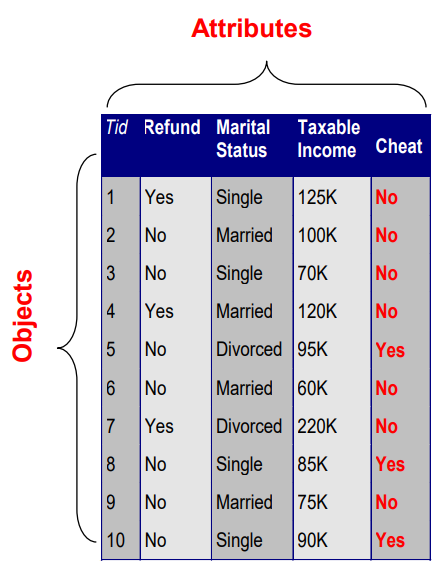

对数据的更完整视角：

1. 数据可能有组成部分
2. 属性（对象）可能与其他属性（对象）存在关联
3. 更一般地，数据可能具有结构
4. 数据可能是不完整的

# 属性

属性（Attribute）是指描述对象某个方面的特征或特性，它用于对对象进行描述、区分和分类。属性可以是数值型或符号型的，用于表示对象在该属性上的取值。

在属性的概念中，我们还需要区分属性和属性值（Attribute values）之间的区别。属性值是指为特定对象的属性所分配的数值或符号。同一个属性可以被映射到不同的属性值上，这取决于对象在该属性上的具体取值方式。

举个例子来说明，考虑身高属性（Height），可以使用不同的单位进行度量，如英尺（feet）或米（meters）。同一个对象的身高属性可以有不同的属性值，例如一个人的身高可以是6英尺或1.8米。

另外，不同的属性也可以映射到相同的属性值集合上。例如，身份证号（ID）和年龄（Age）这两个属性都可以使用整数作为属性值，但它们表示的是不同的概念和属性意义。

需要注意的是，属性值可以具有不同的属性特性。比如，在属性值为数值型时，可以进行数学运算和比较；而在属性值为符号型时，通常只能进行相等性比较或字符串操作。

属性在数据分析和数据挖掘中起着重要的作用，它们帮助我们描述和区分对象的不同特征，从而进行数据的理解、建模和分析。通过属性和属性值的组合，我们可以对对象进行更全面、准确的描述，并利用这些属性信息进行数据挖掘任务，如分类、聚类、预测等。

以下是不同类型的属性及其示例：

| 属性类型 | 示例                                                         |
| -------- | ------------------------------------------------------------ |
| 名义属性 | ID号码、眼睛颜色、邮政编码                                   |
| 顺序属性 | 排名（例如，对薯片口感评分，范围为1-10）、等级、身高（高、中、矮） |
| 区间属性 | 日历日期、摄氏或华氏温度                                     |
| 比例属性 | 开尔文温度、长度、计数、经过的时间（例如，比赛耗时）         |

属性的类型取决于它具有以下哪些特性/操作：

- 区别性：= ≠
- 顺序性： < >
- 差异具有有意义的加减操作：
- 比率具有有意义的乘除操作
- 名义属性：具有区别性
- 顺序属性：具有区别性和顺序性
- 区间属性：具有区别性、顺序性和有意义的差异
- 比例属性：具有所有4个特性/操作

不同属性类型的特性决定了它们可以进行的操作和比较方式。名义属性只具有区别性，用于标识不同的类别。顺序属性除了具有区别性外，还具有顺序性，可以进行大小比较。区间属性除了具有区别性和顺序性外，还具有有意义的差异，可以进行加减操作。比例属性具有所有4个特性/操作，包括区别性、顺序性、有意义的差异和比率的意义。

**具有绝对零点的属性是比例属性。**在比例属性中，存在一个固定的零点，其值表示完全缺乏或不存在某种属性。这意味着可以进行绝对比较和数学运算。例如，温度以开尔文（Kelvin）为单位的比例属性具有绝对零点，其中零度表示完全没有热量。其他比例属性如长度、质量和时间也具有绝对零点，可以进行精确的比较和运算。

可以参考下表：

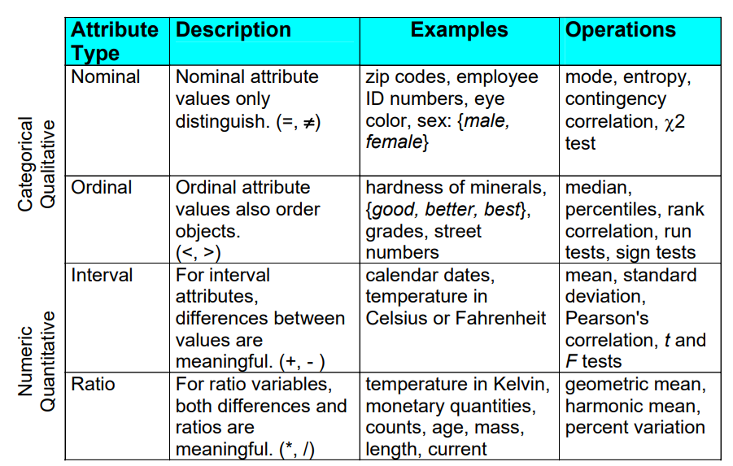

以及：

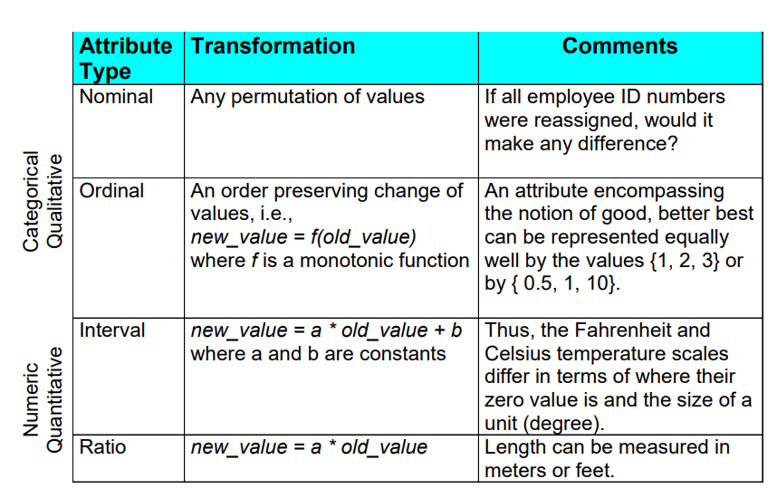

离散属性（Discrete Attribute）是指只有有限或可数无穷多个取值的属性。例如，邮政编码、计数或文档集合中的词语集合都属于离散属性的示例。通常情况下，离散属性被表示为整数变量。需要注意的是，二元属性是离散属性的特殊情况。

连续属性（Continuous Attribute）是指具有实数作为属性值的属性。例如，温度、身高或体重都属于连续属性的示例。实际上，实数值只能通过有限位数的数字进行测量和表示。连续属性通常被表示为浮点数变量。

离散属性和连续属性是数据中常见的两种属性类型。离散属性具有离散的取值集合，通常用于表示分类或计数的概念。而连续属性具有无限的可能取值范围，可以表示连续变化的量或具有实际测量意义的特征。

在数据分析和机器学习中，了解属性的类型对于选择合适的数据处理和建模方法非常重要。对于离散属性，我们可以应用离散的统计和分类算法进行分析；而对于连续属性，我们可以使用连续数据建模和回归分析等方法进行处理。

不对称属性（Asymmetric Attributes）是指只有存在（非零属性值）被视为重要的属性。例如，在文档中存在的单词或客户交易中存在的物品，只有它们的存在才被认为是有意义的。如果我们在杂货店遇到一个朋友，我们会说以下的话吗？"我发现我们的购买很相似，因为我们没有买同样的东西。" 这句话并不常见，因为我们通常关注共同购买的物品，而不是那些我们没有购买的物品。

需要两个不对称的二元属性来表示一个普通的二元属性。关联分析（Association Analysis）使用不对称属性进行分析。不对称属性通常出现在具有集合属性的对象中，其中只有某些元素或成员的存在被认为是重要的，而其他元素的缺席并不被关注。

在数据分析和关联规则挖掘中，不对称属性的概念是重要的，因为它们帮助我们发现物品、事件或特征之间的关联性，而不仅仅是它们的存在与否。通过识别和利用不对称属性，我们可以发现具有共同特征或行为模式的对象之间的关联关系，从而为决策和预测提供有用的信息。

# 数据的类型与特征

记录（Record）：

- 数据矩阵（Data Matrix）
- 文档数据（Document Data）
- 交易数据（Transaction Data）

图（Graph）：

- 万维网（World Wide Web）
- 分子结构（Molecular Structures）

有序（Ordered）：

- 空间数据（Spatial Data）
- 时间数据（Temporal Data）
- 顺序数据（Sequential Data）
- 基因序列数据（Genetic Sequence Data）

数据矩阵：

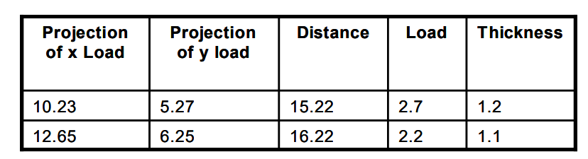

Document Data：

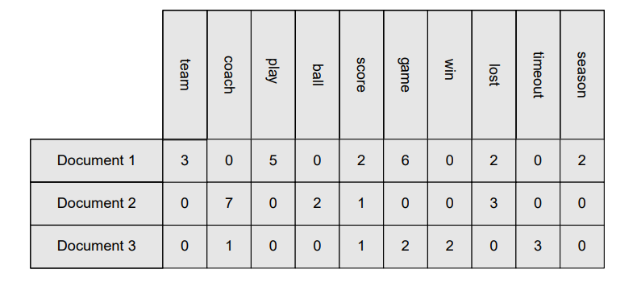

Transaction Data：

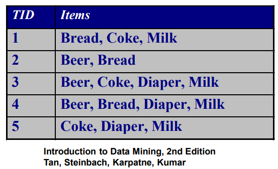

Graph Data：

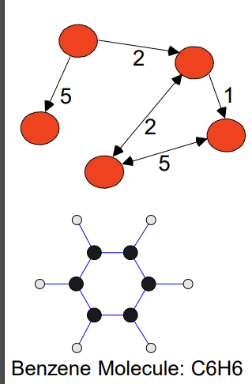

# 数据质量

数据质量是指数据的准确性、完整性、一致性和可靠性，对于数据处理工作具有重要影响。低质量的数据会对企业产生负面影响，导致损失。根据一项研究，低质量的数据可能会使企业的收入减少至少10％，而20％可能是更合理的估计值。

数据挖掘中的一个例子是使用低质量数据构建用于检测贷款风险的分类模型：

- 一些有信用记录的申请人可能被拒绝贷款；
- 更多的贷款可能被给予那些最终违约的个人。

数据质量问题可以包括：

- 噪声和异常值；
- 缺失值；
- 重复数据；
- 错误数据；
- 虚假数据。

如何检测数据质量问题？我们可以通过以下方法来检测数据质量问题：

- 数据审查和数据探索分析；
- 统计分析和可视化工具；
- 数据质量指标和规则。

解决数据质量问题的方法包括：

- 数据清洗：处理噪声、异常值和重复数据；
- 数据填充：补充缺失值；
- 数据验证和校正：确保数据的准确性和一致性；
- 数据源管理：控制数据输入和采集过程；
- 数据质量管理：建立数据质量标准和流程。

数据质量是数据分析和决策的基础，确保数据的质量对于准确的分析和可靠的结果至关重要。通过解决数据质量问题，企业可以更好地利用数据并做出更明智的决策。

在数据分析中，噪声（Noise）和异常值（Outliers）是两个重要概念，它们具有不同的含义和作用。

噪声是指数据对象中的不相关或多余的对象。对于属性而言，噪声指的是原始值的修改或扭曲。例如，在使用质量较差的电话进行通话时，人的声音可能会被扭曲，或者在电视屏幕上出现"雪花"。噪声会干扰数据分析过程，降低数据的质量和可信度。

异常值是指与数据集中的大多数其他数据对象显著不同的数据对象。异常值分为两种情况：

- 情况1：异常值是噪声，对数据分析产生干扰。在这种情况下，异常值可能是由于错误记录、测量误差或其他干扰因素引起的。在数据分析中，我们通常会尝试排除这些异常值，以获得更准确的分析结果。
- 情况2：异常值是我们分析的目标。在某些情况下，我们对异常值的分析和识别具有特定的目的，如信用卡欺诈检测或入侵检测。在这种情况下，异常值是我们关注的重点，我们希望能够准确地识别和处理它们。

噪声和异常值的区别在于它们对数据分析的影响和目的不同。噪声是干扰数据分析的不相关或多余信息，而异常值则是与大多数数据对象显著不同的特殊数据对象。噪声通常是不可接受的，因为它会降低数据的质量和准确性。然而，对于异常值，其可接受性取决于具体的分析目的和数据特点。在某些情况下，我们可能希望针对异常值进行专门的分析和处理。

总而言之，噪声和异常值在数据分析中具有不同的含义和作用。我们需要区分它们，并根据具体情况采取相应的措施，以确保数据分析的准确性和可靠性。

缺失值（Missing values）指的是数据对象中某些属性的值缺失或未被记录。缺失值的出现可能有多种原因：

1. 信息未被收集：例如，有些人可能拒绝提供他们的年龄和体重等信息。
2. 某些属性不适用于所有情况：例如，对于儿童来说，年收入可能不适用。
3. 数据记录错误：数据记录过程中可能发生错误，导致某些属性值缺失。

处理缺失值的方法有几种常见的策略：

1. 删除缺失数据对象或属性：如果缺失值占比较小且对整体分析影响不大，可以选择删除缺失数据对象或属性。
2. 估算缺失值：针对缺失值进行估算，填补缺失值。例如，对于时间序列的温度数据，可以使用插值或平均值填充缺失值；对于人口普查数据，可以使用相关变量进行估算。
3. 在分析过程中忽略缺失值：在进行数据分析时，忽略缺失值，只使用完整的数据进行分析。

缺失值的类型可以根据缺失值出现的方式进行分类：

1. 完全随机缺失（MCAR）：缺失值的出现与其他属性无关，可以根据属性的分布填补缺失值，整体上分析结果可能是无偏的。
2. 随机缺失（MAR）：缺失值的出现与其他变量有关，可以利用其他变量的信息填补缺失值，但这种方式可能导致分析结果产生偏差。
3. 非随机缺失（MNAR）：缺失值的出现与未观测到的测量相关，即缺失值是有信息含义的，无法通过其他变量填补，这种情况下很难确定缺失值对分析结果的影响。

在处理缺失值时，需要根据具体情况选择合适的方法，并注意缺失值可能对分析结果产生的偏差。

# 数据处理

## 有哪些方法

数据处理涉及多种方法和技术，以下是常见的数据处理方法：

1. 聚合（Aggregation）：将数据按照一定规则进行合并或汇总，以减少数据量或提取更高层次的信息。
2. 抽样（Sampling）：从大规模数据集中选取代表性样本，以便在处理过程中更高效地分析和处理数据。
3. 维度约减（Dimensionality Reduction）：通过降低数据的维度，保留最重要的特征信息，以减少数据的复杂性和冗余性。
4. 特征子集选择（Feature Subset Selection）：从原始特征集中选择最相关或最具代表性的特征子集，以减少特征数量并提高模型性能。
5. 特征创建（Feature Creation）：基于已有的特征，创建新的特征，以捕捉更多的数据信息或提取更有意义的特征。
6. 离散化和二值化（Discretization and Binarization）：将连续型数据离散化为离散值或将数值数据转换为二值（0/1）表示，以便于应用特定的算法或分析方法。
7. 属性转换（Attribute Transformation）：对数据属性进行转换或变换，例如对数变换、标准化、归一化等，以满足模型假设或改善数据的分布性质。

这些数据处理方法可以根据具体的数据分析任务和数据特征的不同进行选择和组合使用，以获得更好的数据处理效果和分析结果。

## 聚合

聚合（Aggregation）是将两个或多个对象合并为一个新的对象的过程。聚合的目的可以有多种，包括数据减少、数据尺度的变化和获取更稳定的数据。

进行聚合时，需要确定如何将原始对象合并，并计算合并后的对象的属性值。通常使用聚合函数来对原始对象的属性进行计算，例如求和、平均值、最大值、最小值等。具体的聚合方法和函数选择取决于数据的特性和分析的需求。

以下是一个具体的聚合示例：

假设有一份销售数据，包含多个城市的每月销售额。我们希望将销售数据按照地区进行聚合，以得到每个地区的总销售额。

原始数据示例：

| 城市 | 月份 | 销售额 |
| ---- | ---- | ------ |
| 北京 | 1月  | 100    |
| 上海 | 1月  | 150    |
| 北京 | 2月  | 200    |
| 上海 | 2月  | 180    |

进行聚合后的数据示例：

| 地区 | 总销售额 |
| ---- | -------- |
| 东北 | 300      |
| 华东 | 430      |

在这个例子中，我们根据城市将销售数据进行聚合，计算每个地区的总销售额。通过聚合，原始数据中的城市细节被减少，得到了更高层次的地区销售数据，从而实现了数据减少和尺度变化的目的。

## 采样

抽样是从大量数据中选择部分数据作为代表，用于数据分析和研究的技术。通过使用抽样，可以减少处理的数据量，从而节省时间和资源。

抽样的类型及其特点：

1. 简单随机抽样（Simple Random Sampling）：
   - 选择每个数据项的概率相等。
   - 每个数据项被选中后会从总体中移除。
   - 适用于总体中每个数据项都具有相同的重要性，并且每个数据项的选择是独立的情况。
2. 无放回抽样（Sampling without replacement）：
   - 每次选中一个数据项后，该数据项会从总体中移除。
   - 每个数据项只能在样本中出现一次，不会重复选取。
   - 适用于确保每个数据项只出现一次的情况。
3. 有放回抽样（Sampling with replacement）：
   - 在选择样本时，被选中的数据项并不从总体中移除。
   - 同一个数据项可以被多次选取，可能会重复出现在样本中。
   - 适用于需要重复观察或考虑每个数据项的情况。
4. 分层抽样（Stratified Sampling）：
   - 将数据分成若干个层次（分层），然后从每个层次中随机抽取样本。
   - 确保每个层次都有代表性地出现在样本中，从而捕捉到各个层次的特征。
   - 适用于数据集中存在不同子群体的情况，可以更好地代表总体中的各个子群体。

抽样的目的和优势：

- 减少数据处理的成本和时间消耗。
- 当样本具有代表性时，可以提供对整个数据集的良好估计。
- 可以用于初步调查数据和进行最终数据分析。

抽样在数据挖掘中起着重要作用，因为处理整个大规模数据集的计算成本很高，抽样能够在保证代表性的情况下，以较小的数据集进行分析。

Sample Size：

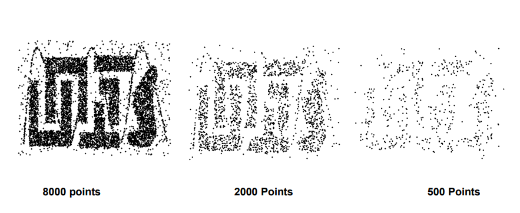

## 降维

维度约减（Dimensionality Reduction）是一种数据处理技术，用于降低数据集的维度数量。当数据的维度增加时，数据在所占据的空间中变得越来越稀疏。在高维空间中，密度和点之间的距离的定义变得不太有意义，这对于聚类和异常值检测等任务非常关键。

进行维度约减的目的主要有以下几个方面：

1. 避免维度灾难（Curse of Dimensionality）：高维数据会导致计算复杂度的急剧增加和算法性能下降，维度约减可以减轻这一问题。
2. 减少数据挖掘算法所需的时间和内存开销：高维数据对算法的计算资源要求较高，通过维度约减可以降低算法的时间和空间复杂度。
3. 更便于数据可视化：维度约减可以将高维数据转换为低维空间，使数据更易于可视化和理解。
4. 帮助消除不相关的特征或降低噪声：维度约减可以帮助识别并去除对数据分析和建模没有贡献的特征，从而提高数据的质量和模型的性能。

常用的维度约减技术包括主成分分析（Principal Component Analysis，PCA）、奇异值分解（Singular Value Decomposition，SVD）以及其他一些监督和非线性的技术。这些技术可以通过线性或非线性的方式对数据进行转换，以保留最重要的信息并减少冗余。维度约减可以根据数据集的特征和应用需求选择合适的方法，并在保持数据代表性的同时提高计算效率和分析性能。

降维技术主要分为线性和非线性方法，常用的降维技术包括：

1. 主成分分析（Principal Component Analysis，PCA）：通过线性变换将原始数据投影到新的低维空间，使得投影后的特征具有最大的方差，从而实现数据的降维。PCA适用于线性相关的数据。
2. 线性判别分析（Linear Discriminant Analysis，LDA）：主要用于分类问题，通过最大化类别间的离散度和最小化类别内的离散度，将数据映射到一个低维空间。LDA旨在找到能够最好地区分不同类别的投影方向。
3. 特征选择（Feature Selection）：选择对目标变量有重要影响的特征，去除对目标变量无关的特征。常见的特征选择方法包括过滤法、包装法和嵌入法。
4. 非负矩阵分解（Non-negative Matrix Factorization，NMF）：将非负数据矩阵分解为非负的低秩近似矩阵，用于提取数据的隐含特征。NMF常用于文本挖掘和图像处理等领域。
5. t-SNE：t分布随机近邻嵌入（t-distributed Stochastic Neighbor Embedding，t-SNE）是一种非线性降维方法，主要用于可视化高维数据。它通过在低维空间中保持数据点之间的相似性来映射高维数据。
6. 自编码器（Autoencoder）：自编码器是一种神经网络模型，通过学习将输入数据编码为低维表示，再将低维表示解码为重构的输入数据。自编码器可以用于无监督学习和特征提取。

这些降维技术可以根据数据的特点和应用需求选择合适的方法。线性方法适用于线性相关的数据，而非线性方法可以处理更复杂的数据结构和关系。根据具体情况选择适合的降维技术可以提高数据分析的效率和性能。

## 相似度和差异度

相似度和差异度度量是用于衡量数据对象之间相似或不同程度的数值度量。相似度度量衡量对象的相似程度，值越高表示对象越相似，通常取值范围在0到1之间。差异度度量衡量对象的差异程度，值越低表示对象越相似，最小差异度通常为0，而上限的取值范围则根据具体情况而变化。相似度和差异度度量用于描述对象之间的接近程度或差异程度

不同类型的Attribute的相似度和差异度的衡量：

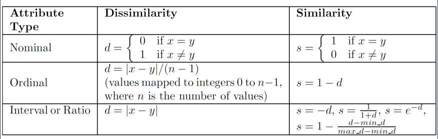

距离度量是衡量两个数据对象之间距离或相似性的数值度量。常见的距离度量方法包括：

1. 欧氏距离（Euclidean Distance）：计算两个对象之间的直线距离。假设有两个n维向量x和y，欧氏距离的计算公式为：dist(x, y) = sqrt(sum((xi - yi)^2))。
2. 曼哈顿距离（Manhattan Distance）：计算两个对象在坐标系中沿坐标轴的距离总和。曼哈顿距离的计算公式为：dist(x, y) = sum(|xi - yi|)。
3. 切比雪夫距离（Chebyshev Distance）：计算两个对象之间在各个维度上的最大差值。切比雪夫距离的计算公式为：dist(x, y) = max(|xi - yi|)。
4. 闵可夫斯基距离（Minkowski Distance）：是欧氏距离和曼哈顿距离的一般化形式。当p=1时为曼哈顿距离，当p=2时为欧氏距离。闵可夫斯基距离的计算公式为：dist(x, y) = (sum(|xi - yi|^p))^(1/p)。
5. 余弦相似度（Cosine Similarity）：用于衡量两个向量之间的夹角余弦值，表示它们在方向上的相似性。余弦相似度的计算公式为：sim(x, y) = (x · y) / (||x|| * ||y||)，其中x · y表示向量x和y的点积，||x||和||y||表示向量x和y的范数。

以上是常见的距离度量方法，根据具体的应用场景和数据类型选择适合的距离度量方法来衡量对象之间的距离或相似性。

协方差（Covariance）是用来衡量两个变量之间的线性关系的统计量。它描述了两个变量如何一起变化。具体而言，协方差的值可以告诉我们两个变量是否随着相似的趋势同时增加或减少，或者它们是否呈现相反的趋势。

标准差（Standard Deviation）是衡量数据集中数据值偏离平均值的程度的统计量。它表示数据的离散程度或数据的分散程度。标准差越大，表示数据值相对于平均值的离散程度越大。

相关性（Correlation）是用来衡量两个变量之间关系的统计量。它描述了两个变量之间的线性关系的强度和方向。相关性的取值范围在-1到1之间，其中-1表示完全负相关，1表示完全正相关，0表示无相关性。

相关性可以通过协方差和标准差来计算。具体而言，两个变量X和Y的相关系数可以通过以下公式计算：

correlation(X, Y) = covariance(X, Y) / (standard deviation(X) * standard deviation(Y))

其中，covariance(X, Y)表示变量X和Y的协方差，standard deviation(X)和standard deviation(Y)分别表示变量X和Y的标准差。

通过计算协方差和标准差，可以得到变量X和Y的相关系数，从而衡量它们之间的相关性强度和方向。相关系数的值接近于-1或1表示较强的相关性，接近于0表示较弱或无相关性。

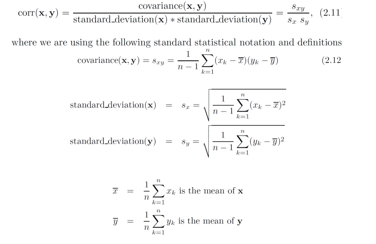

散点图表示Correlation：

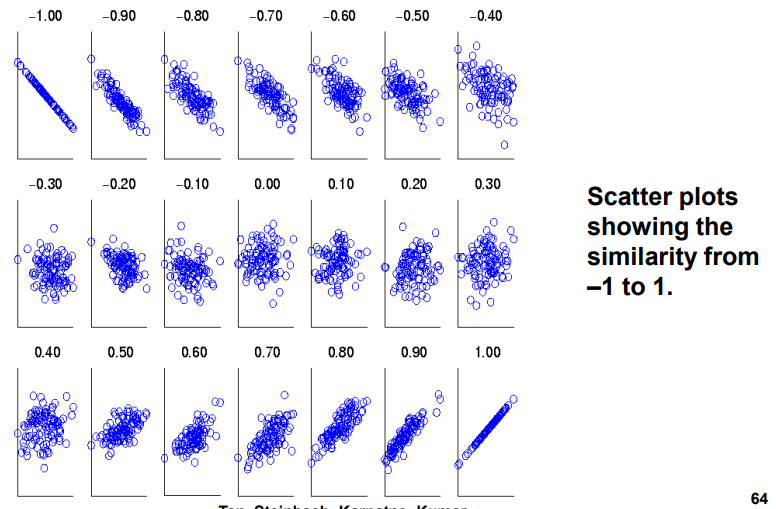