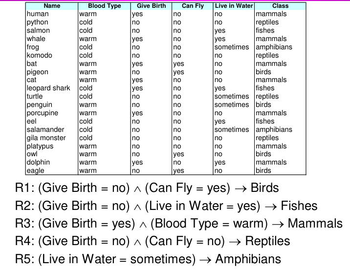
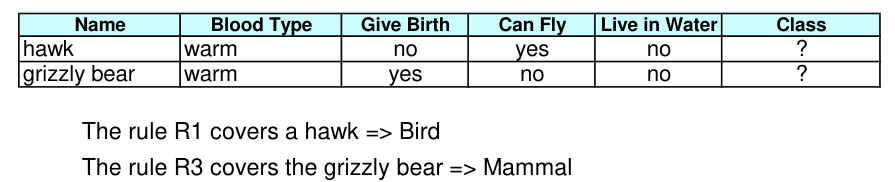

# Rule-Based Classifier

## 定义

Rule-Based Classifier（基于规则的分类器）是一种基于预定义规则进行分类的机器学习方法。该分类器根据一系列规则和条件来判断输入样本的类别。

具体来说，规则是一种形式化的表达方式，其中包含了特征的条件和对应的类别。当输入样本的特征满足某个规则的条件时，分类器将该样本分配到对应的类别。

以下是一个简单的例子来说明基于规则的分类器：

假设我们有一个数据集，其中包含一些关于患者的医疗特征以及他们是否患有某种疾病的标签。我们可以构建一个基于规则的分类器来预测患者是否患有该疾病。

规则1：如果患者的年龄大于等于50岁且血压高于140，则将其分类为患病。

规则2：如果患者的年龄小于50岁且血压低于120，则将其分类为非患病。

规则3：如果患者的年龄在50岁以下且血压在120到140之间，则将其分类为需要进一步检查。

在这个例子中，我们根据患者的年龄和血压两个特征构建了三个规则。当我们有一个新的患者样本时，基于这些规则，分类器将根据其年龄和血压的值判断其是否患病。

基于规则的分类器的优点是易于解释和理解，因为分类结果可以直接从规则中推导出来。然而，它的缺点是可能无法处理复杂的数据模式和噪声，以及需要手动定义规则并逐步添加规则来构建分类器。在实际应用中，基于规则的分类器常常与其他机器学习方法结合使用，以获得更好的分类性能。

例子：



预测：



## 覆盖率与准确性

基于上述信息，我们来讨论一下规则的覆盖率（Coverage）和准确度（Accuracy）。

规则的覆盖率是指满足规则前件（antecedent）的记录所占总记录数的比例。具体地，覆盖率可以通过计算前件满足的记录数目（|A|）除以总记录数（|D|）来得到。覆盖率反映了规则对整个数据集的适用程度。

规则的准确度是指在满足规则前件的记录中，同时满足规则后件（consequent）的记录所占前件满足的记录数的比例。具体地，准确度可以通过计算同时满足前件和后件的记录数目（|A∩y|）除以满足前件的记录数目（|A|）来得到。准确度衡量了规则对于预测目标的准确性。

例如，考虑以下规则：
规则：如果年龄大于等于50岁且收入大于10万美元，则预测为高收入。

对于一个数据集，包含1000条记录，其中有400条记录满足年龄大于等于50岁且收入大于10万美元的条件。其中，有300条记录同时满足了高收入的预测。那么针对这个规则，我们可以计算如下指标：

规则的覆盖率 = 400 / 1000 = 0.4，表示这个规则适用于数据集中40%的记录。

规则的准确度 = 300 / 400 = 0.75，表示在满足规则前件的记录中，有75%同时满足了规则后件。

通过计算覆盖率和准确度，我们可以评估规则的适用性和预测能力。在实际应用中，我们希望规则具有高覆盖率和准确度，以确保规则能够涵盖较多的记录，并且预测结果准确。

## Characteristics of Rule Sets

基于上述信息，我们来阐述一下规则集（Rule Sets）的特征。

规则集的特征如下：

1. 互斥规则（Mutually exclusive rules）：如果规则彼此独立，并且每个记录最多被一条规则所覆盖，则分类器包含互斥规则。这意味着每个记录只能被规则集中的一条规则所分类。互斥规则确保了分类结果的唯一性。

2. 全面规则（Exhaustive rules）：如果分类器包含的规则覆盖了每个可能的属性值组合，则分类器具有全面的覆盖。也就是说，每个记录至少被规则集中的一条规则所覆盖。全面规则确保了分类器对所有可能情况的考虑，不会有记录被漏掉。

3. 非互斥规则（Rules are not mutually exclusive）：如果一条记录可以触发多条规则，则规则之间不是互斥的。这意味着一个记录可能满足多个规则的前件条件。在这种情况下，解决方法可以是使用有序规则集（Ordered rule set），按照规则的优先级依次应用规则；或者使用无序规则集（Unordered rule set），通过投票机制进行决策。

4. 非全面规则（Rules are not exhaustive）：如果一条记录无法触发任何规则，则规则集不是全面的。也就是说，分类器无法为某些记录提供分类结果。在这种情况下，可以采用使用默认类别（default class）的解决方法，将这些无法触发规则的记录分类到默认类别中。

综上所述，规则集的特征涉及互斥性和全面性。了解这些特征可以帮助我们理解规则集的分类过程，并且在设计规则集时考虑到互斥性和全面性的要求。

## 排序

Rule-based Ordering（基于规则的排序）和Class-based Ordering（基于类别的排序）是两种不同的排序方式，用于确定规则的优先级或类别的优先级。

Rule-based Ordering是根据规则的重要性或适用性确定规则的执行顺序。在这种排序方式下，规则按照一定的优先级顺序被依次应用，直到找到满足条件的规则或完成所有规则的遍历。例如，考虑以下两条规则：

规则1：如果收入大于10万美元，则预测为高收入。
规则2：如果收入大于5万美元且年龄大于30岁，则预测为中等收入。

在Rule-based Ordering中，我们可以设定规则1具有更高的优先级，因此规则1将首先被应用。如果规则1不满足条件，则应用规则2。

Class-based Ordering是根据类别的重要性或优先级确定类别的顺序。在这种排序方式下，不同的类别按照一定的优先级顺序被排列。当一个样本满足多个规则并且可以归属于多个类别时，基于Class-based Ordering，我们将为样本分配具有较高优先级的类别。例如，考虑以下两个类别：

类别1：高风险
类别2：低风险

在Class-based Ordering中，如果一个样本被多个规则判定为高风险和低风险，但是高风险的优先级更高，那么这个样本将被归类为高风险。

总结：
- Rule-based Ordering是确定规则执行顺序的方式，规则按照优先级顺序被依次应用。
- Class-based Ordering是确定类别优先级的方式，当一个样本满足多个规则并且可以归属于多个类别时，根据优先级决定将样本分配到哪个类别。

这些排序方式的选择取决于具体的应用场景和需求。

# 创建Classification Rules

## 如何创建

构建分类规则是一个迭代的过程，通常可以按照以下步骤进行：

1. 数据准备：收集并准备用于构建规则的数据集。这包括数据清洗、特征选择和特征工程等步骤。确保数据集中包含目标变量（要预测的类别）和一组特征（用于判断类别的属性）。

2. 规则提取：从数据集中提取分类规则。这可以通过不同的算法和技术来实现。常见的方法包括决策树算法（如CART、C4.5）、关联规则挖掘（如Apriori算法）和基于逻辑的方法（如规则学习算法）等。

3. 规则评估：评估提取的规则的质量和准确性。这包括计算规则的覆盖率、准确度和其他评估指标。可以使用交叉验证、混淆矩阵等技术来评估规则的性能。

4. 规则优化：根据评估结果对规则进行优化和调整。可以删除不准确的规则、调整规则的条件和结论部分，或者添加新的规则来提高分类器的性能。

5. 验证和测试：使用独立的验证集或测试集对构建的分类规则进行验证和测试。这可以帮助评估分类器在新数据上的性能，并检查是否存在过拟合或欠拟合的问题。

6. 部署和应用：将构建的分类规则部署到实际应用中，并应用于新的数据进行预测和分类。确保分类器的稳定性和可靠性，并根据需要进行定期维护和更新。

需要注意的是，构建分类规则是一个迭代和反复实验的过程。需要不断地尝试不同的特征、算法和参数设置，以找到最佳的分类规则。同时，对数据的理解和领域知识的应用也是构建有效规则的关键。

## 如何评估

评估规则的质量和性能是构建分类规则的重要步骤。以下是一些常用的评估方法和指标：

1. 准确度（Accuracy）：准确度是评估规则分类器性能的常用指标之一。它表示分类器正确分类的记录所占的比例。准确度可以通过计算分类器对测试数据集的预测结果与实际类别之间的一致性来计算。

2. 精确度（Precision）和召回率（Recall）：精确度和召回率常用于评估二分类问题的规则性能。精确度是指分类器预测为正类的记录中实际为正类的比例，而召回率是指实际为正类的记录中被分类器正确预测为正类的比例。

3. F1值（F1-Score）：F1值是精确度和召回率的综合指标，用于平衡分类器的精确度和召回率。F1值是精确度和召回率的调和平均值，可以提供更全面的性能评估。

4. ROC曲线和AUC值：对于二分类问题，可以使用ROC曲线（接收者操作特征曲线）和AUC（曲线下面积）来评估规则的性能。ROC曲线绘制了真阳性率（TPR）与假阳性率（FPR）之间的关系，AUC表示ROC曲线下的面积，越接近1表示分类器性能越好。

5. 交叉验证：使用交叉验证可以更准确地评估规则的性能。交叉验证将数据集划分为多个子集，通过多次训练和测试来获得分类器的平均性能。常用的交叉验证方法包括k折交叉验证和留一交叉验证。

6. 混淆矩阵（Confusion Matrix）：混淆矩阵可以提供更详细的分类器性能信息。它显示了分类器在不同类别上的正确分类和错误分类的情况，包括真阳性（TP）、真阴性（TN）、假阳性（FP）和假阴性（FN）。

以上是常用的规则评估方法和指标，根据具体问题和需求，选择适合的评估方法来评估规则的质量和性能。

Foil's Information Gain（Foil的信息增益）是一种用于评估规则的质量和重要性的指标。它基于信息论的概念，衡量了规则在分类任务中提供的有用信息量。

## Foil Information

Foil的信息增益可以通过以下步骤计算：

1. 计算整个数据集的初始信息熵（Initial Entropy）：使用目标变量（要预测的类别）计算整个数据集的初始信息熵。信息熵表示数据集中的不确定性和混乱程度。

2. 对于每个规则，计算规则应用后的条件熵（Conditional Entropy）：对于每个规则，将数据集分为满足规则条件和不满足规则条件的两个子集，并计算每个子集的条件熵。条件熵表示在应用规则后，目标变量的不确定性和混乱程度。

3. 计算规则的信息增益（Information Gain）：通过计算初始信息熵与规则应用后的条件熵之间的差异，得到规则的信息增益。信息增益表示规则在分类任务中提供的有用信息量，即通过应用规则能够减少数据集的不确定性和混乱程度。

Foil的信息增益能够用来评估规则的质量和重要性的原因如下：

1. 衡量规则对于目标变量的解释能力：信息增益反映了规则对于目标变量的解释能力。信息增益越高，规则提供的信息量越多，对目标变量的解释能力越强。

2. 选择最有用的规则：使用Foil的信息增益可以比较不同规则之间的质量和重要性，选择最有用的规则用于分类任务。高信息增益的规则通常具有更好的分类能力。

3. 特征选择和优化：Foil的信息增益可以用于特征选择和规则优化。通过计算不同特征的信息增益，可以确定最具有区分能力的特征，帮助选择最相关的特征用于构建规则。

总之，Foil的信息增益是一种基于信息论的指标，用于评估规则的质量和重要性。它可以帮助选择最有用的规则，并在特征选择和规则优化中发挥作用。

## 方法

对于二分类问题：
- 将其中一个类别作为正类，另一个类别作为负类。
- 学习正类的规则，将负类设为默认类。
  

对于多分类问题：
- 根据类别的出现频率（属于某个类别的实例比例）对类别进行排序。
- 从最小的类别开始，将其作为正类，其余类别作为负类。
- 重复以上步骤，逐个处理每个较小的类别作为正类。
  

规则的生成过程：
- 从空规则开始。
- 添加条件项（conjuncts），只要它们能够提高FOIL的信息增益。
- 当规则不再覆盖负例时停止。
- 使用增量式减小误差修剪方法立即对规则进行修剪。
- 修剪的度量指标为v = (p-n)/(p+n)，其中p为在验证集中规则覆盖的正例数，n为规则覆盖的负例数。
- 修剪方法：删除最大化v值的最终条件序列。
  

构建规则集：
- 使用顺序覆盖算法。
- 找到覆盖当前正例集的最佳规则。
- 消除被该规则覆盖的正例和负例。
- 每次添加规则到规则集时，计算新的描述长度。
- 当新的描述长度比迄今为止最小描述长度增加d位时，停止添加新规则。
  

优化规则集：
- 对于规则集R中的每个规则r：
- 考虑两个备选规则：
  - 替代规则（r*）：从头开始生成新的规则。
  - 修订规则（r'）：添加条件项来扩展规则r。
- 将r与r*和r'生成的规则集进行比较。
- 选择最小化MDL准则的规则集。
- 对于剩余的正例，重复规则生成和规则优化过程。

以上是构建分类规则的步骤和方法，通过逐步生成规则、修剪和优化规则集，可以得到更准确和紧凑的规则集。这些步骤基于FOIL的信息增益和MDL准则，旨在提高分类器的性能和泛化能力。

## 一个例子

| 名称          | 会生育 | 会下蛋 | 能飞 | 水中生活 | 有腿 | 类别     |
| ------------- | ------ | ------ | ---- | -------- | ---- | -------- |
| human         | 是     | 否     | 否   | 否       | 是   | 哺乳动物 |
| python        | 否     | 是     | 否   | 否       | 否   | 爬行动物 |
| salmon        | 否     | 是     | 否   | 是       | 否   | 鱼类     |
| whale         | 是     | 否     | 否   | 是       | 否   | 哺乳动物 |
| frog          | 否     | 是     | 否   | 有时     | 是   | 两栖动物 |
| komodo        | 否     | 是     | 否   | 否       | 是   | 爬行动物 |
| bat           | 是     | 否     | 是   | 否       | 是   | 哺乳动物 |
| pigeon        | 否     | 是     | 是   | 否       | 是   | 鸟类     |
| cat           | 是     | 否     | 否   | 否       | 是   | 哺乳动物 |
| leopard shark | 是     | 否     | 否   | 是       | 否   | 鱼类     |
| turtle        | 否     | 是     | 否   | 有时     | 是   | 爬行动物 |
| penguin       | 否     | 是     | 否   | 有时     | 是   | 鸟类     |
| porcupine     | 是     | 否     | 否   | 否       | 是   | 哺乳动物 |
| eel           | 否     | 是     | 否   | 是       | 否   | 鱼类     |
| salamander    | 否     | 是     | 否   | 有时     | 是   | 两栖动物 |
| gila monster  | 否     | 是     | 否   | 否       | 是   | 爬行动物 |
| platypus      | 否     | 是     | 否   | 否       | 是   | 哺乳动物 |
| owl           | 否     | 是     | 是   | 否       | 是   | 鸟类     |
| dolphin       | 是     | 否     | 否   | 是       | 否   | 哺乳动物 |
| eagle         | 否     | 是     | 是   | 否       | 是   | 鸟类     |

为了展示C4.5、C4.5rules和RIPPER在给定表格上的具体过程，我们将使用R语言中的相应软件包进行演示。

首先，我们需要加载相关的软件包。在R中，我们可以使用以下命令加载所需的软件包：

```R
# 加载C4.5决策树算法所需的软件包
library(C50)

# 加载C4.5rules算法所需的软件包
library(C50)

# 加载RIPPER算法所需的软件包
library(RWeka)
```

接下来，我们将使用给定的表格数据来构建C4.5、C4.5rules和RIPPER分类模型，并查看它们生成的规则。

**C4.5决策树**

```R
# 构建C4.5决策树模型
c4.5_model <- C5.0(Class ~ ., data = data)

# 打印C4.5决策树规则
summary(c4.5_model)
```

C4.5决策树将根据给定的表格数据构建一个决策树模型，并生成相应的规则。

**C4.5rules**

```R
# 构建C4.5rules模型
c4.5rules_model <- C5.0rules(Class ~ ., data = data)

# 打印C4.5rules模型的规则
summary(c4.5rules_model)
```

C4.5rules算法会生成一组规则，其中每个规则由一系列条件和一个类别标签组成。

**RIPPER**

```R
# 构建RIPPER模型
ripper_model <- JRip(Class ~ ., data = data)

# 打印RIPPER模型的规则
summary(ripper_model)
```

RIPPER算法将构建一个规则集，其中每个规则包含一组条件和一个类别标签。

以上是使用C4.5、C4.5rules和RIPPER算法在给定表格数据上构建分类模型并生成规则的过程。通过这些算法，我们可以获得基于给定特征的规则集来预测类别标签。请注意，具体的规则结果可能因数据集和算法参数的不同而有所变化。