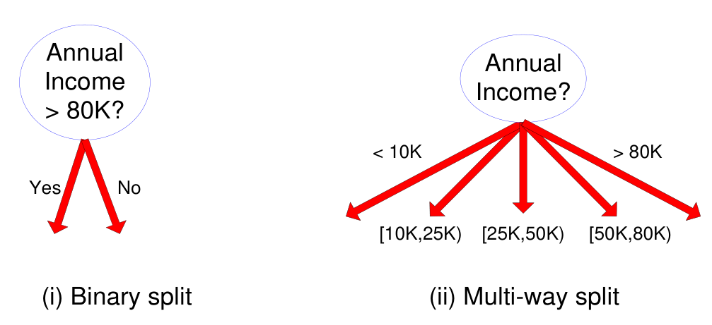

# 分类

## 什么是分类

分类（classification）是机器学习和数据挖掘领域中的一种常见任务，它旨在将输入数据实例分配到预定义的类别或标签中。分类算法通过学习从已标记的训练数据中提取的模式和特征，来建立一个分类模型，然后使用该模型对新的未标记数据进行分类。

分类问题可以形式化为一个监督学习任务，其中训练数据由已知类别的数据实例组成，每个实例都与一个类别相关联。分类模型的目标是根据已有的训练数据学习一个决策边界或者分类规则，以便能够对未知的数据进行分类。

以下是一个分类的例子：

假设我们有一组动物的数据，每个动物都有一些特征，比如体重、身高、颜色等。我们想要根据这些特征将动物分为两个类别：猫和狗。我们可以使用这些已知类别的动物数据作为训练集，训练一个分类模型。模型可以学习到猫和狗的特征模式，并建立一个决策边界，将新的未知动物分为猫或狗的类别。

例如，我们训练的分类模型可以根据动物的体重和身高来进行分类。如果一个未知动物的体重为5千克，身高为30厘米，模型可能会预测它是一只猫。这里，体重和身高是分类模型使用的特征，而猫和狗是预定义的类别。

分类在许多领域中都有广泛的应用，如垃圾邮件过滤、图像识别、文本分类等。

有监督学习（supervised learning）是机器学习中一种常见的学习方法，其任务是从标记的训练数据中学习一个函数或模型，以便能够对新的未标记数据进行预测或分类。

在有监督学习中，训练数据集由输入特征和对应的目标标签组成。输入特征是描述数据实例的属性或特征，目标标签是我们希望模型能够预测或分类的值。通过使用训练数据集，有监督学习算法可以学习从输入特征到目标标签之间的关系，然后将这个关系应用于新的未标记数据，以做出预测或分类。

分类是有监督学习的一个常见任务，因为它需要从已知类别的训练数据中学习并建立一个分类模型。分类问题的目标是根据已知的训练数据学习一个决策边界或分类规则，以便能够将新的未知数据实例分配到预定义的类别或标签中。

在分类任务中，我们有一组已标记的数据实例，每个实例都与一个类别相关联。通过训练数据集，分类算法可以学习到输入特征与目标类别之间的关联模式，以建立一个能够将新的未知数据实例分类到正确类别的模型。

因此，分类是有监督学习的一种形式，因为它使用带有标签的训练数据来指导模型的学习过程，并且在预测阶段需要已知的目标类别来进行分类。

这是搭建分类模型的流程：


如何进行划分。

**Nominal Attributes**


**Ordinal Attributes**


Ordinal算然是分类，但是是有顺序的，所以不能够将不相邻的两者分在同一个Node里面。

Continuous Attributes



## 分类技术

分类任务中常用的分类技术包括以下几种：

1. 决策树方法：基于决策树的方法使用树状结构来表示决策规则，通过一系列特征的划分来进行分类。例如，C4.5和ID3算法都是基于决策树的分类方法。
2. 基于规则的方法：这种方法使用一组规则来进行分类，规则描述了特征和类别之间的关系。例如，关联规则分类器使用频繁项集来生成分类规则，通过匹配规则进行分类。
3. 最近邻方法：最近邻分类器基于实例之间的相似性来进行分类。它根据离未知实例最近的已知实例的类别进行预测。k最近邻（k-Nearest Neighbors，k-NN）是最常见的最近邻分类算法之一。
4. 神经网络：神经网络模型模拟了人类神经系统的工作原理，通过学习输入和输出之间的关联来进行分类。例如，多层感知机（Multilayer Perceptron，MLP）是一种常见的神经网络分类器。
5. 深度学习：深度学习是一种基于多层神经网络的机器学习方法，它可以自动从数据中学习特征表示。卷积神经网络（Convolutional Neural Networks，CNN）和循环神经网络（Recurrent Neural Networks，RNN）等深度学习模型在图像分类、自然语言处理等领域取得了显著的成果。
6. 朴素贝叶斯和贝叶斯信念网络：朴素贝叶斯分类器基于贝叶斯定理和特征之间的条件独立性假设，常用于文本分类等任务。贝叶斯信念网络是一种图模型，结合了贝叶斯网络和决策树的特点。
7. 支持向量机：支持向量机（Support Vector Machines，SVM）通过在特征空间中找到最优超平面来进行分类。它可以处理线性和非线性分类问题，并具有较强的泛化能力。

此外，还有一种常见的分类技术是集成分类器，它通过组合多个基分类器的预测结果来获得更好的分类性能。集成分类器包括提升（Boosting）、装袋（Bagging）和随机森林（Random Forests）等方法。

总结起来，分类任务的常见技术包括决策树方法、规则方法、最近邻方法、神经网络、深度学习、朴素贝叶斯和贝叶斯信念网络、支持向量机，以及集成分类器。每种技术都有其独特的特点和适用场景，可以根据具体问题选择合适的分类技术。

# 决策树

## 什么是决策树

决策树（Decision Tree）是一种基于树状结构的机器学习算法，常用于分类和回归任务。决策树通过将数据集划分为不同的子集，通过一系列决策规则来实现分类或预测。

决策树的结构类似于一棵树，由节点（node）和边（edge）组成。树的顶部是根节点（root node），顶部节点连接到其他中间节点（internal node），最终连接到叶节点（leaf node）。

决策树的构建过程从根节点开始，通过对特征进行划分，将数据集分割成不同的子集。划分的依据通常是选择最能有效地将数据分离为不同类别的特征。这个选择过程基于一些指标，如信息增益（information gain）、基尼系数（Gini index）或平方误差等。

一旦数据集被划分为子集，构建过程将继续在每个子集上递归地进行，直到达到某个停止条件。停止条件可以是达到最大深度、子集中的样本数低于某个阈值，或者子集中的样本属于同一类别等。

在决策树构建完成后，我们可以使用它来进行分类或预测。当新的数据实例通过决策树时，它会根据特征的值沿着树的路径向下遍历，直到达到叶节点。叶节点的类别或预测值将作为最终的分类或预测结果。

决策树具有易于理解和解释的优点，能够处理数值型和离散型特征，且对于异常值和缺失数据具有一定的鲁棒性。然而，决策树容易过拟合（overfitting），特别是当树的深度很大或数据噪声较多时。为了克服这个问题，可以使用剪枝技术或集成学习方法，如随机森林，来改善决策树的泛化能力。

鲁棒性（Robustness）是指一个系统或算法对于输入数据中的扰动、噪声或异常情况的抵抗能力。在机器学习和数据分析领域，鲁棒性通常指的是模型对于数据中的异常值、噪声或其他干扰因素的稳定性。

在鲁棒性较强的模型或算法中，即使输入数据中存在一些异常情况，模型仍能保持相对稳定的性能，并不会过度受到这些异常值或噪声的影响。相反，鲁棒性较弱的模型或算法容易受到异常值或噪声的干扰，导致输出结果不稳定或产生较大误差。

鲁棒性对于实际应用非常重要，因为现实世界中的数据往往包含噪声、异常值或不完整的信息。一个鲁棒的模型能够更好地处理这些现实世界中的复杂情况，提供更可靠和稳定的结果。

在机器学习中，可以通过一些技术来提高模型的鲁棒性，例如使用正则化方法、异常值检测和处理、集成学习等。这些技术可以帮助模型对于数据中的异常情况进行更好的适应和处理，提高模型的鲁棒性。

这是一个决策树的例子：


Home Owner是Nominal，也就是分类，而且是二元分类；Marital Status也是Nominal，但是是多元分类；而Annual Income则是Ratio数据。在对多元分类进行构建的时候，可以先将其设置为二元分类。

首先以 Marital Status为节点进行区分，而Martial Status就是根节点。通过观察可以发现，当MarSt为Married的时候，所有的Defaulted Borrower的结果都是No，所以至此结束，这时候一个叶节点就产生了。接着考虑MarSt为Single和Dicorced的情况，然后考虑Home Owner为Yes和No的情况，最后考虑Income的情况，从而构建出来一个决策树。

接着使用这个决策树来进行预测：


## 信息增益与基尼系数

**什么是熵**

熵（Entropy）是一个概念来源于热力学和信息理论，在信息理论中用于衡量随机变量的不确定性或信息量的多少。它是一个用于度量系统无序程度或混乱程度的指标。

熵的概念最早由克劳修斯·舍尔宾于19世纪中期提出，后来被引入到信息理论中由克劳德·香农在20世纪40年代发展起来。

在信息理论中，熵用于描述随机变量的平均信息量。对于一个离散随机变量，其熵可以通过以下公式计算：

```
H(X) = - Σ p(x) * log2(p(x))
```

其中，`H(X)` 表示随机变量 `X` 的熵，`p(x)` 是随机变量取值为 `x` 的概率。

熵的单位通常使用比特（bit）或纳特（nat）。当以比特为单位时，熵表示信息量的数量，每个比特表示一个二进制选择的信息量。当以纳特为单位时，熵表示信息量的数量，每个纳特表示一个自然对数选择的信息量。

直观上来说，熵可以理解为系统的不确定性或信息的缺乏程度。当随机变量的熵越高，表示该随机变量的取值更加不确定，信息量更多。相反，当熵越低，表示随机变量的取值更加确定，信息量较少。

例如，考虑一个硬币投掷的随机变量，其可能的取值为正面和反面，概率均为 0.5。这个随机变量的熵为：

```
H(X) = - (0.5 * log2(0.5) + 0.5 * log2(0.5))
     ≈ 1.0 bit
```

这表示硬币投掷的结果具有 1.0 bit 的不确定性或信息量。

总之，熵是信息理论中用于度量随机变量不确定性或信息量的指标。它在许多领域中具有广泛的应用，包括数据压缩、密码学、机器学习等。

**什么是信息熵**

信息熵（Entropy）是用于衡量数据集的纯度或不确定性的度量指标。在决策树算法中，我们使用信息熵来选择最优的特征进行数据集的划分。

信息熵的计算公式如下：

```
Entropy(S) = -Σ p(i) * log2(p(i))
```

其中，`Entropy(S)` 表示数据集 `S` 的信息熵，`p(i)` 是数据集中某个类别的概率。

信息熵的值范围从 0 到 1，值越接近 0 表示数据集越纯，值越接近 1 表示数据集的不确定性更高。

举个例子，假设有一个二分类问题的数据集 `S`，其中有 20 个样本，其中 10 个属于类别 A，10 个属于类别 B。现在我们可以计算数据集 `S` 的信息熵。

首先，计算类别 A 和 B 的概率：
```
p(A) = 10 / 20 = 0.5
p(B) = 10 / 20 = 0.5
```

然后，计算信息熵：
```
Entropy(S) = - (p(A) * log2(p(A)) + p(B) * log2(p(B)))
           = - (0.5 * log2(0.5) + 0.5 * log2(0.5))
           ≈ 1.0
```

根据计算结果，数据集 `S` 的信息熵约为 1.0，表示数据集的不确定性较高。

通过计算不同特征划分后的信息熵，我们可以选择具有最小信息熵的特征作为决策树的节点划分特征，以降低数据集的不确定性，提高决策树的纯度。

**信息增益**

Information Gain（信息增益）是在决策树算法中用于选择最优划分特征的指标。它衡量了通过使用某个特征对数据集进行划分所带来的纯度提升或不确定性减少程度。

Information Gain 是通过计算数据集的熵和特征划分后的加权平均熵之差得到的。具体地，给定一个数据集 S，其中包含 K 个类别，每个类别 i 包含的样本数量为 p(i)，数据集 S 的总样本数量为 n。

首先，计算数据集 S 的熵（Entropy(S)）：
```
Entropy(S) = - Σ (p(i) * log2(p(i)))
```

接下来，选择一个特征 A，该特征有 V 个取值。将数据集 S 根据特征 A 的取值划分为 V 个子集 S1, S2, ..., SV，每个子集 Si 包含的样本数量为 ni，数据集 S 的总样本数量为 n。

然后，计算特征 A 的加权平均熵（Entropy(A)）：
```
Entropy(A) = Σ (ni / n) * Entropy(Si)
```

最后，Information Gain 可以通过数据集 S 的熵减去特征 A 的加权平均熵计算得到：
```
Information Gain(S, A) = Entropy(S) - Entropy(A)
```

Information Gain 的数值越大，表示特征 A 对于分类任务的贡献越大，选择具有最大 Information Gain 的特征作为最优的划分特征。

例子：

有如下数据：


可以求得随机变量X（嫁与不嫁）的信息熵为：

嫁的个数为6个，占1/2，那么信息熵为-1/2log1/2-1/2log1/2 = -log1/2=0.301

现在假如我知道了一个男生的身高信息。

身高有三个可能的取值{矮，中，高}

矮包括{1,2,3,5,6,11,12}，嫁的个数为1个，不嫁的个数为6个

中包括{8,9} ，嫁的个数为2个，不嫁的个数为0个

高包括{4,7,10}，嫁的个数为3个，不嫁的个数为0个

先回忆一下条件熵的公式如下：


我们先求出公式对应的:

H(Y|X = 矮) = -1/7log1/7-6/7log6/7=0.178

H(Y|X=中) = -1log1-0 = 0

H(Y|X=高） = -1log1-0=0

p(X = 矮) = 7/12,p(X =中) = 2/12,p(X=高) = 3/12

则可以得出条件熵为：

7/12*0.178+2/12*0+3/12*0 = 0.103

那么我们知道信息熵与条件熵相减就是我们的信息增益，为

0.301-0.103=0.198

所以我们可以得出我们在知道了身高这个信息之后，信息增益是0.198。

通过计算不同特征的 Information Gain，决策树算法可以选择最优的划分特征，以提高数据集的纯度和分类的准确性。


**增益比**

增益比（Gain Ratio）是一种用于特征选择的评估指标，常用于决策树算法中。在决策树的构建过程中，我们需要选择最佳的特征作为节点划分的依据。增益比通过考虑特征的取值数目来对信息增益进行修正，从而解决了信息增益倾向于选择取值数目较多的特征的问题。

增益比通过对信息增益进行归一化，消除了特征取值数目对信息增益的影响。它是用特征的熵（即信息熵）除以特征的固有信息（即特征的熵），得到的比值。增益比越高，说明特征对于分类任务的贡献越大。

增益比的计算公式如下：

GainRatio(A) = Gain(A) / SplitInfo(A)

其中，Gain(A)表示特征A的信息增益，SplitInfo(A)表示特征A的固有信息。通过计算所有特征的增益比，可以选择具有最高增益比的特征作为最佳划分特征。

增益比在特征选择中的作用是帮助决策树算法选择最具分类能力的特征，从而提高决策树的准确性和泛化能力。

假设我们有一个分类问题，要根据一个人的特征（性别、年龄、教育水平等）来预测其是否购买某个产品（是或否）。现在我们需要选择一个特征作为划分节点，这时候可以使用增益比来评估各个特征的重要性。

下面是一个简化的示例，展示如何计算增益比来选择最佳划分特征。

假设我们有如下的训练数据集：

| 编号 | 性别 | 年龄 | 教育水平 | 是否购买 |
| ---- | ---- | ---- | -------- | -------- |
| 1    | 男   | 青年 | 高       | 是       |
| 2    | 男   | 老年 | 中       | 是       |
| 3    | 女   | 青年 | 中       | 否       |
| 4    | 女   | 中年 | 中       | 否       |
| 5    | 女   | 老年 | 低       | 否       |
| 6    | 男   | 中年 | 高       | 是       |
| 7    | 男   | 青年 | 低       | 否       |

首先，我们计算整个数据集的信息熵，用来衡量整体的不确定性。

信息熵的计算公式为：

Entropy(D) = -p(yes)log2(p(yes)) - p(no)log2(p(no))

其中，p(yes)表示购买产品的样本占总样本的比例，p(no)表示不购买产品的样本占总样本的比例。

计算得到：

p(yes) = 3/7，p(no) = 4/7

Entropy(D) = - (3/7)log2(3/7) - (4/7)log2(4/7) ≈ 0.985

接下来，我们计算每个特征的信息增益和增益比。

1. 对于性别（Gender）特征：

我们计算购买产品和不购买产品的样本在不同性别下的分布情况。

| 性别 | 是   | 否   |
| ---- | ---- | ---- |
| 男   | 2    | 2    |
| 女   | 1    | 2    |

然后，我们计算性别特征的信息增益（Gain(Gender)）。

Gain(Gender) = Entropy(D) - (p(male) * Entropy(male) + p(female) * Entropy(female))

其中，p(male)表示男性样本占总样本的比例，p(female)表示女性样本占总样本的比例。Entropy(male)和Entropy(female)分别表示在男性和女性条件下购买产品和不购买产品的样本的信息熵。

计算得到：

- p(male) = 4/7，p(female) = 3/7
- Entropy(male) = -(2/4)log2(2/4) - (2/4)log2(2/4) = 1
- Entropy(female) = - (1/3)log2(1/3) - (2/3)log2(2/3) ≈ 0.918
- Gain(Gender) = 0.985 - (4/7 * 1 + 3/7 * 0.918) ≈ 0.048

接下来，我们计算性别特征的固有信息（SplitInfo(Gender)），即性别特征的熵。

SplitInfo(Gender) = -p(male)log2(p(male)) - p(female)log2(p(female))

计算得到：

- SplitInfo(Gender) = -(4/7)log2(4/7) - (3/7)log2(3/7) ≈ 0.985

最后，我们计算性别特征的增益比（GainRatio(Gender)）。

- GainRatio(Gender) = Gain(Gender) / SplitInfo(Gender)
- GainRatio(Gender) = 0.048 / 0.985 ≈ 0.049

2. 同样的方法，我们计算年龄（Age）和教育水平（Education）特征的信息增益、固有信息和增益比。

计算得到的结果如下：

| 特征     | 信息增益 | 固有信息 | 增益比 |
| -------- | -------- | -------- | ------ |
| 性别     | 0.048    | 0.985    | 0.049  |
| 年龄     | 0.148    | 1.571    | 0.094  |
| 教育水平 | 0.048    | 0.811    | 0.059  |

根据增益比的结果，我们可以看到年龄特征（Age）具有最高的增益比，因此，在决策树构建过程中，我们会选择年龄特征作为划分节点，以此来进行分类。

这就是使用增益比来选择最佳划分特征的一个例子。

**基尼系数**

基尼系数（Gini index）的计算公式如下：

对于一个数据集 S，假设有 K 个类别，每个类别 i 包含的样本数量为 p(i)，数据集 S 的总样本数量为 n。

则基尼系数的计算公式为：

```
Gini Index(S) = 1 - Σ (p(i))^2
```

其中，i 取值范围为 1 到 K。

基尼系数是通过计算数据集中样本被错误分类的概率来度量数据集的纯度。基尼系数越小，表示数据集的纯度越高，即样本被正确分类的概率越大。

举个例子，假设有一个数据集 S 包含 100 个样本，其中有三个类别 A、B 和 C。假设类别 A 包含 40 个样本，类别 B 包含 30 个样本，类别 C 包含 30 个样本。

首先，计算每个类别的样本比例：
```
p(A) = 40 / 100 = 0.4
p(B) = 30 / 100 = 0.3
p(C) = 30 / 100 = 0.3
```

然后，计算基尼系数：
```
Gini Index(S) = 1 - (p(A))^2 - (p(B))^2 - (p(C))^2
              = 1 - (0.4)^2 - (0.3)^2 - (0.3)^2
              = 1 - 0.16 - 0.09 - 0.09
              = 0.66
```

根据计算结果，数据集 S 的基尼系数为 0.66。

通过计算不同特征划分后的基尼系数，我们可以选择具有最小基尼系数的特征作为最优的划分特征，以提高数据集的纯度和分类的准确性。


根据给定的数据，我们可以使用基尼系数的公式来计算不确定性。

假设有一个数据集，其中包含 10 个样本，用于分类拖欠贷款者。其中 3 个样本是拖欠贷款者（是），7 个样本是非拖欠贷款者（否）。

首先，计算拖欠贷款者（是）和非拖欠贷款者（否）的比例：
```
p(是) = 3 / 10 = 0.3
p(否) = 7 / 10 = 0.7
```

然后，计算基尼系数：
```
Gini Index = 1 - (p(是))^2 - (p(否))^2
           = 1 - (0.3)^2 - (0.7)^2
           = 1 - 0.09 - 0.49
           = 0.42
```

因此，根据给定数据集，分类拖欠贷款者的不确定性（基尼系数）为 0.42，表示数据集的纯度程度较低，存在一定的不确定性。

然后使用有房与否来进行分类：


有房这一分类的基尼系数为：0，无房这一分类的基尼系数为24/49，总的基尼系数为0.7*27/49=0.3667。

## 决策树的优劣

决策树的优点包括：

1. 构建成本低廉：决策树的构建过程相对简单，不需要大量的计算和数据处理，因此构建成本较低。

2. 分类速度快：对于未知记录的分类，决策树非常快速，因为它只需要遵循树结构的路径来进行分类，而不需要复杂的计算。

3. 易于解释：决策树的结构非常直观，易于理解和解释，特别是对于小型决策树，人们可以很容易地理解其分类过程和决策依据。

4. 对噪声具有鲁棒性：决策树在一定程度上对噪声具有鲁棒性，特别是当采用避免过拟合的方法时，它可以较好地处理噪声数据。

5. 能够处理冗余或无关属性：决策树可以轻松处理冗余或无关的属性，因为它在构建决策树的过程中可以选择忽略这些属性。

决策树的缺点包括：

1. 可能无法找到最佳树：决策树的可能解空间非常大，很难通过贪婪算法找到最佳决策树，可能只能得到次优解。

2. 忽略属性之间的相互作用：决策树在构建决策边界时，只考虑了单个属性的影响，忽略了属性之间的相互作用，因此可能无法准确捕捉复杂的数据关系。

3. 每个决策边界仅涉及单个属性：决策树的每个决策边界只涉及单个属性，可能无法有效处理多个属性共同决定分类结果的情况。

总的来说，决策树是一种简单而强大的机器学习方法，具有易于解释、快速分类和对噪声数据的鲁棒性等优点。然而，它在处理复杂数据关系和选择最佳树等方面存在一些限制。根据具体问题和数据集的特点，决策树可以是一个有效的分类工具，但在某些情况下可能需要使用其他更复杂的模型来取得更好的性能。
