# 过拟合

## 什么是过拟合

过拟合是指机器学习模型在训练数据上表现良好，但在新的、未见过的数据上表现较差的现象。当模型过度学习了训练数据中的噪声和细节时，就会发生过拟合。

过拟合通常发生在模型具备大量参数或复杂度很高的情况下。这种情况下，模型会过度关注训练数据中的每一个细节和噪声，而无法泛化到新的数据集上。过拟合的模型在训练数据上表现得非常准确，但在测试数据或实际应用中表现较差。

过拟合的主要原因是模型过于复杂，以至于能够记住训练数据中的每一个样本。这可能导致模型对训练数据中的噪声和异常值过度敏感，而无法泛化到新的数据上。

通过采取这些方法，可以有效地减少过拟合问题，提高模型的泛化能力。

过拟合的可视化：

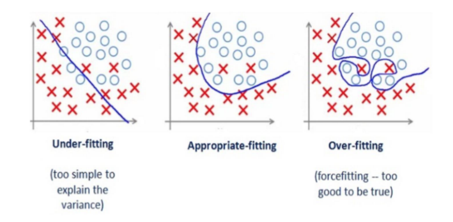

## 分类器错误

分类器错误是指分类器在进行分类任务时所犯的错误。根据上述资料，分类器错误可以分为训练误差（apparent errors）、测试误差（test errors）和泛化误差（generalization errors）。

训练误差是指分类器在训练集上所犯的错误，也就是分类器在已知标签的训练样本上的错误率。训练误差通常是分类器对于训练数据的拟合程度的衡量指标，它表示了分类器在已知标签的数据上的准确性。

测试误差是指分类器在测试集上所犯的错误，也就是分类器在未知标签的测试样本上的错误率。测试误差用于评估分类器在未见过的数据上的性能，它可以提供对分类器泛化能力的估计。

泛化误差是指分类器在从同一分布中随机选择的记录上的期望错误。它是分类器在真实世界中应用时所期望的错误率。泛化误差是对分类器在未知数据上的性能进行整体估计的指标。

## 一个具体的例子

这是一个数据集：

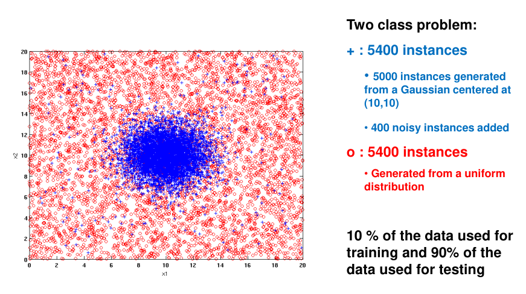

这是Train Error随着决策树的节点的增加的变化：

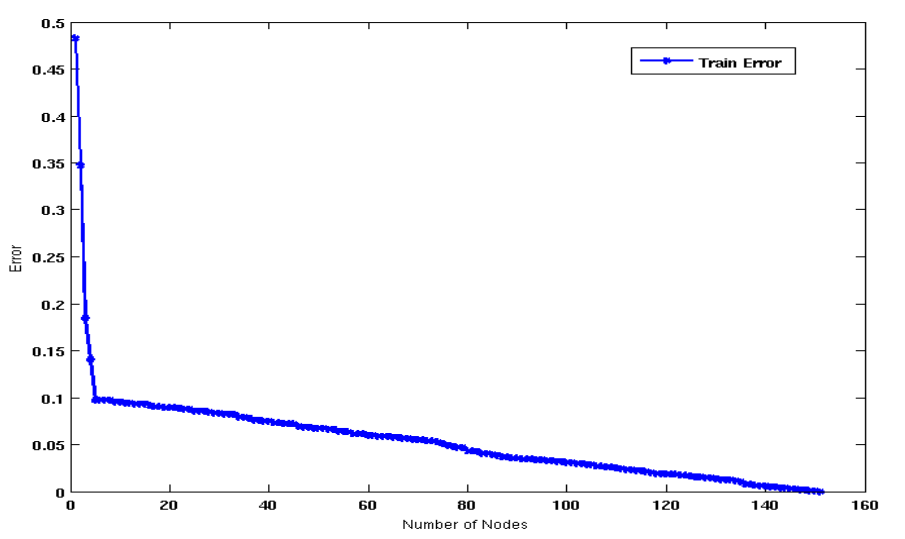

如果只使用4个Nodes：

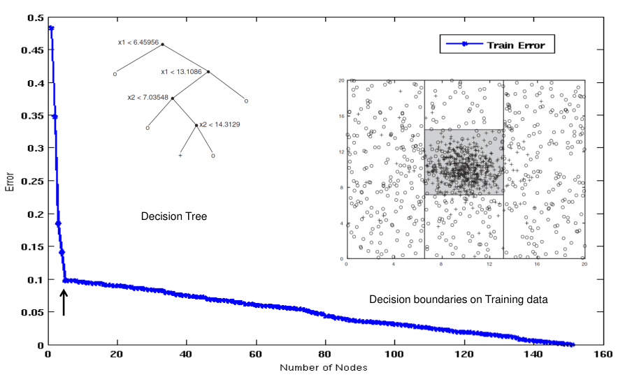

如果使用50个Nodes：

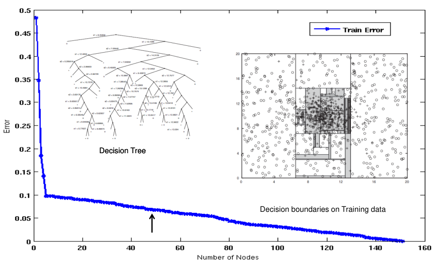

哪一个更好？

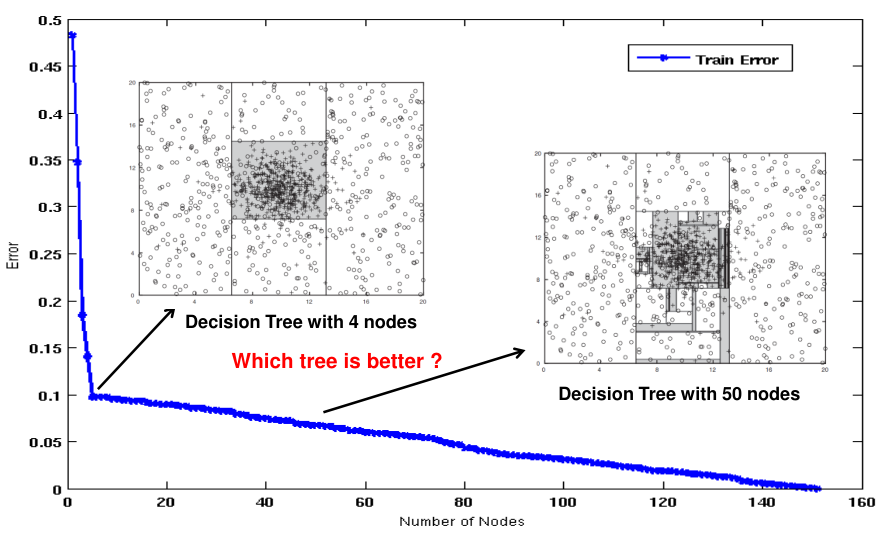

增加训练数据的规模可以减小在给定模型大小的情况下，训练误差和测试误差之间的差异。

当模型在较小的训练数据上进行训练时，它可能会过度拟合这些数据，导致训练误差较低，但在测试数据上的表现较差，即测试误差较高。这是因为模型在小规模数据上学习的特征和模式可能具有较高的噪声或是局部性质，无法很好地泛化到未见过的数据上。

然而，增加训练数据的规模可以提供更多的样本和更广泛的数据分布，使模型能够更全面地学习数据的特征和模式。通过观察更多的样本，模型可以更好地捕捉到数据的整体特征，而不会过于关注训练数据中的个别样本或噪声。

因此，随着训练数据规模的增加，模型的训练误差和测试误差之间的差异会减小。模型在更大规模的训练数据上进行训练，可以更好地泛化到未见过的数据上，从而使测试误差逐渐接近训练误差。

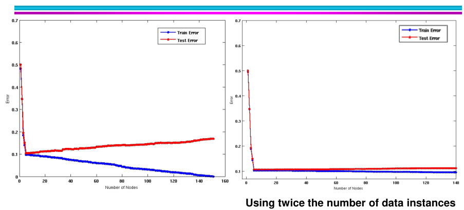

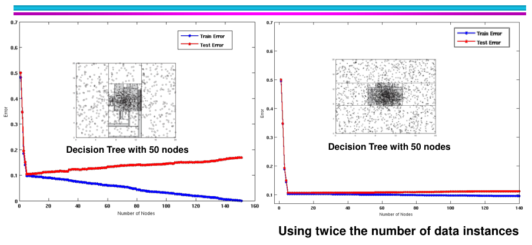

## 决策树的可视化

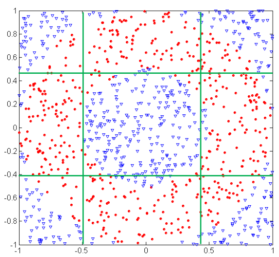

决策树使用平行于轴的线来分割空间。

在训练数据上进行更多的划分并不意味着在测试数据上会有更好的预测率。划分训练数据的次数增加与测试数据上的预测率之间的关系取决于多种因素，包括数据的质量和代表性、问题的复杂性以及所使用的算法或模型。

在机器学习中，常常将可用数据划分为训练集和测试集。训练集用于训练模型，而测试集用于评估训练模型在未见过数据上的性能。目标是开发一个能够很好地泛化到新的、未见过数据上的模型。

当将训练数据划分为更多的子集，例如使用更多的交叉验证折数或划分数时，可能能够更全面地评估模型的性能。这样可以通过考虑不同子集的数据进行训练和验证，来评估模型的鲁棒性和可靠性。

然而，仅仅增加划分的次数并不能保证在测试数据上获得更好的预测率。重要的是要考虑其他因素，例如训练集和测试集的大小和代表性、问题的复杂性、特征和标签的质量，以及所选择的算法或模型。

要在测试数据上获得更好的预测率，关键是要注重各个方面，包括选择适当的特征、优化模型参数、考虑正则化技术，以及解决过拟合或欠拟合等问题。此外，收集更多多样化和代表性的数据、改善数据质量，以及选择适当的评估指标也可以有助于提高测试数据上的预测率。

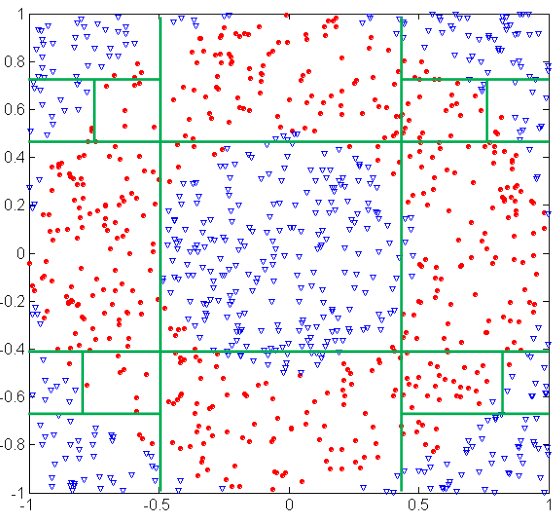

可能导致过拟合的两个原因：

1. 噪音
2. 不充足的样本

噪音如何导致过拟合：

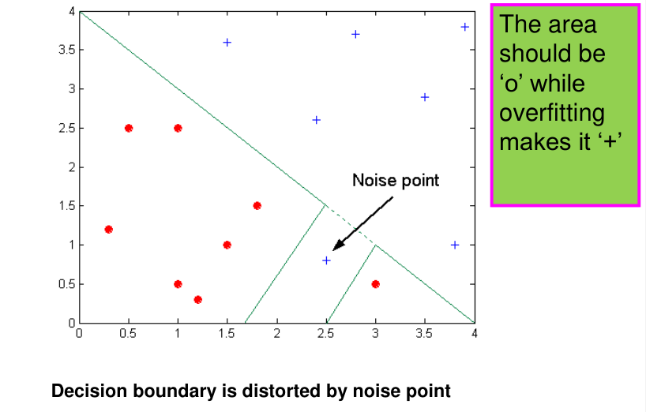

不充足的样本导致的过拟合：

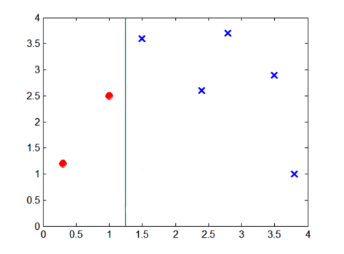

测试集上的表现：

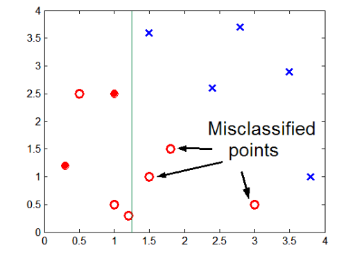

## 泛化错误

泛化错误是指模型在未见过的数据上的错误率。它是衡量模型在真实世界中应用的能力和性能的指标。泛化错误反映了模型对新数据的预测准确性，较低的泛化错误意味着模型能够更好地泛化到未知数据上，具有更好的预测能力。

计算泛化错误需要使用测试数据集。测试数据集是与训练数据集独立且未参与模型训练的数据。以下是计算泛化错误的一般步骤：

1. 将测试数据集输入已经训练好的模型。
2. 模型对测试数据集进行预测，得到预测结果。
3. 将预测结果与测试数据集的真实标签进行比较。
4. 统计模型在测试数据集上错误的预测数量或错误率。
5. 泛化错误可以通过错误的预测数量除以测试数据集的总样本数量来计算，得到错误率或误差。

具体计算泛化错误的方法取决于所使用的问题类型和评估指标。例如，在分类问题中，泛化错误可以通过计算错误分类的样本数量除以测试数据集的总样本数量来计算错误率。而在回归问题中，可以使用不同的误差度量，如均方误差（MSE）或平均绝对误差（MAE）等。

需要注意的是，为了更准确地估计泛化错误，可以使用交叉验证等技术进行多和评估，以获得更稳定的结果。交叉验证可以将数据集分成多个折（folds），每次使用其中一部分作为测试集，其余部分作为训练集，重复进行评估并取平均值，以减小随机性对泛化错误估计的影响。

奥卡姆的剃刀（Occam's Razor）是一种科学和哲学原则，它提出在解释现象或选择理论时，应该选择最简单的解释或假设，而不应该引入不必要的复杂性。奥卡姆的剃刀原则强调简单性和经济性，并认为不应该增加超出必要的实体或假设。

奥卡姆的剃刀原则的基本思想是，当存在多个可行的解释或理论时，最简单的解释通常是最可靠和最有可能的解释。简单的解释更易于理解、验证和应用，并且更少受到潜在假设和误解的影响。

奥卡姆的剃刀原则虽然没有被严格证明是绝对正确的，但它在科学和哲学领域中具有广泛的应用和支持。以下是一些支持奥卡姆的剃刀原则的理由和证据：

1. 经验原则：在实践中，较简单的解释通常更容易被理解、应用和验证。它们更符合人们的直觉和常识，因此更容易获得共识和接受。

2. 简化复杂性：增加不必要的复杂性会引入额外的假设和未经验证的因素，增加理论的风险和不确定性。相比之下，较简单的解释更易于管理和理解，并减少了错误的可能性。

3. 经验支持：奥卡姆的剃刀原则在科学研究和推理中的广泛应用表明，它在实践中是有效的。科学家和研究者倾向于选择较简单的解释，因为它们更具有预测性、解释力和适用性。

4. 贝叶斯推断：奥卡姆的剃刀原则与贝叶斯推断原理相吻合。贝叶斯推断指出，假设较简单的模型具有较高的先验概率，而较复杂的模型需要更多的证据来支持。因此，在证据有限的情况下，选择简单的模型更为合理。

需要注意的是，奥卡姆的剃刀原则并不意味着简单就一定是正确的，或者复杂性从未是合理的选择。在特定情况下，复杂的解释或模型可能更能解释数据或现象。因此，在应用奥卡姆的剃刀原则时，需要综合考虑多种因素

## 如何解决

为了解决过拟合问题，可以采取以下方法：

1. 数据集扩充：通过增加更多的训练样本，可以提供更多的数据样本，使模型能够更好地学习数据的分布，减少过拟合的风险。例如，在图像分类任务中，如果训练数据中只包含少量的猫和狗的图像，可以通过数据增强技术生成更多的图像样本，如翻转、旋转、缩放等，从而扩充数据集，使模型能够更好地学习猫和狗的特征。

2. 简化模型：减少模型的复杂度可以降低过拟合的风险。例如，在线性回归任务中，如果模型使用了高阶多项式特征，可以通过减少多项式的阶数来简化模型，从而降低过拟合的风险。

3. 使用交叉验证：将数据集划分为训练集和验证集，并使用交叉验证来评估模型的性能。例如，将数据集分为5个子集，依次选取其中4个作为训练集，剩余的1个作为验证集，然后重复这个过程5次，最后取平均结果作为模型性能的评估指标。通过交叉验证可以及早发现过拟合现象，并采取相应的措施。

4. 提前停止训练：通过监控模型在验证集上的性能，当模型在验证集上的性能开始下降时，停止训练，可以防止过拟合。例如，在神经网络训练过程中，可以设置一个阈值，当验证集上的损失函数超过该阈值时，停止训练，从而避免模型在训练集上过度拟合。

5. 正则化：通过添加正则化项到损失函数中，可以对模型的复杂度进行惩罚，促使模型更加简单化，从而减少过拟合的风险。例如，在逻辑回归中，可以使用L1正则化或L2正则化对模型的系数进行约束，限制其大小，避免过度拟合。

6. 集成方法：使用集成学习技术，如随机森林、梯度提升等，可以减少过拟合的风险，通过多个模型的组合来提高泛化能力。例如，在随机森林中，通过构建多棵决策树并对它们的预测结果进行集成，可以减少单个决策树的过拟合问题，从而提高整体模型的性能。

