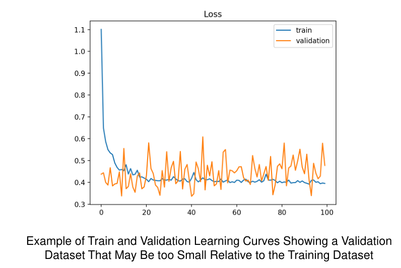

# Metrics for Performance Evaluation

## Confused Matrix

混淆矩阵（Confusion Matrix），也称为误差矩阵，是一种用于衡量分类模型性能的表格，它展示了模型在预测过程中真实类别与预测类别之间的关系。

混淆矩阵通常用于二分类问题，将预测结果划分为四个不同的类别：

- 真正例（True Positive，TP）：模型将正类别预测为正类别的数量。
- 真反例（True Negative，TN）：模型将负类别预测为负类别的数量。
- 假正例（False Positive，FP）：模型将负类别预测为正类别的数量。
- 假反例（False Negative，FN）：模型将正类别预测为负类别的数量。

混淆矩阵的形式如下：

```
                 预测为正类别    预测为负类别
实际为正类别        TP               FN
实际为负类别        FP               TN
```

混淆矩阵提供了对分类模型性能的详细分析，可以计算各种性能评估指标，如准确率、精确率、召回率等。

混淆矩阵可以帮助我们了解模型在不同类别上的表现，识别出模型可能存在的分类错误情况，进而调整模型或改进算法以提高性能。

如下图所示：


计算准确率：


准确率（Accuracy）是评估分类模型性能的常用指标之一，但它也存在一些局限性。以下是准确率的几个局限性：

1. 不适用于类别不平衡的情况：当分类任务中的类别分布不均衡时，准确率可能会给出误导性的结果。例如，对于一个二分类问题，其中一个类别的样本数量非常少，而另一个类别的样本数量非常多。如果模型将所有样本都预测为多数类别，准确率可能会非常高，但实际上模型没有对少数类别进行有效分类。

2. 忽略了不同类别的重要性：在一些分类任务中，不同类别的重要性可能不同。准确率只是简单地计算了正确分类的比例，没有考虑到对不同类别的分类错误可能有不同的后果。例如，在癌症诊断中，将患者的癌症预测为健康可能比将健康的患者预测为癌症更严重。准确率无法捕捉到这种不同类别的重要性差异。

3. 无法提供详细的错误信息：准确率无法提供关于分类错误的详细信息，无法告诉我们模型在哪些类别上出现了错误。无法确定是哪种类型的错误导致了准确率的降低，因此无法直接针对性地改进模型。

举例来说，假设有一个二分类问题，其中 95% 的样本属于类别 A，而只有 5% 的样本属于类别 B。如果一个模型将所有样本都预测为类别 A，则准确率将为 95%。然而，这并不能说明模型在对类别 B 进行分类时的表现如何，因为它可能完全未能识别出类别 B。

因此，准确率在某些情况下可能会给出误导性的结果，我们需要结合其他性能指标来更全面地评估分类模型的性能。

## Balanced classification rate (BCR)

平衡分类率（Balanced Classification Rate，BCR）是一种考虑了类别不平衡问题的分类性能指标，它综合了不同类别的分类准确率，提供了更全面的评估。

BCR 的计算方式如下：

1. 首先，计算每个类别的分类准确率（Accuracy）。

2. 对于每个类别，计算其分类准确率与该类别在总样本中的比例的乘积。

3. 将所有类别的乘积相加，并取平均值，得到平衡分类率。

具体计算步骤如下：

1. 对于每个类别 k，计算该类别的分类准确率 Acc_k。

2. 计算每个类别 k 的权重 W_k，其中 W_k = (类别 k 在总样本中的样本数) / (总样本数)。

3. 对于每个类别 k，计算 Acc_k * W_k。

4. 将所有 Acc_k * W_k 相加，并取平均值，得到平衡分类率 BCR。

平衡分类率（BCR）提供了对不同类别的分类准确率的综合评估，对类别不平衡问题具有较好的鲁棒性。它可以帮助我们更准确地评估分类模型在不同类别上的性能，并避免类别不平衡对整体性能评估的偏倚。

这是一个例子：


## Cost Matrix

在机器学习领域，成本矩阵（Cost Matrix）是一种用于衡量分类模型在不同类别上错误分类所造成的代价的矩阵。它被用于解决类别不平衡或不同类别之间代价不同的分类问题。

成本矩阵的每个元素表示了将真实类别 i 预测为类别 j 所造成的代价。矩阵的行表示真实类别，列表示预测类别。

以下是一个例子，假设有一个二分类问题，类别 A 和类别 B：

```
        预测为类别 A    预测为类别 B
真实类别 A      C(AA)             C(AB)
真实类别 B      C(BA)             C(BB)
```

其中，C(AA) 表示将真实类别 A 预测为类别 A 所造成的代价，C(AB) 表示将真实类别 A 预测为类别 B 所造成的代价，C(BA) 表示将真实类别 B 预测为类别 A 所造成的代价，C(BB) 表示将真实类别 B 预测为类别 B 所造成的代价。

例如，在医学诊断中，将一个健康患者误诊为患有疾病的代价可能比将一个患有疾病的患者误诊为健康的代价更高。因此，成本矩阵可以根据实际情况来定义这些代价。

成本矩阵可以用于优化分类模型的决策阈值，以最小化总体分类错误的代价。通过调整模型的决策边界，可以根据不同类别的代价权衡来平衡分类模型的性能。


一个计算的例子：


Cost和Accuracy的关系：


成本敏感度量（Cost-Sensitive Measures）是一类用于衡量分类模型性能的评估指标，它将不同类别的分类错误所造成的代价考虑在内。

在传统的评估指标中，如准确率（Accuracy）、精确率（Precision）、召回率（Recall）和F1度量（F-measure），每个类别的分类错误被视为等同。然而，在某些任务中，不同类别的错误可能会导致不同的后果或代价。

以下是几个与成本敏感度量相关的指标：

1. 精确率（Precision）：精确率是分类为正类别的样本中真正为正类别的比例。它衡量了模型在预测为正类别的样本中的准确性。对于成本敏感度量，可以计算每个类别的精确率，从而考虑不同类别的代价。

2. 召回率（Recall）：召回率是指实际为正类别的样本中被正确预测为正类别的比例。它衡量了模型对实际正类别样本的识别能力。与精确率类似，可以计算每个类别的召回率以反映不同类别的代价。

3. F1度量（F-measure）：F1度量是精确率和召回率的调和平均值，综合考虑了模型的准确性和识别能力。对于成本敏感度量，可以计算每个类别的F1度量以反映不同类别的代价。

这些成本敏感度量可以帮助我们更全面地评估分类模型在不同类别上的性能，并根据任务的特定需求来权衡不同类别的分类错误的代价。通过使用成本敏感度量，我们可以更好地优化模型，使其能够在考虑不同类别代价的情况下达到更好的性能。

这是计算的例子：


一个包含具体的值的例子：

假设有一个二分类问题，涉及识别恶性肿瘤。下面是一个具体的例子，展示了如何计算精确率、召回率和F1度量：

假设有一组预测结果和真实标签如下：

```
预测结果: [0, 1, 1, 0, 1, 0, 1, 1, 0, 0]
真实标签: [0, 1, 0, 0, 1, 1, 0, 1, 1, 0]
```

其中，0 表示阴性（非恶性肿瘤），1 表示阳性（恶性肿瘤）。

首先，计算 True Positive（TP）、True Negative（TN）、False Positive（FP）和 False Negative（FN）的数量：

- TP: 预测为阳性，真实为阳性的数量
- TN: 预测为阴性，真实为阴性的数量
- FP: 预测为阳性，但真实为阴性的数量
- FN: 预测为阴性，但真实为阳性的数量

```
               实际为阳性    实际为阴性
预测为阳性     TP                   FP
预测为阴性     FN                   TN
```

根据上述预测结果和真实标签，可以计算如下：

```
TP = 3
TN = 4
FP = 2
FN = 1
```

根据 TP、FP、TN 和 FN 的值，可以计算精确率、召回率和F1度量：

1. 精确率（Precision）：

   精确率表示在所有被模型预测为阳性的样本中，真实为阳性的比例。

   ```
   精确率 = TP / (TP + FP)
   精确率 = 3 / (3 + 2)
   精确率 = 0.6
   ```

2. 召回率（Recall）：

   召回率表示在所有真实为阳性的样本中，被模型正确预测为阳性的比例。

   ```
   召回率 = TP / (TP + FN)
   召回率 = 3 / (3 + 1)
   召回率 = 0.75
   ```

3. F1度量（F1-measure）：

   F1度量是精确率和召回率的调和平均值，用于综合考虑模型的准确性和识别能力。

   ```
   F1度量 = 2 * (精确率 * 召回率) / (精确率 + 召回率)
   F1度量 = 2 * (0.6 * 0.75) / (0.6 + 0.75)
   F1度量 = 0.6667
   ```

因此，在这个例子中，精确率为0.6，召回率为0.75，F1度量为0.6667。这些指标提供了关于模型在识别恶性肿瘤方面的性能评估。

# Methods for Performance Evaluation

如何获得可靠的性能估计？

模型的性能可能取决于学习算法之外的其他因素：
– 类别分布（多纯） – 节点/组没有/很少有噪音
– 错误分类的成本
– 训练和测试集的大小 – 学习曲线

## Learning Curve

学习曲线（Learning Curve）是一种用于可视化机器学习算法性能随训练数据量变化的图表。它展示了模型在不同训练数据量下的训练和验证性能。

学习曲线通常以训练样本数量为横轴，模型性能指标（如准确率或误差）为纵轴。通过观察学习曲线，我们可以了解模型在不同数据量下的训练情况和泛化能力，并判断是否存在过拟合或欠拟合等问题。

以下是计算学习曲线的一般步骤：

1. 定义不同的训练样本数量集合，如每次增加一定数量的训练样本或按比例递增。

2. 对于每个训练样本数量，使用这个子集进行模型的训练。

3. 在每个训练样本数量下，使用独立的验证集或交叉验证来评估模型的性能指标。

4. 绘制学习曲线图表，横轴为训练样本数量，纵轴为性能指标的平均值（如准确率）或损失的平均值。

5. 可选：可以在学习曲线上添加标准差或置信区间，以展示性能的可变性。

下面是一个具体的例子，假设我们使用一个分类算法进行训练，以观察准确率随训练样本数量的变化：

```
训练样本数量: [100, 200, 300, 400, 500, 600, 700, 800, 900, 1000]
```

对于每个训练样本数量，我们按照以下步骤计算学习曲线：

1. 选择训练集的前100个样本进行训练，并在验证集上评估模型性能，记录准确率。

2. 选择训练集的前200个样本进行训练，并在验证集上评估模型性能，记录准确率。

3. 以此类推，逐步增加训练样本数量，每次记录相应的准确率。

最后，绘制学习曲线图表，横轴为训练样本数量，纵轴为准确率。可以通过观察学习曲线来了解模型在不同训练样本数量下的性能表现，判断是否存在过拟合或欠拟合等问题，并决定是否需要增加更多的训练样本来改善模型的性能。

例子如下所示：


Learning curve shows how accuracy changes with varying sample size.

## 过拟合和欠拟合的学习曲线

欠拟合的学习曲线：


Good Fit Learning Curve:


不具代表性的训练数据集：


不具代表性的验证数据集：



## 重新样本量的估计方法

1. Holdout（留出法）：将数据集划分为训练集和测试集，一般是按照2/3的比例划分为训练集，1/3的比例划分为测试集。在训练集上训练模型，在测试集上评估模型性能。
2. Random subsampling（随机子抽样）：通过重复留出法进行多次抽样，每次随机选择训练集和测试集。通过多次抽样并计算准确率，得到模型的平均准确率。
3. Cross validation（交叉验证）：将数据集划分为k个不相交的子集，其中k-fold是常用的一种方法。在k-fold中，将数据集划分为k个子集，每次选择其中k-1个子集作为训练集，剩下一个子集作为测试集，然后进行模型训练和性能评估。重复这个过程k次，每次选择不同的子集作为测试集，得到k个准确率结果，最后取平均值作为模型的性能评估。
4. Leave-one-out（留一法）：是k-fold的特殊情况，其中k等于数据集的样本数量n。每次选择一个样本作为测试集，其他n-1个样本作为训练集，进行模型训练和性能评估。留一法适用于样本数量较少的情况。
5. Stratified sampling（分层抽样）：在进行数据集划分时，保持不同类别样本的比例与原始数据集中的比例相同。这样做是为了确保训练集和测试集中的样本分布与原始数据集一致，避免出现类别不平衡的问题。可以通过过采样（oversampling）或欠采样（undersampling）的方法来实现。
6. Bootstrap（自助法）：通过有放回地从原始数据集中进行抽样，生成一个新的数据集，新数据集的样本数量与原始数据集相同。这种方法允许某些样本在新数据集中出现多次，而其他样本可能被忽略。通过多次自助法抽样，并计算模型的准确率，可以得到模型的平均准确率，用于评估模型的性能。

## Cross Validation

交叉验证（Cross Validation）是一种用于评估和选择机器学习模型的常用方法。它通过将数据集划分为训练集和验证集，并多次重复这个过程，来获得模型的性能估计。

以下是一个具体的交叉验证的例子：

假设我们有一个包含1000个样本的数据集。我们可以使用k-fold交叉验证来评估模型的性能，其中k可以选择为5或10。

1. 对于5-fold交叉验证，我们将数据集分成5个子集，每个子集包含200个样本。

2. 在第一次迭代中，我们选择第1个子集作为验证集，剩下的4个子集作为训练集。然后，在这个训练集上训练模型，并在验证集上评估模型的性能。

3. 在第二次迭代中，我们选择第2个子集作为验证集，剩下的4个子集作为训练集。同样地，训练模型并在验证集上评估性能。

4. 重复这个过程，直到每个子集都作为验证集进行了一次训练和评估。

5. 最后，我们计算每次迭代中模型在验证集上的性能指标（如准确率或F1度量）的平均值，得到最终的性能估计。

例如，我们得到了5个准确率分数，分别是0.85、0.82、0.86、0.84和0.88。我们可以计算这些分数的平均值，得到最终的准确率估计为0.85。

通过交叉验证，我们可以获得对模型性能的更准确的估计，因为每个样本都能够在训练集和验证集中被使用到。这样可以避免单次划分可能导致的偶然性结果，并提供对模型在不同数据子集上的稳定性评估。这使得我们能够更好地判断模型的泛化能力和选择最佳的模型。

在交叉验证中训练出来的多个模型中，通常选择平均性能最好的模型作为最终选择。

具体选择最佳模型的方法可以根据具体情况而定，以下是几种常见的选择方法：

1. 平均性能：计算每个模型在验证集上的性能指标（如准确率、F1度量等）的平均值。选择具有最高平均性能的模型作为最佳模型。这种方法适用于性能指标比较明确的情况下，如准确率。

2. 方差分析：通过比较模型性能的方差来选择最佳模型。如果模型的性能方差较小，表示模型在不同的验证集上具有稳定的性能，更可靠；而方差较大可能表示模型对于不同的数据子集表现不一致，不稳定。选择方差较小的模型作为最佳模型。

3. 统计检验：使用统计方法对模型的性能进行比较，例如使用t检验或F检验等。这些检验可以帮助确定是否存在显著差异，以及哪个模型的性能更好。通常使用的是配对t检验来比较模型之间的性能差异。

4. 额外评估指标：除了常用的性能指标外，可以考虑其他评估指标，如模型的误差曲线、学习曲线、ROC曲线等。这些指标提供了更全面的模型评估，帮助选择最佳模型。

在实际选择最佳模型时，需要综合考虑性能指标、稳定性、统计显著性以及领域知识等因素。最终选择的最佳模型应该是在交叉验证中表现最好，并且能够在实际应用中取得良好的性能。


**k-Fold Cross Validation**


确定k的值需要综合考虑数据集的大小、样本数量、数据的变异性和数据的类别平衡性。以下是一些常见的方法来确定k的值：

1. 小型数据集：对于样本数量较少的数据集（例如少于100个样本），通常选择较高的k值，例如10。这样可以确保每个训练集和验证集都包含足够的样本，以准确评估模型的性能。

2. 大型数据集：对于样本数量较多的数据集，选择较低的k值，例如5，可能已经足够。因为大型数据集提供了更多的样本用于训练和验证，所以可以将数据集划分为更少的折叠，以节省计算时间。

3. 数据不平衡：对于不平衡的数据集，确保每个折叠都包含每个类别的比例是很重要的。例如，如果某个类别的样本数量很少，可以采用分层抽样（stratified sampling）的方法，确保每个折叠中都包含一定比例的正类和负类样本。

4. 数据变异性：如果数据集具有高度变异性，即不同的折叠之间存在很大差异，可以选择较高的k值。这样可以通过更多的折叠来捕捉数据的多样性，减少由于随机性引起的误差。

综合考虑上述因素，选择合适的k值是一个权衡过程。一般来说，建议先尝试不同的k值，并通过交叉验证的结果来评估模型性能。根据性能指标的稳定性和统计显著性，选择最合适的k值来进行模型选择和评估。

**Stratified k-Fold Cross Validation**

Stratified k-Fold Cross Validation是一种在交叉验证中保持类别平衡的方法。它通过在划分数据集时，确保每个折叠中都包含各个类别的样本，从而避免了类别不平衡对模型评估的影响。

以下是一个Stratified k-Fold Cross Validation的例子：

假设我们有一个二分类问题的数据集，其中类别A有200个样本，类别B有300个样本，总共500个样本。

1. 首先，根据类别标签将数据集中的样本分成类别A和类别B。

2. 然后，将类别A和类别B的样本分别混洗（shuffle），以打乱样本的顺序。

3. 接下来，选择k值，例如k=5，将数据集划分为5个折叠。

4. 在每个折叠中，保持类别A和类别B的比例相同。例如，如果每个折叠包含2个子集，我们会确保每个子集中类别A和类别B的样本比例都是相同的。

5. 对于第一次迭代，选择第1个折叠作为验证集，剩下的4个折叠作为训练集。然后，在训练集上训练模型，并在验证集上评估性能。

6. 重复上述步骤，直到每个折叠都作为验证集进行了一次训练和评估。

通过Stratified k-Fold Cross Validation，我们可以确保在每个折叠中都有足够的类别A和类别B的样本，以更准确地评估模型的性能。这种方法特别适用于类别不平衡的问题，可以防止某个类别被忽视或过度表示的情况。


# Methods for Model Comparison

ROC（受试者工作特征曲线）是一种常用的评估二分类模型性能的工具。它通过绘制真阳性率（True Positive Rate，也称为召回率）与假阳性率（False Positive Rate）之间的关系曲线，来展示分类模型在不同阈值下的性能。

以下是一个ROC曲线的例子：

假设我们有一个二分类问题的模型，用于预测某种疾病的存在（阳性）或不存在（阴性）。在测试集上，模型给出了一系列预测结果以及对应的真实标签。

根据模型的预测结果和真实标签，我们可以计算出不同阈值下的真阳性率和假阳性率，进而绘制ROC曲线。

首先，我们选择一个阈值，将预测结果分为阳性和阴性。然后，计算出该阈值下的真阳性率（TPR）和假阳性率（FPR）。

例如，假设在阈值为0.5的情况下，模型的预测结果如下：

真实标签：阳性 阳性 阴性 阳性 阴性 阴性

预测结果：阳性 阳性 阳性 阴性 阳性 阴性

根据以上结果，可以计算出该阈值下的真阳性率和假阳性率。

真阳性率（TPR）= 真阳性 / (真阳性 + 假阴性) = 2 / (2 + 0) = 1.0

假阳性率（FPR）= 假阳性 / (假阳性 + 真阴性) = 1 / (1 + 2) = 0.33

以不同的阈值重复上述计算过程，得到一系列不同阈值下的真阳性率和假阳性率。

最后，将所有计算得到的真阳性率和假阳性率绘制在坐标轴上，连接各点，就得到了ROC曲线。

ROC曲线的特点是，TPR越高，FPR越低，曲线越接近左上角，则模型的性能越好。当ROC曲线与对角线（随机预测）重合时，模型的性能等同于随机预测。通过分析ROC曲线，我们可以选择最佳的阈值来平衡模型的召回率和误报率。

