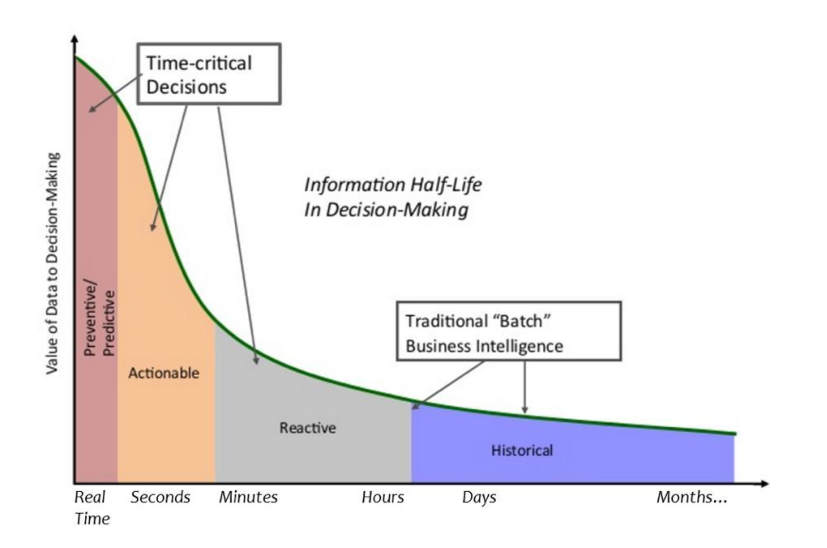
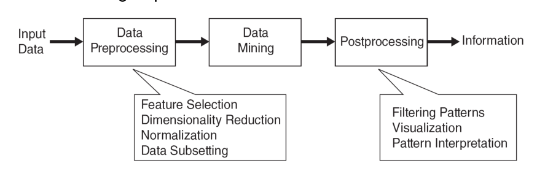
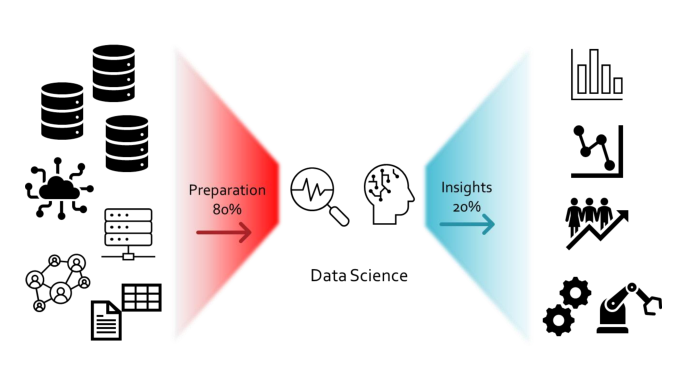
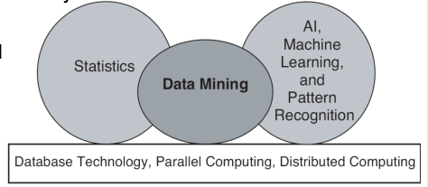
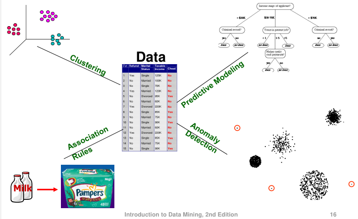
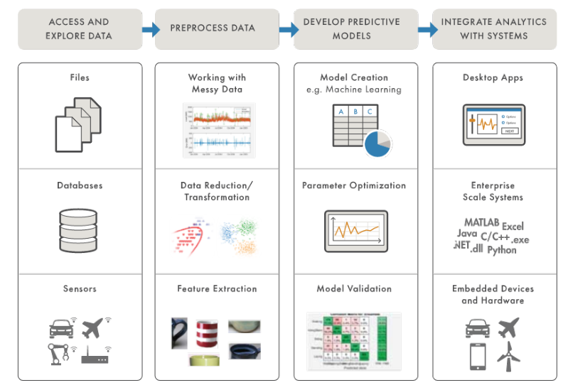

# 为什么进行数据挖掘

商业和科学数据库中的数据量由于数据生成和收集技术的进步而呈现出巨大增长。因此，现在的主张是：无论何时何地，尽可能地收集所有可得的数据。我们期望这些收集到的数据将具有价值，无论是为了最初的收集目的，还是为了未来可能出现的其他用途。

大量数据正在被收集和存储：

- 网络数据：
  - 雅虎拥有数PB的网络数据
  - Facebook拥有数十亿活跃用户
- 百货/杂货店、电子商务的购买数据：
  - 亚马逊每天处理数百万次访问
- 银行/信用卡交易数据 计算机变得更便宜和更强大 竞争压力很大
- 为了获得优势，提供更好、定制的服务（例如在客户关系管理方面

数据以极快的速度被收集和存储：

- 卫星上的远程传感器：
  - NASA EOSDIS每年归档数PB的地球科学数据
- 扫描天空的望远镜：
  - 天体巡天数据
- 高吞吐量的生物数据
- 科学模拟：
  - 几小时内产生的TB级数据 数据挖掘帮助科学家：
- 在大规模数据集的自动化分析中
- 在假设形成方面

数据的价值的递减：

# 什么是数据挖掘

数据挖掘是一种通过自动或半自动的方法从大规模数据集中发现隐藏模式、关联和知识的过程。它结合了统计学、机器学习和数据库技术，旨在从数据中提取有价值的信息。

数据挖掘的目标是发现数据中的模式和规律，以帮助做出预测、制定决策和解决问题。它可以揭示数据中的潜在趋势、关联性、异常点和规律，并提供对数据的深入理解。数据挖掘可以应用于各个领域，包括商业、金融、医疗、市场营销、社交媒体等。

数据挖掘的过程通常包括以下步骤：

1. 数据收集：收集和获取需要分析的数据。
2. 数据预处理：对数据进行清洗、整理、转换和集成，以消除噪声、处理缺失值和处理异常数据。
3. 特征选择和提取：从原始数据中选择最相关的特征或提取新的特征，以减少数据维度和提高模型性能。
4. 模型构建：选择适当的数据挖掘技术和算法，构建模型以从数据中发现模式和规律。
5. 模式评估：评估模型的性能和准确性，以确定其是否能够提供有用的结果。
6. 模型解释和应用：解释模型的结果，并将其应用于实际问题中，做出决策或进行预测。

80/20 数据科学困境：

数据准备的任务如下：

1. 探索（Discovery）：了解数据集的内容和结构，确定需要进行的数据准备步骤。
2. 访问（Accessing）：获取和获取数据集，确保数据可供后续处理使用。
3. 解释（Interpreting）：理解数据的含义和上下文，以便正确地处理和分析数据。
4. 收集（Collecting）：从各种来源收集数据，包括数据库、文件、传感器等。
5. 组织（Organising）：对数据进行结构化和整理，以便更好地进行处理和分析。
6. 验证（Validating）：验证数据的完整性、准确性和一致性，确保数据可靠可用。
7. 清洗（Cleaning）：处理缺失值、异常值和重复数据，使数据更加干净和一致。
8. 建模（Modelling）：根据需求构建合适的数据模型，以支持后续的分析和决策。
9. 丰富（Enriching）：通过数据整合、特征提取和衍生变量等方式增强数据的价值。
10. 存储（Storing）：将经过处理和准备的数据存储在适当的位置和格式中，以供后续使用。

这些任务是数据准备过程中的关键步骤，以确保数据的质量、完整性和可用性，为后续的数据分析和决策提供可靠的基础。

什么是数据挖掘，什么不是：

| 数据挖掘                                                     | 非数据挖掘                           |
| ------------------------------------------------------------ | ------------------------------------ |
| 根据美国特定地区出现的姓氏（如O'Brien、O'Rourke、O'Reilly等在波士顿地区更常见）来发现模式和趋势 | 在电话目录中查找电话号码             |
| 根据搜索引擎返回的相似文档的上下文（例如，亚马逊雨林、Amazon.com）将其分组 | 在网络搜索引擎中查询有关“亚马逊”信息 |
| 使用数据挖掘技术从大规模数据集中发现隐藏模式、关联和知识     | 从已知的资源中直接获取特定信息       |
| 分析和挖掘数据以获得有价值的信息和见解，以帮助做出决策和解决问题 | 简单的查询或查找操作                 |
| 需要使用统计学、机器学习和数据库技术等方法来提取和分析数据   | 直接从已知的资源中检索信息           |
| 涉及数据预处理、特征选择、模型构建和评估等步骤               | 单纯的数据查找和检索操作             |

# 数据挖掘的起源

数据挖掘的起源可以追溯到对大规模、高维度、异构、复杂、分布式数据进行分析和发现的需求。数据挖掘借鉴了机器学习/人工智能、模式识别、统计学和数据库系统等领域的思想和方法。

传统的分析技术在处理大规模、高维度、异构、复杂、分布式数据时可能不适用。这些数据的特点使得传统的方法在处理和提取有价值的信息方面面临挑战。

数据挖掘是数据科学和数据驱动发现领域的重要组成部分。它结合了机器学习、统计学、模式识别和数据库系统等多个学科的理论和技术，旨在从大规模数据集中发现隐藏模式、关联和知识。

# 数据挖掘的任务

数据挖掘任务可以分为预测方法和描述方法：

1. 预测方法：使用一些变量来预测其他变量的未知或未来值。预测方法旨在建立模型和算法，通过分析已知的数据和变量之间的关系，预测目标变量的值。这些方法通常使用统计学、机器学习和人工智能等技术，可以用于预测销售额、股票价格、用户行为等未来事件。
2. 描述方法：寻找可解释的模式，用于描述数据中的现象和关系。描述方法旨在发现数据中的潜在模式和规律，以提供对数据的深入理解。这些方法可以帮助揭示数据中的趋势、异常点、关联性等，为业务决策和问题解决提供见解。描述方法通常使用统计学和数据可视化等技术，可用于探索数据集的特征、属性之间的关系以及数据的整体结构。

因此，数据挖掘的任务可以包括预测方法和描述方法，旨在通过分析数据中的模式、关联和规律，提供对数据的预测和解释。这些任务涉及使用各种技术和方法，以从大规模、复杂和异构的数据集中提取有用的信息，并为决策制定和问题解决提供支持。

预测分析的workflow：

# 各种有监督学习

## 分类

分类（Classification）是数据挖掘中的一种常见任务，旨在根据已知的特征和标签，将数据实例分为预定义的类别或类标签。分类问题通常是一个监督学习的任务，其中训练数据集包含已知类别的样本，模型根据这些样本学习特征与类别之间的关系，并用于预测未知样本的类别。

以下是一个分类的例子：

假设有一个电子邮件分类的问题，我们需要根据电子邮件的内容将其分为"垃圾邮件"和"非垃圾邮件"两类。我们首先需要构建一个分类模型，模型根据已知的电子邮件样本和它们的特征（如词频、主题等）进行训练。训练集中的每个样本都有一个已知的类别标签（垃圾邮件或非垃圾邮件）。模型学习从特征到类别的映射关系，然后可以用于对新的未知邮件进行分类。

例如，对于一个新的电子邮件样本，模型会分析其特征并预测其类别。如果模型预测该邮件是垃圾邮件，则可以将其过滤到垃圾邮件文件夹中，如果模型预测该邮件是非垃圾邮件，则可以将其投递到收件箱。

分类在许多领域和应用中都有广泛的应用，如文本分类、图像分类、客户分类、疾病诊断等。通过分类，我们可以根据已知的特征和样本类别，自动识别和归类未知数据，从而帮助做出决策和解决问题。

## 回归

回归（Regression）是数据挖掘中的一种任务，它用于建立变量之间的关系模型，通过已知的特征和标签来预测数值型目标变量的值。回归分析通常是一种监督学习的方法，其中训练数据集包含了已知的特征和相应的数值型标签，模型利用这些数据学习特征和目标变量之间的关系，并用于预测未知样本的目标变量值。

以下是一个回归的具体例子：

假设我们有一组房屋销售数据，其中每个样本都包含了房屋的特征（如面积、卧室数量、地理位置等）以及相应的销售价格。我们想要建立一个回归模型，根据这些特征来预测房屋的销售价格。

我们首先使用训练数据集训练回归模型，模型学习特征与销售价格之间的关系。例如，模型可能会发现面积和卧室数量与销售价格呈正相关关系，地理位置也可能对价格有影响。通过学习这些关系，回归模型能够建立一个数学函数，将特征作为输入，预测房屋的销售价格作为输出。

然后，我们可以使用已训练的回归模型对新的未知房屋样本进行预测。通过输入未知房屋的特征值，模型可以预测出其销售价格。这样，我们可以利用回归模型来估计未知房屋的价格，从而帮助买家、卖家或房地产专业人员做出决策。

回归分析在许多领域和应用中都有广泛的应用，如房地产市场预测、股票价格预测、销售量预测、疾病发展预测等。通过回归分析，我们可以利用已知的特征和标签，建立模型来预测连续型数值变量的值，从而提供对未知数据的预测和洞察。

## 聚类

聚类（Clustering）是数据挖掘中的一种常见任务，旨在根据数据的相似性或相关性将数据样本划分为不同的组或簇，使得同一组内的样本更相似，不同组之间的样本差异较大。聚类是一种无监督学习的方法，它不依赖于预定义的类别标签，而是根据数据本身的内在结构和相似性进行划分。

聚类算法通过计算样本之间的距离或相似性，将相似的样本归为同一簇。聚类的目标是使得同一簇内的样本相似度最大化，而不同簇之间的相似度最小化。

以下是一个聚类的例子：

假设我们有一组顾客的购物数据，包括他们的购买金额、购买频率、购买种类等特征。我们希望通过聚类算法将这些顾客划分为不同的群组，以了解不同类型的顾客行为和偏好。

聚类算法可以通过计算顾客之间的相似性，将相似的顾客归为同一簇。例如，算法可能会发现一组顾客购买金额较高、购买频率较高的簇，这表示他们是高价值的忠实顾客；另一组顾客可能购买金额较低、购买频率较低，这表示他们是低价值的潜在顾客。

通过聚类分析，我们可以识别不同类型的顾客群体，并针对每个群体制定个性化的营销策略。例如，对于高价值的忠实顾客，可以提供定制化的优惠和推荐；对于低价值的潜在顾客，可以进行促销活动以吸引他们的购买。

聚类在许多领域和应用中都有广泛的应用，如市场细分、社交网络分析、图像分析、基因组学等。通过聚类分析，我们可以发现数据集中的潜在群体和结构，为数据理解、问题解决和决策制定提供有价值的信息。