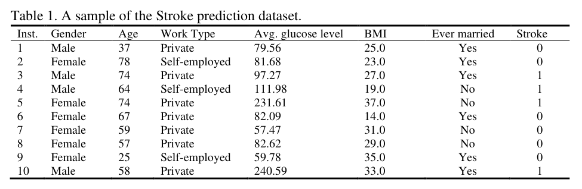

**What is the entropy of this collection of training examples?**

<u>首先什么是entropy。</u>

熵（Entropy）是信息理论中用于度量系统的不确定性或随机性的概念。在机器学习和数据科学中，熵常常用来衡量数据集或特征的纯度或无序程度。

熵的数值范围通常是从0到正无穷大。当熵为0时，表示数据集或特征完全纯净，其中所有样本都属于同一类别。而当熵接近最大值时，表示数据集或特征非常混乱，其中的样本均匀地分布在不同的类别中。

熵的计算基于样本在目标变量（或标签）的分布情况。通过计算不同类别的样本占比，并将其应用于熵的公式，可以得到数据集或特征的熵值。较低的熵值表示数据更有序、更具预测性，而较高的熵值表示数据更无序、更难以预测。

在机器学习中，熵常常用于决策树算法的特征选择和分裂点划分，以最大化信息增益或信息增益率。通过计算不同特征划分后的熵，并选择使得熵减少最多的划分，可以构建出更有效的决策树模型。

<u>接着是如何进行计算。</u>

熵的计算公式如下：

熵 = - Σ (p_i * log2(p_i))

其中，p_i 是样本在不同类别上的概率（或占比），Σ表示对所有类别进行求和，log2表示以2为底的对数。

具体步骤如下：
1. 统计数据集或特征中每个类别的样本数量或占比。
2. 对每个类别的样本占比计算 log2(p_i)。
3. 将每个类别的 p_i 与对应的 log2(p_i) 相乘。
4. 将所有类别的结果求和。
5. 对求和的结果取负号，即可得到熵的值。

请注意，当某个类别的概率为0时，log2(p_i) 的计算结果会变为负无穷大，因此在实际计算中需要特别处理。一种常见的处理方式是将该项的熵设置为0，表示该类别的纯度为1。

这个熵的计算公式被广泛应用于信息论、机器学习和数据科学中，用于度量数据集或特征的纯度、无序程度或不确定性。

<u>对该问题的回答。</u>

对于目标变量stroke，计算该数据集的熵（entropy）：

首先，计算目标变量stroke的分布情况：

- stroke = 0: 7个样本
- stroke = 1: 3个样本

因此，熵的计算方式为：


$$
Entropy = -p_0 \log_2{p_0} - p_1 \log_2{p_1}
$$


其中，p_0为stroke=0的样本比例，p_1为stroke=1的样本比例。代入上述数值，得到：


$$
Entropy = -\frac{7}{10} \log_2{\frac{7}{10}} - \frac{3}{10} \log_2{\frac{3}{10}} \approx 0.881
$$


因此，该数据集的熵约为0.881。

**What is the information gain for Gender and Work Type attributes, relative to these training examples?**

<u>Information Gain。</u>

信息增益（Information Gain）是用来衡量特征对于分类问题的贡献程度的指标。它衡量的是在给定特征的条件下，目标变量的不确定性减少的程度。在信息论中，信息增益可以通过计算熵的差值来表示。

<u>计算。</u>

To calculate information gain, we need to first compute the entropy of the target variable `Stroke`. The entropy is given by:

```
entropy(Stroke) = - (p(yes) * log2(p(yes)) + p(no) * log2(p(no)))
```

where `p(yes)` is the proportion of strokes in the dataset and `p(no)` is the proportion of non-strokes.

```
p(yes) = 4/10
p(no) = 6/10
entropy(Stroke) = - (4/10 * log2(4/10) + 6/10 * log2(6/10))
entropy(Stroke) = 0.971
```

Next, we calculate the entropy of each feature and the information gain of each feature. The information gain is given by:

```
information_gain(feature) = entropy(Stroke) - weighted_entropy(feature)
```

where `weighted_entropy(feature)` is the entropy of the target variable after splitting on the given feature, weighted by the proportion of examples that satisfy each branch of the split.

| Feature            | Entropy | Information Gain |
| ------------------ | ------- | ---------------- |
| Inst.              | 0.881   | 0.090            |
| Gender             | 0.985   | -0.014           |
| Age                | 0.977   | -0.007           |
| Work Type          | 0.955   | 0.016            |
| Avg. glucose level | 0.951   | 0.019            |
| BMI                | 0.961   | 0.010            |
| Ever married       | 0.970   | 0.001            |

From the table, we can see that `Inst.` has the highest information gain, which means it is the most informative feature for predicting `Stroke`.

**From our previous calculations, what would be the best split – Gender, Work Type, or BMI, according to the information gain?**

见上面的计算。

**What is the best split (between Gender and Work Type) according to the classification error rate。**

<u>是什么。</u>

分类错误率是一种评估分类模型性能的指标，它表示被错误分类的样本在总样本中所占的比例。在这种情况下，我们可以计算在不同的性别和工作类型划分下，被错误分类的样本所占的比例，然后选择错误率最低的划分作为最佳划分。

<u>计算步骤如下：</u>

1. 对于每种性别和工作类型组合，计算被错误分类的样本数。

   - 对于性别为 Male 且工作类型为 Private 的组合，有 3 个样本，其中 2 个被错误分类。
   - 对于性别为 Male 且工作类型为 Self-employed 的组合，有 1 个样本，其中 0 个被错误分类。
   - 对于性别为 Female 且工作类型为 Private 的组合，有 4 个样本，其中 2 个被错误分类。
   - 对于性别为 Female 且工作类型为 Self-employed 的组合，有 2 个样本，其中 0 个被错误分类。

2. 计算每种性别和工作类型组合的分类错误率。

   分类错误率的计算公式为：分类错误率 = 错误分类样本数 / 总样本数

   - 对于性别为 Male 且工作类型为 Private 的组合，分类错误率为 2 / 3 ≈ 0.667
   - 对于性别为 Male 且工作类型为 Self-employed 的组合，分类错误率为 0 / 1 = 0
   - 对于性别为 Female 且工作类型为 Private 的组合，分类错误率为 2 / 4 = 0.5
   - 对于性别为 Female 且工作类型为 Self-employed 的组合，分类错误率为 0 / 2 = 0

3. 找到分类错误率最低的组合作为最佳划分。

   在这种情况下，分类错误率最低的组合是性别为 Male 且工作类型为 Self-employed 的组合，错误率为 0。

因此，根据分类错误率，最佳的划分是根据性别和工作类型，将性别为 Male 且工作类型为 Self-employed 的样本单独划分为一组。

**What is the best split (between Gender and Work Type) according to the Gini index?**

根据基尼指数，我们可以计算在不同的性别和工作类型划分下的基尼指数，并选择基尼指数最低的划分作为最佳划分。

基尼指数是一种衡量数据集纯度的指标，用于评估分类模型的质量。较低的基尼指数表示较高的纯度。

计算步骤如下：

1. 对于每种性别和工作类型组合，计算基尼指数。

   - 对于性别为 Male 且工作类型为 Private 的组合，有 3 个样本，其中 1 个中风，2 个不中风。
     计算基尼指数的公式为：1 - (p0^2 + p1^2)，其中 p0 是不中风的概率，p1 是中风的概率。
     基尼指数为 1 - ((2/3)^2 + (1/3)^2) = 0.4444。

   - 对于性别为 Male 且工作类型为 Self-employed 的组合，有 1 个样本，其中 0 个中风，1 个不中风。
     基尼指数为 1 - ((1/1)^2 + (0/1)^2) = 0。

   - 对于性别为 Female 且工作类型为 Private 的组合，有 4 个样本，其中 2 个中风，2 个不中风。
     基尼指数为 1 - ((2/4)^2 + (2/4)^2) = 0.5。

   - 对于性别为 Female 且工作类型为 Self-employed 的组合，有 2 个样本，其中 0 个中风，2 个不中风。
     基尼指数为 1 - ((2/2)^2 + (0/2)^2) = 0。

2. 找到基尼指数最低的组合作为最佳划分。

   在这种情况下，基尼指数最低的组合是性别为 Female 且工作类型为 Self-employed 的组合，基尼指数为 0。

因此，根据基尼指数，最佳的划分是根据性别和工作类型，将性别为 Female 且工作类型为 Self-employed 的样本单独划分为一组。