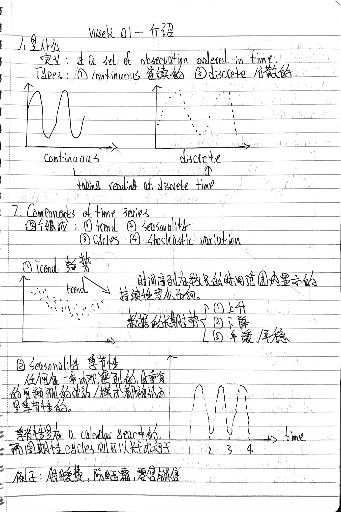
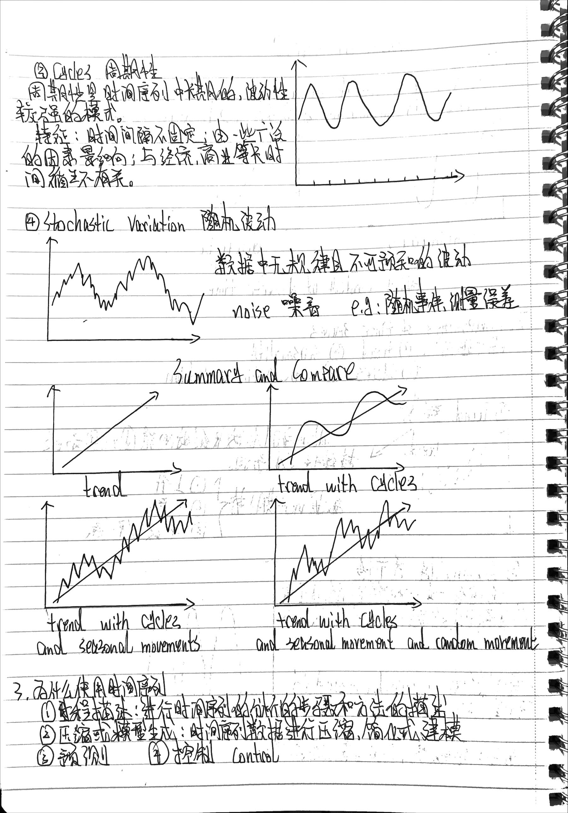
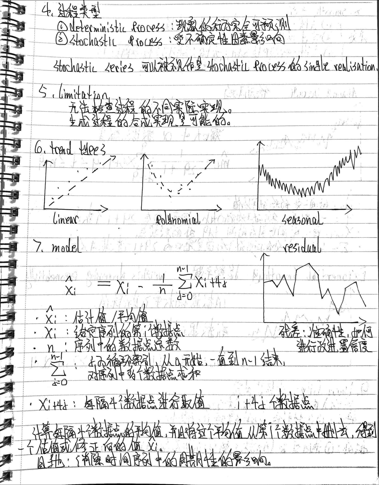
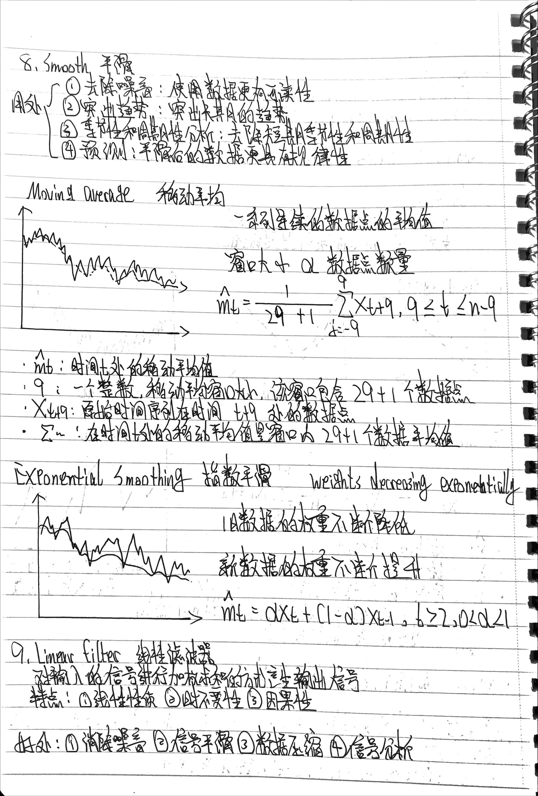
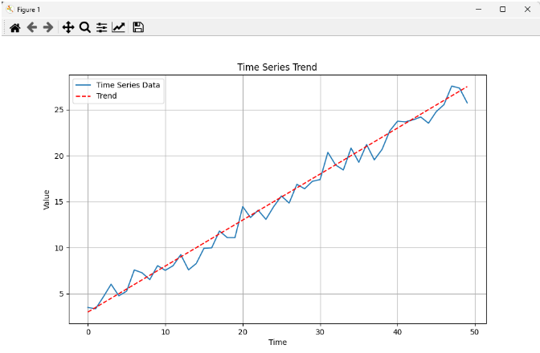
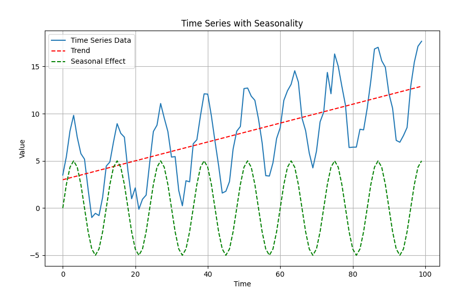
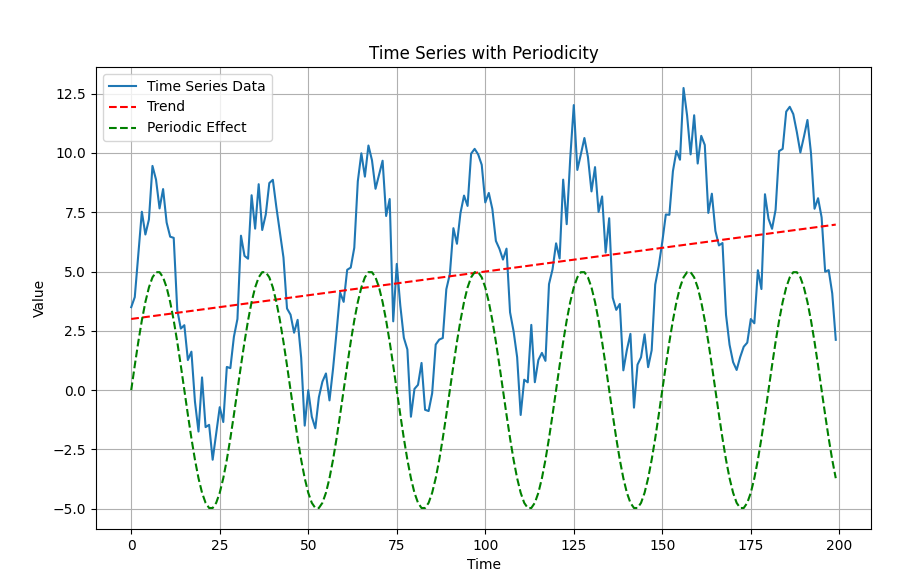
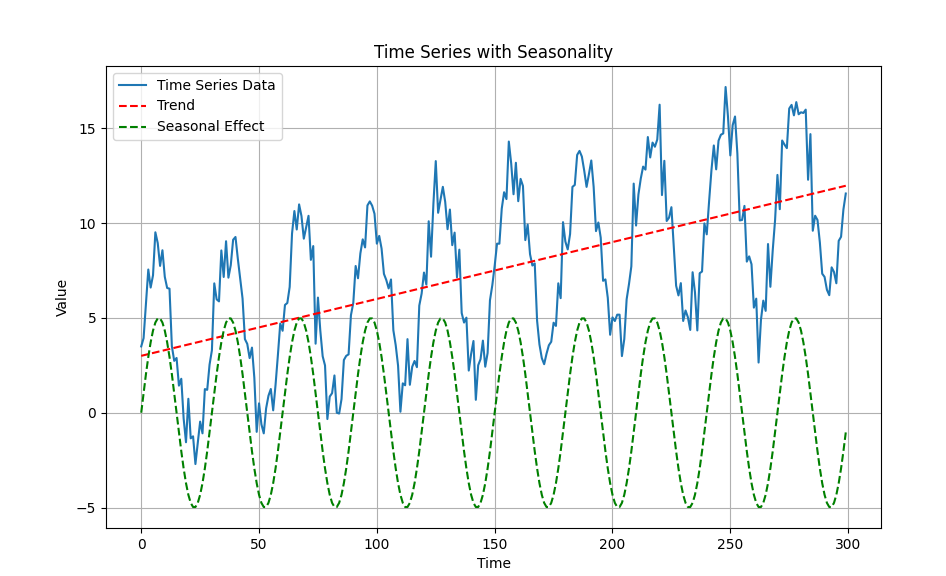
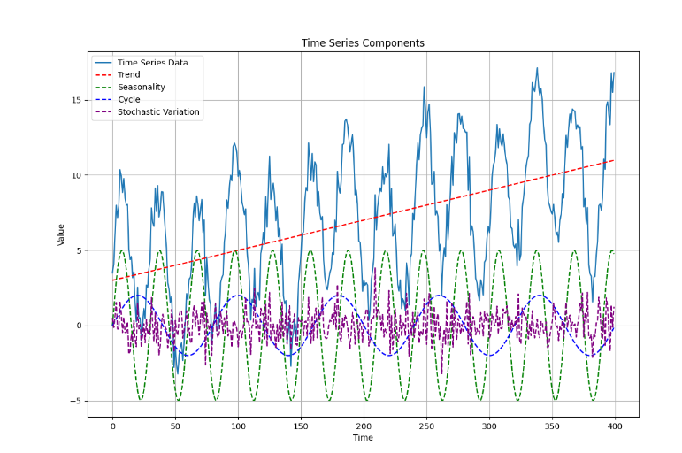

## 笔记









## 实现

Trend

```python
import numpy as np
import matplotlib.pyplot as plt

# 生成时间序列数据
np.random.seed(42)
num_points = 50
time = np.arange(num_points)
trend = 0.5 * time + 3  # 假设趋势是线性的，斜率为0.5，截距为3
noise = np.random.normal(0, 1, num_points)  # 添加随机噪音
data = trend + noise

# 绘制时间序列趋势
plt.figure(figsize=(10, 6))
plt.plot(time, data, label='Time Series Data')
plt.plot(time, trend, label='Trend', linestyle='dashed', color='red')
plt.xlabel('Time')
plt.ylabel('Value')
plt.title('Time Series Trend')
plt.legend()
plt.grid(True)
plt.show()
```

可视化：



Seasonality：

```python
import numpy as np
import matplotlib.pyplot as plt

# 生成时间序列数据
np.random.seed(42)
num_points = 100
time = np.arange(num_points)
seasonality_period = 12  # 假设季节性周期为12个点
trend = 0.1 * time + 3  # 假设趋势是线性的
seasonal_effect = 5 * np.sin(2 * np.pi * time / seasonality_period)  # 季节性效应
noise = np.random.normal(0, 1, num_points)  # 添加随机噪音
data = trend + seasonal_effect + noise

# 绘制时间序列和季节性效应
plt.figure(figsize=(10, 6))
plt.plot(time, data, label='Time Series Data')
plt.plot(time, trend, label='Trend', linestyle='dashed', color='red')
plt.plot(time, seasonal_effect, label='Seasonal Effect', linestyle='dashed', color='green')
plt.xlabel('Time')
plt.ylabel('Value')
plt.title('Time Series with Seasonality')
plt.legend()
plt.grid(True)
plt.show()
```

可视化：



周期性并且添加所及噪音：

```python
import numpy as np
import matplotlib.pyplot as plt

# 生成时间序列数据
np.random.seed(42)
num_points = 200
time = np.arange(num_points)
period = 30  # 假设周期为30个点
trend = 0.02 * time + 3  # 假设趋势是线性的
periodic_effect = 5 * np.sin(2 * np.pi * time / period)  # 周期性效应
noise = np.random.normal(0, 1, num_points)  # 添加随机噪音
data = trend + periodic_effect + noise

# 绘制时间序列和周期性效应
plt.figure(figsize=(10, 6))
plt.plot(time, data, label='Time Series Data')
plt.plot(time, trend, label='Trend', linestyle='dashed', color='red')
plt.plot(time, periodic_effect, label='Periodic Effect', linestyle='dashed', color='green')
plt.xlabel('Time')
plt.ylabel('Value')
plt.title('Time Series with Periodicity')
plt.legend()
plt.grid(True)
plt.show()
```

得到的结果为：



季节性包括随机噪音：

```python
import numpy as np
import matplotlib.pyplot as plt

# 生成时间序列数据
np.random.seed(42)
num_points = 300
time = np.arange(num_points)
seasonality_period = 30  # 假设季节性周期为30个点
trend = 0.03 * time + 3  # 假设趋势是线性的
seasonal_effect = 5 * np.sin(2 * np.pi * time / seasonality_period)  # 季节性效应
noise = np.random.normal(0, 1, num_points)  # 添加随机噪音
data = trend + seasonal_effect + noise

# 绘制时间序列和季节性效应
plt.figure(figsize=(10, 6))
plt.plot(time, data, label='Time Series Data')
plt.plot(time, trend, label='Trend', linestyle='dashed', color='red')
plt.plot(time, seasonal_effect, label='Seasonal Effect', linestyle='dashed', color='green')
plt.xlabel('Time')
plt.ylabel('Value')
plt.title('Time Series with Seasonality')
plt.legend()
plt.grid(True)
plt.show()
```

可视化：



同时展示：trend，cycles，seasonality和stochastic variation：

```python
import numpy as np
import matplotlib.pyplot as plt

# 生成时间序列数据
np.random.seed(42)
num_points = 400
time = np.arange(num_points)
trend = 0.02 * time + 3  # 趋势是线性的
seasonality_period = 30  # 季节性周期为30个点
seasonal_effect = 5 * np.sin(2 * np.pi * time / seasonality_period)  # 季节性效应
cycle_period = 80  # 周期为80个点
cycle_effect = 2 * np.sin(2 * np.pi * time / cycle_period)  # 周期效应
noise = np.random.normal(0, 1, num_points)  # 随机噪音
data = trend + seasonal_effect + cycle_effect + noise

# 绘制时间序列趋势、季节性、周期和随机变化
plt.figure(figsize=(12, 8))
plt.plot(time, data, label='Time Series Data')
plt.plot(time, trend, label='Trend', linestyle='dashed', color='red')
plt.plot(time, seasonal_effect, label='Seasonality', linestyle='dashed', color='green')
plt.plot(time, cycle_effect, label='Cycle', linestyle='dashed', color='blue')
plt.plot(time, noise, label='Stochastic Variation', linestyle='dashed', color='purple')
plt.xlabel('Time')
plt.ylabel('Value')
plt.title('Time Series Components')
plt.legend()
plt.grid(True)
plt.show()
```

可视化结果为：



上述代码生成了一个时间序列数据，并将其中的趋势、季节性、周期和随机变化分别可视化展示在同一张图中。让我们对每个成分进行解释：

1. 趋势（Trend）：红色虚线表示趋势。它是随时间线性增长的部分，即数据整体呈现出逐渐增加或减少的模式。在这个示例中，趋势是一个斜率为0.02，截距为3的线性函数。

2. 季节性（Seasonality）：绿色虚线表示季节性效应。季节性是指在某个时间周期内（比如一年的不同月份）出现的重复模式。在这里，我们使用正弦函数来模拟季节性，其周期为30个点，使得每30个点循环一次。

3. 周期性（Cycles）：蓝色虚线表示周期性效应。周期性是指在一个更长的时间尺度内出现的重复模式，比季节性更长。在这个示例中，我们使用正弦函数来模拟周期性，其周期为80个点。

4. 随机变化（Stochastic Variation）：紫色虚线表示随机噪音的影响。随机噪音是指与时间无关的随机波动，它在实际数据中通常会存在，导致数据点的波动和不确定性。

整个图表展示了这些成分是如何叠加在一起形成最终的时间序列数据的。你可以从图中看到整体数据的走势，以及趋势、季节性、周期和随机变化在不同时间点的贡献。这种可视化有助于理解时间序列数据的结构和不同成分之间的相互作用。