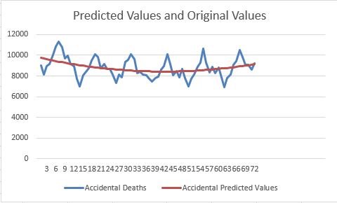

## Lake Huron

### Excel

Open Excel, Click File and Find the Option:

Then Add the Analysis ToolPak:

Select all data but not 1875, and the click Inter Button and click recommendation charts button:

A Line Chart is drawn as shown above, date is the x-value and level is the y value.

Just from the changes in the polyline in the above figure, we can generally believe that there is a downward trend over time.

Next, we proceed to regression analysis:

Hold on and move is to the end of the data column, and then select fill series:

When performing regression analysis on time series data, why not use time as the x value?

> Time is not used as an independent variable because time usually does not provide explanation or causality about the dependent variable, which may introduce multicollinearity problems, increase model complexity, and reduce model generalization ability. We focus more on capturing the intrinsic structure of time series, such as trends and seasonality, to improve forecasting performance.

Then we can start doing regression analysis:

After Clicking OK:

Set data Level (from C5 to C 102) as Input Y Range, and set Index (from B5 to B 102) as Input X Range, then CLick Residuals Button.

Click OK:

A new Sheet is created as show the result of regression analysis.

We can choose:

select a cell you want, and click ok:

The first part is regression statistics:

| Regression Statistics |          |
| --------------------- | -------- |
| Multiple R            | 0.521989 |
| R Square              | 0.272473 |
| Adjusted R Square     | 0.264894 |
| Standard Error        | 1.130287 |
| Observations          | 98       |

1. **Multiple R**: This is a value between -1 and 1, representing the degree of correlation between the independent variables and the dependent variable. Here, 0.52198923 indicates a moderate positive correlation between the independent variables and the dependent variable. The closer this value is to 1, the stronger the relationship
2. **R Square** : This is a measure of goodness-of-fit, indicating the proportion of variance in the dependent variable explained by the model. Here, 0.272472756 means the model can explain approximately 27.25% of the variance in the dependent variable. This implies that the model can account for some of the variability in the dependent variable, but there is still a substantial amount of unexplained variance.
3. Adjusted R Square : This is a modified version of R Square that takes into account the impact of the number of independent variables and the sample size on model performance. In this case, 0.264894347 is an adjusted R Square, providing a more accurate reflection of the model's fit.
4. **Standard Error** : This is the standard error of the model, indicating the average deviation between the actual values of the dependent variable and the model's predicted values. Here, 1.130286779 represents an average prediction error of approximately 1.13 units.
5. **Observations**: This represents the number of samples used to build the regression model, which is 98 in this example.

| ANOVA      |      |          |          |          |                |
| ---------- | ---- | -------- | -------- | -------- | -------------- |
|            | df   | SS       | MS       | F        | Significance F |
| Regression | 1    | 45.93274 | 45.93274 | 35.95382 | 3.55E-08       |
| Residual   | 96   | 122.6446 | 1.277548 |          |                |
| Total      | 97   | 168.5774 |          |          |                |

The ANOVA (Analysis of Variance) summary table, commonly used in statistical analysis, particularly in the context of linear regression. Here's an explanation of each component of the table:

- **ANOVA**: This header indicates that the table is presenting an analysis of variance.
- **df (Degrees of Freedom)**: This column shows the degrees of freedom associated with each component of the analysis. Degrees of freedom are a measure of the number of values in the final calculation of a statistic that are free to vary.
- **SS (Sum of Squares)**: This column displays the sum of squared differences or variations. It represents the variability in the data that is attributed to each component.
- **MS (Mean Square)**: This column represents the mean or average of the squared differences (SS) and is calculated by dividing SS by its respective degrees of freedom (df).
- **F (F-statistic)**: The F-statistic is a test statistic used to compare the variances between groups or components. It is calculated by dividing the mean square of the regression (or model) by the mean square of the residuals (error term).
- **Significance F (Significance Level or p-value)**: This column provides the p-value associated with the F-statistic. The p-value indicates the probability that the observed F-statistic occurred by chance. Smaller p-values typically suggest that the component being tested (in this case, the regression) is statistically significant.

Now, let's interpret the specific values in the table:

- **Regression**: This row represents the part of the variability in the dependent variable that is explained by the regression model. It has 1 degree of freedom, a sum of squares (SS) of 45.93274, a mean square (MS) of 45.93274, and an F-statistic of 35.95382. The very low p-value (3.55E-08) indicates that the regression model is highly significant in explaining the variation in the dependent variable.
- **Residual**: This row represents the unexplained or residual variability in the dependent variable. It has 96 degrees of freedom, an SS of 122.6446, and an MS of 1.277548.
- **Total**: This row represents the total variability in the dependent variable, combining both the explained (regression) and unexplained (residual) variation. It has 97 degrees of freedom and a total SS of 168.5774.

|              | Coefficients | Standard Error | t Stat   | P-value  | Lower 95% | Upper 95% | Lower 95.0% | Upper 95.0% |
| ------------ | ------------ | -------------- | -------- | -------- | --------- | --------- | ----------- | ----------- |
| Intercept    | 10.20204     | 0.230111       | 44.33524 | 9.7E-66  | 9.745269  | 10.6588   | 9.745269    | 10.6588     |
| X Variable 1 | -0.0242      | 0.004036       | -5.99615 | 3.55E-08 | -0.03221  | -0.01619  | -0.03221    | -0.01619    |

This is a coefficients table from a regression analysis, providing information about the coefficients in the regression model and their statistical properties. Here's an explanation of each column in the table:

- **Coefficients**: This column displays the coefficients (parameter estimates) for each variable in the regression model, including the intercept and the independent variable X Variable 1. These coefficients represent the impact of each variable on the dependent variable.
- **Standard Error**: This column shows the standard error of the estimated coefficients, which measures the uncertainty in the coefficient estimates.
- **t Stat**: This column displays the t-statistic, which is a statistical measure used to test whether the coefficients are statistically significant. A higher absolute t-statistic (positive or negative) suggests greater statistical significance.
- **P-value**: This column provides the p-value associated with the t-statistic. The p-value indicates the probability of observing the t-statistic, and a smaller p-value suggests that the coefficient is statistically significant.
- **Lower 95%** and **Upper 95%**: These two columns show the lower and upper bounds of the 95% confidence interval for each coefficient. These intervals represent our level of confidence in the coefficient estimates.

Specifically:

- **Intercept**: The intercept is the constant term in the regression model, representing the predicted value of the dependent variable when the independent variable is 0. In this case, the estimated intercept is 10.20203661, with a very small standard error (0.230111251). The t-statistic is very large (44.33523595), and the corresponding p-value (9.70257E-66) is very close to zero, indicating that the intercept is highly significant.
- **X Variable 1**: The coefficient estimate for X Variable 1 is -0.024201111, with a standard error of 0.004036108. The t-statistic is -5.99615055, and the associated p-value (3.54523E-08) is very close to zero, indicating that X Variable 1 has a statistically significant effect on the dependent variable.

The last part is residual output:

Is shows the predicted value of the regression model and the residuals of predicted values and original values.

"Residual" is an important concept in statistics and regression analysis, which represents the difference or error between the actual observed value and the predicted value of the model.

In regression analysis, we try to build a mathematical model to explain the relationship between the dependent variable (or response variable) and one or more independent variables (or explanatory variables). The difference between the model's predicted value and the actual observed value is the residual. Residuals represent the variability in the dependent variable that is not explained or captured by the model. Our goal is to minimize the residual error so that it is as close to zero as possible, thus improving the fit of the model.

Residuals are usually calculated in the following way:

1. First, use a regression model to calculate the predicted value for each observation.
2. Then, subtract the corresponding predicted value from the actual value of each observation to obtain the residual.

The nature of the residuals is very important in assessing the quality and accuracy of the regression model. If the residuals have a certain pattern or structure, it may mean there is a problem with the model and further improvement is needed. Some common residual patterns include:

- **Random Residuals**: Residuals are randomly distributed with no obvious pattern or trend.
- **Heteroscedastic Residuals**: The variance of the residuals is inconsistent at different levels of the independent variables, and transformation or weighted regression may need to be considered.
- **Autocorrelated residuals**: There is temporal or spatial correlation between the residuals, which needs to be processed using a time series or spatial model.
- **Nonlinear Residuals**: There is a nonlinear relationship between the residuals and the independent variables, which may require a more complex model.

By analyzing the residuals, model deficiencies can be identified and appropriate actions can be taken to improve the model's fit and predictive performance. Therefore, residuals are a key concept in regression analysis and help in evaluating the effectiveness of a model.

Now copy the predicted values from result output to the beside original data:

Or set the year as x value but just index:

Judging from the visualization results of the predicted values of the regression model, there is a downward trend. But it can be argued that the model does not fit the trend of the original data very well.

Try quadratic to fit the data:

Now try regression again:

Now we get the regression result:

Then we can copy predicted to the beside of original data again:

Then we can graph that:

This seems much better, and judging from the trend of the model, the model seems to show an upward trend in the later period.

Check R-square values:

The two R Square values are:

1. The R Square value of the first model is 0.272472756.

2. The R Square value for the second model is 0.408318578.

These two R Square values measure how well the regression model explains the dependent variable. When comparing these two values, you can see:

- The second model has a higher R Square value of 0.408318578, which is closer to 1 than the first model's 0.272472756. This means that the second model better explains the variability in the dependent variable and has a better fit.

- Since R Square reflects the goodness of fit of the model, higher R Square values generally indicate a better fit of the model to the data. Therefore, the second model is more powerful in explaining the data.

Overall, the R Square value of the second model indicates that it has better fitting performance relative to the first model and is better able to explain the variability of the dependent variable.

### Minitab

Copy X and Y to the minitab:

Then Click Statistics → Regression → Regression:

Select Columns:

The click graphs and click four in one:

Then a graph is created:

We can compare excel and minitab results:

The go to graph and select scatter plot:

The that is the result:

Obviously this is not the best model, no matter from the visualization results or from the value of r square.

We can try $x^2$ next:

Then:

Now we use scatter plot graph to draw that again:

### Additional Information

The significance of using the square of x (X^2) and x as the x-axis is to introduce a quadratic term, thus extending linear regression into quadratic regression or polynomial regression. This can be used to model non-linear relationships, allowing the model to fit the data better, especially when the data shows a clear curvilinear trend.

Specifically, if you include x and X^2 as the two features of the x-axis, your regression model becomes:

$y = β0 + β1 * x + β2 * X^2 + ε$

in that formula:

- y is the dependent variable (usually the value you want to predict).
- x is the original independent variable (year).
- X^2 is the square of x.
- β0, β1, and β2 are the regression coefficients used to fit the model.
- ε is the error term.

The point of this model is that it allows you to capture the non-linear relationship between the dependent variables y and x. If your data shows a curvilinear trend, a quadratic regression model may fit the data better and provides more flexibility than a simple linear regression model.

However, it should be noted that introducing quadratic terms may also increase the risk of overfitting, so the complexity of the model needs to be carefully selected and whether it is necessary to introduce quadratic terms or higher-order terms based on the characteristics of the data. Often, you can use model evaluation metrics (such as mean squared error, R squared, etc.) to help determine the most suitable model.

## Death

For death, it is same to draw the graph first.

If we observe directly, we can think that the trend is showing a slowly decreasing trend:

In addition, the data should have seasonality.

and then we can do the regression again:

That is the result:

The above output is a summary table of the results of a regression analysis, often used to explain the performance and parameter estimates of regression models. Below I'll explain what each part means:

**Regression Statistics:**

1. **Multiple R**: Multiple correlation, indicating the linear correlation between the dependent variable (dependent variable) and the independent variable (independent variable). Here, Multiple R is equal to 0.185, indicating a weak linear correlation.

2. **R Square**: Coefficient of determination, indicating how well the model fits. It is the proportion of the variation in the dependent variable that can be explained by the independent variables. Here, R Square is 0.034, indicating that the model is able to explain approximately 3.4% of the variation in the dependent variable.

3. **Adjusted R Square**: The adjusted coefficient of determination, which takes into account the number of independent variables and sample size, is used to more accurately estimate the fit of the model. Here, the corrected R Square is 0.0205.

4. **Standard Error**: Standard error, used to measure the error of the regression item in the model. Here, the standard error is 948.47.

5. **Observations**: The number of observations, indicating the number of data points used to fit the regression model, here are 72 observations.

**ANOVA table (Analysis of Variance):**

This table shows the variance decomposition of the regression analysis, which helps us understand the statistical significance of the model.

1. **df**: degrees of freedom, indicating the number of parameters that can be changed freely in the model. Here, the regression degree of freedom is 1 and the residual degrees of freedom are 70.

2. **SS**: sum of squares, indicating the sum of squares corresponding to each variable. Here, the regression sum of squares is 2235819.523 and the residual sum of squares is 62971414.46.

3. **MS**: Mean Square, which is the sum of squares divided by the degrees of freedom, used to calculate the F-statistic.

4. **F**: F statistic, used to test the significance of the regression model. Here, the F statistic is 2.49.

5. **Significance F**: Significance level, indicating the significance of the F statistic. Here, the p-value (Significance F) is 0.1194, which is greater than the commonly used significance level (for example, 0.05), indicating that the model is not statistically significant.

**Coefficient table:**

This table lists the regression model's coefficients (Intercept and X Variable 1) and statistics associated with them.

1. **Intercept**: Intercept, indicating the estimated value of the dependent variable when the independent variable X Variable 1 is equal to zero. Here, the intercept is 9097.22.

2. **X Variable 1**: independent variable 1, its coefficient is -8.48. This means that, holding other variables constant, each unit increase in X Variable by 1 causes a change in the dependent variable.

3. **Standard Error**: Standard error, used to estimate the uncertainty of the coefficient.

4. **t Stat**: t statistic, used to test whether the coefficient is significantly different from zero. Here, the t-statistic for X Variable 1 is -1.58, which corresponds to a p-value of 0.1194, so X Variable 1 is not statistically significant.

5. **P-value**: p value, used to test whether the coefficient is significantly different from zero. Generally, a coefficient is considered significant if the p-value is less than a selected significance level (such as 0.05).

6. **Lower 95% and Upper 95%**: These columns show the confidence interval for each coefficient, indicating the estimated range of the coefficient.

Based on this information, you can conclude that the model has a low R Square, the F statistic is not significant, and the coefficient of X Variable 1 is not significant. This may mean that the model does not explain the variation in the dependent variable well, or that the model needs to be further improved to better fit the data.

Visualize the residuals, which also seem to have seasonality.

However, due to the poor performance of the model, we will try multiple regression first.

This new regression model performs better relative to the previous model. Here are the key observations about the new model:

**Regression Statistics:**

1. **Multiple R**: The multiple correlation has improved from about 0.185 before to about 0.369, which means a stronger linear correlation between the independent variable and the dependent variable.

2. **R Square**: The coefficient of determination has improved from about 0.034 before to about 0.137, which means that the new model better explains about 13.7% of the variation in the dependent variable.

3. **Adjusted R Square**: The adjusted coefficient of determination has improved from about 0.0205 before to about 0.1115, which shows that the new model also performs better when considering the number of independent variables and sample size.

4. **Standard Error**: The standard error has been reduced from the previous about 948.47 to about 903.34, which means that the fitting error of the model is smaller and the model is more accurate.

5. **ANOVA table**: The F statistic here is 5.45, and the significance level (Significance F) is 0.0063, which shows that the regression model is statistically significant, which is a significant difference compared with the previous model Improve.

**Coefficient table:**

1. **Intercept**: The intercept is still significant, its t-statistic is much greater than zero, and the p-value is very small.

2. **X Variable 1**: The coefficient of X Variable 1 becomes -65.99, which means that each unit increase of X Variable 1 will lead to a decrease of the dependent variable, which is more effective than the previous model The impact is clear and significant.

3. **X Variable 2**: The new model introduces an additional independent variable, X Variable 2, which has a coefficient of 0.79, a t-statistic of 2.86, and a p-value of 0.0056, indicating that X Variable 2 is also significant.

To summarize, the new regression model performs better relative to the previous model. It has a higher coefficient of determination, lower standard errors, and more significant F-statistics and coefficients. This means that the new model better explains the changes in the dependent variable and fits the data more accurately. Therefore, the new model is an improved model from a statistical and interpretive performance perspective.

Then created a visualization to show the predicted values and original values:

Compare two residuals:

Judging from the observation results, we can generally think that there is seasonal nature in residual, and it will first show a trend of first falling, then rising and then falling every year.

## Jeans

Now we are going to try jeans dataset:

From the visual results, Jeans shows obvious seasonality. Sales will be at a low point in the first quarter of each year, then drop to the lowest point of the year in the second quarter, then begin to pick up in the third quarter, and then reach the highest point of the year in the fourth quarter. Repeatedly every year.

Then we did regression for the data:

This result is the statistical output of a linear regression model used to analyze the relationship between two variables. The following is an explanation for this result:

1. **Regression statistics**:
    - **Multiple R**: This is the multiple correlation coefficient, which indicates the strength of the linear relationship between the independent variable (X Variable 1) and the dependent variable. Here, the Multiple R is 0.059, indicating that the linear relationship between X Variable 1 and the dependent variable is relatively weak.
    - **R Square**: This is the coefficient of determination, which indicates the proportion of the variation in the dependent variable that can be explained by the independent variables. Here, R Square is 0.0035, indicating that X Variable 1 can only explain a small part of the variation in the dependent variable, and the fitting degree of the model is very low.
    - **Adjusted R Square**: This is the adjusted coefficient of determination, taking into account the number of independent variables in the model and the sample size. Here, the Adjusted R Square is -0.0677, because this value is negative, indicating that the model may not be suitable for predicting the dependent variable.
    - **Standard Error**: This is the standard error of the regression equation and represents the average error between the dependent variable data points and the regression line. Here, the standard error is 23.91.

2. **ANOVA (Analysis of Variance)**:
    - This section shows the results of the analysis of variance used to determine whether the independent variable (X Variable 1) has a significant effect on the dependent variable.
    - The **Regression** section includes the degrees of freedom (df) of the regression, the regression sum of squares (SS), the mean square (MS), the F statistic and the significance level of the F statistic. The significance level of the F statistic (Significance F) is 0.828, indicating that the significance of the regression model is very low, that is, the degree of explanation of the independent variable on the dependent variable is not significant.
    - The **Residual** part includes the degrees of freedom of the residuals (df), the sum of squares of the residuals (SS) and the mean square of the residuals (MS).

3. **Coefficients**:
    - This section shows the coefficients in the regression equation.
    - **Intercept** is the intercept, representing the estimated value of the dependent variable when the independent variable (X Variable 1) equals zero. Here, the intercept is 94.125.
    - The coefficient of **X Variable 1** represents the relationship between changes in the independent variable and changes in the dependent variable. Here, the coefficient of X Variable 1 is 0.2868, but the P value is high (0.828), which means that the effect of the independent variable X Variable 1 on the dependent variable is not significant.

Taken together, based on the results of this linear regression model, X Variable 1 does not seem to explain the changes in the dependent variable well because the R Square is low, the significance level of the F statistic is high, and the P value of the coefficient is also high. The fit of the model is poor, the relationship between the independent variables and the dependent variable may not be linear, or more independent variables may be needed to better explain changes in the dependent variable.

## Red Wine

Visualization first:

It’s clear that red wine is on the rise.

Then we use regression to build a model:

## Deseasoning

### Jeans

**What is that:**

> "Deseasoning" is a term in time series analysis that describes the process of removing the effects of seasonality from time series data. Time series data often contain multiple components, including trend, seasonality, and random noise components. A seasonal component refers to periodic fluctuations in data due to seasonal changes such as seasons, months, or weeks.
>
> The main goal of Deseasoning is to eliminate or reduce the effects of seasonal components in order to better analyze and predict trends and random movements in time series data. This usually involves calculating the effect of the seasonal component and subtracting it from the raw data. This can be achieved by different methods including moving averages, decomposition methods such as X-12-ARIMA or STL decomposition, etc.
>
> Once the deseasoning process is completed, the remaining time series data often contains trend and random noise components, making it easier for analysts to identify and analyze trends, make forecasts, or perform other time series analysis tasks.
>
> In summary, deseasoning is a method used to remove seasonal components from time series data in order to better understand and analyze other aspects of the data.

Using Minitab to deseasoning:

Minitab's deseasoning function is often used to remove seasonal components from time series data to better analyze trends and other effects. This function can be used to perform the following operations:

- Seasonal adjustment: Minitab may provide seasonal adjustment methods for estimating and removing seasonal effects. This can include using seasonal decomposition methods, such as X-12-ARIMA, to identify and remove seasonal components.
- Plot seasonality: Minitab may allow users to plot seasonality charts to visualize seasonal components and to help users understand seasonal patterns in data.
- Forecasting: By removing the seasonal component, Minitab may allow users to conduct trend analysis and forecasting more accurately to make better decisions.

We can do that for jeans data by using minitab:

The result is shown as below:

Then we choose additive rather than multiplicative:

Here are the results of the two models and some comparisons between them:

**Multiplicative Model**:

- The fitted trend equation is Yt = 101.15 - 0.518×t, where t is time.
- Seasonal Indices show that seasonal components affect the data in different proportions in different seasons. The index values are 0.91446, 0.81150, 0.87125 and 1.40279 respectively.
- Accuracy measures include MAPE (Mean Absolute Percent Error) of 4.3328, MAD (Mean Absolute Dispersion) of 4.0212, and MSD (Mean Squared Difference) of 24.9849.

**Additive Model**:

- The fitted trend equation is Yt = 101.33 - 0.560×t, where t is time.
- The seasonality index shows that the seasonal component affects the data with relatively small additive values, with index values of -8.0625, -17.6875, -12.4375, and 38.1875, respectively.
- Accuracy measures include MAPE of 4.5176, MAD of 4.1584, and MSD of 26.7118.

**Compare**:
1. **Model Type**: The main difference between multiple and additive models is how the seasonal component is handled. A multiple model multiplies a seasonal component to the data, while an additive model adds a seasonal component to the data.

2. **Seasonal Indices**: The seasonal index values in the multiple models are all greater than 1, indicating that the seasonal component affects the data in a multiplicative manner. In contrast, the seasonality index in the additive model has positive and negative values, indicating that the seasonal component affects the data in an additive manner.

3. **Accuracy Measures**: The accuracy measures (MAPE, MAD, MSD) of the two models are close, and there is no obvious difference between them. Which model you choose depends on your understanding of the seasonal component and how you interpret the data.

When choosing between multiple and additive models, you usually need to consider the nature of your data and your theoretical understanding of the seasonal component. If you believe that the seasonal component has a multiplicative effect on the data, then a multiple model may be more appropriate. If you believe that the seasonal component has an additive effect on the data, then an additive model may be more appropriate. You can also choose the best-fit model based on its fit quality and accuracy measures.

Multiple models and additive models are two different methods for dealing with seasonal components in time series data. The main difference between them is how the seasonal components are combined with the original data. Here is a further explanation of the two models:

1. **Multiplicative Model**:
    - Multiple models assume a multiplicative relationship between the seasonal component and the trend component. Specifically, it decomposes raw data into a product of three components: trend, seasonality, and random noise.
    - In multiple models, the seasonal component is multiplied by the original data. This means that the volatility of the seasonal component varies with the overall level of the time series. If the seasonal component is large, it will have a greater impact on the overall data; if the seasonal component is small, it will have a smaller impact on the overall data.
    - Specifically, the seasonality index is used to represent the relative influence of seasonal components at different points in time. These indices are usually greater than 1, less than 1, or equal to 1, indicating a positive enhancement, weakening, or no effect of the seasonal component on the data, respectively.

2. **Additive Model**:
    - Additive models assume that the seasonal and trend components are additive. Specifically, it decomposes raw data into the sum of three components: trend, seasonality, and random noise.
    - In an additive model, the seasonal component is simply added to the original data. This means that the volatility of the seasonal component is a fixed value that is not affected by the overall level of the time series.
    - Specifically, the seasonality index is used to represent the absolute increase or decrease of the seasonal component at different points in time. These indices can be positive or negative, indicating the addition or subtraction of seasonal components to the data.

In summary, the main difference between multivariate and additive models is how they relate the seasonal components to the original data. Multiple models consider the relative impact of seasonal components through a multiplicative relationship, whereas additive models consider the absolute impact of seasonal components through an additive relationship. Which model you choose should be based on your theoretical understanding of the data and how you interpret seasonal effects.Multiple models and additive models are two different methods for dealing with seasonal components in time series data. The main difference between them is how the seasonal components are combined with the original data. Here is a further explanation of the two models:

1. **Multiplicative Model**:
    - Multiple models assume a multiplicative relationship between the seasonal component and the trend component. Specifically, it decomposes raw data into a product of three components: trend, seasonality, and random noise.
    - In multiple models, the seasonal component is multiplied by the original data. This means that the volatility of the seasonal component varies with the overall level of the time series. If the seasonal component is large, it will have a greater impact on the overall data; if the seasonal component is small, it will have a smaller impact on the overall data.
    - Specifically, the seasonality index is used to represent the relative influence of seasonal components at different points in time. These indices are usually greater than 1, less than 1, or equal to 1, indicating a positive enhancement, weakening, or no effect of the seasonal component on the data, respectively.

2. **Additive Model**:
    - Additive models assume that the seasonal and trend components are additive. Specifically, it decomposes raw data into the sum of three components: trend, seasonality, and random noise.
    - In an additive model, the seasonal component is simply added to the original data. This means that the volatility of the seasonal component is a fixed value that is not affected by the overall level of the time series.
    - Specifically, the seasonality index is used to represent the absolute increase or decrease of the seasonal component at different points in time. These indices can be positive or negative, indicating the addition or subtraction of seasonal components to the data.

In summary, the main difference between multivariate and additive models is how they relate the seasonal components to the original data. Multiple models consider the relative impact of seasonal components through a multiplicative relationship, whereas additive models consider the absolute impact of seasonal components through an additive relationship. Which model you choose should be based on your theoretical understanding of the data and how you interpret seasonal effects.

**Explain**

In the multiplicative model, the specific values of the seasonal index are as follows:

seasonal index

Period 1 Index: 0.91446
Period 2 Index: 0.81150
Period 3 Index: 0.87125
Period 4 Index: 1.40279

These values represent the relative influence of the seasonal component on the raw data for different seasonal periods (for example, four quarters or four months). For example, in the first quarter (Period 1), the seasonal component has the strongest influence at 0.91446, while in the fourth quarter (Period 4), the seasonal component has the strongest influence at 1.40279.

In multiple models, each seasonality index represents the relative influence of the seasonal component within the corresponding seasonal period. When you multiply raw data by these seasonal indices, the result is data that has been adjusted, that is, the effects of the seasonal component are removed.

Specifically, the purpose of the multiplication operation is to remove the seasonal component from the raw data in order to better analyze the trend and other components of the data. Therefore, by multiplying the raw data with a seasonal index, you get data that can be viewed as data that is not affected by seasonality within the corresponding seasonal cycle.

This seasonally adjusted data can be used to analyze and forecast trends more accurately because it has removed the seasonal component. This helps to better understand the overall behaviour of time series data.

### Red Wine

