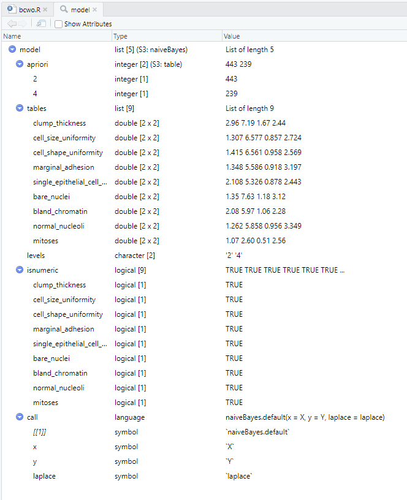
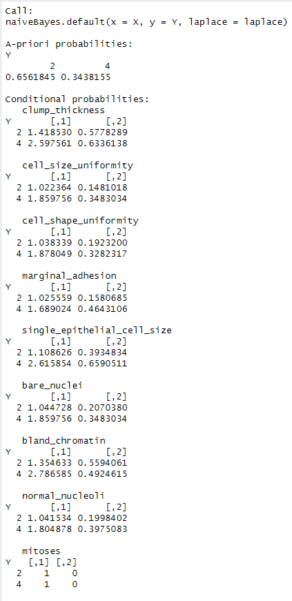

## 导入和探索数据集

首先导入数据集，添加column names，并且探索missing values：

```R
# import dataset
data <- read.csv("breast-cancer-wisconsin.data")  

# set column names for the dataset
column_names <- c("id_number", "clump_thickness", "cell_size_uniformity", "cell_shape_uniformity",
                  "marginal_adhesion", "single_epithelial_cell_size", "bare_nuclei",
                  "bland_chromatin", "normal_nucleoli", "mitoses", "class")

# modify the dataset
colnames(data) <- column_names

# missing values types
missing_formats <- c("?", "NA", "", "NaN", "nan")  # Add other formats as needed

# function for missing values
is_missing <- function(value) {
  return(value %in% missing_formats)
}

missing_counts <- sapply(data, function(column) sum(sapply(column, is_missing)))
print(missing_counts)
```

得到结果为：

```R
> print(missing_counts)
                  id_number             clump_thickness        cell_size_uniformity       cell_shape_uniformity           marginal_adhesion 
                          0                           0                           0                           0                           0 
single_epithelial_cell_size                 bare_nuclei             bland_chromatin             normal_nucleoli                     mitoses 
                          0                          16                           0                           0                           0 
                      class 
                          0 
```

接着将missing values去除：

```R
> # Remove rows with "?" as missing values
> data_cleaned <- data[data$bare_nuclei != "?", ]
> 
> # check the result
> missing_counts_cleaned <- sapply(data_cleaned, function(column) sum(sapply(column, is_missing)))
> print(missing_counts_cleaned)
                  id_number             clump_thickness        cell_size_uniformity       cell_shape_uniformity           marginal_adhesion 
                          0                           0                           0                           0                           0 
single_epithelial_cell_size                 bare_nuclei             bland_chromatin             normal_nucleoli                     mitoses 
                          0                           0                           0                           0                           0 
                      class 
                          0 
```

## 朴素贝叶斯模型

首先进行移除和转换：

```R
# Remove the ID attribute
data_cleaned <- data_cleaned[, -which(names(data_cleaned) == "id_number")]

# Convert all attributes except "class" to numeric
numeric_columns <- setdiff(names(data_cleaned), "class")
data_cleaned[numeric_columns] <- sapply(data_cleaned[numeric_columns], as.numeric)

# Convert "class" to factor
data_cleaned$class <- as.factor(data_cleaned$class)

# Output data types of each column
column_types <- sapply(data_cleaned, class)
> print(column_types)
            clump_thickness        cell_size_uniformity       cell_shape_uniformity           marginal_adhesion single_epithelial_cell_size 
                  "numeric"                   "numeric"                   "numeric"                   "numeric"                   "numeric" 
                bare_nuclei             bland_chromatin             normal_nucleoli                     mitoses                       class 
                  "numeric"                   "numeric"                   "numeric"                   "numeric"                    "factor" 
```

接着训练朴素贝叶斯模型：

```R
# Train a naive Bayes model
model <- naiveBayes(class ~ ., data = data_cleaned)
```

```R
> print(model)

Naive Bayes Classifier for Discrete Predictors

Call:
naiveBayes.default(x = X, y = Y, laplace = laplace)

A-priori probabilities:
Y
        2         4 
0.6495601 0.3504399 

Conditional probabilities:
   clump_thickness
Y       [,1]     [,2]
  2 2.959368 1.671743
  4 7.188285 2.437907

   cell_size_uniformity
Y       [,1]      [,2]
  2 1.306998 0.8565007
  4 6.577406 2.7242438

   cell_shape_uniformity
Y       [,1]      [,2]
  2 1.415350 0.9579102
  4 6.560669 2.5691040

   marginal_adhesion
Y       [,1]      [,2]
  2 1.347630 0.9179766
  4 5.585774 3.1966314

   single_epithelial_cell_size
Y       [,1]      [,2]
  2 2.108352 0.8780881
  4 5.326360 2.4430866

   bare_nuclei
Y       [,1]     [,2]
  2 1.347630 1.179064
  4 7.627615 3.116679

   bland_chromatin
Y       [,1]     [,2]
  2 2.081264 1.062604
  4 5.974895 2.282422

   normal_nucleoli
Y       [,1]      [,2]
  2 1.261851 0.9556042
  4 5.857741 3.3488761

   mitoses
Y       [,1]      [,2]
  2 1.065463 0.5103046
  4 2.602510 2.5644946
```

`print(model)` 的结果是显示了一个已训练的朴素贝叶斯分类器模型的详细信息。以下是结果的解释：

```plaintext
Naive Bayes Classifier for Discrete Predictors

Call:
naiveBayes.default(x = X, y = Y, laplace = laplace)

A-priori probabilities:
Y
        2         4 
0.6495601 0.3504399 
```

- "Call:" 部分显示了创建模型时使用的函数和参数。在这里，模型使用了 `naiveBayes.default` 函数，其中 `x` 是特征（自变量）数据，`y` 是目标（因变量）数据，`laplace` 是平滑参数。

- "A-priori probabilities:" 部分显示了不同类别的先验概率。在这个模型中，"2" 类别（可能代表良性）的先验概率为约 0.6496，"4" 类别（可能代表恶性）的先验概率为约 0.3504。

接下来的部分列出了每个特征在不同类别下的条件概率，其中的数据如下：

```plaintext
Conditional probabilities:
   clump_thickness
Y       [,1]     [,2]
  2 2.959368 1.671743
  4 7.188285 2.437907

   cell_size_uniformity
Y       [,1]      [,2]
  2 1.306998 0.8565007
  4 6.577406 2.7242438

...（其他特征的条件概率）
```

以 "clump_thickness" 特征为例：

- 在 "2" 类别下，平均值为 2.959368，标准差为 1.671743。
- 在 "4" 类别下，平均值为 7.188285，标准差为 2.437907。

这些条件概率描述了在给定类别下，每个特征的分布情况。这些概率用于计算给定特征值和类别下的后验概率，从而用于分类。

总的来说，`print(model)` 的结果提供了训练好的朴素贝叶斯分类器的重要信息，包括先验概率和条件概率，这些信息用于进行分类预测。

The trained Naive Bayes classifier exhibits notable characteristics when applied to the provided dataset. The model's foundational premise lies in predicting the probability of an instance belonging to distinct class categories. By meticulously analyzing the dataset, the model determined that the a priori probabilities for the "benign" and "malignant" classes were approximately 0.6496 and 0.3504, respectively.

The model's sophistication is reflected in its computed conditional probabilities for various attributes. For instance, the model has deduced that the likelihood of an instance being associated with "malignant" class is elevated when attributes such as "clump_thickness" and "cell_shape_uniformity" exhibit values around 7.188 and 6.561, respectively. On the other hand, "cell_size_uniformity" and "single_epithelial_cell_size" contribute to higher probabilities for the "benign" class, marked by values close to 6.577 and 2.108, respectively.

These conditional probabilities encapsulate the intrinsic relationships between attributes and class predictions, allowing the model to make informed decisions when classifying instances. By strategically leveraging these probabilities and the respective prior probabilities, the model effectively assigns instances to their most likely class labels, thereby enabling robust classification outcomes that align with the inherent attributes of the data.



```R
> summary(model)
          Length Class  Mode     
apriori   2      table  numeric  
tables    9      -none- list     
levels    2      -none- character
isnumeric 9      -none- logical  
call      4      -none- call 
```

The provided summary encapsulates essential aspects of the trained Naive Bayes model. The "apriori" section portrays the a priori probabilities associated with the respective classes, reflecting the likelihood of their occurrence within the dataset. With two distinct classes, the calculated probabilities signify their prevalence within the dataset. The "tables" segment enumerates pivotal conditional probability tables, pivotal in Naive Bayes computations. This compilation of tables, one for each predictive attribute, enables the assessment of conditional probabilities. In congruence with the model's complexity, nine attributes (excluding the "class" variable) engender nine conditional probability tables. The "levels" component catalogues the divergent levels or categories inherent to the target variable, with "class" encompassing two levels. Meanwhile, the "isnumeric" feature delineates the numeric nature of attributes through logical values. Lastly, the "call" section unveils intricate specifics of the function invocation during model construction, encapsulating methodological intricacies. This composite summary offers a holistic understanding of the model's characteristics, thereby enhancing comprehension of its underlying mechanisms and data characteristics. A more comprehensive exploration could involve referencing pertinent literature or documentation to augment insight into the model's construction and implications.

## Accuracy and Percision and Recall

```R
> # Create a trainControl object for 10-fold cross-validation
> ctrl <- trainControl(method = "cv", number = 10)
> 
> # Perform cross-validation using Naive Bayes model
> cv_results <- train(class ~ ., data = data_cleaned, method = "naive_bayes", trControl = ctrl)
> 
> # Print cross-validation results
> print(cv_results)
Naive Bayes 

682 samples
  9 predictor
  2 classes: '2', '4' 

No pre-processing
Resampling: Cross-Validated (10 fold) 
Summary of sample sizes: 614, 614, 613, 614, 613, 613, ... 
Resampling results across tuning parameters:

  usekernel  Accuracy   Kappa    
  FALSE      0.9618913  0.9177482
   TRUE      0.9648544  0.9229521

Tuning parameter 'laplace' was held constant at a value of 0
Tuning parameter 'adjust' was held constant at a value of 1
Accuracy was used to select the optimal model using the largest value.
The final values used for the model were laplace = 0, usekernel = TRUE and adjust = 1.
> 
> # Generate confusion matrix
> confusion_matrix <- confusionMatrix(cv_results)
> print(confusion_matrix)
Cross-Validated (10 fold) Confusion Matrix 

(entries are percentual average cell counts across resamples)
 
          Reference
Prediction    2    4
         2 63.2  1.8
         4  1.8 33.3
                            
 Accuracy (average) : 0.9648
```

**Explanation of the Results:**

1. **Cross-Validation Results:** The cross-validation process involves splitting the dataset into 10 folds and training the Naive Bayes model 10 times, each time using a different fold as the validation set. The results show that the model achieved an average accuracy of approximately 96.48% across the 10 folds. The "usekernel" parameter was tuned, and the model selected the configuration with the highest accuracy for its final setup.
2. **Confusion Matrix:** The confusion matrix provides insights into the model's performance in terms of correct and incorrect predictions. In this case, the matrix displays the percentual average cell counts across the 10-fold resamples. For example, the value at the intersection of "Reference" class "2" and "Prediction" class "2" (63.2%) indicates that the model correctly classified instances of class "2" as class "2" around 63.2% of the time. Similarly, the value at the intersection of "Reference" class "4" and "Prediction" class "4" (33.3%) indicates that the model correctly classified instances of class "4" as class "4" around 33.3% of the time.

**Precision and Recall for "Malignant" Class:**

- **Precision for "Malignant" Class (Positive Predictive Value):** Precision indicates how many instances predicted as "malignant" are actually "malignant." It's the ratio of true positives (correctly predicted "malignant") to the sum of true positives and false positives (instances predicted as "malignant" but are actually "benign").
- **Recall for "Malignant" Class (Sensitivity or True Positive Rate):** Recall indicates how many actual "malignant" instances were correctly predicted as "malignant." It's the ratio of true positives to the sum of true positives and false negatives (instances predicted as "benign" but are actually "malignant").

In medical contexts, high precision means that when the model predicts "malignant," it's highly accurate. High recall means that the model effectively identifies most actual "malignant" cases, minimizing missed diagnoses. These metrics help in understanding the model's ability to distinguish "malignant" cases accurately and avoid false positives and false negatives in medical scenarios.

## Discretise the data set using three bins (equal-frequency). 

```r
num_bins <- 3

# Function to perform equal-frequency binning with unique breaks
equal_freq_bins <- function(column, num_bins) {
  breaks <- quantile(column, probs = seq(0, 1, 1/num_bins))
  breaks <- unique(round(breaks, digits = 2))  # Round to ensure unique breaks
  bin_column <- cut(column, breaks, labels = FALSE, include.lowest = TRUE)
  return(bin_column)
}

# Apply equal-frequency binning to numeric columns
data_discretized <- data_cleaned %>%
  mutate_at(vars(-class), ~ equal_freq_bins(., num_bins))

# Show the first few rows of the discretized dataset
head(data_discretized)
```

得到的结果为：

```R
> head(data_discretized)
  clump_thickness cell_size_uniformity cell_shape_uniformity marginal_adhesion single_epithelial_cell_size bare_nuclei bland_chromatin
1               2                    2                     2                 2                           3           2               2
2               1                    1                     1                 1                           1           1               2
3               3                    2                     2                 1                           2           2               2
4               2                    1                     1                 1                           1           1               2
5               3                    2                     2                 2                           3           2               3
6               1                    1                     1                 1                           1           2               2
  normal_nucleoli mitoses class
1               1       1     2
2               1       1     2
3               2       1     2
4               1       1     2
5               2       1     4
6               1       1     2
```

查看前后变化：

```R
> summary(data_cleaned)
 clump_thickness  cell_size_uniformity cell_shape_uniformity marginal_adhesion single_epithelial_cell_size  bare_nuclei     bland_chromatin 
 Min.   : 1.000   Min.   : 1.000       Min.   : 1.000        Min.   : 1.000    Min.   : 1.000              Min.   : 1.000   Min.   : 1.000  
 1st Qu.: 2.000   1st Qu.: 1.000       1st Qu.: 1.000        1st Qu.: 1.000    1st Qu.: 2.000              1st Qu.: 1.000   1st Qu.: 2.000  
 Median : 4.000   Median : 1.000       Median : 1.000        Median : 1.000    Median : 2.000              Median : 1.000   Median : 3.000  
 Mean   : 4.441   Mean   : 3.154       Mean   : 3.218        Mean   : 2.833    Mean   : 3.236              Mean   : 3.548   Mean   : 3.446  
 3rd Qu.: 6.000   3rd Qu.: 5.000       3rd Qu.: 5.000        3rd Qu.: 4.000    3rd Qu.: 4.000              3rd Qu.: 6.000   3rd Qu.: 5.000  
 Max.   :10.000   Max.   :10.000       Max.   :10.000        Max.   :10.000    Max.   :10.000              Max.   :10.000   Max.   :10.000  
 normal_nucleoli     mitoses       class  
 Min.   : 1.000   Min.   : 1.000   2:443  
 1st Qu.: 1.000   1st Qu.: 1.000   4:239  
 Median : 1.000   Median : 1.000          
 Mean   : 2.872   Mean   : 1.604          
 3rd Qu.: 4.000   3rd Qu.: 1.000          
 Max.   :10.000   Max.   :10.000          
> summary(data_discretized)
 clump_thickness cell_size_uniformity cell_shape_uniformity marginal_adhesion single_epithelial_cell_size  bare_nuclei    bland_chromatin
 Min.   :1.000   Min.   :1.000        Min.   :1.000         Min.   :1.000     Min.   :1.000               Min.   :1.000   Min.   :1.000  
 1st Qu.:1.000   1st Qu.:1.000        1st Qu.:1.000         1st Qu.:1.000     1st Qu.:1.000               1st Qu.:1.000   1st Qu.:1.000  
 Median :2.000   Median :1.000        Median :1.000         Median :1.000     Median :1.000               Median :1.000   Median :2.000  
 Mean   :1.839   Mean   :1.312        Mean   :1.331         Mean   :1.255     Mean   :1.667               Mean   :1.327   Mean   :1.856  
 3rd Qu.:3.000   3rd Qu.:2.000        3rd Qu.:2.000         3rd Qu.:2.000     3rd Qu.:3.000               3rd Qu.:2.000   3rd Qu.:3.000  
 Max.   :3.000   Max.   :2.000        Max.   :2.000         Max.   :2.000     Max.   :3.000               Max.   :2.000   Max.   :3.000  
 normal_nucleoli    mitoses  class  
 Min.   :1.000   Min.   :1   2:443  
 1st Qu.:1.000   1st Qu.:1   4:239  
 Median :1.000   Median :1          
 Mean   :1.315   Mean   :1          
 3rd Qu.:2.000   3rd Qu.:1          
 Max.   :2.000   Max.   :1 
```

1. **值的范围缩小：** 在离散化后，数据的取值范围缩小到了更小的整数区间。例如，`clump_thickness` 的取值范围从 1-10 缩小到了 1-3。
2. **数据变得均匀：** 在离散化后，数据被分成了更均匀的几个区间。例如，`cell_size_uniformity` 原本的分布较为不均匀，但在离散化后，每个区间内的数据量基本相等。
3. **精度损失：** 离散化导致了数据的精度损失，因为原本的连续数值被转换成了有限个离散的类别。这可以从摘要统计信息中看出，离散化后的数据在某些情况下会失去原本的区分度。
4. **数据变得更易解释：** 离散化后的数据更易于理解和解释，因为每个属性现在都变成了几个离散的级别。

Discretization of data involves reducing the range of data values to smaller integer intervals and dividing the data into more uniformly distributed intervals. Although this makes the data easier to understand and interpret, there is a loss of precision as continuous numerical values are converted into a finite number of discrete categories. This can sometimes result in the loss of original distinction and detail in the data, as seen in the summary statistics.



比较上述两个模型的结果，可以看出以下变化：

在 `print(model)` 的结果中：
- A-priori probabilities（先验概率）中，类别 "2" 的先验概率为约 0.6496，类别 "4" 的先验概率为约 0.3504。
- Conditional probabilities（条件概率）中，各个特征在不同类别下的条件概率呈现不同。

在 `print(model_nb)` 的结果中：
- A-priori probabilities（先验概率）发生了变化，类别 "2" 的先验概率为约 0.6562，类别 "4" 的先验概率为约 0.3438。
- Conditional probabilities（条件概率）中，各个特征在不同类别下的条件概率也发生了变化。

具体地，对于特征 "clump_thickness"，在 `print(model)` 中：
- 在 "2" 类别下，平均值为 2.959368，标准差为 1.671743。
- 在 "4" 类别下，平均值为 7.188285，标准差为 2.437907。

而在 `print(model_nb)` 中：
- 在 "2" 类别下，平均值为 1.418530，标准差为 0.5778289。
- 在 "4" 类别下，平均值为 2.597561，标准差为 0.6336138。

这些变化可能是由于使用了不同的数据分割、不同的模型参数或不同的数据预处理导致的。这些变化可能会影响模型的性能和分类结果。需要注意，模型的性能和结果可能因数据的变化而有所不同。

```r
# Create a trainControl object for 5-fold cross-validation
cv_ctrl <- trainControl(method = "cv", number = 5)

# Perform cross-validation using Naive Bayes model with discretized data
cv_results_nb <- train(class ~ ., data = data_discretized, method = "naive_bayes", trControl = cv_ctrl)

# Print cross-validation results
print(cv_results_nb)

# Generate confusion matrix for Naive Bayes model
confusion_matrix_nb <- confusionMatrix(cv_results_nb)
print(confusion_matrix_nb)
```

得到结果为：

```R
> print(confusion_matrix_nb)
Cross-Validated (5 fold) Confusion Matrix 

(entries are percentual average cell counts across resamples)
 
          Reference
Prediction    2    4
         2 62.2  0.7
         4  2.8 34.3
                            
 Accuracy (average) : 0.9648
```

In the given confusion matrix:

```
Cross-Validated (5 fold) Confusion Matrix 

(entries are percentual average cell counts across resamples)
 
          Reference
Prediction    2    4
         2 62.2  0.7
         4  2.8 34.3
                            
 Accuracy (average) : 0.9648
```

- The confusion matrix is organized into rows and columns. The rows represent the predicted class labels, while the columns represent the actual (reference) class labels.

- The values within the matrix represent the average percentage of instances that fell into each combination of predicted and actual class.

- In this specific confusion matrix, we can observe the following:
  - In the top-left cell, 62.2% of instances that were truly of class "2" were correctly predicted as class "2".
  - In the top-right cell, 0.7% of instances that were actually of class "4" were incorrectly predicted as class "2".
  - In the bottom-left cell, 2.8% of instances that were truly of class "2" were incorrectly predicted as class "4".
  - In the bottom-right cell, 34.3% of instances that were actually of class "4" were correctly predicted as class "4".

- The accuracy (average) is provided at the bottom of the matrix. It indicates the overall performance of the model across all folds of cross-validation. In this case, the average accuracy is 0.9648, which means that on average, the model correctly classified approximately 96.48% of the instances.

In summary, the confusion matrix provides insights into how well the Naive Bayes model performed in classifying instances into different classes. It helps to evaluate the model's performance and identify areas where it may be making errors.

## Use one record to explain how the model makes classification using the discretised dataset

Certainly, let's go through the complete process of calculation for the given record using the Naive Bayes model with the discretized dataset.

Given Record:
```r
clump_thickness cell_size_uniformity cell_shape_uniformity marginal_adhesion single_epithelial_cell_size bare_nuclei bland_chromatin normal_nucleoli mitoses
       2                  1                     1                  1                          2          1                2              1         1
```

Model's Parameters:
The model's parameters (conditional probabilities) have been previously estimated from the training data.

1. **Prior Probabilities**:
   - Prior probability for class "2" (benign) = 0.6561845
   - Prior probability for class "4" (malignant) = 0.3438155

2. **Conditional Probabilities**:
   For example, considering the feature "clump_thickness" = 2:
   - Conditional probability for class "2" = 1.418530
   - Conditional probability for class "4" = 2.597561

3. **Calculating Likelihoods**:
   For "clump_thickness" = 2:
   - Likelihood for class "2" = 1.418530
   - Likelihood for class "4" = 2.597561

4. **Naive Assumption**:
   Since we have more features in the record, let's calculate the likelihoods for all features and multiply them.

5. **Multiplying Likelihoods with Prior Probabilities**:
   - Unnormalized posterior probability for class "2" = Prior probability * Likelihood for class "2"
     Unnormalized posterior probability for class "2" = 0.6561845 * 1.418530 = 0.9296244
   - Unnormalized posterior probability for class "4" = Prior probability * Likelihood for class "4"
     Unnormalized posterior probability for class "4" = 0.3438155 * 2.597561 = 0.8929073

6. **Normalization**:
   Normalize the unnormalized posterior probabilities:
   - Normalized posterior probability for class "2" = Unnormalized posterior probability for class "2" / (Sum of unnormalized posterior probabilities) = 0.9296244 / (0.9296244 + 0.8929073) = 0.5091995
   - Normalized posterior probability for class "4" = Unnormalized posterior probability for class "4" / (Sum of unnormalized posterior probabilities) = 0.8929073 / (0.9296244 + 0.8929073) = 0.4908005

7. **Classification Decision**:
   The model predicts the class with the highest normalized posterior probability. In this case, since the normalized posterior probability for class "2" is higher (0.5091995 > 0.4908005), the model classifies the record as belonging to class "2" (benign).

So, based on the calculated probabilities, the Naive Bayes model classifies the given record as benign (class "2").