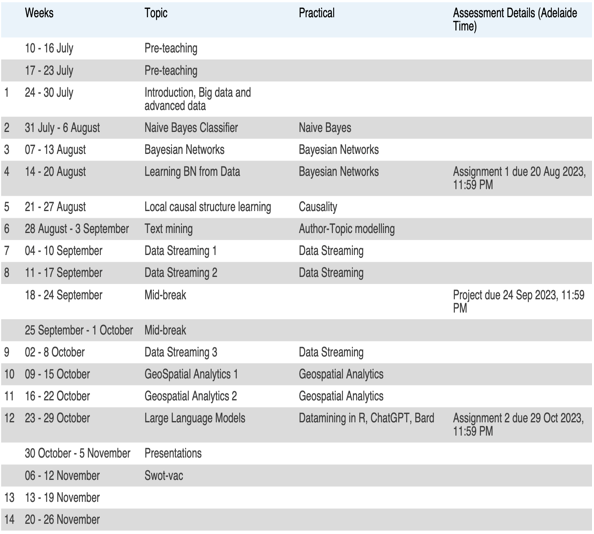
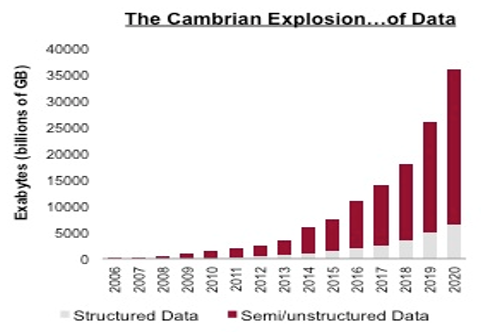
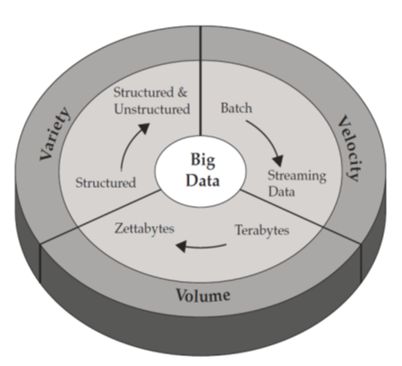
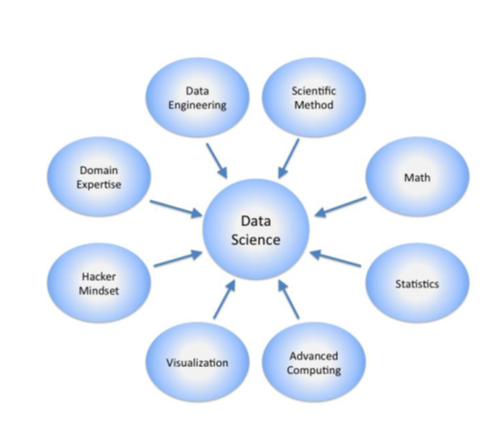
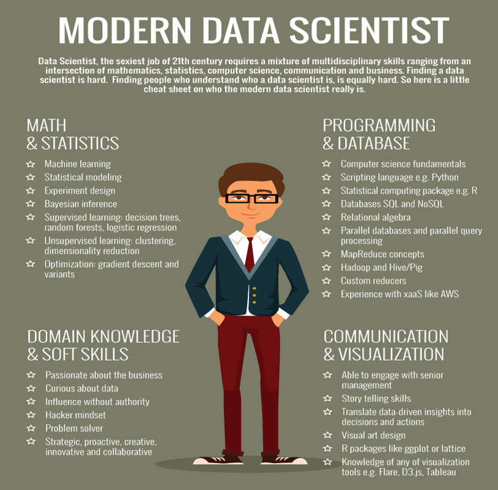

## Timeline & Assignments

Timeline:



Assignments:

```
Assignment 1: Big data & Naïve Bayes classifiers
30%
Deadline: 20/08/2023
Project: Bayesian networks
40%
Deadline: 24/09/2023
Assignment 3: text mining, geospatial, streaming data
30%
Deadline: 29/10/2023
```

Contents:

```
Big data & data science introduction: week 1
Naïve Bayes Classifiers: week 2
Bayesian networks: week 3, 4, 5
Bayesian network structure learning
Causal inference
Local causal structure learning
Text mining: week 6
Streaming data: week 7, 8, 9
Geospatial analytics: week 10, 11
Experiment design: week 12
```

## Big Data

Why Big Data:



What is Big Data:

> •‘Big Data’ is similar to ‘small data’, but **bigger** in size

3 Vs:

1. Volume–challenging to load and process (how to index, retrieve)
2. Variety–different data types and degree of structure (how to query semi-structured data)
3. Velocity–real-time processing influenced by rate of data arrival



10 Vs:

1. 体积：吨字节
2. 多样性：维度
3. 速度：高数据速率
4. 真实性：必要且充分的数据
5. 有效性：数据质量
6. 价值：商业价值、投资回报率
7. 可变性：动态
8. 地点：地点
9. 词汇：语义
10. 模糊性：混乱

## Data Science

Data Science Skills:



Data Scientist:



## Applications

**behaviour Analytics**

Behavioral Analytics: Definition: Behavioral analytics is the process of collecting, measuring, and analyzing user behavior data to gain insights into how individuals interact with digital platforms, products, or services. It helps organizations understand user preferences, patterns, and actions, which can be used to optimize user experience and improve business outcomes.

Example: An e-commerce website tracks user behavior, such as pages visited, products viewed, time spent on each page, and items added to the cart. By analyzing this data, the website can identify popular products, detect drop-off points in the user journey, and personalize recommendations to improve conversions and overall user satisfaction.

**Optimize Funnel Conversation**

Optimize Funnel Conversion: Definition: Funnel conversion optimization involves analyzing and enhancing the conversion rates at different stages of a sales or marketing funnel. The goal is to identify and remove any barriers or inefficiencies in the user journey to increase the percentage of users who complete desired actions, such as making a purchase or signing up for a service.

Example: A software company examines the conversion rates of its sign-up process for a free trial of their product. By using A/B testing, they discover that simplifying the registration form and providing a clearer call-to-action significantly increases the number of trial users who convert to paying customers.

**Customer Segmentation**

Customer Segmentation: Definition: Customer segmentation is the practice of dividing a customer base into distinct groups based on specific characteristics or behaviors. This allows businesses to tailor their marketing, communication, and product offerings to better meet the needs and preferences of each segment.

Example: A fitness app segments its users based on their fitness goals, such as weight loss, muscle gain, or general fitness. The app then sends targeted content and workout plans to each segment, increasing user engagement and retention.

**Predictive Support**

Predictive Support: Definition: Predictive support, also known as predictive customer service, involves using data analysis and machine learning algorithms to anticipate customer needs and proactively address potential issues before they occur. This approach aims to enhance customer satisfaction and reduce support costs.

Example: An internet service provider monitors network performance data and user behavior to predict potential connectivity problems for specific users. When the system detects a likely issue, it automatically sends a notification to the customer and initiates troubleshooting steps, preventing a full service disruption and reducing the number of customer support calls.

========================================

**行为分析**

行为分析：定义：行为分析是收集、测量和分析用户行为数据的过程，以获得有关个人如何与数字平台、产品或服务进行交互的见解。它有助于组织了解用户的偏好、模式和行动，这可以用于优化用户体验和改善业务结果。

例如：电子商务网站跟踪用户行为，如访问的页面、查看的产品、在每个页面上花费的时间和添加到购物车的物品。通过分析这些数据，网站可以确定热门产品，在用户旅程中检测到流失点，并个性化推荐以提高转化率和整体用户满意度。

**优化漏斗转化率**

优化漏斗转化率：定义：漏斗转化率优化涉及分析和增强销售或营销漏斗不同阶段的转化率。目标是识别和消除用户旅程中的任何障碍或低效率，以增加完成所需操作（例如购买或注册服务）的用户百分比。

例如：一家软件公司检查其免费试用产品的注册流程的转化率。通过使用A/B测试，他们发现简化注册表格并提供更清晰的呼吁策略显著增加了转化为付费客户的试用用户数量。

**客户细分**

客户细分：定义：客户细分是将客户群体根据特定特征或行为分成不同的群体的做法。这使企业能够根据每个细分的需求和偏好来定制其营销、沟通和产品提供。

例如：健身应用程序根据其用户的健身目标（如减肥、增肌或普通健身）对其进行细分。然后，该应用程序向每个细分发送定向内容和训练计划，提高用户参与度和保留度。

**预测性支持**

预测性支持：定义：预测性支持，也称为预测性客户服务，涉及使用数据分析和机器学习算法来预测客户需求并在可能出现问题之前主动解决。这种方法旨在增强客户满意度并降低支持成本。

例如：一家互联网服务提供商监控网络性能数据和用户行为，以预测特定用户的可能连接问题。当系统检测到可能存在问题时，它会自动向客户发送通知并启动故障排除步骤，防止全面服务中断并减少客户支持电话的数量。