## 背景

三种分类方法：

1. 直接建模分类规则，例子：k-NN，决策树，感知器，支持向量机（SVM）
2. 建模给定输入数据的类别成员概率，例子：带有交叉熵损失的感知机
3. 对每个类别内的数据进行概率建模，例子：朴素贝叶斯，基于模型的分类器

1和2是判别式分类的例子，3是生成式分类的例子，2和3都是概率分类的例子。

**判别式分类模型**（discriminative classification）是直接学习输入数据与其对应的输出标签之间的映射关系，即从输入到输出的直接映射。在判别式分类中，我们关注的是找到一个决策边界，能够将不同类别的样本分开。例如，k-NN、决策树、感知机和支持向量机（SVM）都属于判别式分类算法。

**生成式分类**（generative classification）也可以建模类别成员概率，但是它更关注对每个样本的分类结果，即给定输入数据，输出其属于各个类别的概率。这样，我们可以在分类问题中获得更多信息，并进行更精细的分类决策。例如，感知机使用交叉熵损失来优化分类结果，从而间接地对类别成员概率进行建模。

**生成式分类**（probabilistic classification）是一种通过建模每个类别内数据的分布来进行分类的方法。它考虑了样本生成的过程，即给定输入数据，估计其来自每个类别的概率，并基于概率来进行分类决策。朴素贝叶斯和其他基于模型的分类器属于生成式分类算法。生成式分类可以用于生成新的样本，因为它对数据分布有较好的建模。

## 概率基础

### 基础概念

**先验概率 (Prior Probability)**:

先验概率是指在考虑任何新的证据或信息之前，根据以往的经验或已有的知识，对一个事件或假设的概率进行的估计。

公式：$$ P(A) $$

解释：$$ P(A) $$ 是指事件 A 发生的概率，它是在考虑任何新的信息之前，基于先前观察或经验得出的概率。

**条件概率 (Conditional Probability)**:

条件概率是指在给定其他相关事件发生的情况下，某个事件发生的概率。在条件概率中，我们考虑了某些已知条件对事件发生概率的影响。

公式：$$ P(A|B) = \frac{P(A \cap B)}{P(B)} $$

解释：$$ P(A|B) $$ 表示在事件 B 已经发生的条件下，事件 A 发生的概率。条件概率是通过事件 A 与事件 B 共同发生的概率除以事件 B 发生的概率得到的。

**联合概率 (Joint Probability)**:

联合概率是指两个或多个事件同时发生的概率，它表示了这些事件共同发生的可能性。

公式：$$ P(A \cap B) $$

解释：$$ P(A \cap B) $$ 表示事件 A 和事件 B 同时发生的概率，即两个事件共同发生的可能性。

**关系: 独立性 (Independence)**:

两个事件 A 和 B 是相互独立的，当且仅当它们的联合概率等于它们各自的概率的乘积。

公式：$$ P(A \cap B) = P(A) \cdot P(B) $$

解释：当事件 A 和事件 B 是相互独立的时候，它们的联合概率等于事件 A 发生的概率乘以事件 B 发生的概率。换句话说，在独立事件中，一个事件的发生不会影响另一个事件的发生。

### 贝叶斯定理

**贝叶斯定理（Bayes Rule）**，也称为贝叶斯公式，是概率论中一种用于计算条件概率的重要规则。它基于条件概率的定义，通过已知的先验概率和新的证据或观测来更新事件的后验概率。

**定义**：

给定两个事件 A 和 B，贝叶斯定理描述了在已知事件 B 发生的条件下，事件 A 发生的概率。

**公式**：

贝叶斯定理的公式如下：

$$ P(A|B) = \frac{P(B|A) \cdot P(A)}{P(B)} $$

其中，

- $P(A|B)$ 表示在事件 B 已经发生的条件下，事件 A 发生的概率，称为后验概率（Posterior Probability）。
- $P(B|A)$ 表示在事件 A 已经发生的条件下，事件 B 发生的概率，称为条件概率（Conditional Probability）。
- $P(A)$ 和 $P(B)$ 分别是事件 A 和事件 B 的先验概率（Prior Probability）。

**推算过程**：

要计算贝叶斯定理中的后验概率，可以按照以下步骤进行推算：

1. 先计算条件概率 $P(B|A)$：这是在事件 A 已经发生的条件下，事件 B 发生的概率。根据问题的具体情况进行计算。

2. 计算事件 A 和事件 B 的先验概率 $P(A)$ 和 $P(B)$：这些概率通常是根据以往的经验或其他信息得出的。

3. 将上述值代入贝叶斯定理的公式：$$ P(A|B) = \frac{P(B|A) \cdot P(A)}{P(B)} $$

4. 计算得到的 $P(A|B)$ 就是在已知事件 B 发生的条件下，事件 A 发生的后验概率。

贝叶斯定理在统计学、机器学习、人工智能等领域有着广泛的应用，特别是在概率推理、分类问题和信息融合等方面。通过利用贝叶斯定理，我们可以根据已有的知识和新的证据来更新对事件发生概率的估计，从而做出更准确的预测和决策。

图示：

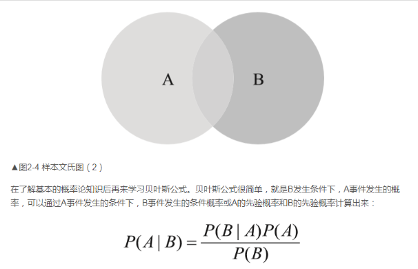

**补充：后验概率。**

后验概率（Posterior Probability）是概率论中的一个概念，它指的是在考虑了新的观测数据或证据之后，对一个事件发生概率进行更新得到的概率。

在贝叶斯统计学中，后验概率是指在给定先验概率和观测数据的条件下，对事件或假设的概率进行修正的结果。它反映了在已知一些信息后，我们对事件发生概率的最新估计。

公式表示为：$$ P(A|B) = \frac{P(B|A) \cdot P(A)}{P(B)} $$

其中，

- $P(A|B)$ 表示在事件 B 已经发生的条件下，事件 A 发生的后验概率。
- $P(B|A)$ 是在事件 A 已经发生的条件下，事件 B 发生的条件概率。
- $P(A)$ 和 $P(B)$ 分别是事件 A 和事件 B 的先验概率。

在贝叶斯定理中，我们根据已知的先验概率 $P(A)$ 和条件概率 $P(B|A)$，以及观测数据 $B$ 来计算后验概率 $P(A|B)$。通过这个计算，我们可以根据新的观测数据更新对事件发生概率的估计，使我们的推断更加准确。

后验概率在许多领域都有广泛应用，特别是在统计学、机器学习、模式识别和人工智能等领域。它在决策分析、分类问题、参数估计和贝叶斯推断等方面都扮演着重要角色。

拓展阅读：http://www.snailtoday.com/archives/20596

## 概率分类器

### 两种类别

**判别式分类器（discriminative model）：**

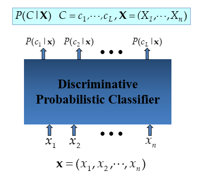

**生成式分类器（Generative Model）：**

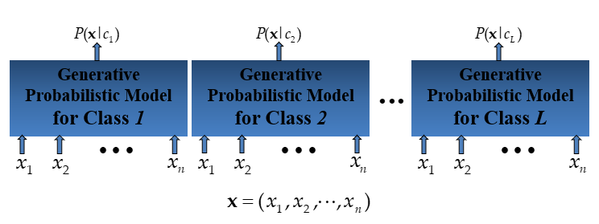

### MAP（Maximum A Posteriori）分类规则

MAP（Maximum A Posteriori）分类规则是一种基于贝叶斯定理的分类方法，用于在给定观测数据的条件下，选择具有最大后验概率的类别。在MAP分类中，我们利用已知的类别先验概率和观测数据的条件概率，来推断出最可能的类别。

**公式**：

假设我们有两个类别 $C_1$ 和 $C_2$，以及观测数据 $x$。MAP分类规则可以表示为：

- 如果 $P(C_1|x) > P(C_2|x)$，则将 $x$ 分类为 $C_1$。
- 如果 $P(C_2|x) > P(C_1|x)$，则将 $x$ 分类为 $C_2$。

其中，

- $P(C_i|x)$ 表示在给定观测数据 $x$ 的条件下，事件属于类别 $C_i$ 的后验概率。

**推导**：

根据贝叶斯定理，后验概率可以表示为：

$$ P(C_i|x) = \frac{P(x|C_i) \cdot P(C_i)}{P(x)} $$

其中，

- $P(x|C_i)$ 表示在事件属于类别 $C_i$ 的条件下，观测数据 $x$ 的概率，也称为似然概率（Likelihood）。
- $P(C_i)$ 表示类别 $C_i$ 的先验概率。
- $P(x)$ 是观测数据 $x$ 的边缘概率。

由于 $P(x)$ 对于所有类别是相同的，因此我们可以忽略它，并只考虑后验概率的相对大小。

那么，MAP分类规则就变成了：

- 如果 $P(x|C_1) \cdot P(C_1) > P(x|C_2) \cdot P(C_2)$，则将 $x$ 分类为 $C_1$。
- 如果 $P(x|C_2) \cdot P(C_2) > P(x|C_1) \cdot P(C_1)$，则将 $x$ 分类为 $C_2$。

**例子**：

假设我们有两个类别 $C_1$ 和 $C_2$，以及一个二维观测数据 $x = (x_1, x_2)$。现在我们已知类别的先验概率 $P(C_1)$ 和 $P(C_2)$，以及在各个类别下观测数据的条件概率 $P(x|C_1)$ 和 $P(x|C_2)$。我们希望根据观测数据 $x$ 来判断它属于哪个类别。

根据MAP分类规则，我们可以计算后验概率并比较它们的大小，从而得出分类结果。假设计算结果为 $P(C_1|x)$ 和 $P(C_2|x)$，如果 $P(C_1|x) > P(C_2|x)$，则将 $x$ 分类为 $C_1$；否则，将 $x$ 分类为 $C_2$。这样就完成了对观测数据的分类。

**似然概率**

似然概率（Likelihood Probability）是概率论中的一个概念，它表示在给定模型的参数条件下，观测数据发生的概率。换句话说，似然概率是关于参数的函数，它描述了参数取值的可能性，使得观测数据出现的概率最大。

**定义**：

假设我们有一个概率模型，其中包含参数 θ。观测数据记为 X。似然概率（likelihood probability） L(θ|X) 是在给定参数 θ 的条件下，观测数据 X 出现的概率。通常表示为：

$$ L(θ|X) = P(X|θ) $$

其中，

- $ L(θ|X) $ 表示在给定参数 θ 的条件下，观测数据 X 出现的似然概率。
- $ P(X|θ) $ 表示在参数 θ 的条件下，观测数据 X 出现的概率。

**例子**：

假设我们有一个硬币，并且想知道这个硬币投掷时正面朝上的概率。我们假设硬币是一个公平硬币，也就是说正反两面朝上的概率都是相等的，即 $ P(正面) = P(反面) = 0.5 $。

现在，我们进行了一系列投掷实验，结果如下：正面、反面、正面、正面、反面。

我们的目标是使用这些观测数据来估计硬币投掷时正面朝上的概率。

在这个例子中，似然概率表示给定某个正面朝上的概率（参数 θ），观测数据出现的概率。假设参数 θ 表示正面朝上的概率，那么观测数据 X 可以用二进制表示为 [1, 0, 1, 1, 0]，其中 1 表示正面，0 表示反面。

如果我们假设硬币投掷时正面朝上的概率是 0.5（即 θ = 0.5），那么似然概率可以表示为：

$$ L(θ=0.5|X=[1, 0, 1, 1, 0]) = P(X=[1, 0, 1, 1, 0]|θ=0.5) $$

在这里，观测数据 X 出现的概率是由硬币投掷模型和参数 θ=0.5 决定的。我们可以使用二项分布来建模硬币投掷实验，并计算似然概率。根据计算结果，我们可以比较不同参数值下的似然概率，找到使观测数据出现概率最大的参数值，即得到最大似然估计。在本例中，因为硬币是公平硬币，最大似然估计为 θ=0.5，即硬币投掷时正面朝上和反面朝上的概率均为 0.5。

**Python语言的实现**

假设我们有两个类别 C1 和 C2，以及观测数据 x，我们需要根据已知的类别先验概率 P(C1) 和 P(C2)，以及在各个类别下观测数据的条件概率 P(x|C1) 和 P(x|C2) 来进行分类。

```python
def map_classification(P_C1, P_C2, P_x_given_C1, P_x_given_C2):
    # 计算后验概率 P(C1|x) 和 P(C2|x)
    P_C1_given_x = (P_x_given_C1 * P_C1) / (P_x_given_C1 * P_C1 + P_x_given_C2 * P_C2)
    P_C2_given_x = (P_x_given_C2 * P_C2) / (P_x_given_C1 * P_C1 + P_x_given_C2 * P_C2)
    
    # 根据后验概率进行分类
    if P_C1_given_x > P_C2_given_x:
        return "C1"  # 将 x 分类为 C1
    else:
        return "C2"  # 将 x 分类为 C2

# 示例数据
P_C1 = 0.4  # 类别 C1 的先验概率
P_C2 = 0.6  # 类别 C2 的先验概率
P_x_given_C1 = 0.7  # 在类别 C1 下观测数据 x 的条件概率
P_x_given_C2 = 0.3  # 在类别 C2 下观测数据 x 的条件概率
observed_data = 0.8  # 观测数据 x

# 调用 MAP 分类器进行分类
result = map_classification(P_C1, P_C2, P_x_given_C1, P_x_given_C2)

# 输出分类结果
print("观测数据 x 被分类为:", result)
```

在这个例子中，我们使用了一个简单的二分类问题，并通过计算后验概率来将观测数据 x 分类为 C1 或 C2。实际应用中，需要根据具体的问题设置先验概率和条件概率，以及相应的观测数据。

课件中的公式：

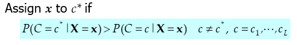

在模式识别和分类问题中，通常使用 c* 和 c 来表示不同的类别。

- c* ：通常用 c* 表示真实的或标准的类别。在监督学习中，我们经常有一组被标记好的数据，其中每个样本都有一个正确的类别标签。c* 就表示这些正确的类别标签，也称为真实类别或标准类别。在测试阶段，我们可以将新的未知样本与 c* 进行比较，从而评估分类算法的性能。

- c：通常用 c 表示分类算法预测的类别。在监督学习中，我们的目标是根据已知的数据学习一个模型，然后用这个模型对未知数据进行分类。c 就表示分类器预测的类别标签，也称为预测类别或估计类别。

例如，在一个手写数字识别问题中，我们可能有一组标记好的手写数字图像数据，其中每个图像都有对应的真实数字标签（c* ），而我们的任务是使用分类算法对新的手写数字图像进行识别，并预测它们属于哪个数字类别（c）。在这种情况下，c* 表示真实的数字类别，c 表示分类器预测的数字类别。我们可以根据 c* 和 c 来评估分类算法的准确性和性能。

使用MAP RULE的生成式分类器：

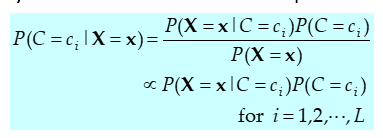

这是用于生成式分类的MAP（Maximum A Posteriori）分类规则的表达式。在这个公式中，我们希望计算在给定观测数据 𝐗=𝐱 的条件下，事件属于每个类别 $𝑐_𝑖$ 的后验概率。

- $𝑃(𝐶=𝑐_𝑖 |𝐗=𝐱)$：表示在给定观测数据 $𝐗=𝐱$ 的条件下，事件属于类别 $𝑐_𝑖$ 的后验概率，也就是我们要计算的分类结果。

- $𝑃(𝐗=𝐱|𝐶=𝑐_𝑖)$：表示在事件属于类别 $𝑐_𝑖$ 的条件下，观测数据 $𝐗=𝐱$ 的概率，也称为似然概率。

- $𝑃(𝐶=𝑐_𝑖)$：表示类别 $𝑐_𝑖$ 的先验概率，也就是在没有观测数据时，我们对事件属于类别 $𝑐_𝑖$ 的概率的初始估计。

- $𝑃(𝐗=𝐱)$：表示观测数据 $𝐗=𝐱$ 的边缘概率，即在所有类别的情况下观测数据 $𝐗=𝐱$ 发生的概率。

公式的含义是，在生成式分类中，我们首先计算观测数据 $𝐗=𝐱$ 对每个类别 $𝑐_𝑖$ 的似然概率和类别先验概率的乘积，然后再进行归一化（即除以观测数据的边缘概率）以得到后验概率的相对大小。最终，选择具有最大后验概率的类别作为分类结果。

由于在分类问题中，观测数据的边缘概率对于所有类别是相同的，因此在上述公式中可以省略边缘概率的计算，而直接比较各类别的似然概率和先验概率乘积的大小，从而得到后验概率的相对大小，然后进行分类决策。

### 朴素贝叶斯 Naive Bayes

贝叶斯：

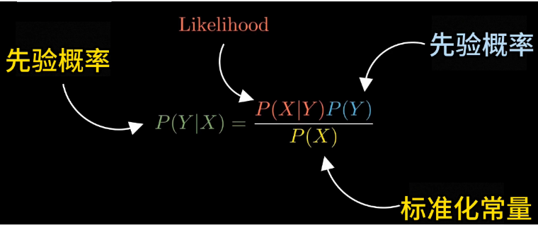

思路：

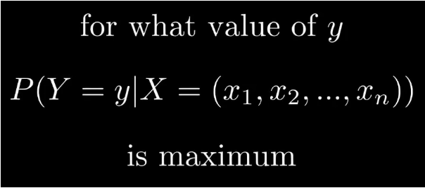

假设Y有0和1两个取值，那么计算出$X=(x_1, x_2, ..., x_n)$的情况之下，Y=0和Y=1的概率，然后将其分配到概率值更高的Y的类别中。

假设有数据集如下所示：

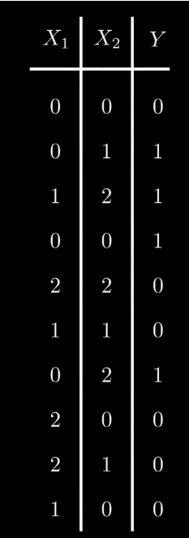

现在有一个新的数据，X=(0, 2)，要求找到正确的Y的标签。

那么按照之前的逻辑，就是计算 $P(Y=0|X = (0, 2))$  和 $P(Y=1|X=(0,2))$的概率，然后比较大小，最终将这个新的数据分配到概率较大的类别中。

首先进行计算：

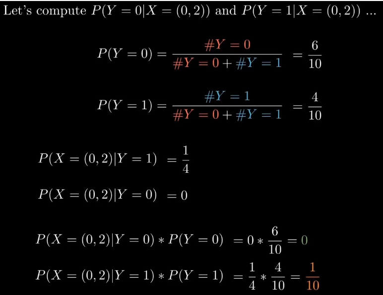

因为分母都是$P(X=(0, 2))$，所以分母对于最终的概率大小不存在着影响。如此只需要计算$P(X=(0,2) | Y = 0 或 Y = 1)$ 和 $P(Y=0 或 Y = 1)$的乘积就可以了。最终这个数据被分配到$Y=1$这个类别中。

**为什么采用朴素贝叶斯？**因为我们需要在数据集中找到X=(0,2)的特定组合，在存在着多个特征和大量的数据的情况之下，这是极其繁琐和困难的事情。比如说如果有十个特征，每个特征有三种可能性，那么排列的总数为：
$$
\text{总的排列组合数} = 3^{10} = 59,049
$$

因此，在这种情况下，一共有59,049种排列组合方式。

如果使用朴素贝叶斯，那么可以直接将X1和X2视作是独立的变量，计算公式就可以简化为：

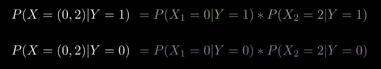

因为独立的两个变量的概率是可以直接相乘的。

简单的计算可得：

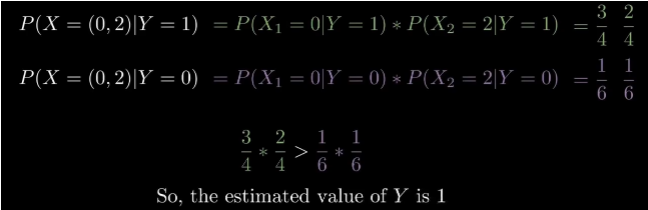

推导如下所示：

在概率论中，当两个事件A和B是独立事件时，它们的联合概率等于各自的概率的乘积。这就是独立事件的定义。

如果事件A和事件B是独立的，那么有：

$$P(A \cap B) = P(A) \cdot P(B)$$

其中，

- $P(A \cap B)$ 表示事件A和事件B同时发生的概率，即它们的交集的概率。
- $P(A)$ 表示事件A发生的概率。
- $P(B)$ 表示事件B发生的概率。

当事件A和事件B是独立的，我们有以下定义和性质：

1. 定义：两个事件A和B是独立的，当且仅当满足以下条件之一：
   - $P(A \mid B) = P(A)$，表示在已知事件B发生的条件下，事件A发生的概率与事件A发生的概率相等；
   - $P(B \mid A) = P(B)$，表示在已知事件A发生的条件下，事件B发生的概率与事件B发生的概率相等。

2. 性质：如果事件A和事件B是独立的，则有 $P(A \cap B) = P(A) \cdot P(B)$。

证明：

根据独立事件的定义，我们知道：

$$P(A \mid B) = P(A)$$

根据条件概率的定义，我们有：

$$P(A \mid B) = \frac{P(A \cap B)}{P(B)}$$

将这两个等式结合起来，我们有：

$$P(A) = \frac{P(A \cap B)}{P(B)}$$

然后，我们可以通过移项，得到：

$$P(A \cap B) = P(A) \cdot P(B)$$

这就完成了对于 $P(A \cap B) = P(A) \cdot P(B)$ 的证明。

因此，当事件A和事件B是独立的时候，它们的联合概率等于各自的概率的乘积。这是独立事件的一个重要性质。

当事件A和事件B是独立事件时，它们的发生不会相互影响。这意味着在给定另一个事件的发生情况下，A和B仍然是独立的。因此，事件A和事件B同时发生的概率就等于它们各自发生的概率的乘积。

请注意，当事件A和事件B不是独立事件时，它们的联合概率通常不等于各自概率的乘积，而需要使用条件概率来计算。

**朴素贝叶斯（Naive Bayes）** 是一种简单且高效的概率分类算法，常用于文本分类和垃圾邮件过滤等任务。它基于贝叶斯定理和“朴素”假设，即认为特征之间是条件独立的。

**定义**：

朴素贝叶斯分类是一种生成式分类方法，它假设给定类别标签，不同特征之间是条件独立的。这个假设使得朴素贝叶斯分类算法非常高效，并在许多实际问题中表现良好。

**公式**：

假设我们有一个类别标签 C 和一组特征变量 X={X1, X2, ..., Xn}。朴素贝叶斯分类器通过贝叶斯定理来计算后验概率，并选择具有最大后验概率的类别作为分类结果。

朴素贝叶斯分类器的计算公式为：

$$ P(C|X) = \frac{P(X|C) \cdot P(C)}{P(X)} $$

其中，

- $ P(C|X) $ 表示在给定特征变量 X 的条件下，类别标签 C 的后验概率。
- $ P(X|C) $ 表示在类别标签 C 的条件下，特征变量 X 的似然概率。
- $ P(C) $ 是类别标签 C 的先验概率。
- $ P(X) $ 是观测数据 X 的边缘概率。

由于在朴素贝叶斯中，特征变量之间被假设为条件独立的，因此可以将似然概率表示为各个特征变量的条件概率的乘积：

$$ P(X|C) = P(X1|C) \cdot P(X2|C) \cdot ... \cdot P(Xn|C) $$

**例子**：

假设我们有一个文本分类问题，需要根据电子邮件的文本内容将邮件分类为“垃圾邮件”或“非垃圾邮件”。我们的特征变量 X 是由邮件中出现的单词组成的集合，类别标签 C 可以是“垃圾邮件”或“非垃圾邮件”。

在朴素贝叶斯分类中，我们首先计算观测数据 X（即邮件中出现的单词集合）在每个类别下的似然概率 $P(X|C)$。然后，我们根据先验概率 $P(C)$ 和边缘概率 $P(X)$，使用贝叶斯定理计算后验概率 $P(C|X)$。最终，我们选择具有最大后验概率的类别作为邮件的分类结果。

例如，如果一封邮件中出现了单词“折扣”、“免费”和“优惠”，我们可以计算这封邮件在“垃圾邮件”类别和“非垃圾邮件”类别下的似然概率，并使用贝叶斯定理来计算后验概率，从而将这封邮件分类为“垃圾邮件”或“非垃圾邮件”。

课件中的公式，**假设所有输入特征都是条件独立的：**
$$
P(X_1, X_2, ..., X_n | C) = P(X_1 | X_2, ..., X_n, C) \cdot P(X_2, ..., X_n | C) \\
= P(X_1 | C) \cdot P(X_2, ..., X_n | C) \\
= P(X_1 | C) \cdot P(X_2 | C) \cdot ... \cdot P(X_n | C)
$$
这个公式是根据条件概率的定义，利用概率的链式法则来推导。它表示在给定类别标签 C 的条件下，多个特征变量 X1, X2, ..., Xn 同时发生的概率可以分解为各个特征变量在给定类别标签 C 的条件下的概率的乘积。在朴素贝叶斯分类中，我们使用这个条件独立性假设，将多个特征变量之间的联合概率分解为各个特征变量在给定类别标签 C 的条件下的概率的乘积，从而简化了计算。

**更加具体的解释**：

上述公式是朴素贝叶斯分类中使用条件独立性假设的推导过程。它基于概率的链式法则，将多个特征变量在给定类别标签 C 的条件下的联合概率拆解成各个特征变量在给定类别标签 C 的条件下的概率的乘积。这样的假设使得朴素贝叶斯分类器计算高效，并在实际应用中表现优秀。

**例子**：

假设我们有一个文本分类问题，需要将电子邮件分类为“垃圾邮件”或“非垃圾邮件”。特征变量 X 是由邮件中出现的单词组成的集合，类别标签 C 可以是“垃圾邮件”或“非垃圾邮件”。

为了更好地理解上述公式，我们将其应用于一个简单的文本分类示例：

假设我们有一个训练数据集，其中包含以下三封邮件：

1. 邮件1：内容是 "优惠 折扣"，属于 "垃圾邮件" 类别。
2. 邮件2：内容是 "商品 优惠"，属于 "垃圾邮件" 类别。
3. 邮件3：内容是 "新闻 报告"，属于 "非垃圾邮件" 类别。

现在，我们想对一封新的邮件进行分类，内容是 "商品 优惠 折扣"。我们需要计算在给定这封邮件的内容的条件下，属于不同类别的后验概率。

首先，我们使用训练数据集来计算先验概率 $P(C)$ 和各个单词在给定类别的条件下的概率 $P(X_i | C)$。在这个例子中，我们有两个类别，因此需要计算两个先验概率 $P(垃圾邮件)$ 和 $P(非垃圾邮件)$，以及每个单词在两个类别下的条件概率，如 $P(优惠 | 垃圾邮件)$、$P(折扣 | 垃圾邮件)$、$P(商品 | 垃圾邮件)$ 和 $P(新闻 | 非垃圾邮件)$。

然后，我们使用上述先验概率和条件概率，根据上述公式计算后验概率 $P(垃圾邮件 | 商品 优惠 折扣)$ 和 $P(非垃圾邮件 | 商品 优惠 折扣)$。通过比较这两个后验概率的大小，我们可以判断该封邮件属于哪个类别，从而完成文本分类。

在处理**离散值特征（Discrete-Valued Features）**的情况下，Naïve Bayes 算法**假设各个特征之间是条件独立的**，并基于贝叶斯定理来计算后验概率从而进行分类。

**算法步骤**：

1. 数据准备：收集标记好的训练数据，其中每个样本都有一个类别标签和多个离散值特征。对于每个特征，我们需要计算在给定类别的条件下，该特征取每个可能取值的概率。

2. 计算先验概率：根据训练数据集中每个类别出现的频次，计算各个类别的先验概率 $P(C)$。

3. 计算条件概率：对于每个特征 $X_i$，计算在给定类别的条件下，该特征取每个可能取值的概率 $P(X_i | C)$。为了避免零概率问题，通常会使用拉普拉斯平滑或其他平滑技术来处理未在训练数据中出现的特征值。

4. 分类决策：对于一个新的样本数据，计算该样本属于各个类别的后验概率 $P(C | X_1, X_2, ..., X_n)$，其中 $X_1, X_2, ..., X_n$ 是该样本的特征值。通过比较各个类别的后验概率，选择具有最大后验概率的类别作为分类结果。

**解释**：

在 Naïve Bayes 算法中，"Naïve" 指的是特征之间被假设为条件独立的，这是朴素贝叶斯算法的核心假设。虽然这个假设在实际应用中可能并不总是成立，但在许多情况下，这种简化可以带来高效且准确的分类结果。

对于离散值特征，我们需要计算每个特征在给定类别下的条件概率 $P(X_i | C)$。在文本分类问题中，特征通常是单词或词汇，条件概率表示在给定类别的条件下，每个单词在文本中出现的概率。通过计算先验概率 $P(C)$ 和条件概率 $P(X_i | C)$，我们可以使用贝叶斯定理来计算后验概率 $P(C | X_1, X_2, ..., X_n)$，即在给定特征值的条件下，样本属于各个类别的概率。最终，我们选择具有最大后验概率的类别作为分类结果。

Naïve Bayes 算法因其简单、高效且在许多实际问题中表现良好而受到广泛应用，特别是在文本分类和垃圾邮件过滤等任务中。由于它不需要大量的参数调整和复杂的特征工程，因此在实践中通常是一种强大的分类工具。

**Python语言实现**

```python
from sklearn.naive_bayes import MultinomialNB
from sklearn.feature_extraction.text import CountVectorizer

def train_naive_bayes_classifier(train_data, train_labels):
    # 创建特征提取器，将文本转换为特征向量
    vectorizer = CountVectorizer()
    X_train = vectorizer.fit_transform(train_data)

    # 创建朴素贝叶斯分类器并进行训练
    nb_classifier = MultinomialNB()
    nb_classifier.fit(X_train, train_labels)

    return nb_classifier, vectorizer

def predict_naive_bayes_classifier(classifier, vectorizer, test_data):
    # 将测试数据转换为特征向量
    X_test = vectorizer.transform(test_data)

    # 进行预测
    predicted_labels = classifier.predict(X_test)

    return predicted_labels

# 示例数据
train_data = ["This is a positive review.",
              "I really enjoyed this movie.",
              "The acting was superb!",
              "Terrible movie, do not watch it.",
              "Waste of time and money."]

train_labels = ["positive", "positive", "positive", "negative", "negative"]

test_data = ["I loved the movie, it was fantastic!",
             "Avoid this movie, it's awful."]

# 训练朴素贝叶斯分类器
nb_classifier, vectorizer = train_naive_bayes_classifier(train_data, train_labels)

# 进行预测
predicted_labels = predict_naive_bayes_classifier(nb_classifier, vectorizer, test_data)

# 输出预测结果
print(predicted_labels)  # 输出: ['positive' 'negative']

```

得到的结果为：

```python
['positive' 'positive']
```

### 朴素贝叶斯模型对新数据进行分类	

使用朴素贝叶斯模型对新数据进行预测涉及以下步骤：

1. 对每个类别，计算其先验概率。
2. 对于每个类别，乘以每个特征在该类别下的条件概率。
3. 找到具有最高概率的类别。

让我们通过一个具体的例子来说明。考虑以下简化的情境：

**数据集**:

```
Feature_1  Feature_2  Class
   A          X        1
   A          Y        1
   B          X        2
   B          Y        2
```

基于此训练数据，假设我们已经得到以下模型参数：

**先验概率**:

$P(Class=1) = 0.5$

$P(Class=2) = 0.5$

**条件概率**:

$P(Feature_1=A|Class=1) = 1.0$

$P(Feature_1=B|Class=1) = 0.0$

$P(Feature_1=A|Class=2) = 0.0$

$P(Feature_1=B|Class=2) = 1.0$

$P(Feature_2=X|Class=1) = 0.5$

$P(Feature_2=Y|Class=1) = 0.5$

$P(Feature_2=X|Class=2) = 0.5$

$P(Feature_2=Y|Class=2) = 0.5$

现在，考虑一个新的数据点：$Feature_1 = A$和 $Feature_2 = X$

**预测过程**:

为Class=1:

$P(Class=1|Data) \propto P(Class=1) \times P(Feature_1=A|Class=1) \times P(Feature_2=X|Class=1)$

$ = 0.5 \times 1.0 \times 0.5 = 0.25$

为Class=2:

$P(Class=2|Data) \propto P(Class=2) \times P(Feature_1=A|Class=2) \times P(Feature_2=X|Class=2)$

$= 0.5 \times 0.0 \times 0.5 = 0.0$

因此，对于新的数据点，我们预测其类别为1，因为它具有较高的概率值。

需要注意的是，我们没有考虑分母（边际概率）的计算，因为我们只是对概率进行比较来进行分类，而不是真正地计算后验概率的值。

### 优缺点

**朴素贝叶斯的优点**：

1. 简单高效：朴素贝叶斯算法是一种简单高效的分类算法。它基于概率模型，假设特征之间是条件独立的，使得算法计算高效，适用于大规模数据集。

2. 适用于高维数据：朴素贝叶斯算法在高维数据上表现良好，尤其在文本分类等自然语言处理任务中广泛应用。

3. 对小规模数据集有较好表现：即使在小规模数据集上，朴素贝叶斯也能表现出较好的性能。

4. 适用于多分类问题：朴素贝叶斯算法天生支持多分类问题，可以轻松处理多个类别的分类任务。

**朴素贝叶斯的缺点**：

1. 忽略特征之间的相关性：朴素贝叶斯算法假设所有特征之间是条件独立的，但在现实问题中，很多特征可能存在相关性。因此，在处理特征之间强相关的数据时，朴素贝叶斯可能会导致分类性能下降。

2. 处理连续特征困难：朴素贝叶斯算法通常假设特征是离散值的，对于连续值特征，需要进行离散化处理，可能会引入信息损失。

3. 对数据分布的假设：朴素贝叶斯算法假设特征之间是条件独立的，这种假设在某些数据集上可能不成立，导致分类性能下降。

**具体例子**：

假设我们有一个电子邮件分类问题，需要将邮件分类为“垃圾邮件”或“非垃圾邮件”。我们使用朴素贝叶斯算法来处理这个问题。

**优点**：

- 简单高效：朴素贝叶斯算法处理文本分类问题非常高效，并且在大规模数据集上表现出色。
- 适用于高维数据：文本分类问题通常涉及大量特征（每个单词都是一个特征），朴素贝叶斯在高维数据上表现良好。

**缺点**：

- 忽略特征之间的相关性：例如，对于文本分类问题，一些词汇可能有强相关性（如“good”和“excellent”），而朴素贝叶斯算法忽略了这些相关性。
- 处理连续特征困难：如果文本分类问题中需要考虑词汇的频率等连续值特征，朴素贝叶斯算法需要进行离散化处理，可能会引入信息损失。
- 对数据分布的假设：如果文本分类问题中不同类别的邮件之间有交叉词汇，朴素贝叶斯的条件独立性假设可能导致性能下降。

