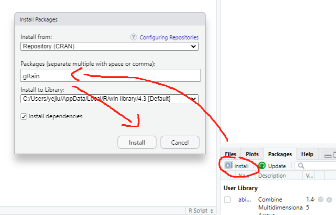

首先，安装必备的package：



接着导入：

```R
> library(gRain)
载入需要的程辑包：gRbase
Error: package or namespace load failed for ‘gRbase’ in loadNamespace(j <- imp[[1L]], c(lib.loc, .libPaths()), versionCheck = vI[[j]]):
 不存在叫‘Rgraphviz’这个名字的程辑包
Error: 无法载入程辑包‘gRbase’
```

这是因为gRbase需要Rgraphviz。

先安装必备的包：

```R
> if (!requireNamespace("BiocManager", quietly = TRUE))
+     install.packages("BiocManager")
> 
> BiocManager::install("Rgraphviz")
'getOption("repos")' replaces Bioconductor standard repositories, see
'help("repositories", package = "BiocManager")' for details.
Replacement repositories:
    CRAN: https://cran.rstudio.com/
Bioconductor version 3.17 (BiocManager 1.30.22), R 4.3.1 (2023-06-16 ucrt)
Installing package(s) 'Rgraphviz'
trying URL 'https://bioconductor.org/packages/3.17/bioc/bin/windows/contrib/4.3/Rgraphviz_2.44.0.zip'
Content type 'application/zip' length 1457266 bytes (1.4 MB)
downloaded 1.4 MB

程序包‘Rgraphviz’打开成功，MD5和检查也通过

下载的二进制程序包在
	C:\Users\yejiu\AppData\Local\Temp\Rtmp2t3ab0\downloaded_packages里
Old packages: 'dplyr', 'ggplot2', 'htmltools', 'purrr', 'rmarkdown', 'xfun'
Update all/some/none? [a/s/n]: 
Update all/some/none? [a/s/n]: 
a

  有二进制版本的，但源代码版本是后来的:
          binary source needs_compilation
rmarkdown   2.24   2.25             FALSE

trying URL 'https://cran.rstudio.com/bin/windows/contrib/4.3/dplyr_1.1.3.zip'
Content type 'application/zip' length 1553163 bytes (1.5 MB)
downloaded 1.5 MB

trying URL 'https://cran.rstudio.com/bin/windows/contrib/4.3/ggplot2_3.4.3.zip'
Content type 'application/zip' length 3326992 bytes (3.2 MB)
downloaded 3.2 MB

trying URL 'https://cran.rstudio.com/bin/windows/contrib/4.3/htmltools_0.5.6.zip'
Content type 'application/zip' length 355449 bytes (347 KB)
downloaded 347 KB

trying URL 'https://cran.rstudio.com/bin/windows/contrib/4.3/purrr_1.0.2.zip'
Content type 'application/zip' length 498372 bytes (486 KB)
downloaded 486 KB

trying URL 'https://cran.rstudio.com/bin/windows/contrib/4.3/xfun_0.40.zip'
Content type 'application/zip' length 434168 bytes (423 KB)
downloaded 423 KB

程序包‘dplyr’打开成功，MD5和检查也通过
程序包‘ggplot2’打开成功，MD5和检查也通过
程序包‘htmltools’打开成功，MD5和检查也通过
程序包‘purrr’打开成功，MD5和检查也通过
程序包‘xfun’打开成功，MD5和检查也通过

下载的二进制程序包在
	C:\Users\yejiu\AppData\Local\Temp\Rtmp2t3ab0\downloaded_packages里
安装源码包‘rmarkdown’

trying URL 'https://cran.rstudio.com/src/contrib/rmarkdown_2.25.tar.gz'
Content type 'application/x-gzip' length 2188934 bytes (2.1 MB)
downloaded 2.1 MB

* installing *source* package 'rmarkdown' ...
** package 'rmarkdown' successfully unpacked and MD5 sums checked
** using staged installation
** R
** inst
** byte-compile and prepare package for lazy loading
** help
*** installing help indices
*** copying figures
** building package indices
** installing vignettes
** testing if installed package can be loaded from temporary location
** testing if installed package can be loaded from final location
** testing if installed package keeps a record of temporary installation path
* DONE (rmarkdown)

下载的程序包在
	‘C:\Users\yejiu\AppData\Local\Temp\Rtmp2t3ab0\downloaded_packages’里
> install.packages("gRbase")
WARNING: Rtools is required to build R packages but is not currently installed. Please download and install the appropriate version of Rtools before proceeding:

https://cran.rstudio.com/bin/windows/Rtools/
将程序包安装入‘C:/Users/yejiu/AppData/Local/R/win-library/4.3’
(因为‘lib’没有被指定)
trying URL 'https://cran.rstudio.com/bin/windows/contrib/4.3/gRbase_1.9.0.zip'
Content type 'application/zip' length 2361559 bytes (2.3 MB)
downloaded 2.3 MB

程序包‘gRbase’打开成功，MD5和检查也通过

下载的二进制程序包在
	C:\Users\yejiu\AppData\Local\Temp\Rtmp2t3ab0\downloaded_packages里
> library(gRain)
载入需要的程辑包：gRbase
```

可以发现已经成功的导入了。

此示例使用以下二元变量： asia 、吸烟者 、tub（结核病）、lung（肺癌）、bronc（支气管炎）、either（结核病或肺癌）、dysp（呼吸困难）和 xray 。 每个变量都是二进制的，可以取值“ yes ”和“ no ”，并且其中一个是逻辑变量，如果 tube 或 lung 为 true ( yes )，则为 true ( yes )，否则为 false ( no )。

接着运行如下所示的代码：

```R
# 运行代码
yn <- c("yes","no")
a <- cptable(~asia, values=c(1,99),levels=yn)
t.a <- cptable(~tub|asia, values=c(5,95,1,99),levels=yn)
s <- cptable(~smoke, values=c(5,5), levels=yn)
l.s <- cptable(~lung|smoke, values=c(1,9,1,99), levels=yn)
b.s <- cptable(~bronc|smoke, values=c(6,4,3,7), levels=yn)
e.lt <-
  cptable(~either|lung:tub,values=c(1,0,1,0,1,0,0,1),levels=yn)
x.e <- cptable(~xray|either, values=c(98,2,5,95), levels=yn)
d.be <- cptable(~dysp|bronc:either, values=c(9,1,7,3,8,2,1,9),
                levels=yn)
plist <- compileCPT(list(a, t.a, s, l.s, b.s, e.lt, x.e, d.be))
plist


# 核对一些nodes的conditional probability
plist$tub
plist$either
```

得到的结果为：

```R
> # 核对一些nodes的conditional probability
> plist$tub
     asia
tub    yes   no
  yes 0.05 0.01
  no  0.95 0.99
> plist$either
, , tub = yes

      lung
either yes no
   yes   1  1
   no    0  0

, , tub = no

      lung
either yes no
   yes   1  0
   no    0  1
```

贝叶斯网络是一个用于表示随机变量及其条件依赖性的概率图模型。在上述结果中，我们有两个表格：一个表示`asia`和`tub`之间的关系，另一个表示`tub`和`either`以及`lung`之间的关系。

1. **`plist$tub` 表**:

    这个表展示了给定 `asia` 的状态时 `tub` 的条件概率。

    - 如果一个人在亚洲（asia=yes），他患有肺结核（tub=yes）的概率是0.05，不患有的概率是0.95。
    - 如果一个人不在亚洲（asia=no），他患有肺结核（tub=yes）的概率是0.01，不患有的概率是0.99。

2. **`plist$either` 表**:

    这个表格展示了给定 `tub` 和 `lung` 的状态时 `either` 的条件概率。它是一个三维的表。

    - 当 `tub=yes`：
        - 无论 `lung` 是 `yes` 还是 `no`，`either=yes` 的概率都是1。这意味着，如果一个人确实患有肺结核，那么 `either` 的值也是肯定的。
    
    - 当 `tub=no`：
        - 如果 `lung=yes`，那么 `either=yes` 的概率是1。
        - 如果 `lung=no`，那么 `either=no` 的概率是1。这意味着，如果一个人没有患有肺结核并且肺部是健康的，那么 `either` 的值也是否定的。

总之，这些表描述了某些医疗状态之间的条件概率关系。尤其是，它们描述了肺结核的存在与否如何依赖于是否在亚洲，以及`either`状态如何依赖于肺结核和另一个未明确的条件（可能是另一种肺部疾病或状况，由于上下文中没有给出具体描述，所以我们只能推测）。

或者可以这么做：

```R
> # 或者可以这么做
> plist$tub %>% as.data.frame.table
  tub asia Freq
1 yes  yes 0.05
2  no  yes 0.95
3 yes   no 0.01
4  no   no 0.99
```

上述的结果表示的是：$P(tub = yes | asia = yes) = 0.05$，等等。

接着绘图：

```{R}
plot(net1)  #无向网络
```


接着是有向的网络：

```{r}
plot(net1$dag)
```


接着计算边际概率。

边际概率，也叫作边缘概率或简单概率，是一个随机变量在没有给定其他变量的条件下的概率。它表示一个或多个事件发生的概率，而忽略其他事件。边际概率常常通过从联合概率分布中对一个或多个变量求和来获得。

假设我们有两个二进制随机变量$X$和$Y$。给定它们的联合概率分布如下：

| $X$  | $Y$  | P$( X, Y )$ |
| ---- | ---- | ----------- |
| 0    | 0    | 0.3         |
| 0    | 1    | 0.2         |
| 1    | 0    | 0.1         |
| 1    | 1    | 0.4         |

我们可以计算$X$和$Y$的边际概率如下：

$P(X=0) = P(X=0, Y=0) + P(X=0, Y=1) = 0.3 + 0.2 = 0.5$

$P(X=1) = P(X=1, Y=0) + P(X=1, Y=1) = 0.1 + 0.4 = 0.5$

$P(Y=0) = P(X=0, Y=0) + P(X=1, Y=0) = 0.3 + 0.1 = 0.4$

$P(Y=1) = P(X=0, Y=1) + P(X=1, Y=1) = 0.2 + 0.4 = 0.6$

在这里，$P(X=0)$和 $P(X=1)$ 就是$X$的边际概率，而$P(Y=0)$ 和 $P(Y=1)$ 是$Y$的边际概率。

在多维随机变量的情况下，边际概率通常是通过从联合概率分布中对除了目标变量之外的所有变量进行积分（对于连续变量）或求和（对于离散变量）来得到的。

接着计算边际概率：

```{r}
> # 计算边际概率
> querygrain(net1, nodes = c("lung", "bronc"), type = "marginal")
$lung
lung
  yes    no 
0.055 0.945 

$bronc
bronc
 yes   no 
0.45 0.55 
```

这是一个R代码片段，它使用了`querygrain`函数（这个函数来自于`gRain`包，用于查询贝叶斯网络的概率分布）。代码试图查询与`lung`和`bronc`这两个节点相关的边际概率。

从给出的结果中，我们可以解释为：

1. **`lung`节点**:
   
   这是`lung`的边际概率分布：
   - `yes`：有0.055的概率表示某人患有与此节点相关的肺部疾病或条件（例如肺结核或肺癌等）。
   - `no`：有0.945的概率表示某人没有患有与此节点相关的肺部疾病或条件。

2. **`bronc`节点**:
   
   这是`bronc`的边际概率分布：
   - `yes`：有0.45的概率表示某人患有支气管炎或与此节点相关的其他呼吸系统条件。
   - `no`：有0.55的概率表示某人没有患有支气管炎或与此节点相关的其他呼吸系统条件。

简而言之，这两个结果提供了`lung`和`bronc`两个节点的边际概率分布。这意味着，考虑到网络中所有其他节点的影响，一个随机选择的个体患有某种肺部疾病的概率是0.055，而患有支气管相关疾病的概率是0.45。

然后是联合概率：

```R
> # 计算联合概率
> querygrain(net1, nodes=c("lung","bronc"), type="joint")
     bronc
lung     yes     no
  yes 0.0315 0.0235
  no  0.4185 0.5265
```

这个R代码片段使用`querygrain`函数从`gRain`包中查询了与`lung`和`bronc`两个节点相关的联合概率。

给定的结果是一个2x2的表，描述了`lung`和`bronc`两个节点可能状态的联合概率分布：

1. **联合概率**:
   
   $P(lung, bronc)$ 表示`lung`和`bronc`两个节点的联合概率分布。
   
   - $P(lung = \text{yes}, bronc = \text{yes}) = 0.0315$：这意味着，有0.0315的概率一个随机选择的个体同时有肺部疾病（如肺结核或肺癌）并患有支气管炎或与此节点相关的其他呼吸系统条件。
   - $P(lung = \text{yes}, bronc = \text{no}) = 0.0235$：有0.0235的概率一个随机选择的个体有肺部疾病但没有支气管相关疾病。
   - $P(lung = \text{no}, bronc = \text{yes}) = 0.4185$：有0.4185的概率一个随机选择的个体没有肺部疾病但患有支气管相关疾病。
   - $P(lung = \text{no}, bronc = \text{no}) = 0.5265$：有0.5265的概率一个随机选择的个体既没有肺部疾病也没有支气管相关疾病。

简而言之，这个表格为我们提供了在考虑`lung`和`bronc`两个节点时可能的四种状态组合的联合概率。联合概率给出了两个或多个事件同时发生的概率。在这个情境下，这些事件是与`lung`和`bronc`两个节点相关的健康状况或疾病。

计算条件概率：

```R
> # conditional probability
> querygrain(net1, nodes = c("lung", "bronc"),
+            type = "conditional")
     bronc
lung   yes         no
  yes 0.07 0.04272727
  no  0.93 0.95727273
```

开始做各种计算：

```R
> # ====================================
> # P(lung = yes, bronc = yes)
> querygrain(net1, nodes = c("lung", "bronc"), type = "joint")
     bronc
lung     yes     no
  yes 0.0315 0.0235
  no  0.4185 0.5265
```

```R
> # p(bronc = yes)
> querygrain(net1, nodes = c("bronc"), type = "marginal")
$bronc
bronc
 yes   no 
0.45 0.55
```

```R
> # p(lung = yes | smoke = yes)
> querygrain(net1, nodes = c("lung", "smoke"), type = "conditional")
     smoke
lung  yes   no
  yes 0.1 0.01
  no  0.9 0.99
```

```R
> # p(xray = yes | smoke = yes)
> querygrain(net1, nodes = c("xray", "smoke"), type = "conditional")
     smoke
xray        yes         no
  yes 0.1517048 0.06887528
  no  0.8482952 0.93112472
```

```R
> # P(xray = yes | smoke = yes, asia = yes)
> querygrain(net1, nodes = c("xray", "smoke", "asia"), type = "conditional")
, , asia = yes

     smoke
xray      yes       no
  yes 0.18485 0.105335
  no  0.81515 0.894665

, , asia = no

     smoke
xray      yes       no
  yes 0.15137 0.068507
  no  0.84863 0.931493
```


```R
> #P(lung=yes|asia=yes)
> querygrain(net1, nodes=c("lung","asia")
+            , type="conditional")
     asia
lung    yes    no
  yes 0.055 0.055
  no  0.945 0.945
```

```R
> ##P(bronc=yes|smoke=yes, asia=yes)
> querygrain(net1, nodes=c("bronc","smoke","asia")
+            , type="conditional")
, , asia = yes

     smoke
bronc yes  no
  yes 0.6 0.3
  no  0.4 0.7

, , asia = no

     smoke
bronc yes  no
  yes 0.6 0.3
  no  0.4 0.7
```

