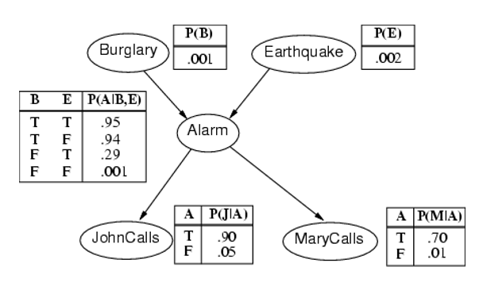
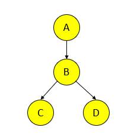
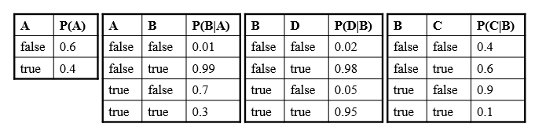
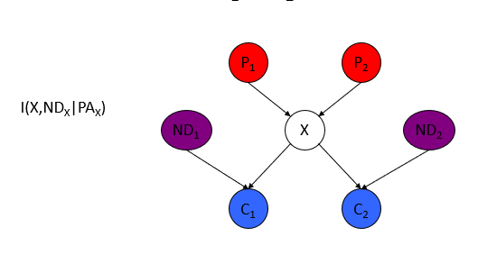
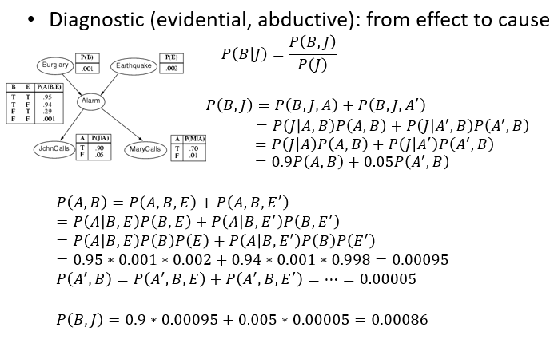
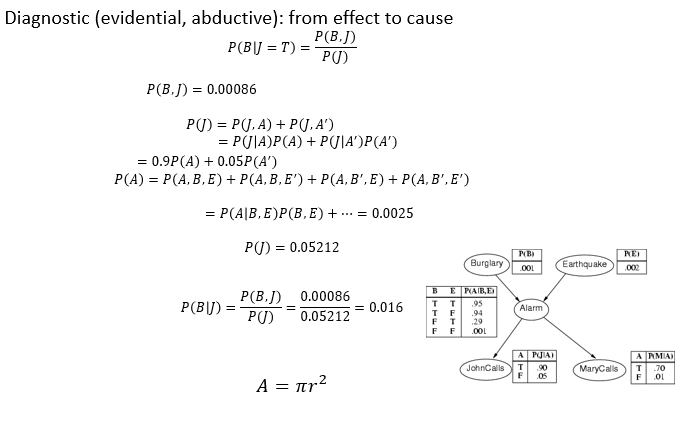
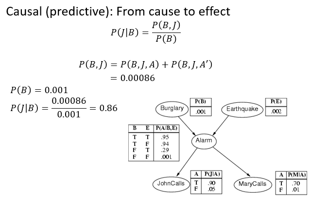
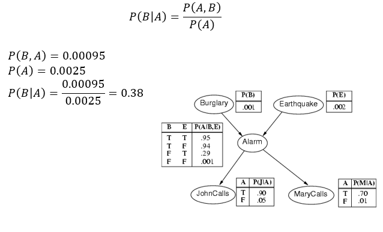

## 贝叶斯网络

这是一个贝叶斯网络图：

展示了：

- Burglary（入室盗窃）和Earthquake（地震）发生的可能性
- 在两者发生或者不发生的组合之下Alarm（警报器）作响的可能性
- 最后是在警报器响了或者不响的情况之下，John和Mary打电话的可能性

贝叶斯网络（Bayesian Network），也称为信念网络（Belief Network）或概率有向图模型（Probabilistic Directed Acyclic Graph Model）

贝叶斯网络由两部分组成：节点和有向边。每个节点表示一个随机变量，有向边表示变量之间的依赖关系。节点之间的有向边表示因果关系，即一个节点的值可能受到其父节点的影响。每个节点还伴随着一个条件概率表，描述了给定其父节点值的情况下，该节点取各个可能取值的概率分布。

这是一段引用：

> 贝叶斯网络（Bayesian Network，BN）是一种用于描述一组变量之间概率关系的图形模型。BN通过图结构编码变量之间的条件独立关系，提供了对变量之间联合概率分布的紧凑表示。一个问题领域由一系列变量X1、…、Xn建模，关于问题领域的知识用联合概率P(X1、…、Xn)来表示。有向链接表示因果直接影响，每个节点都有一个条件概率表，量化了来自父节点的影响。图中没有有向循环。

这是另一个贝叶斯网络模型：

这是每一个节点的概率表：

上述贝叶斯模型的属性为：

1. 图中的每个节点都是一个随机变量
2. 如果存在从节点 X 到节点 Y 的箭头，则节点 X 是另一个节点 Y 的父节点，例如。 A是B的父母
3. 非正式地，从节点 X 到节点 Y 的箭头表示 X 对 Y 有直接影响
4. 每个节点 Xi 都有一个条件概率分布 P(Xi | Parent(Xi))，用于量化父节点对节点的影响。参数是这些条件概率表 (CPT) 中的概率

## 贝叶斯属性

### Conditional Independence

贝叶斯网络具有两个重要的特性：

1. **编码图结构中变量之间的条件独立关系**：贝叶斯网络通过其图结构来表示变量之间的关系。如果在图中两个变量之间没有直接的有向链接，那么这两个变量就在给定它们的父节点的条件下是条件独立的。这意味着在贝叶斯网络中，图的拓扑结构可以表示变量之间的条件独立性。这种结构使得贝叶斯网络能够捕捉变量之间复杂的依赖关系，并将其以图形化的方式表示出来。

2. **是变量之间联合概率分布的紧凑表示**：贝叶斯网络为每个节点提供了条件概率表，描述了该节点在给定其父节点的情况下的概率分布。通过将所有节点的条件概率表组合起来，可以构建整个问题领域的联合概率分布。这种方式相比直接列举所有可能的状态和概率更加高效，尤其在变量较多时。贝叶斯网络的这种紧凑表示使得我们能够有效地计算和推断不同变量的概率。

条件独立是指在给定一些其他变量的条件下，两个变量之间的独立性。换句话说，如果两个变量在某些其他条件下是独立的，那么它们在这些条件下是条件独立的。

在贝叶斯网络中，条件独立关系是指，在给定一组变量（通常是它们的父节点）的取值情况下，另外两个变量之间不存在直接的依赖关系。这可以在网络的图结构中表示为缺少直接的有向边连接这两个变量。这种条件独立关系的存在可以大大简化联合概率分布的表示和计算，因为在条件独立的情况下，联合概率可以分解成更小的条件概率表。
马尔可夫条件（The Markov Condition）是贝叶斯网络中的一个基本概念，它描述了一个节点在给定其父节点的情况下，与其非直接祖先节点无关。马尔可夫条件是贝叶斯网络中条件独立性的一个关键方面，有助于确定哪些节点之间存在条件独立关系。

具体来说，马尔可夫条件表述为：在给定节点的父节点的情况下，该节点与与其非直接祖先节点是条件独立的。换句话说，一个节点的状态仅依赖于其直接的父节点，而不受其他非直接祖先节点的影响。

这个条件有助于在贝叶斯网络中确定图结构和条件概率分布。通过满足马尔可夫条件，贝叶斯网络可以将问题领域的概率分布分解成一系列条件概率表，使得表示和计算问题的联合概率分布变得更加高效。

以上图为例子，首先X不是一个independent变量，因为P1和P2都能够影响到X；但是X不受ND1和ND2的影响，所以可以认为 X Node 是 conditionally independent 于 ND1和ND2的。

**以抛硬币为例子。**

让我们考虑一个简单的例子，假设我们有两个硬币 A 和 B。我们想研究两次抛掷硬币的结果是否是条件独立的。

事件：
- A = 结果为正面的硬币 A
- B = 结果为正面的硬币 B

我们可以表示这两次抛掷的概率：
- P(A) = P(正面出现在硬币 A) = 0.5
- P(B) = P(正面出现在硬币 B) = 0.5

现在，让我们假设硬币 A 和 B 的结果是独立的，即硬币 A 的结果不会影响硬币 B 的结果，反之亦然。

如果硬币 A 和 B 是独立的，那么下面的公式应该成立：

$P(A ∩ B) = P(A)P(B)$

由于我们假设硬币 A 和 B 的结果独立，所以：

$P(A ∩ B) = P(正面出现在硬币 A) × P(正面出现在硬币 B) = 0.5 × 0.5 = 0.25$

同时：

$P(A)P(B) = (P(正面出现在硬币 A)) × (P(正面出现在硬币 B)) = 0.5 × 0.5 = 0.25$

因此，$P(A ∩ B) = P(A)P(B) $成立，符合条件独立的定义。

在这个例子中，硬币 A 和 B 的结果独立，因此它们在条件独立。这意味着知道硬币 A 的结果不会影响我们对硬币 B 的结果的概率估计，反之亦然。

对于条件独立性（conditional independence），我们需要考虑给定另一个事件的条件下，两个事件是否是独立的。让我们继续使用上面的硬币抛掷的例子来解释条件独立性。

假设我们现在引入一个新的事件：
- C = 抛掷硬币 C 的结果为正面

现在我们要考虑的是，如果我们知道硬币 C 的结果为正面，是否会影响硬币 A 和 B 的结果之间的关系。

事件：
- A = 结果为正面的硬币 A
- B = 结果为正面的硬币 B
- C = 抛掷硬币 C 的结果为正面

条件独立性定义为：在给定事件 C 的条件下，事件 A 和事件 B 是否是独立的。

数学表示为：

$P(A ∩ B | C) = P(A | C)P(B | C)$

如果事件 A 和 B 在给定事件 C 的条件下满足这个等式，那么它们是条件独立的。

在我们的例子中，硬币 A 和 B 是独立的，不受彼此的影响。因此，在给定事件 C 的条件下，硬币 A 和 B 仍然是独立的。这意味着硬币 C 的结果不会影响硬币 A 和 B 的结果之间的关系。

数学表示为：

$P(A ∩ B | C) = P(A | C)P(B | C)$

$P(正面出现在硬币 A 且正面出现在硬币 B | 正面出现在硬币 C) = P(正面出现在硬币 A | 正面出现在硬币 C) × P(正面出现在硬币 B | 正面出现在硬币 C)$

在这个例子中，条件独立性并不成立，因为硬币 C 的结果不会使硬币 A 和 B 在条件下变得独立。

### The Joint Probability Distribution

由于马尔可夫条件，我们可以使用以下公式计算贝叶斯网络中所有变量 X1, …, Xn 的联合概率分布：

$P(X_1=x_1, \ldots, X_n=x_n) = \prod_{i=1}^n P(X_i=x_i | \text{Parents}(X_i))$

这个公式表示了在贝叶斯网络中，联合概率分布可以通过将每个变量在其父节点的条件下的条件概率相乘而获得。这利用了马尔可夫条件，其中每个变量的取值只与其父节点相关，从而简化了整个问题的联合概率的计算。

latex语法为：

> \prod_{下标}^{上标}

输出结果：$\prod_{i=1}^{n}$。

∏ 符号是希腊字母 "pi"，在数学中通常表示连乘（product）操作，类似于 ∑ 符号表示求和。

举一个具体的例子，考虑要计算前 n 个自然数的阶乘，可以使用 ∏ 符号表示：

$n! = \prod_{i=1}^n i$

在这个例子中，∏ 符号表示将从 $i = 1$ 到 $n$ 的所有整数相乘，从而计算阶乘。例如，当 n = 5时：

$5! = \prod_{i=1}^5 i = 1 \cdot 2 \cdot 3 \cdot 4 \cdot 5 = 120$

这是一个常见的使用 ∏ 符号的例子，它表示一个连乘操作，用于计算一系列数值的乘积。

假设我们有一个贝叶斯网络，其中包含三个变量：天气（W），草坪湿度（G），以及是否使用喷水器（S）。我们已经得到了如下条件概率表：

1. 天气的条件概率表：
   - P(W = Sunny) = 0.7
   - P(W = Cloudy) = 0.3

2. 草坪湿度的条件概率表：
   - P(G = Wet | W = Sunny) = 0.8
   - P(G = Dry | W = Sunny) = 0.2
   - P(G = Wet | W = Cloudy) = 0.4
   - P(G = Dry | W = Cloudy) = 0.6

3. 使用喷水器的条件概率表：
   - P(S = Use | W = Sunny, G = Wet) = 0.9
   - P(S = NoUse | W = Sunny, G = Wet) = 0.1
   - P(S = Use | W = Sunny, G = Dry) = 0.6
   - P(S = NoUse | W = Sunny, G = Dry) = 0.4
   - P(S = Use | W = Cloudy, G = Wet) = 0.7
   - P(S = NoUse | W = Cloudy, G = Wet) = 0.3
   - P(S = Use | W = Cloudy, G = Dry) = 0.2
   - P(S = NoUse | W = Cloudy, G = Dry) = 0.8

现在，假设我们想要计算的是在“天气为晴天”和“草坪湿度为湿润”的条件下，使用喷水器的概率。根据之前的公式：

$P(S = Use | W = Sunny, G = Wet) = \frac{P(S = Use, W = Sunny, G = Wet)}{P(W = Sunny, G = Wet)}$

我们可以使用之前提供的条件概率表来计算这些概率：

$P(S = Use, W = Sunny, G = Wet) = P(S = Use | W = Sunny, G = Wet) \cdot P(W = Sunny) \cdot P(G = Wet | W = Sunny)$

$P(W = Sunny, G = Wet) = P(W = Sunny) \cdot P(G = Wet | W = Sunny)$

将上述值代入计算得：

$P(S = Use | W = Sunny, G = Wet) = \frac{0.9 \cdot 0.7 \cdot 0.8}{0.7 \cdot 0.8} = 0.9$

这表示在“天气为晴天”和“草坪湿度为湿润”的条件下，使用喷水器的概率为 0.9。这个例子演示了如何使用贝叶斯网络中的条件概率表来计算具体的条件概率。

## 贝叶斯网络推理

**Diagnostic (evidential, abductive)：从效应到原因**

- $P(\text{Burglary}|\text{JohnCalls}) = P(B|J) = 0.016$
- $P(B|J,M) = 0.29$
- $P(A|J,M) = 0.76$

**Causal (predictive)：从原因到效应**

- $P(\text{JohnCalls}|\text{Burglary}) = P(J|B) = 0.86$ 
- $P(\text{MaryCalls}|\text{Burglary}) = P(M|B) = 0.67$ 

**Intercausal (explaining away)：共同效应**

- $P(B|A) = 0.38$
- $P(B|A, E) = 0.003 $

**Mixed：多种情况的组合**

- $P(A|J,E') = 0.03 $
- $P(B|J,E') = 0.017 $

这些概率值代表了在贝叶斯网络中的不同类型的推断情况。例如，诊断推断涉及从观察到的结果推断可能的原因。因果推断涉及从已知的原因预测可能的结果。解释效应涉及在存在共同因素的情况下，某个事件对另一个事件的影响如何。而混合情况则可能结合了不同类型的推断方式。

**精确推论**：
- 贝叶斯网络推理问题通常是 NP-hard（NP 难解）的，这意味着在某些情况下，寻找精确解可能需要指数级时间。这是因为随着贝叶斯网络中的变量数量增加，图的大小呈指数级增长，导致推理问题变得非常复杂。

- 在精确推断中，一种方法是使用概率和马尔可夫条件来处理问题。这涉及到利用条件概率表以及图结构中的信息来计算所需的概率。

- 变量消除是一种用于处理精确推理问题的常见方法。它涉及通过对联合概率分布进行求和来消除不必要的变量，从而得到所需的概率。

- 聚类/连接树算法是一种用于解决贝叶斯网络推理问题的有效方法。它利用图的结构来构建树状结构，从而简化推理计算。

**近似推论**：
- 由于精确推理在某些情况下可能变得非常昂贵，近似推理方法被提出来近似地解决这些问题。

- 随机模拟/抽样方法涉及通过从概率分布中抽取样本来近似计算所需的概率。

- 马尔可夫链蒙特卡罗（MCMC）方法是一种用于近似推理的方法，它基于马尔可夫链，通过在状态空间中进行随机游走来估计概率。

- 遗传算法、神经网络、模拟退火以及平均场理论等方法也可以用于近似推理，这些方法利用不同的技术来逼近概率分布。

总之，贝叶斯网络推理问题在实际中可能变得非常复杂，需要使用各种方法来处理，从精确推理到近似推理，以便根据具体情况选择合适的方法来获得所需的概率估计。

**Diagnostic (evidential, abductive)：从效应到原因**

注意：上图的计算可能不是非常准确。

**诊断（证据、溯因）：从结果到原因**

**因果（预测）：从原因到结果**

**因果关系（解释掉）：共同效应**

