## 贝叶斯网络

### 什么是贝叶斯网络

贝叶斯网络（Bayesian Network），也称为信度网络或概率图模型，是一种用图形模型来表示一组变量之间概率关系的统计模型。这种模型用于表现变量之间的依赖关系，并可以用于推断、学习和决策。

贝叶斯网络有两个主要部分：

1. **结构**：一个有向无环图（DAG），其中节点表示随机变量（可以是观测到的数据、未知参数或隐藏变量），边则表示变量之间的概率依赖关系。

2. **参数**：给定其父变量，每个节点的概率分布。

以下是贝叶斯网络的一些主要特点和应用：

1. **因果关系**：如果有一条从节点A指向节点B的边，我们可以说A是B的一个原因或父节点。这意味着知道A的状态会影响我们对B状态的信念。

2. **条件独立性**：给定其父节点的状态，某节点与它的非后代节点是条件独立的。

3. **推断**：给定一些节点的观测值，我们可以使用贝叶斯网络推断其他未观测节点的分布。

4. **学习**：如果我们有一个数据集，我们可以使用它来学习网络的结构和/或参数。

5. **应用**：贝叶斯网络在许多领域都有广泛的应用，包括医疗诊断、机器学习、风险评估和自然语言处理等。

贝叶斯网络的一个核心思想是利用贝叶斯定理来更新或计算给定观测数据时的各种不确定性或概率分布。

DAG 是 "Directed Acyclic Graph"（有向无环图）的缩写。它是一个由节点（或称顶点）和有向边组成的图，且满足以下条件：

1. **有向**：图中的每一条边都有一个起点和一个终点，明确地表示了方向。

2. **无环**：从任何节点出发，沿着边的方向前进，永远不会回到这个节点，即不存在闭环。

DAG 在许多领域中都有应用，例如：

1. **计算机科学**：DAG 用于数据依赖关系，如在优化编译器中。
  
2. **生物信息学**：DAG 可用于表示基因或蛋白质的功能关系。

3. **贝叶斯网络**：如上文所述，DAG 用于表示变量之间的因果关系。

4. **项目管理**：DAG 可用于表示任务之间的先后关系，如在 PERT/CPM 图中。

5. **数据库**：DAG 可用于表示事务的依赖关系，以确定事务的提交顺序。

6. **数据流编程和并行计算**：DAG 用于表示数据的流动和任务的执行顺序。

简而言之，任何需要表示有向关系且关系中不存在循环的情境都可以使用 DAG。

### 贝叶斯网络列子①

**一个贝叶斯网络的例子。**

当然可以，首先我们选一个经典的例子：草地湿润的原因。考虑两个因素可能导致草地湿润：下雨和喷水。

我们有三个随机变量：

1. $R$：是否下雨
2. $S$：是否喷水
3. $W$：草地是否湿润

依赖关系为：下雨和喷水都可以导致草地湿润，但它们是相互独立的。

这个模型的结构可以表示为：

```
 R -> W
 S -> W
```

在 Markdown 中，我们可以使用 ASCII 图形来表示这个结构：

```
 R
 |
 V
 W <- S
```

然后，我们为这个网络定义概率：

1. $P(R)$：下雨的概率
2. $P(S)$：喷水的概率
3. $P(W|R,S)$：给定下雨和/或喷水的情况下，草地湿润的概率

例如：

- $P(R) = 0.2$（下雨的概率为 20%）
- $P(S) = 0.5$（喷水的概率为 50%）
- $P(W| R, S) = 1$：如果下雨且喷水，则草地一定是湿的
- $P(W| R, \neg S) = 0.9$：如果只下雨但不喷水，草地湿润的概率为 90%
- $P(W| \neg R, S) = 0.8$：如果只喷水但不下雨，草地湿润的概率为 80%
- $P(W| \neg R, \neg S) = 0$：如果既不下雨也不喷水，草地是干的

这就是贝叶斯网络的基本结构和概率分布的简化示例。在真实的应用中，贝叶斯网络可能会包含更多的节点和复杂的依赖关系。

使用上述贝叶斯网络和概率表，您可以进行多种概率推断。以下是一些可能的推断：

1. **边际概率计算**：计算某事件发生的概率，无需考虑其他事件。例如，您可以直接使用给出的 $P(R)$ 和  $P(S)$ 来得知下雨或喷水的概率。

2. **联合概率计算**：计算两个或多个事件同时发生的概率。例如，计算既下雨又喷水的概率：$P(R, S) = P(R) \times P(S) = 0.2 \times 0.5 = 0.1$

3. **条件概率推断**：基于某些已知情况推断其他事件的概率。例如，已知草地湿润，我们想知道是因为下雨还是喷水。为了计算这个，您需要使用贝叶斯定理和全概率定理。

   以计算已知草地湿润时下雨的概率为例：

   $P(R|W) = \frac{P(W|R) \times P(R)}{P(W)}$

   其中 $P(W)$ 可以通过全概率定理计算：

   $P(W) = P(W|R, S) \times P(R) \times P(S) + P(W|R, \neg S) \times P(R) \times (1-P(S)) + P(W| \neg R, S) \times (1-P(R)) \times P(S) + P(W| \neg R, \neg S) \times (1-P(R)) \times (1-P(S))$

4. **预测**：基于某些已知情况预测其他事件的概率。例如，已知今天下雨且喷水，我们可以使用 $P(W|R, S)$ 预测草地湿润的概率。

5. **因果推断**：评估一个事件对另一个事件的概率产生的影响。例如，如果我们想知道不喷水（也许是为了节约水）对草地湿润的影响，我们可以比较 $P(W| R, S)$ 和 $P(W| R, \neg S)$。

这只是使用贝叶斯网络进行推断的一些基本方式。在实际应用中，可能需要使用更复杂的算法，特别是当网络结构和关联概率变得更加复杂时。

**补充知识：全概率公式。**

全概率公式是概率论中的一个基本公式，它为计算复杂事件的概率提供了一个框架。具体地说，全概率公式处理了在给定一组互斥且完备的事件的条件下，计算另一事件概率的问题。

设事件组 $B_1, B_2, \dots, B_n$ 是样本空间 $S$ 的一个划分，即它们互斥并且其并集为整个样本空间。也就是说：

1. $B_i \cap B_j = \emptyset$ 对于所有的 $i \neq j$。
2. $\cup_{i=1}^{n} B_i = S$。

对于任何事件 \( A \) 在样本空间中，全概率公式为：

$P(A) = \sum_{i=1}^{n} P(A|B_i)P(B_i)$

证明：

考虑事件 $A$。它可以被表示为与 $B_1, B_2, \dots, B_n$ 的交集的并集，即：

$A = (A \cap B_1) \cup (A \cap B_2) \cup \dots \cup (A \cap B_n)$

因为 $B_1, B_2, \dots, B_n$ 互斥，所以 $A \cap B_i$ 和 $A \cap B_j$ 也是互斥的，对于所有的 $i \neq j$。

现在我们可以计算 \( A \) 的概率：

$P(A) = P((A \cap B_1) \cup (A \cap B_2) \cup \dots \cup (A \cap B_n))$

由于这些交集是互斥的，所以并集的概率就是各个交集概率的和：

$P(A) = P(A \cap B_1) + P(A \cap B_2) + \dots + P(A \cap B_n)$

使用条件概率的定义，我们有：

$P(A \cap B_i) = P(A|B_i)P(B_i)$

代入上述方程，我们得到：

$P(A) = \sum_{i=1}^{n} P(A|B_i)P(B_i)$

这就完成了全概率公式的证明。

在全概率公式中，事件的互斥性和完备性是关键的，因为它们确保了在给定的样本空间中，我们正确且完整地考虑了所有可能的情况。让我们详细解释这两个条件的重要性：

1. **互斥 (Mutually Exclusive)**: 互斥意味着任意两个事件不能同时发生。这确保了当我们在全概率公式中对事件的概率进行求和时，没有任何重叠或双重计数。如果事件不是互斥的，我们可能会错误地将某些事件计数多次，从而导致最终的概率超过1，这是不合逻辑的。

2. **完备 (Collectively Exhaustive)**: 完备意味着这组事件覆盖了所有可能的情况，即它们的并集构成了整个样本空间。这确保了我们在计算全概率时考虑了所有可能的情况，没有遗漏。如果事件集不是完备的，那么可能会有某些未考虑的情况，导致我们的概率计算低于实际概率。

为了更好地理解，考虑一个简单的例子：掷一个公正的六面骰子。设想以下三个事件：

- $B_1$：掷出的是奇数。
- $B_2$：掷出的是偶数。
- $B_3$：掷出的是7。

在这里，$B_1$和$B_2$是互斥的，因为一个数字不能同时是奇数和偶数。而$B_1$、$B_2$和 $B_3$ 都与其他事件互斥。但这组事件不是完备的，因为7不是一个有效的掷骰子结果。此外，只有 $B_1$和$B_2$就已经是完备的，因为它们的并集涵盖了所有可能的掷骰子结果。如果我们使用这三个事件来应用全概率公式，我们会得到一个错误的结果，因为我们考虑了一个不可能的事件$B_3$。因此，确保事件是互斥并且完备的是至关重要的。

### 贝叶斯网络例子②

**这是来自于课件的例子。**

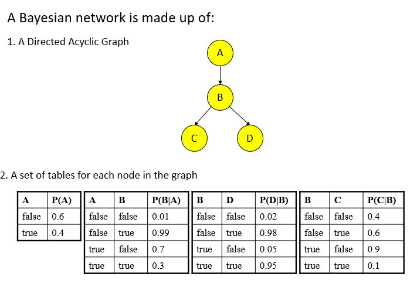

首先这个贝叶斯网络是有向无环的。如果在有向图中，节点 $a$ 指向节点 $b$ 并且节点 $b$ 也指向节点 $a$，那么这构成了一个环。在图论中，一个环是一个非空的有限集合，它首尾相连的一系列边组成，并且首尾是同一个节点。在您描述的情况下，从节点 $a$ 到节点 $b$，然后再从节点 $b$ 返回到节点 $a$，这构成了一个长度为2的环。此外，应该注意的是，有环的图在某些上下文中可能不是理想的。例如，在贝叶斯网络中，图是有向无环图 (DAG)，意味着任何两个节点之间都不应存在这种互相指向的环。

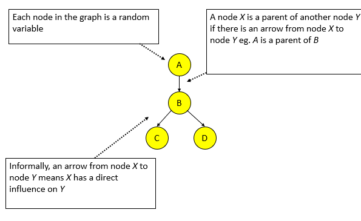

如果A指向了B，那么A则是B的Parent Node，而箭头的方向则表示了因果关系，以及A has a direct influence on B。

接着是一个概率表。

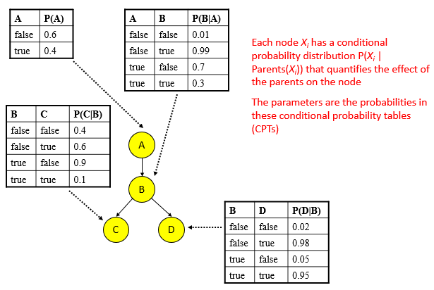

P(A)给出了A分别为True和False的可能性，而P(B|A)则给出了A分别为True和False的情况之下，B分别为True和False的可能性。

**Conditional Probability（条件概率）知识点补充。**

条件概率度量了在给定一个事件发生的情况下，另一个事件发生的概率。换句话说，它是在某一条件下某一事件的概率。

记作 $P(A|B)$，读作“给定 $B$ 的条件下 $A$ 的概率”，它的定义为：

$P(A|B) = \frac{P(A \cap B)}{P(B)}$

其中：

- $P(A \cap B)$ 是 $A$ 和  $B$ 同时发生的概率（联合概率）。
- $P(B)$ 是事件 $B$ 发生的概率。

注意：$P(B) \neq 0$，因为我们不能在 $B$ 不可能发生的情况下条件 $B$。

例子：假设我们有一副扑克牌，并想要知道在已知我们拿到了一张红色的牌（红桃或者方块）的情况下，这张牌是一个王$K$的概率。

设事件 $A$ 是拿到王，事件 $B$ 是拿到红色的牌。我们知道：

- $P(A)$：任意拿到王的概率是 $\frac{4}{52}$（因为有4张王）。
- $P(B)$：任意拿到红色牌的概率是 $\frac{26}{52} = \frac{1}{2}$（因为有26张红色的牌）。
- $P(A \cap B) $：拿到红色的王的概率是 $\frac{2}{52}$（因为有2张红色的王）。

因此，给定我们拿到了一张红色的牌，拿到王的概率是：

$P(A|B) = \frac{P(A \cap B)}{P(B)} = \frac{\frac{2}{52}}{\frac{1}{2}} = \frac{2}{26} = \frac{1}{13}$

所以，如果我们知道我们拿到的是红色的牌，那么这张牌是王的概率是 $\frac{1}{13}$。

### 条件独立性

**什么是条件独立性**

条件独立是概率论和统计学中的一个重要概念，它描述了在给定某个或某些条件时，两个或多个随机变量之间的关系。

**定义**：设有三个随机变量 $A$, $B$, 和 $C$。如果给定 $C$ 的情况下 $A$ 与 $B$ 是独立的，那么我们说在给定 $C$ 的条件下，$A$ 与 $B$ 是条件独立的。数学上，这可以表示为：

$P(A, B | C) = P(A | C) \times P(B | C)$

或者等价地：

$P(A | B, C) = P(A | C)$

这意味着，当我们知道 $C$ 的信息时，$A$ 的概率分布不会被 $B$ 的任何信息所影响（反之亦然）。

使用文氏图来进行表示：

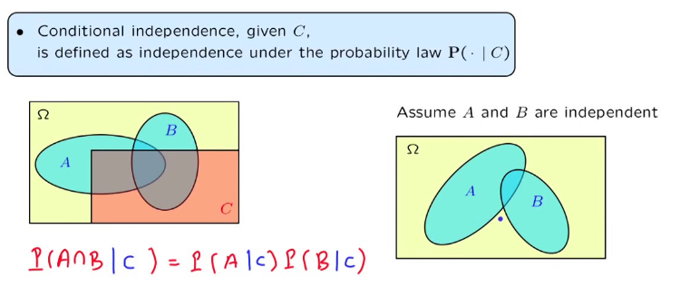

**关于上图的知识点补充**

不，$A$ 和 $B$ 是独立的并不意味着它们没有交集。在概率论中，“独立”和“没有交集”是两个完全不同的概念。

让我们先解释一下这两个概念：

1. **独立**：当两个事件 $A$ 和 $B$ 是独立的，这意味着一个事件的发生不影响另一个事件的发生。数学上，事件 $A$ 和 $B$ 是独立的当且仅当 $P(A \cap B) = P(A) \times P(B)$。

2. **没有交集**：如果事件 $A$ 和 $B$ 之间没有任何公共结果，那么它们是互斥的或不相交的。这意味着两个事件不可能同时发生。数学上，如果 $A$ 和 $B$ 是互斥的，那么 $P(A \cap B) = 0$。

从上述定义中，我们可以看到，“独立”和“没有交集”是不同的。独立的事件可以有交集（其实，它们通常会有交集，除非其中一个事件的概率是0），而互斥的事件永远不可能同时发生。

举个简单的例子：考虑一次公正的掷骰子。事件 $A$ 是得到一个偶数，事件$B$ 是得到一个大于3的数。这两个事件明显有交集（即4和6），但它们是独立的，因为知道一次掷骰子得到偶数并不影响它得到大于3的数的概率，反之亦然。

**为什么条件独立性重要？**

在很多情况下，两个随机变量可能是相关的，但当我们知道第三个变量的信息时，这两个变量可能变得独立。为了更清楚地理解这一点，让我们看一个经典的例子：

**例子**：考虑两个随机变量：一个人是否带伞$(A)$和当天是否下雨$(B)$。通常情况下，这两个变量是相关的，因为人们更可能在下雨的日子带伞。但现在，考虑第三个变量：这个人是否听了天气预报$(C)$。

如果我们知道这个人听了预报，并且预报说当天会下雨，那么不论这个人是否带伞，我们都已经知道了关于是否下雨的信息。在这种情况下，知道他是否带伞并不会给我们提供更多关于是否真的下雨的信息。因此，在知道天气预报的条件下，带伞与否与当天是否下雨是条件独立的。

这种条件独立性在许多领域，特别是在机器学习和统计建模中，都有重要应用。例如，它是贝叶斯网络中关键概念的基础。

如果现在的情况如下所示：

```txt
A → B
B → D
C → D
```

分析如下所示：

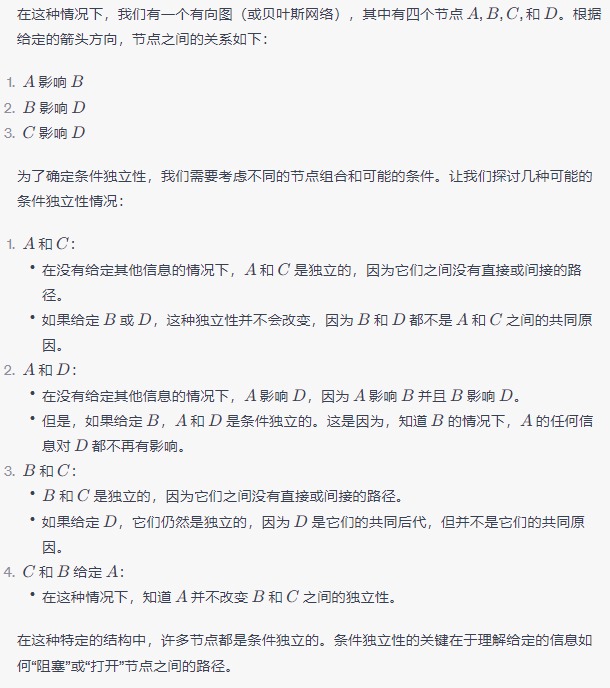

**条件独立和绝对独立（或简单地称为“独立”）是两个不同的概念。**

**绝对独立**：两个事件 $A$ 和 $B$ 是独立的，当且仅当 $P(A \cap B) = P(A) \times P(B)$。这意味着事件 $A$ 的发生不会影响事件 $B$ 的发生，反之亦然。

**条件独立**：给定第三个事件 $C$，如果 $A$ 和 $B$ 是在 $C$ 的条件下独立的，那么我们可以写作 $P(A \cap B | C) = P(A | C) \times P(B | C)$。这意味着，当事件 $C$ 已知时，知道 $A$ 的情况并不会为我们提供关于 $B$ 的任何额外信息，反之亦然。

如您所述，两个事件可以是条件独立的，但在没有给定条件的情况下，它们可能并不是绝对独立的。同样地，即使两个事件在没有给定条件的情况下是绝对独立的，给定某些条件后，它们可能不再是条件独立的。

举个经典的例子：考虑两个随机变量，一个人是否带伞 $A$ 和当天是否下雨 $B$。通常，这两个变量是相关的，因为人们更可能在下雨的日子带伞。但如果引入第三个变量：这个人是否听了天气预报 $C$。如果我们知道这个人听了预报并且预报说当天会下雨，那么不论这个人是否带伞，我们都已经知道了关于是否下雨的信息。因此，在知道天气预报的条件下，带伞与否与当天是否下雨是条件独立的，尽管在没有这个条件的情况下，它们是相关的。

### 马尔科夫条件

马尔可夫条件（The Markov Condition）和条件独立性（Conditional Independence）在贝叶斯网络中是密切相关的概念。为了解释它们之间的关系，我们首先需要明确每个概念的定义。

1. **马尔可夫条件（The Markov Condition）**：对于贝叶斯网络中的任何节点 $X$，给定其父节点，它与非后代节点是条件独立的。

2. **条件独立性（Conditional Independence）**：给定某些事件或变量 $C$，如果两个事件或变量 $A$ 和 $B$ 是条件独立的，这意味着知道 $C$ 的情况下，$A$ 的信息不提供关于 $B$ 的任何额外信息，反之亦然。数学上，这可以表示为 $P(A, B|C) = P(A|C) \times P(B|C)$。

**关系**：

马尔可夫条件实际上是条件独立性在贝叶斯网络中的一个特定应用。它确保了，当我们知道一个节点的父节点的值时，该节点与其非后代节点是条件独立的。这种独立性质极大地简化了贝叶斯网络的计算，因为我们可以利用条件概率和乘法规则来计算联合分布，而不需要知道整个网络的所有细节。

所以，马尔可夫条件为贝叶斯网络提供了一种结构，使得我们只需要关心节点与其直接父节点之间的关系，而不是整个网络的全局关系。而条件独立性是这种结构背后的核心数学概念。

马尔科夫条件是贝叶斯网络中的一个核心概念。考虑以下示例：

假设我们有一个关于学生学术表现的贝叶斯网络。在这个网络中，我们有以下几个节点：

- **智力（Intelligence）**：学生的智力，可以是"高"或"低"。
- **难度（Difficulty）**：考试的难度，可以是"容易"或"困难"。
- **成绩（Grade）**：学生的考试成绩，可以是"A"、"B"或"C"。

我们可以认为成绩（Grade）直接取决于智力（Intelligence）和考试的难度（Difficulty）。因此，我们可以有以下的关系：

```
Intelligence -> Grade
Difficulty -> Grade
```

在这个模型中，马尔科夫条件告诉我们：

1. 给定成绩（Grade），智力（Intelligence）与难度（Difficulty）是条件独立的。这意味着，如果我们知道了一个学生的成绩，那么知道他的智力水平并不会为我们提供任何关于考试难度的额外信息，反之亦然。

2. 另外，考虑智力（Intelligence）节点。因为它没有父节点，所以它与任何其他非后代节点（在这里是难度）是独立的。

这个简单的例子展示了如何在贝叶斯网络中应用马尔科夫条件，以及它是如何利用局部关系来简化复杂网络中的条件独立性问题的。

### 联合概率分布

**联合概率分布**描述了两个或更多随机变量同时取各种可能值的概率。对于离散的随机变量，它给出了所有可能的值组合的概率。对于连续的随机变量，它则是关于这些变量的多变量概率密度函数。

举个简单的例子来理解：

假设有两个离散随机变量 $X$ 和 $Y$，它们的取值分别为 ${x_1, x_2}$ 和 $y_1, y_2$。那么，它们的联合概率分布可以表示为一个表格，显示了它们各种值组合的概率：

| $X \backslash Y$ | $y_1$                 | $y_2$                 |
| ---------------- | --------------------- | --------------------- |
| $x_1$            | $P(X = x_1, Y = y_1)$ | $P(X = x_1, Y = y_2)$ |
| $x_2$            | $P(X = x_2, Y = y_1)$ | $P(X = x_2, Y = y_2)$ |

在这个表格中，每个单元格的概率值表示了 $X$ 和 $Y$ 同时取对应值的概率。例如，$P(X = x_1, Y = y_2)$ 表示 $X$ 取值 $x_1$ 和 $Y$ 取值 $y_2$ 时的联合概率。

知道联合概率分布可以帮助我们计算边缘概率和条件概率，以及多个随机变量之间的各种关系和依赖性。

由于马尔可夫条件，我们可以使用以下公式计算贝叶斯网络中所有变量 $X_1, \ldots, X_n$ 的联合概率分布：

$P(X_1 = x_1, \ldots, X_n = x_n) = \prod_{i=1}^{n} P(X_i = x_i \mid Parents(X_i))$

这个公式的意思是：

- 贝叶斯网络中所有变量的联合概率分布可以由网络中每个节点的条件概率之积表示。
- 具体来说，对于网络中的每个节点 $X_i$，我们考虑其在给定其父节点（即$Parents(X_i)$值的条件下的概率 $P(X_i = x_i \mid Parents(X_i))$。
- 我们将这些条件概率相乘，得到整个网络的联合概率分布。

这基于马尔可夫条件的理念，即给定其父节点的值，节点与其所有非后代节点是条件独立的。这使得我们可以使用上面的公式简化整个贝叶斯网络的联合概率分布的计算。

首先，考虑一个简单的情形。假设我们只有两个变量 $X$ 和 $Y$，并且 $Y$ 依赖于 $X$。根据贝叶斯网络，我们有：

$P(X, Y) = P(X) \times P(Y|X)$

这是直观的，因为 $Y$ 的出现依赖于 $X$。

现在，考虑一个稍微复杂一点的情形。假设我们有三个变量：$X$, $Y$, 和 $Z$。其中 $Y$ 依赖于 $X$，而 $Z$ 依赖于 $X$ 和 $Y$。根据贝叶斯网络，我们有：

$P(X, Y, Z) = P(X) \times P(Y|X) \times P(Z|X, Y)$

这是因为，为了知道 $Z$ 发生的概率，我们需要同时考虑 $X$ 和 $Y$。

现在，我们可以用归纳法进行总体证明。假设上述公式对 $n-1$ 个变量成立，我们需要证明它对 $n$ 个变量也成立。

考虑一个贝叶斯网络，其中 $X_n$ 依赖于一组变量 $Parents(X_n)$。因此，我们有：

$P(X_1, \ldots, X_{n-1}, X_n) = P(X_1, \ldots, X_{n-1}) \times P(X_n|Parents(X_n))$

由于我们已经假设公式对 $n-1$ 个变量成立，所以：

$P(X_1, \ldots, X_{n-1}) = \prod_{i=1}^{n-1} P(X_i|Parents(X_i))$

代入上面的公式，我们得到：

$P(X_1, \ldots, X_n) = \prod_{i=1}^{n} P(X_i|Parents(X_i))$

这就完成了归纳证明。

总之，马尔可夫条件允许我们将一个大型贝叶斯网络的联合概率分布分解为每个节点给定其父节点的条件概率的乘积。

这是一个例子：

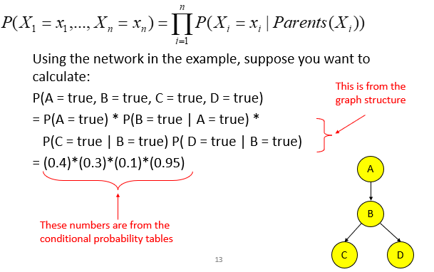

### 贝叶斯网络推理

"Inference" 在计算机科学和其他学科中是一个广泛的概念，但基本上它指的是从给定的信息中得出结论或预测。这里是几个上下文中的 "inference" 的定义：

1. **统计和概率论**：推断是根据样本数据得出关于总体的结论的过程。例如，我们可以从一个小样本中推断整个人口的平均值。常用的方法包括假设检验和置信区间。

2. **逻辑**：在逻辑中，推断是从一个或多个前提出发得出结论的过程。

3. **机器学习和人工智能**：在这个上下文中，推断通常指的是已经训练好的模型给出预测或决策的过程。例如，在训练了一个图像识别模型后，使用该模型来识别新图像中的对象就是推断过程。

4. **贝叶斯网络**：推断是根据已知的证据变量来计算某些未知变量的后验概率的过程。

5. **计算机科学 - 编程**：在某些编程语境中，类型推断指的是编译器或解释器自动确定表达式的类型，而不是由程序员明确指定。

每个上下文中的推断都涉及到从已知信息中得出结论，但具体的方法和含义可能会有所不同。

在这里：使用贝叶斯网络来计算概率被称为推断。

贝叶斯网络是一个表示变量之间概率关系的图模型。在这个网络中，节点代表随机变量，而边则代表变量之间的概率依赖关系。每个节点都有一个与之关联的条件概率分布。

**推断** 是贝叶斯网络中的一种关键操作，涉及到基于已知证据来计算其他变量的概率。简而言之，给定某些节点（即已知变量或观测）的状态，我们想知道其他节点（即未知变量或查询）的概率分布。

一般来说，贝叶斯网络推断的问题是NP-hard的（与图的大小成指数关系）。

**精确推断**：这些方法旨在计算与查询变量相关的确切概率分布。

- **概率和马尔可夫条件**：基于贝叶斯网络的基本概率性质和马尔可夫条件进行推断。
- **变量消除**：一种基于求和和乘法操作来消除非查询变量的技术。
- **聚类 / 连接树算法**：将贝叶斯网络转化为一种特定的数据结构，如连接树，然后在此结构上进行推断。

**近似推断**：当精确推断在计算上变得不切实际时，近似推断方法可以给出概率分布的近似估计。

- **随机模拟 / 抽样方法**：通过随机抽样从概率分布中得到近似解。
- **马尔可夫链蒙特卡洛方法**：一种使用马尔可夫链进行随机抽样的技术。
- **遗传算法**：模拟自然选择过程来逼近最优解的搜索算法。
- **神经网络**：可以模拟贝叶斯网络并进行近似推断的模型。
- **模拟退火**：一种全局优化方法，模拟金属冷却和退火的过程。
- **平均场理论**：一种物理启发式的方法，用于近似复杂系统的行为。

例如，考虑一个贝叶斯网络，该网络描述了天气、交通状况和一个人是否迟到的关系。如果我们知道今天的天气（例如下雨）和交通状况（例如塞车），我们可以使用推断来估计这个人迟到的概率。

这是一个例子：

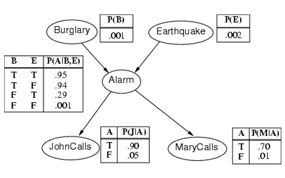

Burglary和Earthquake是绝对独立的，这两者没有一者指向另一者的路径。而JohnCalls和MaryCalls对Burglary和Earthquake而言是conditional independent。

贝叶斯网络推理可以进行：

- 诊断（证据、溯因）：从结果到原因
  - $P(Buglary|JonhCalls), P(B|J)=0.016$
  - $P(B|J,M)=0.29$
  - $P(A|J,M)=0.76$
- 因果（预测）：从原因到结果
  - $P(J|B)=0.86$
  - $P(M|B)=0.67$
- 因果关系（解释掉）：共同效应
  - $P(B|A)=0.38$
  - $P(B|A, E)=0.003$
- 混合：以上两种或两种以上的组合
  - $P(A|J,E’)=0.03$
  - $P(B|J,E’)=0.017$

**诊断（证据、溯因）：从结果到原因的例子。**

求在J为True的情况之下，因为B的可能性有多少？即：$P(B│J = True)=P(B,J)/P(J) $

首先可以得出：

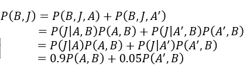

接着可以计算：

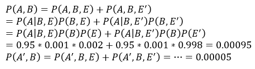

然后求得 $P(B, J)$的数值：$P(B,J)=0.9∗0.00095+0.005∗0.00005=0.00086$

再接着计算P(J)：

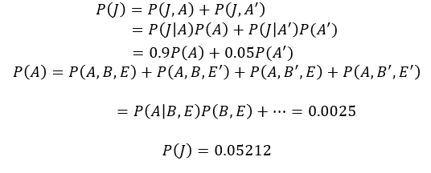

最后得到最终的结果：$P(B│J)=P(B,J)/P(J) =0.00086/0.05212=0.016$。

**上一个例子的一些补充的知识点。**

$P(A, B, C) $表示随机变量 $A$、$B$ 和 $C$ 的联合概率分布。简单来说，这表示 $A$、$B$ 和 $C$ 同时取特定值的概率。例如，如果 $A$、$B$ 和 $C$ 都是二元变量，那么 $P(A = 1, B = 0, C = 1)$ 就表示 $A$ 取值为 1，$B$ 取值为 0，$C$ 取值为 1 的概率。联合概率分布描述了所有变量的所有可能组合的概率。对于离散随机变量，这通常可以通过一个概率表表示，该表列出了每种可能的变量组合和相应的概率值。

为什么$P(A, B) = P(A, B, C) + P(A, B, C')$

这是根据概率的加法规则和边际化（marginalization）过程得出的。为了更清楚地解释，我们从基本的定义开始。

首先，$P(A, B)$ 是随机变量 $A$ 和 $B$ 的联合概率分布，而 $P(A, B, C)$ 和 $P(A, B, C')$ 分别是 $C$ 取其可能值或其补（不取该值）时的 $A$、$B$ 和 $C$ 的联合概率分布。现在，$P(A, B)$ 为 $A$ 和 $B$ 同时取某个值的概率，而不考虑 $C$ 的取值。要从 $P(A, B, C)$ 和 $P(A, B, C') $ 得到 $P(A, B)$，我们需要对 $C$ 的所有可能值进行求和，这一过程叫做边际化。

公式如下：$P(A, B) = \sum_{c} P(A, B, C=c)$，其中 $c$ 是 $C$ 的所有可能值。

在二元情况（例如，C只能取0或1）中，该公式变为：$P(A, B) = P(A, B, C=0) + P(A, B, C=1)$

或者使用 $C$和 $C'$ 的表示法其中 $C'$ 表示 $C$ 不取某个特定值）：$P(A, B) = P(A, B, C) + P(A, B, C')$

这就是为什么 $P(A, B)$ 是 $P(A, B, C)$ 和 $P(A, B, C')$ 的和的原因。

**推理的另一个例子：从原因到结果**

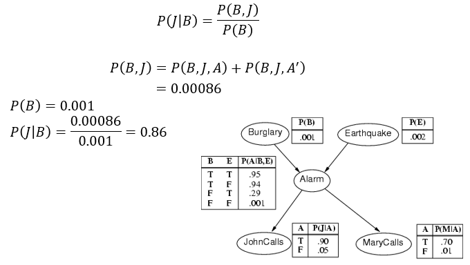

**再一个例子：共同效应**

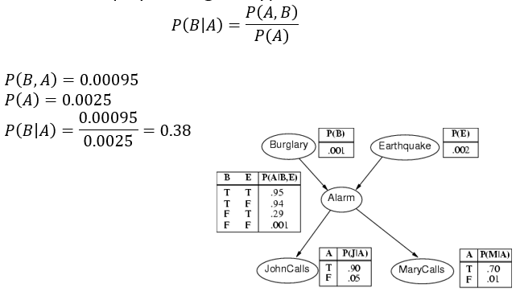


