## 贝叶斯网络学习

### 可能的贝叶斯网络关系

我们研究可能得到这样的一个结果：

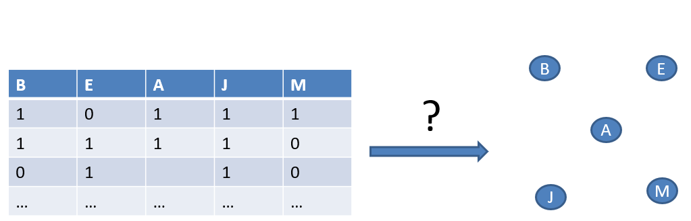

我们需要找出各个变量直接的依赖关系，但是存在着多种可能的关系。

**为什么存在着多种可能的贝叶斯网络关系**

当我们谈论贝叶斯网络（或其他图模型）的结构时，我们实际上是在描述变量之间的依赖关系。在给定一组变量的情况下，可能存在多种方式来表示这些变量之间的依赖关系，因此会有多个网络结构。

以下是为什么存在多个网络结构的几个原因：

1. **数据的不确定性与噪声**：实际数据可能包含噪声，或者可能没有足够的数据来确定一个唯一的最佳结构。因此，多个结构可能都能很好地适应同一数据集。

2. **变量之间的多重因果关系**：有时，一组变量之间的因果关系可能有多种解释。例如，考虑两个变量A和B。A可能导致B，B可能导致A，或者它们可能都是由第三个未观察到的变量C的结果。这些不同的关系都会导致不同的网络结构。

3. **模型的复杂性选择**：为了避免过度拟合，我们可能希望选择一个更简单的模型，即使它并不是与数据最匹配的模型。这可能会导致选择一个不同的网络结构。

4. **启发式搜索的局限性**：由于搜索最佳结构的问题是NP-hard的，所以我们经常使用启发式方法来近似找到最佳结构。这些方法可能会找到多个接近最佳的结构，但不一定是真正的最佳结构。

5. **不同的先验知识**：在某些情况下，我们可能会根据先验知识对结构进行约束，这可能会导致选择不同的网络结构。例如，如果我们知道某些变量之间不存在因果关系，那么我们可能会排除包含这些关系的结构。

总之，存在多个网络结构的原因与数据、模型选择标准、搜索方法和先验知识等多个因素有关。在实际应用中，通常会根据特定的应用背景和需求来选择最佳的网络结构。

贝叶斯网络（Bayesian Networks）的学习和结构选择的概念如下所示：

1. **贝叶斯网络**：这是一种概率图模型，它通过有向无环图（DAG，Directed Acyclic Graph）表示变量间的条件依赖关系，并利用这些关系来进行概率推理。

2. **‘Search and score’ approach**：
    - 这种方法的目的是从数据中找到最佳的DAG结构。
    - **搜索所有可能的DAGs**：理论上，我们可以检查所有可能的DAG结构来找到最佳的结构。
    - **为每个DAG打分**：这里的“打分”是通过某种评分函数来实现的，该函数基于数据评估DAG的质量。
    - **选择最高分的DAG**：从所有可能的DAGs中选择得分最高的DAG。这个DAG被认为是最适合给定数据的。

3. **NP-hard problem**：寻找最佳的DAG结构是一个NP-hard问题，这意味着我们不可能在多项式时间内找到最佳解决方案。这也是为什么实际中很少从头开始搜索所有可能的DAGs的原因。

4. **Constraint-based approach**：
    - 这是另一种学习DAG结构的方法。
    - 使用统计测试来评估变量之间的依赖关系。
    - 基于这些统计测试结果，可以确定某些边（关系）是否存在。
    - 这种方法的复杂性是指数级的，因为随着节点数量的增加，需要进行的统计测试的数量也会呈指数增长。

总的来说，贝叶斯网络的结构学习是一个复杂的问题，有多种策略可以进行处理。但是，由于问题的困难性，完全的搜索并不总是可行的。因此，实践中经常使用启发式方法、约束方法或结合这些方法的混合方法。

**关于Search and Score's approach。**

"Search and Score"方法是在学习贝叶斯网络结构时经常使用的一种方法。该方法的核心思想是在所有可能的有向无环图（DAGs，Directed Acyclic Graphs）中搜索最佳的结构，并使用一个评分函数来为每个DAG打分，以选择那个与数据最匹配的结构。

1. **搜索（Search）**:
    - **所有可能的DAGs**: 理论上，给定n个变量，可能的DAG数量是非常巨大的。这是因为你需要考虑所有可能的边的存在和不存在的组合。
    - 由于搜索空间太大，通常不可能完整地搜索所有可能的DAGs。因此，实际应用中，搜索通常是启发式的，例如使用贪婪算法、遗传算法或其他优化方法来探索和修改当前DAG的结构。

2. **打分（Score）**:
    - **评分函数**：评分函数的目的是衡量一个给定DAG与数据的匹配程度。高分意味着DAG更能解释观察到的数据。
    - 常用的评分标准包括BIC（Bayesian Information Criterion）、AIC（Akaike Information Criterion）和似然函数等。这些评分标准的选择可能会受到统计性质和数据的影响。
    - 为每个DAG打分: 你将数据带入DAG，并使用上述评分标准之一来为DAG打分。

3. **选择最佳DAG**:
    - 从所有搜索到的DAGs中选择得分最高的一个。这个DAG被认为是最能代表或解释给定数据的。

总的来说，"Search and Score"方法试图在所有可能的网络结构中找到最佳的一个，但由于其计算复杂性，实际操作时往往使用各种启发式算法来近似解决。这种方法的一个主要挑战是，随着变量数量的增加，可能的DAGs数量会指数级增长，导致搜索和评分变得非常复杂。

如下图：

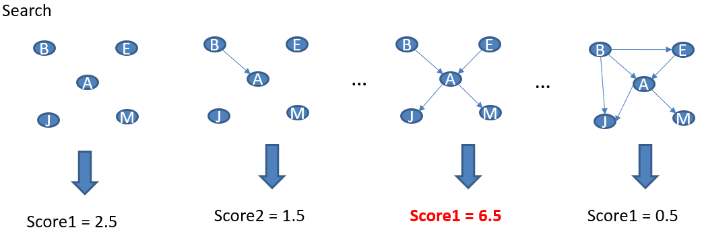

### 贝叶斯网络评分

**我们需要评估多少DAGs？**

如下图：

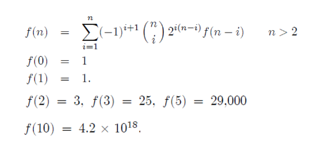

这是一个例子：

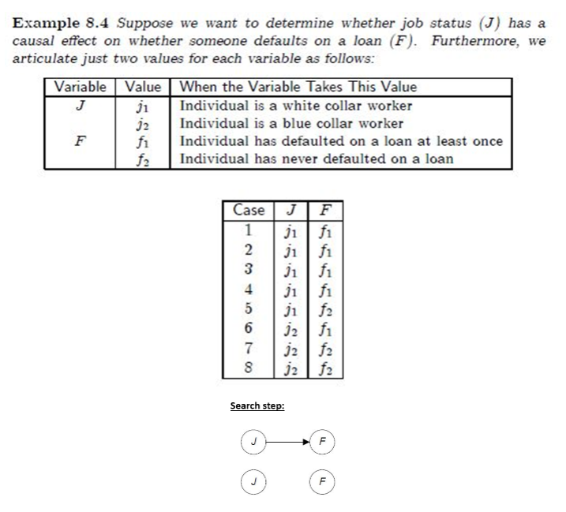

**计算需要使用BIC。**

Bayesian Information Criterion（BIC）是一种模型选择标准，旨在确定给定数据最佳的模型。BIC不仅考虑模型对数据的拟合度，而且包括一个惩罚项，惩罚模型的复杂性，以避免过拟合。它是基于贝叶斯概率原则的，但其实际计算更像是经验方法。

BIC定义为：
$ \text{BIC} = -2 \cdot \ln(\text{likelihood of the data under the model}) + k \cdot \ln(n) $
其中：
- $ \ln $ 是自然对数函数。
- $\text{likelihood of the data under the model}$ 是给定模型下数据的似然值。
- $ k $ 是模型中的参数数量。
- $ n $ 是数据集中的样本数量。

BIC的两部分有各自的解释：

1. **-2 $\cdot \ln(\text{likelihood})$**：这部分衡量模型如何拟合数据。较小的值意味着模型更好地拟合数据。
  
2. **$k \cdot \ln(n)$**：这部分惩罚模型的复杂性。增加更多的参数可以使模型更好地拟合数据，但可能导致过拟合。这个惩罚项确保只有当新参数确实提供了显著的改进时，才会添加到模型中。

在使用BIC进行模型选择时，我们通常选择具有最小BIC值的模型，因为较小的BIC值意味着对于其复杂性，模型为数据提供了更好的拟合。

BIC在许多统计建模的上下文中都有应用，包括线性回归、聚类和贝叶斯网络结构学习等。

或者可以采用这个：

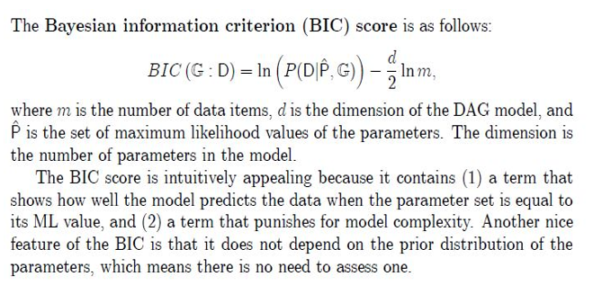

这是一个例子：

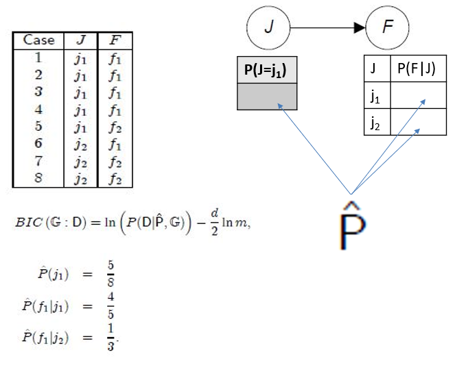

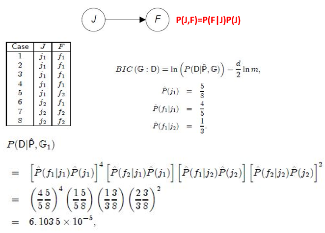

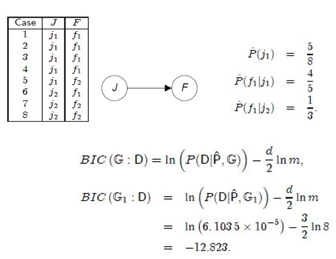

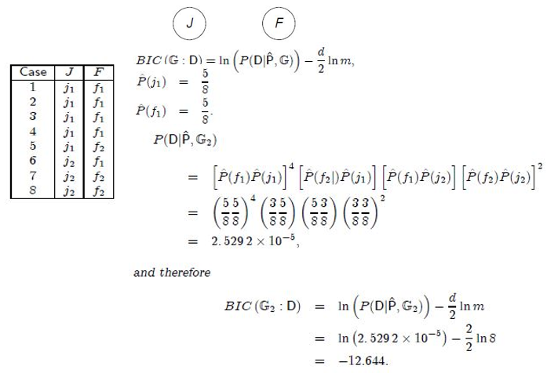

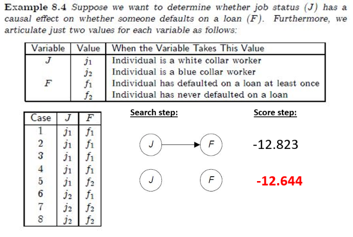

**这是另一个例子**

好的，让我们使用一个简化的例子来说明如何使用BIC选择最佳的贝叶斯网络。

假设我们有三个随机变量：$A$，$B$，和$C$。我们想要确定这三个变量之间的关系。为简化起见，我们考虑以下两个可能的贝叶斯网络结构：

1. 结构1： $A \rightarrow B \rightarrow C$
2. 结构2： $A \leftarrow B \rightarrow C$

我们拥有一个数据集，该数据集包含这三个变量的观察值。我们的目标是确定哪一个网络结构更能解释这些观察到的数据。

步骤1：计算每个模型的似然值

首先，我们为每个结构学习其参数（比如条件概率表）。然后，我们计算给定这些参数下数据的似然值。

假设：
- 结构1的数据似然值为 $L_1$
- 结构2的数据似然值为 $L_2$

步骤2：计算BIC值

对于每个结构，我们使用BIC公式计算其值：

$ \text{BIC} = -2 \cdot \ln(\text{likelihood}) + k \cdot \ln(n) $

其中:
- $ k $ 是模型的参数数量。
- $ n $ 是数据点的数量。

假设每个结构都有5个参数（在实际应用中，参数的数量可能会根据网络的连接性和数据的具体性质而变化），且数据集包含100个观察值。

结构1的BIC值为：

$ \text{BIC}_1 = -2 \cdot \ln(L_1) + 5 \cdot \ln(100) $

结构2的BIC值为：

$ \text{BIC}_2 = -2 \cdot \ln(L_2) + 5 \cdot \ln(100) $

步骤3：选择BIC值较小的结构

我们选择BIC值较小的结构作为最佳结构。假设 $\text{BIC}_1 < \text{BIC}_2$，那么我们会选择结构1作为这三个变量之间关系的最佳模型。

通过这种方式，BIC帮助我们在拟合数据和模型复杂性之间达到平衡，从而选择出最佳的贝叶斯网络结构。

**关于似然值的知识点补充。**

似然值（Likelihood）是一个统计学上的概念，用于描述一个模型给定数据的合理性或概率。更具体地说，它度量了在给定某个参数值时，观察到现有数据的概率是多少。似然值与概率相关，但它们并不是同一回事。

为了更清晰地理解似然值，我们可以考虑一个简单的例子：

例子：抛硬币

假设我们有一个可能是不均匀的硬币，我们想要估计这个硬币正面朝上的概率$ p $。为此，我们抛这个硬币10次，得到了7次正面和3次反面的结果。

1. **概率**：如果我们知道硬币是均匀的（即 $ p = 0.5 $），那么我们可以计算在10次抛掷中得到7次正面的概率。

2. **似然值**：现在，我们反过来思考。给定我们已经观察到的7次正面和3次反面的数据，我们想知道这些数据在不同的$ p $值下有多合理。例如，如果 $ p = 0.4 $，与$ p = 0.7 $相比，这些数据的似然值是多少？

数学上，对于上述硬币抛掷实验，似然值可以写作：

$ L(p) = p^7(1-p)^3 $

这个函数会告诉我们在不同的$ p $值下，观察到的数据（7次正面和3次反面）有多合理。

似然值在统计学中非常重要，尤其是在估计模型参数（例如最大似然估计）时。在模型选择和统计推断中，似然函数和它的相关概念（如对数似然）也常常被用到。

**为什么这里使用似然值**

似然值是统计学和模型选择中的核心概念，它衡量了给定模型下数据的“可能性”。在贝叶斯网络结构学习和许多其他统计任务中，似然值用于评估模型对数据的拟合程度。具体来说，似然值描述了在固定模型参数时，观察到数据的概率是多少。

为什么在模型选择中使用似然值有以下几个原因：

1. **数据的适应度**：似然值直接反映了模型如何拟合数据。较高的似然值意味着数据在给定的模型和参数下更有可能被观察到。因此，似然值为我们提供了衡量模型对数据拟合程度的直观方法。

2. **参数估计的基础**：在统计学中，最大似然估计（MLE）是一种常用的参数估计方法。通过最大化似然函数，我们可以找到使数据最有可能出现的模型参数。

3. **与BIC和其他信息准则的关系**：如前所述，BIC等模型选择标准在其计算中使用似然值。BIC结合了似然值（衡量模型的拟合度）和模型复杂性的惩罚项，以避免过度拟合。

4. **统计推断**：似然值在统计推断中也起到关键作用，例如在假设检验和置信区间的构建中。

总之，似然值是一个描述给定模型和参数时数据被观察到的“可能性”或“合理性”的度量。在模型选择和参数估计中，它提供了一个重要的工具来评估模型如何解释观察到的数据。

### 两种方法的比较

“Search and Score”方法和“Constraint-based”方法。详细为你解释这两种方法：

1. **“Search and Score” Approach（搜索和评分方法）**:
    - **Search for all possible DAGs**: 这意味着尝试所有可能的有向无环图（DAG）结构来代表变量之间的关系。
    - **Score each DAG with a scoring function**: 一旦每个DAG被构建，它就会根据某种评分函数被评分。这个评分函数通常基于数据的似然值，但会加入某种形式的模型复杂性的惩罚，例如BIC。
    - **The DAG with the highest score**: 选择得分最高的DAG，因为这个DAG最能解释给定的数据。
    - **NP-hard problem**: 找到最佳的DAG结构是一个NP-hard问题，意味着随着变量数量的增加，解决它的计算复杂性会急剧增加，使得对于大型问题来说，寻找确切的解决方案是不切实际的。

2. **Constraint-based Approach（基于约束的方法）**:
    - **Use statistical tests to evaluate the dependency between variables**: 这种方法首先测试变量之间是否独立。例如，使用Pearson卡方测试来评估两个离散变量是否条件独立。
    - **Construct the network based on independencies**: 通过确定的独立性和非独立性关系，构建网络。如果两个变量是独立的，则不在它们之间放置边；否则，会加一个边。
    - **Exponential to the number of nodes**: 尽管这种方法避免了直接搜索所有可能的DAGs，但它的复杂性仍然是节点数量的指数函数。这是因为它必须考虑所有可能的变量组合以测试独立性。

这两种方法都有其优点和限制。搜索和评分方法通常会产生更加精确的结果，但对于具有大量变量的数据集可能是不切实际的。而基于约束的方法则更快，但可能更容易受到数据中噪声的影响。在实践中，还有其他混合方法和启发式方法用于结构学习，以解决这两种方法的局限性。

当然可以，下面是一个表格，比较了“Search and Score”方法和“Constraint-based”方法：

| 特点/方法          | Search and Score             | Constraint-based                                       |
| ------------------ | ---------------------------- | ------------------------------------------------------ |
| 主要思路           | 搜索所有可能的DAGs并为其评分 | 使用统计测试确定变量之间的独立性                       |
| 评分/评估机制      | 使用评分函数（如BIC）        | 使用统计测试（如卡方测试）                             |
| 最佳结构的选择     | 选择得分最高的DAG            | 基于确定的独立性和非独立性构建网络                     |
| 计算复杂性         | NP-hard                      | 指数于节点数量                                         |
| 数据要求           | 大量数据可以提供更准确的评分 | 对数据质量和样本量有一定要求，以确保独立性测试的可靠性 |
| 噪声容忍度         | 中等（取决于评分函数）       | 通常较低，因为噪声可能导致错误的独立性测试结果         |
| 结果               | 通常更加精确但计算量大       | 更快但可能受到数据噪声的影响                           |
| 是否考虑模型复杂性 | 是（通过评分函数中的惩罚项） | 不直接，但通过独立性测试间接地考虑                     |

这个表格提供了两种方法的基本比较。实际上，在选择最合适的方法时，可能还需要考虑其他因素，如数据的大小、质量、可用的计算资源等。

### 相关性

**什么是相关性**

相关性描述了两个变量之间线性关系的强度和方向。

其中，皮尔逊积矩相关系数（Pearson's correlation coefficient）是最常用的相关性测量方法。它的公式为：

$ r = \frac{\sum (x_i - \bar{x})(y_i - \bar{y})}{\sqrt{\sum (x_i - \bar{x})^2 \sum (y_i - \bar{y})^2}} $

其中：
- $ x_i $ 和 $ y_i $ 是观测值。
- $ \bar{x} $ 和 $ \bar{y} $ 是其对应的均值。

皮尔逊相关系数的值范围从-1到1：
- $ r = 1 $ 表示完全正相关。
- $ r = -1 $ 表示完全负相关。
- $ r = 0 $ 表示没有线性相关性。


考虑以下两组数据：

$ x: [1, 2, 3, 4, 5] $
$ y: [2, 3, 4, 5, 6] $

首先，计算均值：

$ \bar{x} = \frac{1+2+3+4+5}{5} = 3 $
$ \bar{y} = \frac{2+3+4+5+6}{5} = 4 $

使用上述公式，我们可以计算r：

$ r = \frac{\sum (x_i - 3)(y_i - 4)}{\sqrt{\sum (x_i - 3)^2 \sum (y_i - 4)^2}} $

当你对每个$ x_i $和$ y_i $进行计算并插入到公式中，你会得到：

$ r = 1 $
这表示x和y之间有完全正相关。

在实际应用中，为了计算相关性，通常使用统计软件或编程语言的库函数，如Python的NumPy中的`corrcoef`函数。

**相关性图**

相关性图是一种图形化表示方法，用于描述一组变量之间的相互关系。在这个图中，每个节点代表一个变量，而连接节点的边则表示这些变量之间的相关性。边的强度或权重通常表示相关性的大小或强度。通过这种图，我们可以直观地看到哪些变量之间存在较强的关系。

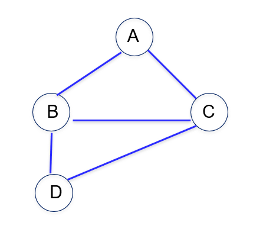

**真实图与相关性图**

"True graph"和"Correlation graph"是在图论、统计和因果推断的上下文中使用的术语。让我们详细解释它们：

1. **True Graph**:
   - **定义**: "True graph"通常指代数据背后的真实因果结构或关系。在因果推断和贝叶斯网络的文献中，这通常指的是正确的、未观察到的结构，我们希望从数据中学习到或推断出来的。
   - **特点**: 它通常是一个有向图（通常是有向无环图或DAG），其中边表示因果关系，从原因节点指向效果节点。

2. **Correlation Graph**:
   - **定义**: "Correlation graph"是一个无向图，其中节点表示变量，而边则表示变量之间的统计相关性。如果两个变量之间的相关性（如皮尔逊相关系数）超过某个阈值，或者它们之间的相关性是显著的，那么这两个变量之间就有一条边。
   - **特点**: 这种图只捕捉到变量之间的相关性，而不捕捉到它们之间的因果关系。只因为两个变量相关，并不意味着其中一个变量是另一个变量的原因。

3. **区别:**
   - "True graph"强调的是真实的因果关系，而不仅仅是相关性。它的边是有向的，表示一个变量如何影响另一个变量。
   - "Correlation graph"仅表示数据中观察到的相关性，而不表示因果关系。它的边是无向的，只表示两个变量之间存在某种关系，但不说明这种关系的方向或性质。

在进行因果推断或数据分析时，理解这两种图之间的区别是非常重要的，因为相关性不等于因果性。

要测试B和C是否仅由于共同的原因A而发生关联，我们采用条件独立测试：$I(B, C|A)$。

例如：偏相关系数、卡方检验。

图示：

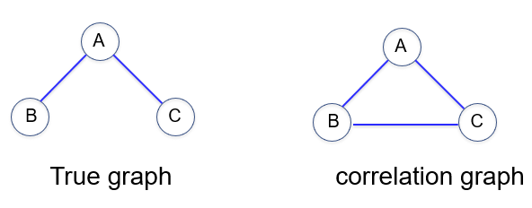

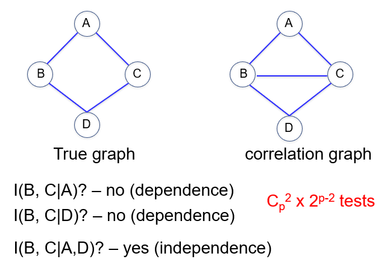

**这是一个计算的例子：**

我们使用一个简化的例子，以偏相关系数为例，说明如何测试B和C是否只因为A的共同因素而相关。

假设我们有三个变量：A、B、C。可能的场景是：
- A是学生的学习时间；
- B是学生的作业得分；
- C是学生的期末考试得分。

我们想要知道：一旦控制了学习时间（A），作业得分（B）和期末考试得分（C）之间的关系是否仍然存在。

首先，我们可以计算B和C的皮尔逊相关系数，这将给出B和C之间的总体相关性。但为了控制A的效应，我们需要计算偏相关系数。

**偏相关系数的公式为**：

$ r_{BC.A} = \frac{r_{BC} - r_{BA} \times r_{CA}}{\sqrt{(1 - r_{BA}^2)(1 - r_{CA}^2)}} $

其中:
- $ r_{BC} $ 是B和C之间的皮尔逊相关系数；
- $ r_{BA} $ 是B和A之间的皮尔逊相关系数；
- $ r_{CA} $ 是C和A之间的皮尔逊相关系数。

假设我们得到以下相关系数：
- $ r_{BC} = 0.8 $
- $ r_{BA} = 0.6 $
- $ r_{CA} = 0.7 $

插入公式，我们得到：

- $ r_{BC.A} = \frac{0.8 - 0.6 \times 0.7}{\sqrt{(1 - 0.6^2)(1 - 0.7^2)}} $
- $ r_{BC.A} = \frac{0.8 - 0.42}{\sqrt{(1 - 0.36)(1 - 0.49)}} $
- $ r_{BC.A} = \frac{0.38}{\sqrt{0.64 \times 0.51}} $
- $ r_{BC.A} = \frac{0.38}{0.5732} $
- $ r_{BC.A} \approx 0.663 $

结果显示，在控制了学习时间（A）后，作业得分（B）和期末考试得分（C）之间仍然存在强相关性（偏相关系数约为0.663）。

这个计算过程显示了如何使用偏相关系数来控制潜在的混淆变量，并检查在控制这些变量后其他两个变量之间的关系是否仍然存在。

### PC算法

**什么是PC算法**

PC算法（Peter & Clark算法）是一个经典的算法，用于从观测数据中学习贝叶斯网络结构，特别是在没有先验知识的情况下。它是基于条件独立性测试的，并且旨在确定哪些变量是条件独立的，以此来推断出变量之间的关系。

PC算法的主要步骤可以分为两部分：确定“骨架”(skeleton)和确定边的方向。

1. **确定骨架**：
    - 开始时，所有变量之间都假设存在一个边（即完全图）。
    - 对于每一对变量（A、B），开始时没有其他变量作为条件变量来测试它们的独立性。如果它们是独立的，则删除边A-B。
    - 如果在上一步中A和B是条件独立的，则考虑一个变量集{C}作为条件变量，并再次测试A和B的独立性。如果它们在给定{C}时是独立的，则再次删除边A-B。
    - 增加条件变量的数量，并重复上述步骤，直到所有变量对都被测试过或达到了预先设定的最大条件变量的数量。
    - 完成这些步骤后，剩下的边构成了网络的“骨架”。

2. **确定边的方向**：
    - 使用一组规则和条件独立性测试来确定骨架中边的方向，从而得到DAG。

**注意**：PC算法的一个关键特点是，它不需要对所有可能的网络结构进行搜索和评分，从而大大提高了效率。但这种效率的提高是以牺牲一些精确度为代价的，因为算法可能不会找到数据的最佳结构。

总之，“骨架”是PC算法中的一个关键概念，它描述了在考虑条件独立性测试后仍然存在的变量间的关系。这个骨架随后被用于确定边的方向，从而完成整个网络结构的学习过程。

PC算法由两个主要阶段组成：确定骨架(skeleton)和方向化边(orienting edges)。以下是PC算法的简化伪代码：

```
函数 PC_algorithm(data, significance_level):
    输入:
        data: 观测数据
        significance_level: 显著性水平，用于条件独立性测试
    
    输出:
        DAG: 一个有向无环图

    1. 初始化一个完全图 G，其中节点表示变量，每对变量之间都有边
    2. 对于G中的每一对非相邻节点 X 和 Y:
        a. 设 S = 空集合
        b. 当 S 是 X 和 Y 的邻居的真子集时:
            i. 如果 X 和 Y 在给定 S 的条件下是独立的:
                - 在 G 中移除边 X-Y
                - 将与该边相关的所有节点添加到禁止集，确保这些边不会再被方向化
                - 跳出循环
            ii. 否则，S = S 的下一个子集

    3. 使用以下规则方向化 G 中的边:
        a. 如果在 G 中有一个未定向的边 X-Y，并且在禁止集中不存在与之相关的节点:
            i. 如果存在一个节点 Z，使得 Z 是 X 的邻居，但 Z 不是 Y 的邻居，并且 X-Z-Y 不是一个已定向的路径，那么将 X-Y 定向为 X->Y

    4. 返回 G
```

这个伪代码提供了PC算法的一个高级概述。在实践中，可以使用各种条件独立性测试，如χ²测试、Fisher精确测试等。此外，确定边方向的部分可能需要更复杂的逻辑和额外的规则，特别是当处理更复杂的网络和数据时。

**PC算法的Python语言实现**

该实现将确定变量之间的关系骨架，使用χ²测试作为条件独立性测试。这里我们仅考虑离散变量的情况。

```python
import pandas as pd
import numpy as np
from scipy.stats import chi2_contingency
import networkx as nx

def is_independent(X, Y, S, data, alpha=0.05):
    # 创建联合分布表
    if not S:
        contingency_table = pd.crosstab(data[X], data[Y])
    else:
        contingency_table = data.groupby([X, Y] + S).size().unstack().fillna(0)

    chi2, p_value, _, _ = chi2_contingency(contingency_table)

    return p_value > alpha

def PC_algorithm(data, alpha=0.05):
    variables = list(data.columns)
    G = nx.Graph()
    G.add_nodes_from(variables)
    for i in range(len(variables)):
        for j in range(i+1, len(variables)):
            X = variables[i]
            Y = variables[j]
            G.add_edge(X, Y)  # 开始时为完全图
            for k in range(len(variables)):
                if k == i or k == j:
                    continue
                S = [variables[k]]
                if is_independent(X, Y, S, data, alpha):
                    if G.has_edge(X, Y):
                        G.remove_edge(X, Y)
                    break

    return G

# 示例数据
data = pd.DataFrame({
    'A': np.random.choice([0, 1], 1000),
    'B': np.random.choice([0, 1], 1000),
    'C': np.random.choice([0, 1], 1000)
})

# 确保一些依赖关系
data['B'] = data['A'] ^ data['B']  # B is dependent on A
data['C'] = data['B'] ^ data['C']  # C is dependent on B

G = PC_algorithm(data)
print(G.edges())
```

这个代码实现考虑了两个变量在给定第三个变量时的独立性。为简化起见，这里只考虑了一个条件变量的情况。在真实应用中，你可能需要考虑更大的条件变量集合。这个简化的例子应该给出边 `A-B` 和 `B-C`，因为`B`取决于`A`，而`C`取决于`B`。

直接使用pgmpy库来进行实现：

```python
import numpy as np
import pandas as pd
from pgmpy.estimators import PC
from pgmpy.utils import get_example_model
from pgmpy.estimators import ParameterEstimator, MaximumLikelihoodEstimator
from pgmpy.independencies import Independencies
from pgmpy.models import BayesianModel

# 生成示例数据
data = pd.DataFrame(np.random.randint(0, 2, size=(5000, 2)), columns=list('AB'))
data['C'] = data['A'] + data['B']
data['C'] = data['C'] % 2

# 使用 PC 算法
est = PC(data)

# 估计骨架 (无向图)
max_cond_vars = 3  # 最大的条件变量数
best_model = est.estimate(return_type="dag", significance_level=0.01, max_cond_vars=max_cond_vars)

print("Edges:", best_model.edges())
```

**伪代码和后续推理**

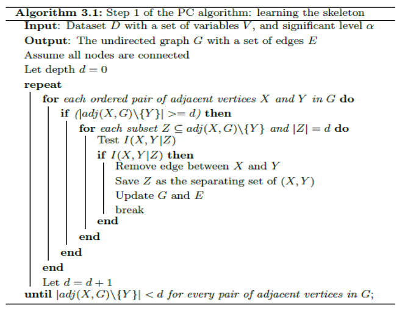

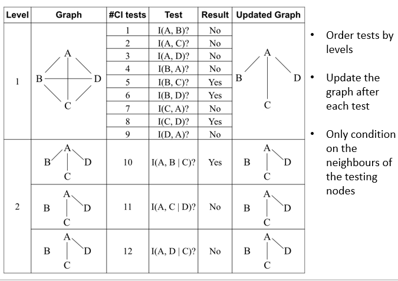

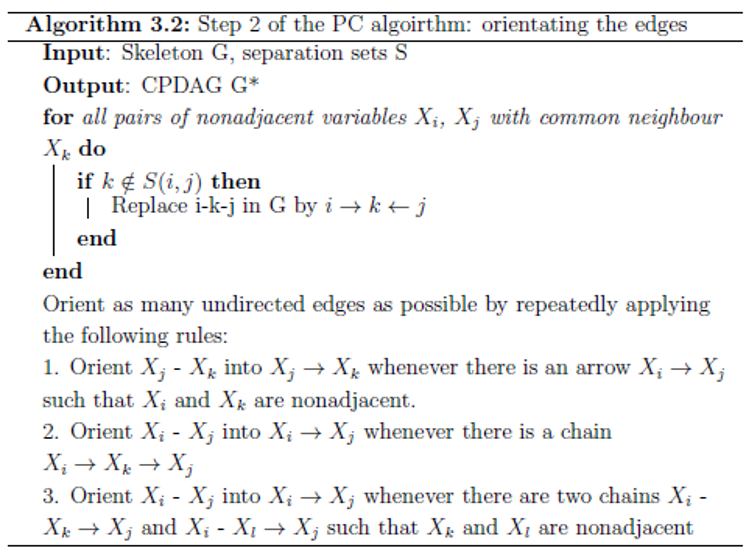

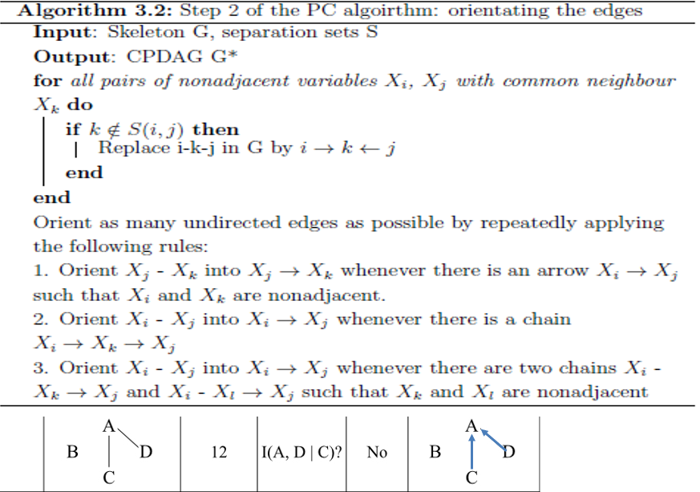

### Practical - 03

