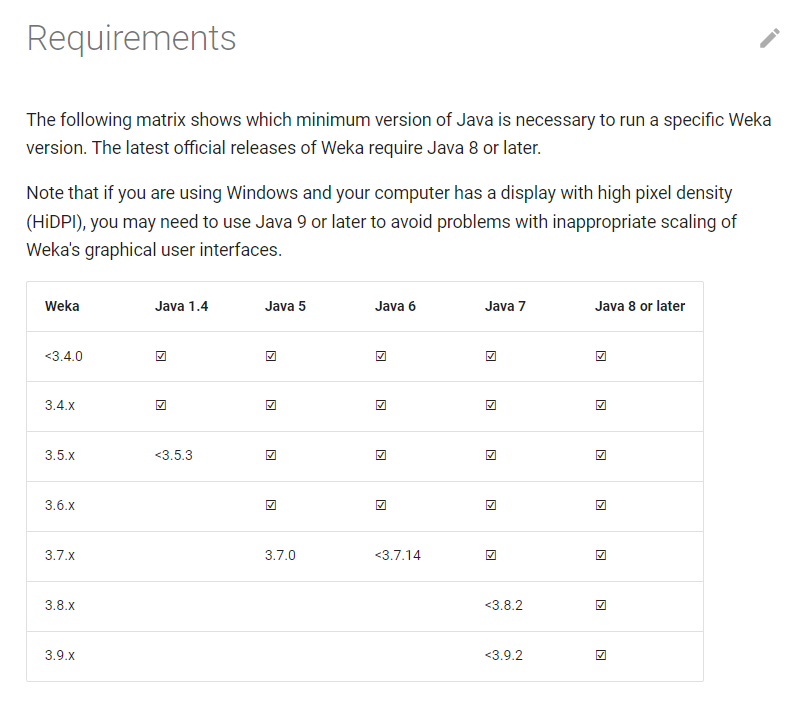
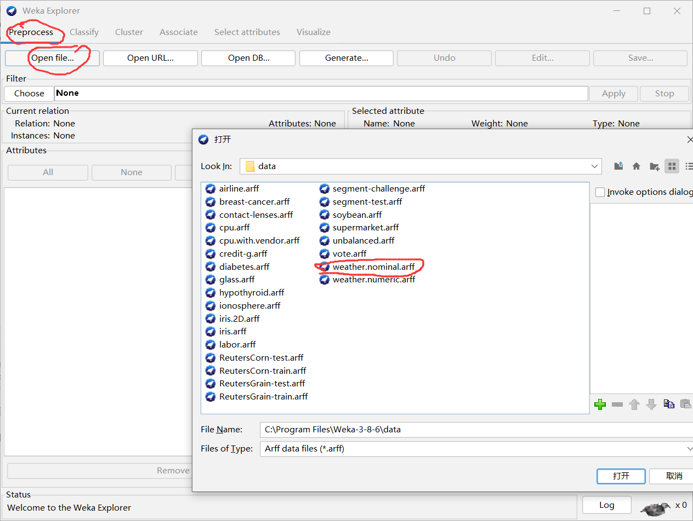
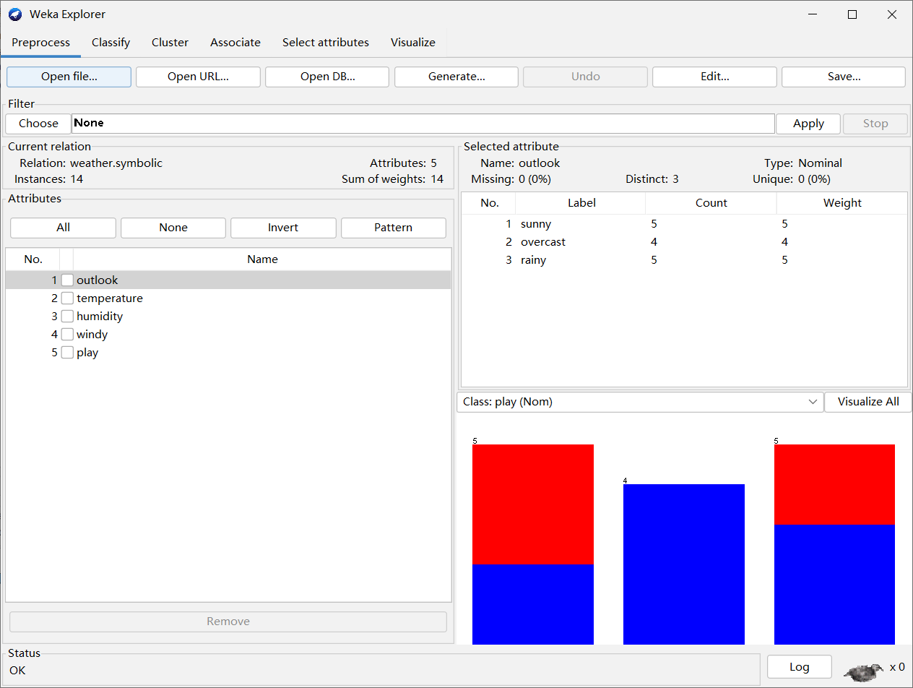
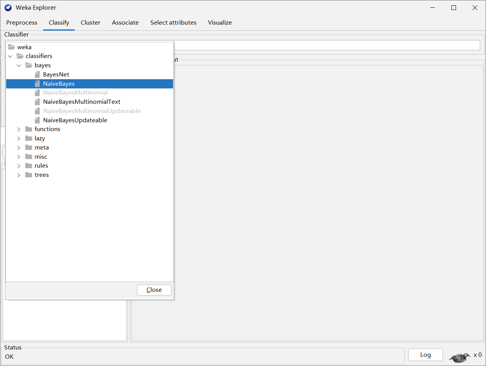
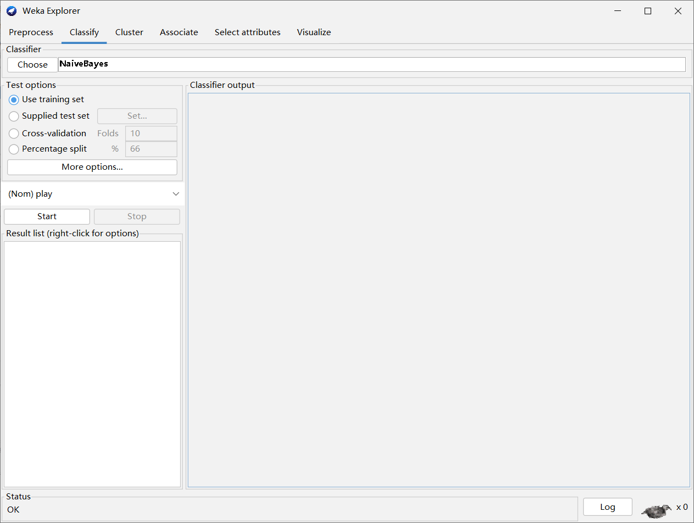
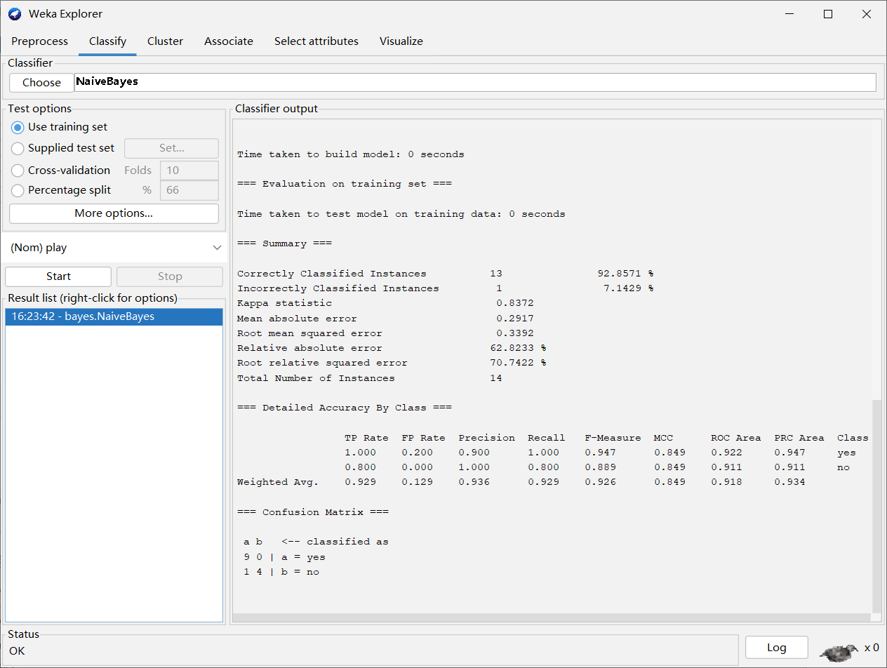
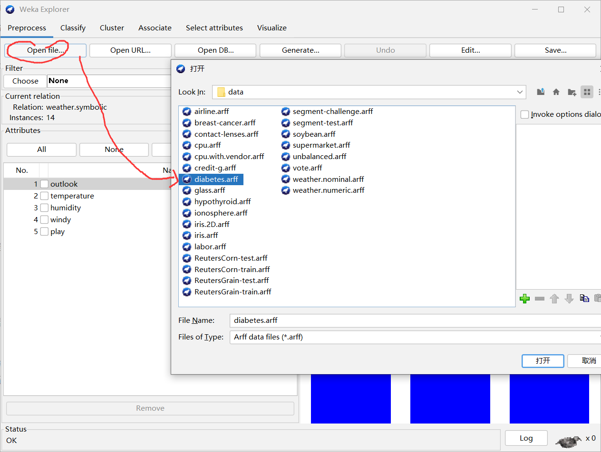
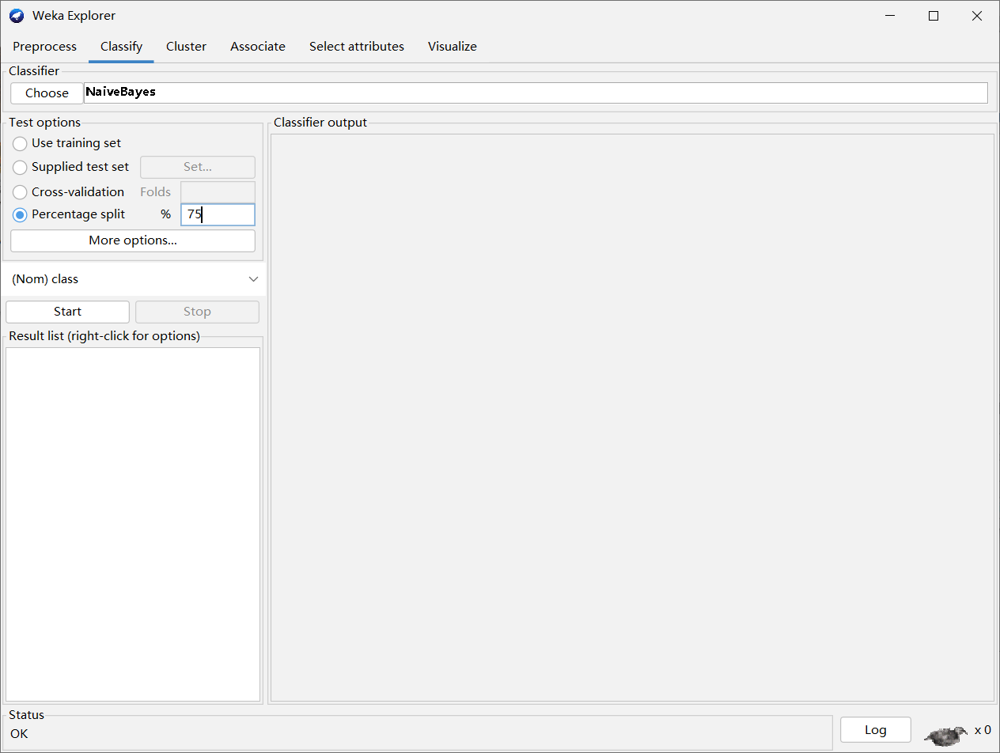
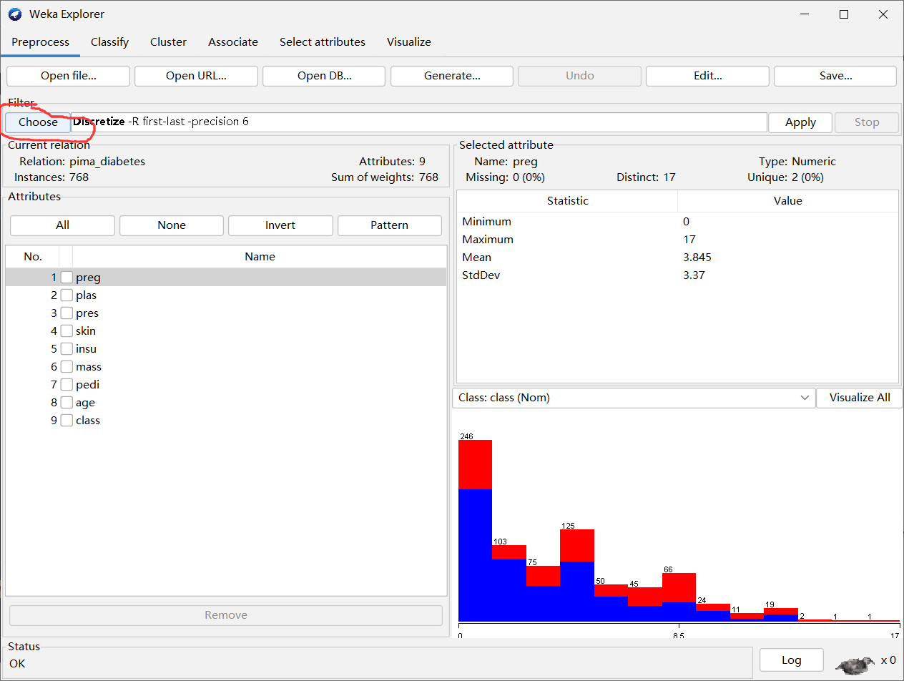
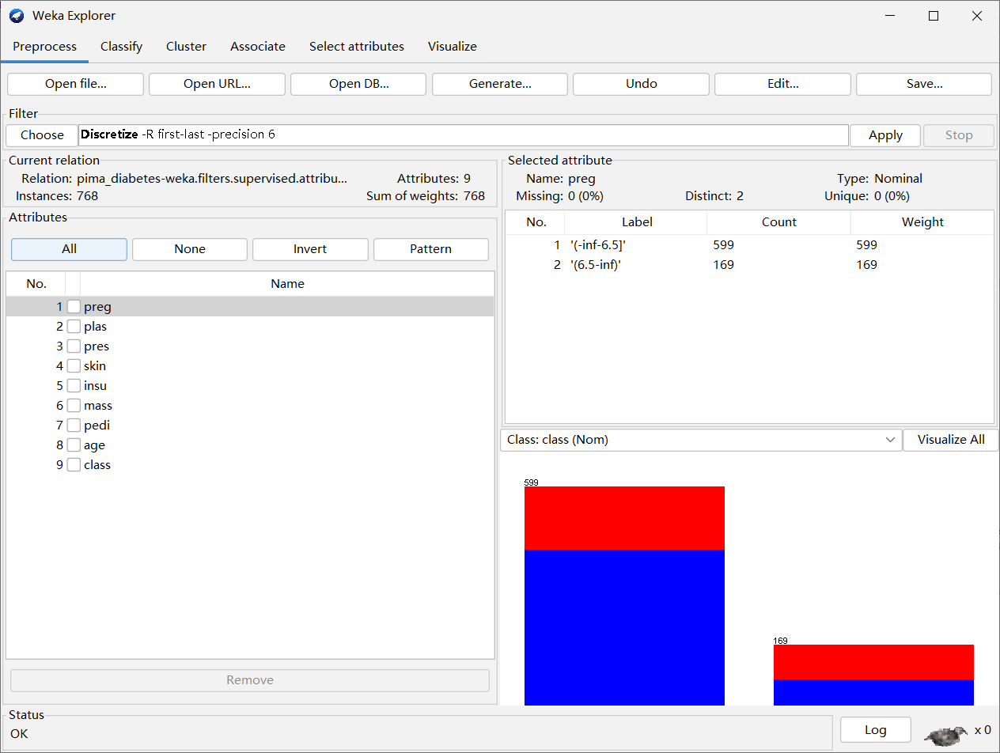

## Weka

### 什么是weka

Weka是一种开源的机器学习软件，它是由新西兰怀卡托大学开发的。Weka的名称来源于新西兰土著毛利人的一种鸟类，同样也是软件的缩写，代表"Waikato Environment for Knowledge Analysis"，意为怀卡托知识分析环境。

Weka提供了各种机器学习算法和数据挖掘工具，使用户能够进行数据预处理、分类、回归、聚类、关联规则挖掘等任务。它是一款功能强大且易于使用的工具，适合初学者和专业人士。

Weka的主要特点包括：
1. 用户友好：它提供了图形用户界面(GUI)，使用户可以轻松地进行数据建模和分析，同时也支持命令行接口。
2. 开源：Weka是开源软件，任何人都可以免费使用、修改和分发。
3. 扩展性：用户可以方便地编写自己的算法或添加插件来扩展软件的功能。
4. 大量的算法：Weka内置了许多经典和先进的机器学习算法，包括决策树、支持向量机、朴素贝叶斯、K近邻、神经网络等。
5. 数据可视化：Weka提供了数据可视化功能，使用户可以更好地理解和分析数据。

总的来说，Weka是一款功能丰富、易于使用的机器学习软件，为研究人员、数据科学家和机器学习爱好者提供了一个强大的工具，用于解决各种数据挖掘和机器学习问题。

### 下载和安装weka

官方网址：https://www.cs.waikato.ac.nz/ml/weka/

首先是需要的环境：



然后是下载：https://waikato.github.io/weka-wiki/downloading_weka/


一路默认安装就可以了。

## 第一个Weka程序

首先运行weka：


点击确定就可以了，然后点击explorer：


接着是了解数据所在的路径：

> C:\Program Files\Weka-3-8-6\data

导入数据：



得到如下所示的结果：



在classify中选择：



最终得到：



点击 start 可以得到：



output全部内容为：

```txt
=== Run information ===

Scheme:       weka.classifiers.bayes.NaiveBayes 
Relation:     weather.symbolic
Instances:    14
Attributes:   5
              outlook
              temperature
              humidity
              windy
              play
Test mode:    evaluate on training data

=== Classifier model (full training set) ===

Naive Bayes Classifier

                Class
Attribute         yes     no
               (0.63) (0.38)
=============================
outlook
  sunny            3.0    4.0
  overcast         5.0    1.0
  rainy            4.0    3.0
  [total]         12.0    8.0

temperature
  hot              3.0    3.0
  mild             5.0    3.0
  cool             4.0    2.0
  [total]         12.0    8.0

humidity
  high             4.0    5.0
  normal           7.0    2.0
  [total]         11.0    7.0

windy
  TRUE             4.0    4.0
  FALSE            7.0    3.0
  [total]         11.0    7.0


Time taken to build model: 0 seconds

=== Evaluation on training set ===

Time taken to test model on training data: 0 seconds

=== Summary ===

Correctly Classified Instances          13               92.8571 %
Incorrectly Classified Instances         1                7.1429 %
Kappa statistic                          0.8372
Mean absolute error                      0.2917
Root mean squared error                  0.3392
Relative absolute error                 62.8233 %
Root relative squared error             70.7422 %
Total Number of Instances               14     

=== Detailed Accuracy By Class ===

                 TP Rate  FP Rate  Precision  Recall   F-Measure  MCC      ROC Area  PRC Area  Class
                 1.000    0.200    0.900      1.000    0.947      0.849    0.922     0.947     yes
                 0.800    0.000    1.000      0.800    0.889      0.849    0.911     0.911     no
Weighted Avg.    0.929    0.129    0.936      0.929    0.926      0.849    0.918     0.934     

=== Confusion Matrix ===

 a b   <-- classified as
 9 0 | a = yes
 1 4 | b = no


```

对上述output结果的解读：

这个运行结果是基于Weka中朴素贝叶斯分类器（Naive Bayes Classifier）对一个名为"weather.symbolic"的数据集进行训练和测试得到的。数据集中共有14个实例（样本），每个实例有5个属性（特征）。

下面对运行结果进行解读：

1. Scheme信息：
   - 使用的分类器：朴素贝叶斯分类器（NaiveBayes）
   - 数据集关系：weather.symbolic
   - 实例数量：14
   - 属性数量：5
   - 测试模式：在训练数据上进行评估

2. 分类器模型：
   - 该部分显示了朴素贝叶斯分类器在训练集上的结果。它展示了每个属性值对应的"yes"（是）和"no"（否）的分类情况。

3. 评估结果：
   - 正确分类实例数：13，正确率为92.8571%
   - 错误分类实例数：1，错误率为7.1429%
   - Kappa统计量：0.8372（衡量分类器性能的一种指标，值越接近1表示性能越好）
   - 平均绝对误差：0.2917
   - 均方根误差：0.3392
   - 相对绝对误差：62.8233%（平均绝对误差相对于真实值的百分比）
   - 根相对平方误差：70.7422%（均方根误差相对于真实值的百分比）
   - 总实例数：14

4. 类别详细准确率：
   - 以每个类别（"yes"和"no"）为基础，给出了真阳性率、假阳性率、精确率、召回率和F1得分等指标。

5. 混淆矩阵：
   - 混淆矩阵展示了真实类别与预测类别之间的对应关系。在本例中，"yes"被正确分类为"yes"的有9个实例，"no"被正确分类为"no"的有4个实例，但是有1个"no"实例被错误分类为"yes"。

综上所述，朴素贝叶斯分类器在这个数据集上表现良好，正确率达到92.8571%，而且Kappa统计量较高，说明分类器的性能较好。然而，要注意这是在训练集上进行的评估，未来还需要在独立的测试集上进行评估，以确保分类器在未见过的数据上的泛化能力。

接着将数据复制到桌面，然后改名为：weather.nominal-02.arff

接着将数据的内容修改为：

```text
@relation weather.symbolic

@attribute outlook {sunny, overcast, rainy}
@attribute temperature {hot, mild, cool}
@attribute humidity {high, normal}
@attribute windy {TRUE, FALSE}
@attribute play {yes, no}

@data
sunny, cool, high, TRUE, no
```

接着将修改之后的数据导入：


点击start，得到结果：

```text
=== Run information ===

Scheme:       weka.classifiers.bayes.NaiveBayes 
Relation:     weather.symbolic
Instances:    14
Attributes:   5
              outlook
              temperature
              humidity
              windy
              play
Test mode:    user supplied test set:  size unknown (reading incrementally)

=== Classifier model (full training set) ===

Naive Bayes Classifier

                Class
Attribute         yes     no
               (0.63) (0.38)
=============================
outlook
  sunny            3.0    4.0
  overcast         5.0    1.0
  rainy            4.0    3.0
  [total]         12.0    8.0

temperature
  hot              3.0    3.0
  mild             5.0    3.0
  cool             4.0    2.0
  [total]         12.0    8.0

humidity
  high             4.0    5.0
  normal           7.0    2.0
  [total]         11.0    7.0

windy
  TRUE             4.0    4.0
  FALSE            7.0    3.0
  [total]         11.0    7.0


Time taken to build model: 0 seconds

=== Evaluation on test set ===

Time taken to test model on supplied test set: 0 seconds

=== Summary ===

Correctly Classified Instances           1              100      %
Incorrectly Classified Instances         0                0      %
Kappa statistic                          1     
Mean absolute error                      0.2647
Root mean squared error                  0.2647
Relative absolute error                 42.3498 %
Root relative squared error             42.3498 %
Total Number of Instances                1     

=== Detailed Accuracy By Class ===

                 TP Rate  FP Rate  Precision  Recall   F-Measure  MCC      ROC Area  PRC Area  Class
                 ?        0.000    ?          ?        ?          ?        ?         ?         yes
                 1.000    ?        1.000      1.000    1.000      ?        ?         1.000     no
Weighted Avg.    1.000    ?        1.000      1.000    1.000      ?        ?         1.000     

=== Confusion Matrix ===

 a b   <-- classified as
 0 0 | a = yes
 0 1 | b = no


```

运行结果显示了朴素贝叶斯分类器在一个测试集上的评估结果。这里测试集只包含一个实例（样本），具体信息如下：

1. Scheme信息：
   - 使用的分类器：朴素贝叶斯分类器（NaiveBayes）
   - 数据集关系：weather.symbolic
   - 实例数量：14
   - 属性数量：5
   - 测试模式：使用用户提供的测试集进行评估，但并未显示测试集的大小（size unknown）。

2. 分类器模型：
   - 该部分和之前的结果相同，显示了朴素贝叶斯分类器在训练集上的分类结果。

3. 评估结果：
   - 正确分类实例数：1，正确率为100%
   - 错误分类实例数：0，错误率为0%
   - Kappa统计量：1（这是极好的Kappa值，意味着预测结果与实际结果完全一致）
   - 平均绝对误差：0.2647
   - 均方根误差：0.2647
   - 相对绝对误差：42.3498%（平均绝对误差相对于真实值的百分比）
   - 根相对平方误差：42.3498%（均方根误差相对于真实值的百分比）
   - 总实例数：1

4. 类别详细准确率：
   - 对于"yes"类别，由于测试集只有一个实例，无法给出具体的真阳性率、假阳性率、精确率、召回率和F1得分等指标。因此，显示为"?"。但因为该实例被正确分类为"yes"，所以准确率为100%。
   - 对于"no"类别，同样由于测试集只有一个实例，无法给出具体的统计信息，但该实例也被正确分类为"no"，准确率为100%。

5. 混淆矩阵：
   - 由于测试集只有一个实例，无法生成混淆矩阵。

综上所述，朴素贝叶斯分类器在这个测试集上表现非常好，将测试集中的实例100%地正确分类为"yes"类别。由于测试集只有一个实例，因此无法提供其他详细准确率和混淆矩阵等信息。

**离散化对朴素贝叶斯模型的提升**

接着使用另一个数据集：



classifier还是Naive Bayes，然后将percentage split设置为75%，也就是75%的数据作为训练数据集，25%的数据集设置为测试数据集：



接着按 start，得到结果为：

```text
=== Run information ===

Scheme:       weka.classifiers.bayes.NaiveBayes 
Relation:     pima_diabetes
Instances:    768
Attributes:   9
              preg
              plas
              pres
              skin
              insu
              mass
              pedi
              age
              class
Test mode:    split 75.0% train, remainder test

=== Classifier model (full training set) ===

Naive Bayes Classifier

                         Class
Attribute      tested_negative tested_positive
                        (0.65)          (0.35)
===============================================
preg
  mean                   3.4234          4.9795
  std. dev.              3.0166          3.6827
  weight sum                500             268
  precision              1.0625          1.0625

plas
  mean                 109.9541        141.2581
  std. dev.             26.1114         31.8728
  weight sum                500             268
  precision              1.4741          1.4741

pres
  mean                  68.1397          70.718
  std. dev.             17.9834         21.4094
  weight sum                500             268
  precision              2.6522          2.6522

skin
  mean                  19.8356         22.2824
  std. dev.             14.8974         17.6992
  weight sum                500             268
  precision                1.98            1.98

insu
  mean                  68.8507        100.2812
  std. dev.              98.828        138.4883
  weight sum                500             268
  precision               4.573           4.573

mass
  mean                  30.3009         35.1475
  std. dev.              7.6833          7.2537
  weight sum                500             268
  precision              0.2717          0.2717

pedi
  mean                   0.4297          0.5504
  std. dev.              0.2986          0.3715
  weight sum                500             268
  precision              0.0045          0.0045

age
  mean                  31.2494         37.0808
  std. dev.             11.6059         10.9146
  weight sum                500             268
  precision              1.1765          1.1765


Time taken to build model: 0.01 seconds

=== Evaluation on test split ===

Time taken to test model on test split: 0.01 seconds

=== Summary ===

Correctly Classified Instances         150               78.125  %
Incorrectly Classified Instances        42               21.875  %
Kappa statistic                          0.4998
Mean absolute error                      0.2642
Root mean squared error                  0.3848
Relative absolute error                 58.7363 %
Root relative squared error             82.0682 %
Total Number of Instances              192     

=== Detailed Accuracy By Class ===

                 TP Rate  FP Rate  Precision  Recall   F-Measure  MCC      ROC Area  PRC Area  Class
                 0.838    0.339    0.838      0.838    0.838      0.500    0.850     0.911     tested_negative
                 0.661    0.162    0.661      0.661    0.661      0.500    0.850     0.772     tested_positive
Weighted Avg.    0.781    0.281    0.781      0.781    0.781      0.500    0.850     0.866     

=== Confusion Matrix ===

   a   b   <-- classified as
 109  21 |   a = tested_negative
  21  41 |   b = tested_positive


```

这个运行结果是基于朴素贝叶斯分类器（NaiveBayes）对一个名为"pima_diabetes"的数据集进行训练和测试得到的。数据集包含768个实例（样本），每个实例有9个属性（特征）。

下面对运行结果进行解读：

1. Scheme信息：
   - 使用的分类器：朴素贝叶斯分类器（NaiveBayes）
   - 数据集关系：pima_diabetes
   - 实例数量：768
   - 属性数量：9
   - 测试模式：采用75.0%的数据作为训练集，其余作为测试集。

2. 分类器模型：
   - 该部分展示了朴素贝叶斯分类器在训练集上对每个属性在各个类别（tested_negative和tested_positive）上的统计信息，包括均值、标准差、样本数和精度。

3. 评估结果：
   - 正确分类实例数：150，正确率为78.125%
   - 错误分类实例数：42，错误率为21.875%
   - Kappa统计量：0.4998（0表示随机分类，1表示完全一致分类）
   - 平均绝对误差：0.2642
   - 均方根误差：0.3848
   - 相对绝对误差：58.7363%（平均绝对误差相对于真实值的百分比）
   - 根相对平方误差：82.0682%（均方根误差相对于真实值的百分比）
   - 总实例数：192

4. 类别详细准确率：
   - 对于"tested_negative"类别，真阳性率（召回率）为0.838，假阳性率为0.339，精确率为0.838。
   - 对于"tested_positive"类别，真阳性率（召回率）为0.661，假阳性率为0.162，精确率为0.661。
   - 加权平均（Weighted Avg.）的指标是综合两个类别的准确率得出的。

5. 混淆矩阵：
   - 混淆矩阵展示了真实类别与预测类别之间的对应关系。在本例中，共有192个测试集实例。
   - 对于"tested_negative"类别，其中109个实例被正确分类为"tested_negative"，21个实例被错误分类为"tested_positive"。
   - 对于"tested_positive"类别，其中41个实例被正确分类为"tested_positive"，21个实例被错误分类为"tested_negative"。

综上所述，朴素贝叶斯分类器在这个数据集上表现一般，正确率为78.125%，Kappa统计量为0.4998。需要进一步优化算法或者尝试其他的分类器来提高分类性能。

在混淆矩阵中，我们可以找到真阴性（True Negative，TN）、假阳性（False Positive，FP）、假阴性（False Negative，FN）、真阳性（True Positive，TP）的值。

混淆矩阵如下：

```
   a   b   <-- classified as
 109  21 |   a = tested_negative
  21  41 |   b = tested_positive
```

其中，
- a表示实际为"tested_negative"类别的样本数量（即负样本），
- b表示实际为"tested_positive"类别的样本数量（即正样本）。

现在我们可以计算TN、FP、FN和TP：
- TN：实际为"tested_negative"且被正确分类为"tested_negative"的样本数量。
- FP：实际为"tested_negative"但被错误分类为"tested_positive"的样本数量。
- FN：实际为"tested_positive"但被错误分类为"tested_negative"的样本数量。
- TP：实际为"tested_positive"且被正确分类为"tested_positive"的样本数量。

根据混淆矩阵中的值，我们可以得到：

- TN = 109
- FP = 21
- FN = 21
- TP = 41

下面是表格展示结果：

|                       | 实际"tested_negative" | 实际"tested_positive" |
| --------------------- | --------------------- | --------------------- |
| 预测"tested_negative" | TN = 109              | FP = 21               |
| 预测"tested_positive" | FN = 21               | TP = 41               |

请注意，混淆矩阵中的行表示真实类别，列表示预测类别。通过计算TN、FP、FN和TP，我们可以更好地评估分类器的性能。

**Filter**

接着提供一个filter：



然后点击apply：



运行得到结果为：

```text
=== Run information ===

Scheme:       weka.classifiers.bayes.NaiveBayes 
Relation:     pima_diabetes-weka.filters.supervised.attribute.Discretize-Rfirst-last-precision6
Instances:    768
Attributes:   9
              preg
              plas
              pres
              skin
              insu
              mass
              pedi
              age
              class
Test mode:    split 75.0% train, remainder test

=== Classifier model (full training set) ===

Naive Bayes Classifier

                              Class
Attribute           tested_negative tested_positive
                             (0.65)          (0.35)
====================================================
preg
  '(-inf-6.5]'                 427.0           174.0
  '(6.5-inf)'                   75.0            96.0
  [total]                      502.0           270.0

plas
  '(-inf-99.5]'                182.0            17.0
  '(99.5-127.5]'               211.0            79.0
  '(127.5-154.5]'               86.0            77.0
  '(154.5-inf)'                 25.0            99.0
  [total]                      504.0           272.0

pres
  'All'                        501.0           269.0
  [total]                      501.0           269.0

skin
  'All'                        501.0           269.0
  [total]                      501.0           269.0

insu
  '(-inf-14.5]'                237.0           140.0
  '(14.5-121]'                 165.0            28.0
  '(121-inf)'                  101.0           103.0
  [total]                      503.0           271.0

mass
  '(-inf-27.85]'               196.0            28.0
  '(27.85-inf)'                306.0           242.0
  [total]                      502.0           270.0

pedi
  '(-inf-0.5275]'              362.0           149.0
  '(0.5275-inf)'               140.0           121.0
  [total]                      502.0           270.0

age
  '(-inf-28.5]'                297.0            72.0
  '(28.5-inf)'                 205.0           198.0
  [total]                      502.0           270.0


Time taken to build model: 0 seconds

=== Evaluation on test split ===

Time taken to test model on test split: 0 seconds

=== Summary ===

Correctly Classified Instances         165               85.9375 %
Incorrectly Classified Instances        27               14.0625 %
Kappa statistic                          0.677 
Mean absolute error                      0.2334
Root mean squared error                  0.3339
Relative absolute error                 51.9021 %
Root relative squared error             71.2158 %
Total Number of Instances              192     

=== Detailed Accuracy By Class ===

                 TP Rate  FP Rate  Precision  Recall   F-Measure  MCC      ROC Area  PRC Area  Class
                 0.900    0.226    0.893      0.900    0.897      0.677    0.904     0.946     tested_negative
                 0.774    0.100    0.787      0.774    0.780      0.677    0.904     0.833     tested_positive
Weighted Avg.    0.859    0.185    0.859      0.859    0.859      0.677    0.904     0.909     

=== Confusion Matrix ===

   a   b   <-- classified as
 117  13 |   a = tested_negative
  14  48 |   b = tested_positive


```

这个运行结果是基于朴素贝叶斯分类器（NaiveBayes）对一个名为"pima_diabetes"的数据集进行训练和测试得到的。数据集包含768个实例（样本），每个实例有9个属性（特征）。

下面对运行结果进行解读：

1. Scheme信息：
   - 使用的分类器：朴素贝叶斯分类器（NaiveBayes）
   - 数据集关系：pima_diabetes-weka.filters.supervised.attribute.Discretize-Rfirst-last-precision6
   - 实例数量：768
   - 属性数量：9
   - 测试模式：采用75.0%的数据作为训练集，其余作为测试集。

2. 分类器模型：
   - 该部分展示了朴素贝叶斯分类器在训练集上对每个属性进行离散化后，对各个离散化区间在各个类别（tested_negative和tested_positive）上的统计信息，包括样本数和精度。

3. 评估结果：
   - 正确分类实例数：165，正确率为85.9375%
   - 错误分类实例数：27，错误率为14.0625%
   - Kappa统计量：0.677（0表示随机分类，1表示完全一致分类）
   - 平均绝对误差：0.2334
   - 均方根误差：0.3339
   - 相对绝对误差：51.9021%（平均绝对误差相对于真实值的百分比）
   - 根相对平方误差：71.2158%（均方根误差相对于真实值的百分比）
   - 总实例数：192

4. 类别详细准确率：
   - 对于"tested_negative"类别，真阳性率（召回率）为0.900，假阳性率为0.226，精确率为0.893。
   - 对于"tested_positive"类别，真阳性率（召回率）为0.774，假阳性率为0.100，精确率为0.787。
   - 加权平均（Weighted Avg.）的指标是综合两个类别的准确率得出的。

5. 混淆矩阵：
   - 混淆矩阵展示了真实类别与预测类别之间的对应关系。在本例中，共有192个测试集实例。
   - 对于"tested_negative"类别，其中117个实例被正确分类为"tested_negative"，13个实例被错误分类为"tested_positive"。
   - 对于"tested_positive"类别，其中48个实例被正确分类为"tested_positive"，14个实例被错误分类为"tested_negative"。

综上所述，朴素贝叶斯分类器在这个数据集上表现较好，正确率为85.9375%，Kappa统计量为0.677。需要进一步优化离散化过程或者尝试其他的分类器来提高分类性能。

根据混淆矩阵，我们可以计算真阴性（True Negative，TN）、假阳性（False Positive，FP）、假阴性（False Negative，FN）、真阳性（True Positive，TP）的值。

混淆矩阵如下：

```
   a   b   <-- classified as
 117  13 |   a = tested_negative
  14  48 |   b = tested_positive
```

其中，
- a表示实际为"tested_negative"类别的样本数量（即负样本），
- b表示实际为"tested_positive"类别的样本数量（即正样本）。

现在我们可以计算TN、FP、FN和TP：
- TN：实际为"tested_negative"且被正确分类为"tested_negative"的样本数量。
- FP：实际为"tested_negative"但被错误分类为"tested_positive"的样本数量。
- FN：实际为"tested_positive"但被错误分类为"tested_negative"的样本数量。
- TP：实际为"tested_positive"且被正确分类为"tested_positive"的样本数量。

根据混淆矩阵中的值，我们可以得到：

- TN = 117
- FP = 13
- FN = 14
- TP = 48

下面是表格展示结果：

|                       | 实际"tested_negative" | 实际"tested_positive" |
| --------------------- | --------------------- | --------------------- |
| 预测"tested_negative" | TN = 117              | FP = 13               |
| 预测"tested_positive" | FN = 14               | TP = 48               |

请注意，混淆矩阵中的行表示真实类别，列表示预测类别。通过计算TN、FP、FN和TP，我们可以更好地评估分类器的性能。

**比较**

通过比较这两个结果，我们可以看出将 filter 设置为 discretize 之后的结果相较于原先的结果，模型在测试集上的性能有所提升。现在我们来解释一下为什么将 filter 设置为 discretize 会带来这个影响：

1. 数据转换：将连续特征进行离散化后，使得原本连续的数值特征被转换为一系列离散的区间或类别。这样做的好处是，朴素贝叶斯分类器对于处理离散的特征更加高效和适用，因为朴素贝叶斯算法是基于概率的分类器，而概率的计算对于离散特征更简单。

2. 解决连续特征的问题：原先的数据集中包含连续特征，朴素贝叶斯分类器在处理连续特征时可能受到数据分布的影响，特别是当数据分布不符合朴素贝叶斯假设（特征之间相互独立）时。将连续特征离散化后，能够一定程度上解决这个问题，使得模型对连续特征的处理更加稳定和有效。

3. 数据稀疏性：在原先的结果中，朴素贝叶斯分类器在处理连续特征时可能由于数据稀疏性导致预测性能下降。而通过离散化，可以使得每个区间都有样本数据，减轻了数据稀疏性的影响，提高了模型的泛化能力。

4. 去除异常值影响：离散化过程中，可以将异常值归入相应的区间，避免了异常值对模型的影响。

5. 捕捉非线性关系：在某些情况下，离散化能够更好地捕捉特征与目标变量之间的非线性关系，使得模型更准确。

总的来说，将 filter 设置为 discretize 的效果表现在了对连续特征的处理和模型性能的提升上。然而，离散化也可能带来一定的信息损失，需要根据具体的数据集和问题来进行调试和优化，以获得更好的模型性能。