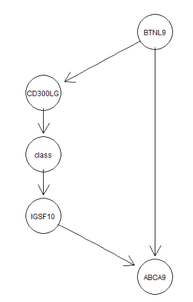

# Data Import And Preliminary Analysis

Import data set and check whether successful or not:

```{r}
# import data set
data <- read.csv("BRCA_RNASeqv2_top50.csv")
```

Then confirm the distribution of missing values and process them if they exist:

```{r}
# View the number of missing values in each column
missing_values_per_column <- sapply(data, function(x) sum(is.na(x)))

# Output the number of missing values in each column
missing_values_per_column
```

Judging from the output results, there are no missing values in the data set, but here we need to consider the expression of missing values other than NA:

```{r}
# Custom function to identify missing values
is_missing <- function(x) {
  return(is.na(x) | 
         x == "None" | 
         is.nan(x) | 
         x == "" | 
         x == "N/A" | 
         x == "-" | 
         x == "Null")
}

# View the number of missing values in each column
missing_values_per_column <- sapply(data, function(x) sum(is_missing(x)))

# Output the number of missing values in each column
missing_values_per_column
```

Judging from the output results, there are indeed no missing values expressed in any form in the data set, so there is no need to process missing values and the data set can be used directly.

```{r}
summary(data)
```

The above output gives the statistical results for each variable. It is not difficult to see that the values of these variables are continuous values rather than discrete values, which will affect the parameter selection during subsequent modeling.

# Using Causal Structure Learning Algorithm To Find The Gene Regulatory Network

Causal structure learning seeks to infer the causal relationships between variables based on observational data. Instead of just determining associations, it aims to discern the directionality of these associations, which is fundamental in fields like medicine, economics, and social sciences where understanding causality can lead to effective interventions 

The PC algorithm, attributed to Peter Spirtes and Clark Glymour, stands as a cornerstone in the domain of causal structure learning. Initially conceptualized to decipher the causal relationships amidst a set of variables, it functions by leveraging statistical independence tests.

The PC algorithm initiates its process with a graph that is inherently undirected and fully connected. The primary objective during its early phase is the systematic removal of edges. This elimination is predicated upon the discernment of conditional independencies among the variables under consideration. Specifically, when two distinct variables exhibit conditional independence contingent upon a subset of other variables, the edge that interlinks them is expunged [1]. Upon the delineation of this skeletal structure, the algorithm subsequently ventures into the intricate task of determining the orientation of the residual edges. This determination is effectuated through the application of a compendium of rules, all of which are anchored in the observed conditional independencies. Illustratively, within a triadic structure such as A-B-C, if variable A manifests independence from variable C when conditioned on B, and simultaneously, B is not identified as a collider (a distinct nodal point where two directed edges intersect), the edge juxtaposing B and C is oriented as B->C [1].

A pivotal assumption underpinning the PC algorithm is the "faithfulness condition". This posits that all observed statistical independencies in the dataset correspond unerringly to independencies within the true underlying causal structure, and vice-versa [1].

Understanding and interpreting the outcome of the PC algorithm mandates caution. While it proffers vital insights into potential causal relationships, it doesn't serve as a definitive proof of causality, especially since the algorithm's conclusions are contingent upon its foundational assumptions and the quality of the data at hand.

First, remove variables of type class from the data set.

```{r}
data_no_class <- data[, !names(data) %in% "class"]
```


The class variable as the target has been removed from the data set. Now only features are left in the data set. Then the pc algorithm is used for modeling, and the potential causal relationship between variables can be observed in the data.

```{r}
library(pcalg)

# Calculate correlation matrix
cor_matrix <- cor(data_no_class)

# Estimating structure using PC algorithm
suffStat <- list(C = cor_matrix, n = nrow(data_no_class))
pc_result <- pc(suffStat, indepTest = gaussCItest, alpha = 0.05,
                labels = colnames(data_no_class))
```

The `pcalg` package is employed to discern potential causal relationships among variables in the `data_no_class` dataset using the PC algorithm. Initially, the Pearson correlation matrix of the dataset is computed with the `cor` function. To execute the PC algorithm, a requisite sufficiency statistic, comprising this correlation matrix and the total number of observations, is prepared. The `pc` function, subsequently invoked, leverages the `gaussCItest` for conditional independence tests at a significance level of \( \alpha = 0.05 \) and utilizes dataset column names as node labels in the resultant graph. The outcome is a partially directed acyclic graph representing inferred causal dependencies among the dataset's variables.

```{R}
# output the trained model
pc_result
```
The output is an overview of the pc function in the pcalg package applied to the data_no_class data set. The output shows that based on the execution of the PC algorithm, the resulting partially directed acyclic graph (PDAG) has 1 undirected edge (that is, the direction of the relationship between the two variables has not yet been determined), and 110 directed edges. edges (i.e., the direction of the relationship between two variables is specified), so there are 111 edges in total. These edges represent potential causal relationships or correlations between variables in the dataset.

For more intuitive observation, a visualization of the results is provided.

```{r Gene Regulatory Network, echo = FALSE, fig.cap="Gene Regulatory Network", message=FALSE}
library(qgraph)
qgraph(pc_result@graph,  title = "Gene Regulatory Network")
```

For Figure 1, it can be inferred that the `pc_result` largely embodies the characteristics of a directed acyclic graph. However, an ambiguity in directional precedence between the variables MYCM1 and ATP1A2 introduces a loop, indicating an indeterminacy in their interrelationship.

# Find The Top 10 Other Genes That Have Strong Causal Effects On EBF1

The primary objective of causal learning is to discern the entire causal structure or causal graph from data. In contrast, causal inference aims to estimate specific causal effects, given an established causal framework. The PC algorithm primarily functions as a causal learning tool, its principal goal being the elucidation of the causal architecture within the data.

Having previously ascertained this structure via the algorithm, one can now, based on the trained pc_result, extract the top 10 genes that exert substantial causal effects on EBF1.

First convert pc_result from the causal relationship structure to an adjacency matrix.

```{r}
adjMatrix <- as(pc_result, "amat")
```

Then find the position of EBF1 in the data and find the genes directly connected to EBF1.

```{r}
ebf1_index <- which(colnames(data_no_class) == "EBF1")
ebf1_neighbors <- which(adjMatrix[ebf1_index, ] != 0)
```

The absolute value of the causal relationship between these genes and EBF1 is then calculated.

```{r}
causal_effects <- abs(cor(data_no_class)[ebf1_neighbors, "EBF1"])
```

The correlation coefficient matrix cor(data_no_class) is used here to estimate the causal effect between each gene and EBF1, and its absolute value is taken.

Finally, obtain the gene name corresponding to each causal effect, merge the gene name and the corresponding causal effect into a data frame, then sort the causal effects and obtain the top 10, and then print the results.

```{r}
# Get the gene name of the causal effect
genes_with_effects <- rownames(cor(data_no_class)[ebf1_neighbors, ])

# Merge gene names and their corresponding effects into a data frame
effects_df <- data.frame(Genes = genes_with_effects, Effects = causal_effects)

# Rank causal effects and get the top 10
top_genes <- head(effects_df[order(-effects_df$Effects),], 10)

# print result
top_genes
```

Judging from the output results, the number of genes that "have strong causal effects on EBF1" is only 6. Although these 6 genes have high values, they do not meet the demand in terms of quantity.

Therefore, in addition to considering directly connected genes, a second degree of connectivity needs to be considered, i.e., considering genes that are two edges away (i.e., genes that are connected to the genes which are directly connected to EBF1).

The first is to calculate directly connected genes.

```{r}
# Extract the adjacency matrix
adj_matrix <- as(pc_result, "amat")

# Find directly connected genes to EBF1
direct_genes <- which(adj_matrix["EBF1",] == 1)

# Find the names of these genes
direct_gene_names <- colnames(adj_matrix)[direct_genes]

direct_gene_names
```
Judging from the output, this will produce the same results as direct processing.

The next additional calculation that needs to be done is to find second_degree_genes.

First, an empty vector is created to store other genes connected to the direct gene, that is, secondary genes.

```{r}
second_degree_genes <- vector()
```


Then find the secondary genes connected to the direct genes.

```{r}
for (gene in direct_gene_names) {
  tmp_genes <- which(adj_matrix[gene,] == 1)
  tmp_gene_names <- setdiff(colnames(adj_matrix)[tmp_genes], c(direct_gene_names, "EBF1"))
  second_degree_genes <- unique(c(second_degree_genes, tmp_gene_names))
}
```

For each gene directly linked to EBF1, the loop finds all genes linked to it and ensures that these do not include known direct genes or EBF1 itself.

Then merge direct genes and secondary genes.

```{r}
all_candidate_genes <- c(direct_gene_names, second_degree_genes)
```

Finally, for each candidate gene (direct or secondary gene), use the sapply function to calculate its correlation with EBF1 and take its absolute value, sort the correlations and extract the top 10 genes.

```{r}
correlations <- sapply(all_candidate_genes, function(gene) {
  abs(cor(data_no_class[, gene], data_no_class[, "EBF1"]))
})

ranked_genes <- names(sort(correlations, decreasing = TRUE))

# Take the top 10 genes
top_10_genes <- ranked_genes[1:10]

print(top_10_genes)
```
From the output results, it can be found that in addition to the 6 genes with direct connections, 4 genes with a second degree of connectivity were found.

Check how strongly the 10 selected genes are related to EBF1.

```{R}
selected_genes <- c("NPR1", "KCNIP2", "CD300LG", "RDH5", 
                    "CIDEC", "GPR146", "BTNL9", "SDPR", "GPAM", "ITIH5")

# Calculate correlation with EBF1
correlations <- sapply(selected_genes, function(gene) {
  cor(data_no_class[, gene], data_no_class[, "EBF1"])
})

# Create a data frame to display the results
correlation_df <- data.frame(Gene = selected_genes, Correlation_with_EBF1 = correlations)

correlation_df
```

This result shows the correlation between 10 selected genes and the EBF1 gene. The value of correlation ranges from -1 to 1, where 1 means a perfect positive correlation, -1 means a perfect negative correlation, and 0 means no linear correlation.

From the results, the following observations can be seen: all these genes show a high positive correlation with EBF1. The correlation between NPR1 and EBF1 is the highest, about 0.919. This means that when the expression of NPR1 increases, the expression of EBF1 is likely to increase as well, and vice versa. The correlation between ITIH5 and EBF1 is the lowest among these 10 genes, but it is still relatively high, about 0.873. 

The correlation values of all genes ranged from 0.87 to 0.92, indicating a strong linear relationship between the expression patterns of these genes and EBF1.

This observation is grounded in correlation and cannot be directly inferred as causation. Nevertheless, when one takes into account the application of the PC algorithm for the construction of a causal network and the subsequent selection of genes most closely associated with EBF1 based on this network, it indeed provides a foundational basis for causal analysis.

# Find Genes In The Markov Blanket Of ABCA9 From Data

IAMB (Incremental Association Markov Blanket) is a Bayesian network structure learning algorithm. This algorithm aims to discover the Markov blanket for each node, which is the set of all nodes related to a given node, conditional on all other nodes. The IAMB algorithm incrementally adds or removes candidate parent nodes to determine the optimal Markov blanket for a node.

The IAMB (Incremental Association Markov Blanket) algorithm operates as follows: Initially, it initializes an empty Markov blanket for each node in the Bayesian network. Subsequently, the algorithm iteratively refines the Markov blanket for a target node. During the incremental addition of parent nodes, it evaluates the conditional independence of the target node with other nodes, selecting a candidate parent node that exhibits the highest conditional independence and incorporating it into the Markov blanket. Following each addition, the algorithm re-evaluates conditional independence, considering the possibility of further parent node additions. Concurrently, in the incremental removal of parent nodes, the algorithm assesses the conditional independence between the target node and its existing parent nodes. If removing a parent node does not diminish the conditional independence, it is removed from the Markov blanket. This addition and removal process is repeated iteratively until no more parent nodes can be added or removed, resulting in the determination of the optimal Markov blanket for the target node. In this manner, the IAMB algorithm efficiently constructs a compact Bayesian network structure by balancing conditional independence relationships[2].

The core idea of the IAMB algorithm is to determine the parent nodes of a node by calculating conditional independence, aiming to minimize the size of the Markov blanket while preserving conditional independence relationships, thus facilitating the construction of a concise Bayesian network structure for efficient probabilistic inference.

```{r, message=FALSE}
library(bnlearn)
nvar <- ncol(data_no_class)
#learn the markov blanket
MB.ABCA9=learn.mb(data_no_class, "ABCA9", method="iamb", alpha=0.01)
MB.ABCA9
```

The above output results are determined to be markov blankets belonging to ABCA9, ABCA9 is related or potentially interacts with these genes in biological processes.

# Discretization Of Data

Discretize the dataset into a binary format using the mean expression level of all genes as the delineation threshold.

```{r}
# Calculate the mean of each column
column_means <- colMeans(data_no_class)

# Calculate global mean
global_mean <- mean(column_means)

# Print the mean of each column
print(global_mean)
```

Then proceed to discretization.

```{r}
# Binarization using global mean as threshold
binary_data <- data_no_class > global_mean

# Convert TRUE to 1 and FALSE to 0
binary_data <- ifelse(binary_data, 1, 0)
```

# Naive Bayes Model For All Genes and Selected Genes

To make predictions, create a new data frame including binary_data and class columns.

```{r}
combined_data <- cbind(binary_data, class = 
                         ifelse(data$class == "C", 1, 0))
```

The PC-simple algorithm, often called pcSelect, is a constraint-based causal structure learning algorithm. It is a simplified version of the original PC (Peter-Clark) algorithm. The PC algorithm aims to start from an undirected graph and progressively remove edges until certain conditions are met to obtain a directed acyclic graph (DAG).

First, pcSelect uses a complete graph (with edges between every pair of nodes) as a starting point. Then, it checks the conditional independence between each pair of nodes. Delete the edge between two variables if they are conditionally independent given some other variables. Finally, it orients certain edges in the undirected graph, resulting in a DAG. This is done by considering the nodes' neighbors on the remaining edges.

Unlike the standard PC algorithm, pcSelect does not increase the size of the condition set, which makes the algorithm faster, but potentially also less accurate.

```{R}
pcS <- pcSelect(combined_data[,"class"], binary_data, alpha=0.05)
pcS
```

In the output derived from the `pcSelect` algorithm, the `$G` component enumerates each feature or variable with a corresponding boolean value. A value of `TRUE` designates the selection of that particular feature, suggesting its significance in the model, while a `FALSE` value indicates its exclusion. Conversely, the `$zMin` component provides a numerical vector, representing the statistical scores or importance measures for each feature. For instance, a value of `11.84933190` for the feature `FIGF` suggests a potent association with the response variable, hence its inclusion in the model.

```{r}
selected_vars <- names(pcS$G)[pcS$G == TRUE]
selected_vars
```

The Naive Bayes algorithm is a classification algorithm based on Bayes' theorem and feature independence assumption [3]. It is often used for text classification, spam filtering, and other classification tasks.

The basis of the Naive Bayes classifier is Bayes' theorem, which has the form: \[ P(A|B) = \frac{P(B|A)P(A)}{P(B)} \]

In text classification, A may represent a specific category, while B represents a given text or a specific word [4]. The core idea of the algorithm is to calculate the probability that the text belongs to each category given a text (or feature), and then select the category with the maximum probability.

To calculate these probabilities, the following formula is used: \[ P(C_k|x) = \frac{P(x|C_k)P(C_k)}{P(x)} \]

Among them, \(C_k\) is the k-th category, and x is a feature vector. Due to the feature independence assumption, \(P(x|C_k)\) can be split into the product of the probabilities of individual features [3]: \[ P(x_1, x_2, ..., x_n|C_k) = \prod_ {i=1}^{n} P(x_i|C_k) \]

First, calculate the prior probability \(P(C_k)\) for each category. Next, for a given text or feature, the likelihood \(P(x|C_k)\) for each category is calculated. Then, calculate the posterior probability \(P(C_k|x)\) for each category given the features. Finally, the category corresponding to the largest posterior probability is selected as the prediction result [4].

Since only 112 samples are of normal cases in the data set and the remaining 1100 samples are cancer patients, in order to avoid not including normal cases when creating the test data set, the two are extracted separately here.

```{R}
combined_data <- as.data.frame(combined_data)
combined_data$class <- as.factor(combined_data$class)

data_class_0 <- combined_data[combined_data$class == 0, ]
data_class_1 <- combined_data[combined_data$class == 1, ]
```

Then start using the split data to create a test set and a training set:

```{r}
set.seed(123)

train_data_class_0 <- data_class_0[sample(1:nrow(data_class_0),
                                          0.7 * nrow(data_class_0)), ]
train_data_class_1 <- data_class_1[sample(1:nrow(data_class_1),
                                          0.7 * nrow(data_class_1)), ]

train_data <- rbind(train_data_class_0, train_data_class_1)

test_data <- combined_data[!rownames(combined_data) %in% rownames(train_data), ]
```

Then start training the Naive Bayes model:

```{r, message=FALSE}
library(e1071)

# Use train_data for training
model <- naiveBayes(class ~ ., data=train_data)
```

Use the model to make predictions.

```{r}
predictions <- predict(model, newdata = 
                         test_data[,-which(names(test_data) == "class")])
```

Evaluate model accuracy.

```{r}
conf_matrix <- table(predictions, test_data$class)
print(conf_matrix)
accuracy <- sum(diag(conf_matrix)) / sum(conf_matrix)
print(paste("Accuracy: ", round(accuracy, 3)))
```

This classifier performed very well on the test data set, with very few samples being misclassified, resulting in a high accuracy of 96.7%.

Now instead of using all the variables, we use the selected variables in pcS to build the naive Bayes model.

```{r}
train_data_selected <- train_data[, c("class", selected_vars)]
test_data_selected <- test_data[, c("class", selected_vars)]

model_pc <- naiveBayes(class ~ ., data=train_data_selected)
predictions_selected <-
  predict(model_pc, newdata = 
            test_data_selected[,-which(names(test_data_selected) == "class")])

conf_matrix_selected <- table(predictions_selected, test_data_selected$class)
print(conf_matrix_selected)
accuracy_selected <- sum(diag(conf_matrix_selected)) / sum(conf_matrix_selected)
print(paste("Accuracy: ", round(accuracy_selected, 3)))
```

The accuracy 99.5%. This means that on this test set, the classifier performed very well, with only a small proportion of samples being misclassified.

Compared with the previous full-feature classifier (accuracy rate 96.7%), the accuracy of the classifier after using selected_vars for feature selection has improved. This also demonstrates the importance of feature selection to improve model performance.

# Bayesian Network Analysis of Gene Expression and Cancer Probability

The Bayesian network is given as figure 2.



The initial inquiry necessitates the formulation of conditional probability tables for the Bayesian network in accordance with the available dataset.

Constructing conditional probability tables (CPTs) for Bayesian networks involves calculating the conditional probability distribution of each node (variable). These distributions tell us what each node (variable) is, given its parent node (if any). The probability of possible values of a node.

First, determine the possible values of each node. For binary variables (such as 'class'), the possible values are 0 and 1. For other numeric nodes, the possible values can usually be determined based on unique values in the data. For each node, consider its parent node. If a node has no parent, then only its own marginal probability distribution is calculated. If a node has a parent node, then its own conditional probability distribution needs to be calculated given its parent node. When calculating conditional probability distributions, frequencies in the data to estimate probabilities can be used. For each possible value combination, calculate the frequency of a node taking a specific value under that combination and use it as a conditional probability.

First calculate the conditional Probability table of the BTNL9 node.

```{r}
# Calculate the conditional probability table of BTNL9 node
# P(BTNL9 | parent nodes)

# Calculate P(BTNL9 = 0)
p_btnl9_0 <- sum(combined_data$BTNL9 == 0) / nrow(combined_data)

# Calculate P(BTNL9 = 1)
p_btnl9_1 <- sum(combined_data$BTNL9 == 1) / nrow(combined_data)

# Create a data frame to store the probabilities
prob_table_btnl <- data.frame(
  BTNL9 = c(0, 1),
  Probability = c(p_btnl9_0, p_btnl9_1)
)

# Print the table
print(prob_table_btnl)
```

Then calculate the conditional Probability table of CD300LG.

```{r}
# Calculate the conditional probability table from BTNL9 to CD300LG
# P(CD300LG | BTNL9)

# Calculate P(CD300LG = 0 | BTNL9 = 0)
p_cd300lg_0_given_btnl9_0 <- sum(combined_data$CD300LG == 0 & 
                                   combined_data$BTNL9 == 0) / 
  sum(combined_data$BTNL9 == 0)

# Calculate P(CD300LG = 1 | BTNL9 = 0)
p_cd300lg_1_given_btnl9_0 <- sum(combined_data$CD300LG == 1 & 
                                   combined_data$BTNL9 == 0) / 
  sum(combined_data$BTNL9 == 0)

# Calculate P(CD300LG = 0 | BTNL9 = 1)
p_cd300lg_0_given_btnl9_1 <- sum(combined_data$CD300LG == 0 & 
                                   combined_data$BTNL9 == 1) / 
  sum(combined_data$BTNL9 == 1)

# Calculate P(CD300LG = 1 | BTNL9 = 1)
p_cd300lg_1_given_btnl9_1 <- sum(combined_data$CD300LG == 1 & 
                                   combined_data$BTNL9 == 1) / 
  sum(combined_data$BTNL9 == 1)

# Create a data frame to store the conditional probabilities for CD300LG given BTNL9
prob_table_cd300lg <- data.frame(
  BTNL9 = c(0, 0, 1, 1),
  CD300LG = c(0, 1, 0, 1),
  Probability = c(p_cd300lg_0_given_btnl9_0, 
                  p_cd300lg_1_given_btnl9_0, 
                  p_cd300lg_0_given_btnl9_1, 
                  p_cd300lg_1_given_btnl9_1)
)

# Print the table
print(prob_table_cd300lg)

```

Then calculate the Probability conditional table of the class.

```{r}
# Calculate the conditional probability table of class nodes
# P(class | CD300LG)

# Calculate P(class = 0 | CD300LG = 0)
p_class_0_given_cd300lg_0 <- sum(combined_data$class == "0" & 
                                   combined_data$CD300LG == 0) / 
  sum(combined_data$CD300LG == 0)

# Calculate P(class = 1 | CD300LG = 0)
p_class_1_given_cd300lg_0 <- sum(combined_data$class == "1" & 
                                   combined_data$CD300LG == 0) / 
  sum(combined_data$CD300LG == 0)

# Calculate P(class = 0 | CD300LG = 1)
p_class_0_given_cd300lg_1 <- sum(combined_data$class == "0" & 
                                   combined_data$CD300LG == 1) / 
  sum(combined_data$CD300LG == 1)

# Calculate P(class = 1 | CD300LG = 1)
p_class_1_given_cd300lg_1 <- sum(combined_data$class == "1" & 
                                   combined_data$CD300LG == 1) / 
  sum(combined_data$CD300LG == 1)

# Create a data frame for the calculated probabilities
conditional_probabilities <- data.frame(
  CD300LG = c(0, 0, 1, 1),
  class = c(0, 1, 0, 1),
  Probability = c(p_class_0_given_cd300lg_0, 
                  p_class_1_given_cd300lg_0, 
                  p_class_0_given_cd300lg_1, 
                  p_class_1_given_cd300lg_1)
)

# Print the data frame
print(conditional_probabilities)
```

Next is IGSF10.

```{r}
# Calculate the conditional probability table of IGSF10 node
# P(IGSF10 | class)

# Calculate P(IGSF10 = 0 | class = 0)
p_igsf10_0_given_class_0 <- sum(combined_data$IGSF10 == 0 & 
                                  combined_data$class == "0") / 
  sum(combined_data$class == "0")

# Calculate P(IGSF10 = 1 | class = 0)
p_igsf10_1_given_class_0 <- sum(combined_data$IGSF10 == 1 & 
                                  combined_data$class == "0") / 
  sum(combined_data$class == "0")

# Calculate P(IGSF10 = 0 | class = 1)
p_igsf10_0_given_class_1 <- sum(combined_data$IGSF10 == 0 & 
                                  combined_data$class == "1") / 
  sum(combined_data$class == "1")

# Calculate P(IGSF10 = 1 | class = 1)
p_igsf10_1_given_class_1 <- sum(combined_data$IGSF10 == 1 & 
                                  combined_data$class == "1") / 
  sum(combined_data$class == "1")

# Create a data frame to store the conditional probabilities for class given CD300LG
prob_table_class <- data.frame(
  CD300LG = c(0, 0, 1, 1),
  class = c(0, 1, 0, 1),
  Probability = c(p_class_0_given_cd300lg_0, 
                  p_class_1_given_cd300lg_0, 
                  p_class_0_given_cd300lg_1, 
                  p_class_1_given_cd300lg_1)
)

# Print the table
print(prob_table_class)
```

The final one is ABCA9.

```{r}
# Calculate the conditional probability table of ABCA9 node
# P(ABCA9 | BTNL9, IGSF10)

# Calculate P(ABCA9 = 0 | BTNL9 = 0, IGSF10 = 0)
p_abca9_0_given_btnl9_0_igsf10_0 <- sum(combined_data$ABCA9 == 0 & 
                                          combined_data$BTNL9 == 0 & 
                                          combined_data$IGSF10 == 0) / 
  sum(combined_data$BTNL9 == 0 & combined_data$IGSF10 == 0)

# Calculate P(ABCA9 = 1 | BTNL9 = 0, IGSF10 = 0)
p_abca9_1_given_btnl9_0_igsf10_0 <- sum(combined_data$ABCA9 == 1 & 
                                          combined_data$BTNL9 == 0 & 
                                          combined_data$IGSF10 == 0) / 
  sum(combined_data$BTNL9 == 0 & combined_data$IGSF10 == 0)

# Calculate P(ABCA9 = 0 | BTNL9 = 1, IGSF10 = 0)
p_abca9_0_given_btnl9_1_igsf10_0 <- sum(combined_data$ABCA9 == 0 & 
                                          combined_data$BTNL9 == 1 & 
                                          combined_data$IGSF10 == 0) / 
  sum(combined_data$BTNL9 == 1 & combined_data$IGSF10 == 0)

# Calculate P(ABCA9 = 1 | BTNL9 = 1, IGSF10 = 0)
p_abca9_1_given_btnl9_1_igsf10_0 <- sum(combined_data$ABCA9 == 1 & 
                                          combined_data$BTNL9 == 1 & 
                                          combined_data$IGSF10 == 0) / 
  sum(combined_data$BTNL9 == 1 & combined_data$IGSF10 == 0)

# Calculate P(ABCA9 = 0 | BTNL9 = 0, IGSF10 = 1)
p_abca9_0_given_btnl9_0_igsf10_1 <- sum(combined_data$ABCA9 == 0 & 
                                          combined_data$BTNL9 == 0 & 
                                          combined_data$IGSF10 == 1) / 
  sum(combined_data$BTNL9 == 0 & combined_data$IGSF10 == 1)

# Calculate P(ABCA9 = 1 | BTNL9 = 0, IGSF10 = 1)
p_abca9_1_given_btnl9_0_igsf10_1 <- sum(combined_data$ABCA9 == 1 & 
                                          combined_data$BTNL9 == 0 & 
                                          combined_data$IGSF10 == 1) / 
  sum(combined_data$BTNL9 == 0 & combined_data$IGSF10 == 1)

# Calculate P(ABCA9 = 0 | BTNL9 = 1, IGSF10 = 1)
p_abca9_0_given_btnl9_1_igsf10_1 <- sum(combined_data$ABCA9 == 0 & 
                                          combined_data$BTNL9 == 1 & 
                                          combined_data$IGSF10 == 1) / 
  sum(combined_data$BTNL9 == 1 & combined_data$IGSF10 == 1)

# Calculate P(ABCA9 = 1 | BTNL9 = 1, IGSF10 = 1)
p_abca9_1_given_btnl9_1_igsf10_1 <- sum(combined_data$ABCA9 == 1 & 
                                          combined_data$BTNL9 == 1 & 
                                          combined_data$IGSF10 == 1) / 
  sum(combined_data$BTNL9 == 1 & combined_data$IGSF10 == 1)

# Create a data frame to store the conditional probabilities for ABCA9 given BTNL9 and IGSF10
prob_table_abca9 <- data.frame(
  BTNL9 = c(0, 0, 1, 1, 0, 0, 1, 1),
  IGSF10 = c(0, 0, 0, 0, 1, 1, 1, 1),
  ABCA9 = c(0, 1, 0, 1, 0, 1, 0, 1),
  Probability = c(p_abca9_0_given_btnl9_0_igsf10_0,
                  p_abca9_1_given_btnl9_0_igsf10_0,
                  p_abca9_0_given_btnl9_1_igsf10_0,
                  p_abca9_1_given_btnl9_1_igsf10_0,
                  p_abca9_0_given_btnl9_0_igsf10_1,
                  p_abca9_1_given_btnl9_0_igsf10_1,
                  p_abca9_0_given_btnl9_1_igsf10_1,
                  p_abca9_1_given_btnl9_1_igsf10_1)
)

# Print the table
print(prob_table_abca9)
```

In order to estimate the probability of the four genes in the network having high expressionlevels, it is necessary to calculate the probability of all four genes in the Bayesian network having high expression levels

That is, the following joint probability should be calculated.

\[ P(BTNL9 = 1, CD300LG = 1, IGSF10 = 1, ABCA9 = 1) \]

Based on the previously calculated conditional probability table, the chain rule can be used to calculate the probability that all four genes in the Bayesian network are highly expressed.

\[
P(BTNL9 = 1, CD300LG = 1, IGSF10 = 1, ABCA9 = 1) 
\]
\[
= P(BTNL9 = 1) \times P(CD300LG = 1 | BTNL9 = 1) 
\]
\[
\times P(IGSF10 = 1 | \text{class} = ?) 
\]
\[
\times P(ABCA9 = 1 | BTNL9 = 1, IGSF10 = 1)
\]

From the conditional probability table above, it is already known the values of all conditional probabilities except \( P(IGSF10 = 1 | class = ?) \) . Since we don't know the value of \( class \) directly, we need to consider all possible values of \( class \) (i.e. 0 and 1) and weight these probabilities.


```{r}
# Given conditional probabilities
p_btnl9_1 <- 0.1790429
p_cd300lg_1_given_btnl9_1 <- 0.640553

# Calculate P(IGSF10 = 1 | class)
p_class_0_given_cd300lg_1 <- 0.7414966
p_class_1_given_cd300lg_1 <- 0.2585034
p_igsf10_1_given_class_0 <- 0.875
p_igsf10_1_given_class_1 <- 0.06454545

p_igsf10_1_given_cd300lg_1 <- p_class_0_given_cd300lg_1 * 
  p_igsf10_1_given_class_0 + p_class_1_given_cd300lg_1 * 
  p_igsf10_1_given_class_1

# P(ABCA9 = 1 | BTNL9 = 1, IGSF10 = 1)
p_abca9_1_given_btnl9_1_igsf10_1 <- 0.9661017

# Calculate joint probability
p_all_high <- p_btnl9_1 * p_cd300lg_1_given_btnl9_1 * 
  p_igsf10_1_given_cd300lg_1 * 
  p_abca9_1_given_btnl9_1_igsf10_1

cat("P(BTNL9 = 1, CD300LG = 1, IGSF10 = 1, ABCA9 = 1):", p_all_high, "\n")

```
Based on the Bayesian network and the conditional probability tables, the probability of all four genes \(BTNL9\), \(CD300LG\), \(IGSF10\), and \(ABCA9\) having high expression levels is approximately 7.37%.

Since gene expression in the data is binary (0 and 1), consider using a threshold of 1 to represent high expression.

To determine the probability of having cancer given the expression level of \(CD300LG = 1\) (high) and \(BTNL9 = 0\) (low), the following formula can be used:

\[P(\text{cancer | } CD300LG = 1, BTNL9 = 0) = P(\text{class = 1 | } CD300LG = 1, BTNL9 = 0)\]

Given that it can be gained:

\[P(CD300LG = k | BTNL9 = j)\]
\[P(\text{class = i | } CD300LG = k)\]

Using the law of total probability to compute \(P(\text{class = 1 | } CD300LG = 1, BTNL9 = 0)\). 


\[
P(\text{class = 1 | } CD300LG = 1, BTNL9 = 0) 
\]
\[
= \sum_{k} P(\text{class = 1 | } CD300LG = k) \times P(CD300LG = k | BTNL9 = 0)
\]

However, since it is given \(CD300LG = 1\), the only term in the summation we're interested in is when \(k = 1\).

Therefore:

\[P(\text{class = 1 | } CD300LG = 1, BTNL9 = 0) = P(\text{class = 1 | } CD300LG = 1) \times P(CD300LG = 1 | BTNL9 = 0)\]

Given the conditional probability tables are calculated before:

\[P(CD300LG = 1 | BTNL9 = 0) = 0.008040201\]
\[P(class = 1 | CD300LG = 1) = 0.2585034\]

Now compute the desired probability:

\[P(\text{class = 1 | } CD300LG = 1, BTNL9 = 0) = 0.2585034 \times 0.008040201 = 0.002078419\]

Use R language code to implement.

```{R}
p_cd300lg_1_given_btnl9_0 <- 0.008040201
p_class_1_given_cd300lg_1 <- 0.2585034

p_class_1_given_cd300lg_1_and_btnl9_0 <- 
  p_class_1_given_cd300lg_1 * p_cd300lg_1_given_btnl9_0

print(p_class_1_given_cd300lg_1_and_btnl9_0)
```

When the expression level of \( CD300LG \) is high (i.e., 1) and the expression level of \( BTNL9 \) is low (i.e., 0), the probability of having cancer (represented by "class" being 1) is approximately 0.2078%. 

Based on the Bayesian network given in Figure 2, the network structure can be described as:

1. BTNL9 → CD300LG
2. CD300LG → class
3. class → IGSF10
4. BTNL9, IGSF10 → ABCA9

The conditional independence between "class" and ABCA9 given CD300LG can be ascertained by examining all undirected paths between "class" and ABCA9. Conditional independence would imply that, given the observed value of CD300LG, any path between "class" and ABCA9 is blocked.

In the Bayes structure, there exists an active path from "class" to ABCA9 through IGSF10. Specifically, "class" influences IGSF10, which in conjunction with BTNL9, influences ABCA9. Knowledge of CD300LG does not deactivate this path; thus, the influence of "class" on ABCA9 remains, even when CD300LG is known.

Therefore, given the value of CD300LG, "class" is not conditionally independent of ABCA9 due to the active path from "class" to ABCA9 via IGSF10.

# References

[1] P. Spirtes, C. Glymour, and R. Scheines, Causation, Prediction, and Search. Springer Science & Business Media, 2012.

[2] I. Tsamardinos, L. E. Brown, and C. F. Aliferis, “The max-min hill-climbing Bayesian network structure learning algorithm,” Machine Learning, vol. 65, no. 1, pp. 31–78, Mar. 2006, doi: https://doi.org/10.1007/s10994-006-6889-7.

[3] A. McCallum and K. Nigam, “A comparison of event models for naive bayes text classification,” National Conference on Artificial Intelligence, pp. 41–48, Jan. 1998.

[4] Lewis, D.D. (1998). Naive (Bayes) at forty: The independence assumption in information retrieval. In: Nédellec, C., Rouveirol, C. (eds) Machine Learning: ECML-98. ECML 1998. Lecture Notes in Computer Science, vol 1398. Springer, Berlin, Heidelberg. https://doi.org/10.1007/BFb0026666